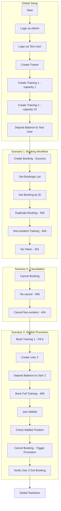

# Plan: API Gateway Integration Tests with Playwright

This document describes the implementation plan for automating API Gateway integration tests using Playwright.

## Overview

### Goal

Automate the manual testing scenarios from [`manual-testing-phase6-api-gateway.md`](./manual-testing-phase6-api-gateway.md) using Playwright API tests.

### Scenarios to Cover

1. **Scenario 1: Booking Workflow** - Steps 16-21
2. **Scenario 2: Training Cancellation** - Steps 22-24
3. **Scenario 3: Waitlist Promotion** - Steps 25-31

### Prerequisites

- All microservices are running and healthy
- Database migrations are applied
- Admin and test users exist via seed data

---

## Architecture

### Test Structure

```
backend/
├── test/
│   └── api-gateway/
│       ├── playwright.config.ts      # Playwright configuration
│       ├── global-setup.ts           # Setup: login, create test data
│       ├── global-teardown.ts        # Cleanup after all tests
│       ├── fixtures/
│       │   ├── auth.fixture.ts       # Authentication helpers
│       │   ├── training.fixture.ts   # Training test data
│       │   └── booking.fixture.ts    # Booking test data
│       ├── tests/
│       │   ├── scenario-1-booking-workflow.spec.ts
│       │   ├── scenario-2-cancellation.spec.ts
│       │   └── scenario-3-waitlist-promotion.spec.ts
│       └── helpers/
│           ├── api-client.ts         # Reusable API request helpers
│           └── assertions.ts         # Custom assertion helpers
└── package.json                      # Updated with Playwright scripts
```

### Test Flow Diagram



---

## Implementation Details

### 1. Playwright Configuration

**File:** `backend/test/api-gateway/playwright.config.ts`

```typescript
import { defineConfig } from "@playwright/test";

export default defineConfig({
  testDir: "./tests",
  fullyParallel: false, // Sequential execution for data dependencies
  timeout: 30000,
  expect: {
    timeout: 5000,
  },
  reporter: [["html"], ["list"]],
  use: {
    baseURL: "http://localhost:3000",
    extraHTTPHeaders: {
      "Content-Type": "application/json",
    },
  },
  globalSetup: require.resolve("./global-setup"),
  globalTeardown: require.resolve("./global-teardown"),
});
```

### 2. Global Setup

**File:** `backend/test/api-gateway/global-setup.ts`

Responsibilities:

- Login as admin and get JWT token
- Login as test user and get JWT token
- Create trainer for tests
- Create two trainings with different capacities
- Deposit balance to test user
- Store all IDs and tokens in environment for tests

### 3. Fixtures

#### Auth Fixture

**File:** `backend/test/api-gateway/fixtures/auth.fixture.ts`

```typescript
import { test as base } from "@playwright/test";

type AuthFixtures = {
  adminToken: string;
  userToken: string;
  userId: string;
  adminId: string;
};

export const test = base.extend<AuthFixtures>({
  adminToken: async ({ request }, use) => {
    // Get from global setup or login fresh
  },
  userToken: async ({ request }, use) => {
    // Get from global setup or login fresh
  },
  // ...
});
```

#### Training Fixture

**File:** `backend/test/api-gateway/fixtures/training.fixture.ts`

```typescript
type TrainingFixtures = {
  trainerId: string;
  trainingId1: string; // capacity=1
  trainingId2: string; // capacity=10
};
```

### 4. Test Files

#### Scenario 1: Booking Workflow

**File:** `backend/test/api-gateway/tests/scenario-1-booking-workflow.spec.ts`

| Step | Test Name                           | Method | Endpoint          | Expected Status |
| ---- | ----------------------------------- | ------ | ----------------- | --------------- |
| 16   | should create booking successfully  | POST   | /api/bookings     | 201             |
| 17   | should return user bookings list    | GET    | /api/bookings     | 200             |
| 18   | should return booking by ID         | GET    | /api/bookings/:id | 200             |
| 19   | should reject duplicate booking     | POST   | /api/bookings     | 409             |
| 20   | should reject non-existent training | POST   | /api/bookings     | 404/503         |
| 21   | should reject request without token | POST   | /api/bookings     | 401             |

#### Scenario 2: Training Cancellation

**File:** `backend/test/api-gateway/tests/scenario-2-cancellation.spec.ts`

| Step | Test Name                          | Method | Endpoint                 | Expected Status |
| ---- | ---------------------------------- | ------ | ------------------------ | --------------- |
| 22   | should cancel booking successfully | POST   | /api/bookings/:id/cancel | 200             |
| 23   | should reject re-cancellation      | POST   | /api/bookings/:id/cancel | 409             |
| 24   | should reject non-existent booking | POST   | /api/bookings/:id/cancel | 404             |

#### Scenario 3: Waitlist Promotion

**File:** `backend/test/api-gateway/tests/scenario-3-waitlist-promotion.spec.ts`

| Step | Test Name                              | Method | Endpoint                  | Expected Status |
| ---- | -------------------------------------- | ------ | ------------------------- | --------------- |
| 25   | should fill training with capacity 1   | POST   | /api/bookings             | 201             |
| 26   | should create second user              | POST   | /api/auth/register        | 201             |
| 27   | should deposit balance to user2        | POST   | /api/auth/balance/deposit | 200             |
| 28   | should reject booking full training    | POST   | /api/bookings             | 409             |
| 29   | should join waitlist                   | POST   | /api/waitlist             | 201             |
| 30   | should return waitlist position        | GET    | /api/waitlist/position    | 200             |
| 31   | should promote from waitlist on cancel | POST   | /api/bookings/:id/cancel  | 200             |

---

## Test Data Management

### Initial State

The tests assume the following initial state from seed data:

- Admin user: `admin@dreamfitness.com` / `admin123`
- Test user: `test@example.com` / `test12345`

### Test Data Created During Setup

| Entity     | Description            | Created By      |
| ---------- | ---------------------- | --------------- |
| Trainer    | For training creation  | Global setup    |
| Training 1 | capacity=1, price=500  | Global setup    |
| Training 2 | capacity=10, price=300 | Global setup    |
| User 2     | For waitlist testing   | Scenario 3 test |

### Balance Management

| User      | Initial Balance | After Scenario 1 | After Scenario 2 | After Scenario 3 |
| --------- | --------------- | ---------------- | ---------------- | ---------------- |
| Test User | 5000            | 4700             | 5000             | 4500             |
| User 2    | 0               | N/A              | N/A              | 4500             |

---

## Assertions

### Response Structure Validation

```typescript
// Booking response
expect(response).toMatchObject({
  id: expect.any(String),
  userId: expect.any(String),
  trainingId: expect.any(String),
  status: expect.stringMatching(/confirmed|cancelled/),
  createdAt: expect.any(String),
  updatedAt: expect.any(String),
});
```

### Error Response Validation

```typescript
// RFC 7807 Problem Details
expect(response).toMatchObject({
  status: 409,
  title: expect.any(String),
  detail: expect.any(String),
});
```

### Balance Verification

```typescript
// Check user balance after operation
const userResponse = await request.get("/api/auth/me");
expect(userResponse.body.balance).toBe(expectedBalance);
```

---

## Execution

### NPM Scripts

Add to `package.json`:

```json
{
  "scripts": {
    "test:api-gateway": "playwright test --config=test/api-gateway/playwright.config.ts",
    "test:api-gateway:ui": "playwright test --config=test/api-gateway/playwright.config.ts --ui",
    "test:api-gateway:report": "playwright show-report test/api-gateway/playwright-report"
  }
}
```

### Running Tests

```powershell
# Prerequisites: Start all services
npm run start:dev:api-gateway
npm run start:dev:auth-service
npm run start:dev:training-service
npm run start:dev:booking-service

# Run tests
npm run test:api-gateway
```

### CI/CD Integration

```yaml
# Example GitHub Actions step
- name: Run API Gateway Tests
  run: npm run test:api-gateway
  env:
    NODE_ENV: test
```

---

## Dependencies

### New Dependencies to Install

```powershell
cd backend
npm i -D -E @playwright/test
```

### Playwright Installation

After npm install, run:

```powershell
npx playwright install
```

---

## File Checklist

### Files to Create

| File                                                                   | Purpose                  |
| ---------------------------------------------------------------------- | ------------------------ |
| `backend/test/api-gateway/playwright.config.ts`                        | Playwright configuration |
| `backend/test/api-gateway/global-setup.ts`                             | Global setup script      |
| `backend/test/api-gateway/global-teardown.ts`                          | Global cleanup script    |
| `backend/test/api-gateway/fixtures/auth.fixture.ts`                    | Auth fixtures            |
| `backend/test/api-gateway/fixtures/training.fixture.ts`                | Training fixtures        |
| `backend/test/api-gateway/fixtures/booking.fixture.ts`                 | Booking fixtures         |
| `backend/test/api-gateway/helpers/api-client.ts`                       | API request helpers      |
| `backend/test/api-gateway/helpers/assertions.ts`                       | Custom assertions        |
| `backend/test/api-gateway/tests/scenario-1-booking-workflow.spec.ts`   | Scenario 1 tests         |
| `backend/test/api-gateway/tests/scenario-2-cancellation.spec.ts`       | Scenario 2 tests         |
| `backend/test/api-gateway/tests/scenario-3-waitlist-promotion.spec.ts` | Scenario 3 tests         |

### Files to Modify

| File                   | Changes                                    |
| ---------------------- | ------------------------------------------ |
| `backend/package.json` | Add Playwright dependency and test scripts |

---

## Summary

This plan provides a comprehensive approach to automating the API Gateway integration tests using Playwright. The tests will:

1. Cover all three scenarios from the manual testing plan
2. Use TypeScript for type safety and IDE support
3. Provide detailed HTML reports
4. Be maintainable and extensible for future scenarios
5. Run against running services without mocking

The implementation should be done in Code mode after this plan is approved.
