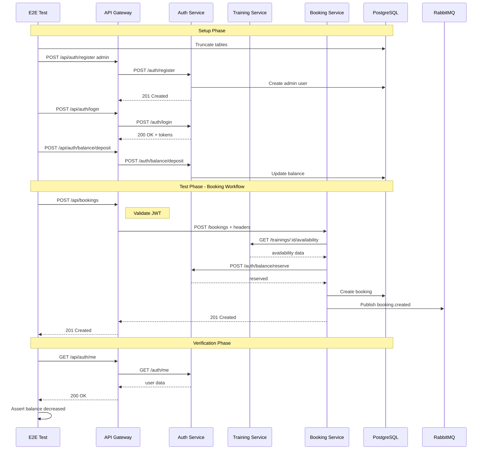

# План автоматизированного E2E тестирования через API Gateway

Этот документ описывает план реализации автоматизированных end-to-end тестов для всей системы DreamFitness через API Gateway.

## Обзор

Тесты будут проверять интеграцию всех сервисов через API Gateway, обеспечивая корректную работу всего backend в целом.

## Архитектура тестов

### Структура папок

```
backend/test/e2e/
├── jest-e2e.json                    # Конфигурация Jest для e2e тестов
├── setup/
│   ├── test-setup.ts                # Глобальная настройка тестов
│   └── teardown.ts                  # Очистка после тестов
├── helpers/
│   ├── app.helper.ts                # Запуск всех сервисов для тестов
│   ├── db.helper.ts                 # Работа с базой данных
│   ├── auth.helper.ts               # Вспомогательные функции для аутентификации
│   ├── api.helper.ts                # Базовый helper для API запросов
│   ├── booking.helper.ts             # Helper для booking API
│   ├── training.helper.ts            # Helper для training API
│   ├── waitlist.helper.ts            # Helper для waitlist API
│   └── wait.ts                       # Утилита для ожидания
├── fixtures/
│   ├── user.fixtures.ts              # Тестовые пользователи
│   ├── trainer.fixtures.ts            # Тестовые тренеры
│   └── training.fixtures.ts           # Тестовые тренировки
├── scenarios/
│   ├── booking-workflow.e2e-spec.ts  # Сценарий 1: Booking Workflow
│   ├── cancellation.e2e-spec.ts      # Сценарий 2: Training Cancellation
│   └── waitlist-promotion.e2e-spec.ts # Сценарий 3: Waitlist Promotion
└── api-gateway/
    ├── auth.e2e-spec.ts              # Тесты Auth API через Gateway
    ├── trainers.e2e-spec.ts          # Тесты Trainers API через Gateway
    ├── trainings.e2e-spec.ts         # Тесты Trainings API через Gateway
    ├── bookings.e2e-spec.ts          # Тесты Bookings API через Gateway
    └── waitlist.e2e-spec.ts          # Тесты Waitlist API через Gateway
```

## Подход к тестированию

### Два режима запуска

#### 1. Интеграционные тесты с моками (быстрые)

Для быстрой проверки логики без запуска реальных сервисов.

```typescript
// Пример: мокирование HTTP запросов к сервисам
// Используется nock или axios-mock-adapter
```

#### 2. Полные E2E тесты (медленные)

Запуск всех сервисов и реальных зависимостей (PostgreSQL, RabbitMQ).

### Рекомендуемый подход

Для данного проекта рекомендуется **полный E2E подход** с запуском всех сервисов, так как:

1. Тестируется реальная интеграция через RabbitMQ
2. Проверяется корректность JWT валидации в API Gateway
3. Проверяется передача внутренних заголовков между сервисами
4. Проверяется вся saga для waitlist promotion

## Детальный план реализации

### Фаза 1: Инфраструктура тестов

#### 1.1. Создать конфигурацию Jest

**Файл:** `backend/test/e2e/jest-e2e.json`

```json
{
  "moduleFileExtensions": ["js", "json", "ts"],
  "rootDir": ".",
  "testEnvironment": "node",
  "testRegex": ".e2e-spec.ts$",
  "testTimeout": 30000,
  "transform": {
    "^.+\\.(t|j)s$": "ts-jest"
  },
  "moduleNameMapper": {
    "@app/contracts/(.*)": "<rootDir>/../../libs/contracts/src/$1",
    "@app/contracts": "<rootDir>/../../libs/contracts/src",
    "@app/shared/(.*)": "<rootDir>/../../libs/shared/src/$1",
    "@app/shared": "<rootDir>/../../libs/shared/src"
  },
  "globalSetup": "./setup/global-setup.ts",
  "globalTeardown": "./teardown/global-teardown.ts"
}
```

#### 1.2. Создать глобальную настройку

**Файл:** `backend/test/e2e/setup/global-setup.ts`

Задачи:

- Запуск Docker контейнеров (PostgreSQL, RabbitMQ)
- Применение миграций
- Ожидание готовности сервисов

#### 1.3. Создать AppHelper для запуска всех сервисов

**Файл:** `backend/test/e2e/helpers/app.helper.ts`

Класс `E2ETestHelper` должен:

- Запускать API Gateway на порту 3000
- Запускать Auth Service на порту 3001
- Запускать Training Service на порту 3002
- Запускать Booking Service на порту 3003
- Предоставлять единый `request` объект для API Gateway

```typescript
export class E2ETestHelper {
  private apiGateway: INestApplication;
  private authProcess: ChildProcess;
  private trainingProcess: ChildProcess;
  private bookingProcess: ChildProcess;

  async init(): Promise<void> {
    // Запуск всех сервисов
  }

  getRequest(): SuperTest<Test> {
    return request(this.apiGateway.getHttpServer());
  }

  async cleanup(): Promise<void> {
    // Остановка всех сервисов
  }
}
```

#### 1.4. Создать DbHelper

**Файл:** `backend/test/e2e/helpers/db.helper.ts`

Методы:

- `truncateTables()` - очистка всех таблиц
- `seedTestData()` - заполнение тестовыми данными
- `getUserById()` - получение пользователя напрямую из БД
- `getBookingById()` - получение бронирования напрямую из БД

#### 1.5. Создать API helpers

**Файл:** `backend/test/e2e/helpers/api.helper.ts`

Базовый класс для всех API helpers:

```typescript
export class ApiHelper {
  constructor(
    protected request: SuperTest<Test>,
    protected baseUrl: string,
  ) {}

  protected async get(path: string, token?: string): Promise<Test> {
    // GET запрос с опциональным Bearer токеном
  }

  protected async post(
    path: string,
    body: unknown,
    token?: string,
  ): Promise<Test> {
    // POST запрос с опциональным Bearer токеном
  }
}
```

#### 1.6. Создать AuthHelper

**Файл:** `backend/test/e2e/helpers/auth.helper.ts`

Методы:

- `register(userData)` - регистрация пользователя
- `login(email, password)` - вход, возвращает токены
- `getMe(token)` - получение профиля
- `depositBalance(userId, amount, adminToken)` - пополнение баланса

#### 1.7. Создать TrainingHelper

**Файл:** `backend/test/e2e/helpers/training.helper.ts`

Методы:

- `createTrainer(data, token)` - создание тренера
- `createTraining(data, token)` - создание тренировки
- `getTraining(id, token)` - получение тренировки
- `getTrainers(token)` - список тренеров

#### 1.8. Создать BookingHelper

**Файл:** `backend/test/e2e/helpers/booking.helper.ts`

Методы:

- `createBooking(trainingId, token)` - создание бронирования
- `getBookings(token)` - список бронирований пользователя
- `getBookingById(id, token)` - получение бронирования
- `cancelBooking(id, token)` - отмена бронирования

#### 1.9. Создать WaitlistHelper

**Файл:** `backend/test/e2e/helpers/waitlist.helper.ts`

Методы:

- `joinWaitlist(trainingId, token)` - встать в очередь
- `getWaitlistPosition(trainingId, token)` - позиция в очереди
- `leaveWaitlist(trainingId, token)` - выйти из очереди

### Фаза 2: Фикстуры

#### 2.1. Пользователи

**Файл:** `backend/test/e2e/fixtures/user.fixtures.ts`

```typescript
export const TEST_USERS = {
  admin: {
    email: "admin@test-e2e.com",
    password: "Admin123!",
    name: "Test Admin",
  },
  user1: {
    email: "user1@test-e2e.com",
    password: "User123!",
    name: "Test User 1",
  },
  user2: {
    email: "user2@test-e2e.com",
    password: "User123!",
    name: "Test User 2",
  },
};
```

#### 2.2. Тренеры и тренировки

**Файл:** `backend/test/e2e/fixtures/training.fixtures.ts`

```typescript
export const TEST_TRAINER = {
  name: "Test Trainer",
  bio: "Test trainer for e2e tests",
};

export function createTrainingDto(
  trainerId: string,
  overrides?: Partial<CreateTrainingDto>,
) {
  return {
    title: "Test Training",
    type: TrainingType.YOGA,
    trainerId,
    scheduledAt: futureDate(7), // через 7 дней
    durationMinutes: 60,
    capacity: 10,
    price: 500,
    ...overrides,
  };
}
```

### Фаза 3: Сценарий 1 - Booking Workflow

**Файл:** `backend/test/e2e/scenarios/booking-workflow.e2e-spec.ts`

#### Тест-кейсы

```typescript
describe("Booking Workflow (E2E through API Gateway)", () => {
  // Предварительная настройка
  beforeAll(async () => {
    // Запуск всех сервисов
    // Создание admin и test пользователей
    // Пополнение баланса test пользователя
    // Создание тренера и тренировки
  });

  afterAll(async () => {
    // Остановка сервисов
  });

  beforeEach(async () => {
    // Очистка таблиц (кроме пользователей и тренеров)
  });

  describe("POST /api/bookings", () => {
    it("should create booking successfully (happy path)", async () => {});
    it("should return 409 when duplicate booking", async () => {});
    it("should return 409 when no available slots", async () => {});
    it("should return 404 when training not found", async () => {});
    it("should return 401 when no token provided", async () => {});
    it("should deduct balance after booking", async () => {});
  });

  describe("GET /api/bookings", () => {
    it("should return user bookings list", async () => {});
    it("should return empty list when no bookings", async () => {});
    it("should filter by status", async () => {});
  });

  describe("GET /api/bookings/:id", () => {
    it("should return booking by ID", async () => {});
    it("should return 404 when booking not found", async () => {});
    it("should return 403 when booking belongs to another user", async () => {});
  });
});
```

### Фаза 4: Сценарий 2 - Training Cancellation

**Файл:** `backend/test/e2e/scenarios/cancellation.e2e-spec.ts`

#### Тест-кейсы

```typescript
describe("Training Cancellation (E2E through API Gateway)", () => {
  describe("POST /api/bookings/:id/cancel", () => {
    it("should cancel booking successfully", async () => {});
    it("should return 409 when booking already cancelled", async () => {});
    it("should return 404 when booking not found", async () => {});
    it("should return 409 when trying to cancel past training", async () => {});
    it("should refund balance after cancellation", async () => {});
    it("should allow re-booking after cancellation", async () => {});
  });
});
```

### Фаза 5: Сценарий 3 - Waitlist Promotion

**Файл:** `backend/test/e2e/scenarios/waitlist-promotion.e2e-spec.ts`

#### Тест-кейсы

```typescript
describe("Waitlist Promotion (E2E through API Gateway)", () => {
  describe("Full Waitlist Promotion Flow", () => {
    it("should promote user from waitlist when booking is cancelled", async () => {
      // 1. Создать тренировку с capacity=1
      // 2. User1 бронирует тренировку (заполняет все места)
      // 3. User2 пытается забронировать - получает NoAvailableSlotsException
      // 4. User2 встает в waitlist
      // 5. User1 отменяет бронирование
      // 6. Проверить, что User2 автоматически получил бронирование
      // 7. Проверить, что баланс User2 уменьшился
      // 8. Проверить, что User2 больше не в waitlist
    });

    it("should promote users in FIFO order from waitlist", async () => {
      // 1. Создать тренировку с capacity=1
      // 2. User1 бронирует
      // 3. User2, User3, User4 встают в waitlist
      // 4. User1 отменяет
      // 5. Проверить, что User2 получил бронирование
      // 6. User2 отменяет
      // 7. Проверить, что User3 получил бронирование
    });

    it("should skip user with insufficient balance and promote next", async () => {
      // 1. Создать тренировку с capacity=1
      // 2. User1 бронирует
      // 3. User2 (баланс=0) встает в waitlist
      // 4. User3 встает в waitlist
      // 5. User1 отменяет
      // 6. Проверить, что User2 пропущен (недостаточно баланса)
      // 7. Проверить, что User3 получил бронирование
    });
  });

  describe("POST /api/waitlist", () => {
    it("should join waitlist successfully", async () => {});
    it("should return 409 when already on waitlist", async () => {});
    it("should return 409 when already has booking for training", async () => {});
  });

  describe("GET /api/waitlist/position", () => {
    it("should return waitlist position", async () => {});
    it("should return 404 when not on waitlist", async () => {});
  });

  describe("DELETE /api/waitlist/:trainingId", () => {
    it("should leave waitlist successfully", async () => {});
    it("should return 404 when not on waitlist", async () => {});
  });
});
```

### Фаза 6: API Gateway тесты

Дополнительные тесты для проверки функциональности API Gateway:

#### 6.1. Auth API через Gateway

**Файл:** `backend/test/e2e/api-gateway/auth.e2e-spec.ts`

```typescript
describe("Auth API through API Gateway", () => {
  describe("POST /api/auth/register", () => {
    it("should register new user", async () => {});
    it("should return 400 for invalid data", async () => {});
  });

  describe("POST /api/auth/login", () => {
    it("should return tokens for valid credentials", async () => {});
    it("should return 401 for invalid credentials", async () => {});
  });

  describe("GET /api/auth/me", () => {
    it("should return user profile with valid token", async () => {});
    it("should return 401 without token", async () => {});
    it("should return 401 with invalid token", async () => {});
  });

  describe("POST /api/auth/balance/deposit", () => {
    it("should deposit balance for admin", async () => {});
    it("should return 403 for non-admin", async () => {});
  });
});
```

#### 6.2. Trainers API через Gateway

**Файл:** `backend/test/e2e/api-gateway/trainers.e2e-spec.ts`

```typescript
describe("Trainers API through API Gateway", () => {
  describe("POST /api/trainers", () => {
    it("should create trainer for admin", async () => {});
    it("should return 403 for non-admin", async () => {});
  });

  describe("GET /api/trainers", () => {
    it("should return trainers list", async () => {});
  });
});
```

#### 6.3. Trainings API через Gateway

**Файл:** `backend/test/e2e/api-gateway/trainings.e2e-spec.ts`

```typescript
describe("Trainings API through API Gateway", () => {
  describe("POST /api/trainings", () => {
    it("should create training for admin", async () => {});
    it("should return 403 for non-admin", async () => {});
  });

  describe("GET /api/trainings", () => {
    it("should return trainings list", async () => {});
    it("should filter by type", async () => {});
  });

  describe("GET /api/trainings/:id", () => {
    it("should return training by ID", async () => {});
    it("should return 404 for non-existent training", async () => {});
  });
});
```

### Фаза 7: Скрипты и конфигурация

#### 7.1. Добавить скрипты в package.json

```json
{
  "scripts": {
    "test:e2e:gateway": "cross-env NODE_ENV=test jest --config test/e2e/jest-e2e.json --runInBand",
    "test:e2e:gateway:watch": "cross-env NODE_ENV=test jest --config test/e2e/jest-e2e.json --watch --runInBand",
    "test:e2e:scenarios": "cross-env NODE_ENV=test jest --config test/e2e/jest-e2e.json --testPathPattern=scenarios --runInBand"
  }
}
```

#### 7.2. Создать .env.test файл

```env
# Database
DB_HOST=localhost
DB_PORT=5432
DB_USERNAME=dreamfitness
DB_PASSWORD=dreamfitness123
DB_DATABASE=dreamfitness_test

# JWT
JWT_SECRET=test-jwt-secret-key
JWT_EXPIRES_IN=1h
JWT_REFRESH_EXPIRES_IN=7d

# Services URLs
AUTH_SERVICE_URL=http://localhost:3001
TRAINING_SERVICE_URL=http://localhost:3002
BOOKING_SERVICE_URL=http://localhost:3003
NOTIFICATION_SERVICE_URL=http://localhost:3004

# RabbitMQ
RABBITMQ_URL=amqp://localhost:5672
RABBITMQ_EXCHANGE=dreamfitness.exchange

# Ports
API_GATEWAY_PORT=3000
AUTH_SERVICE_PORT=3001
TRAINING_SERVICE_PORT=3002
BOOKING_SERVICE_PORT=3003
NOTIFICATION_SERVICE_PORT=3004
```

## Диаграмма потока тестов



## Чек-лист реализации

### Инфраструктура

- [ ] Создать директорию `backend/test/e2e/`
- [ ] Создать `jest-e2e.json` конфигурацию
- [ ] Создать `global-setup.ts` для запуска Docker
- [ ] Создать `global-teardown.ts` для очистки
- [ ] Создать `E2ETestHelper` класс
- [ ] Создать `DbHelper` класс
- [ ] Создать API helpers (Auth, Training, Booking, Waitlist)
- [ ] Создать fixtures (users, trainers, trainings)

### Сценарий 1: Booking Workflow

- [ ] Создать `booking-workflow.e2e-spec.ts`
- [ ] Тест: успешное бронирование
- [ ] Тест: повторное бронирование (409)
- [ ] Тест: нет свободных мест (409)
- [ ] Тест: тренировка не найдена (404)
- [ ] Тест: без токена (401)
- [ ] Тест: списание баланса
- [ ] Тест: список бронирований
- [ ] Тест: получение бронирования по ID
- [ ] Тест: чужое бронирование (403)

### Сценарий 2: Training Cancellation

- [ ] Создать `cancellation.e2e-spec.ts`
- [ ] Тест: успешная отмена
- [ ] Тест: повторная отмена (409)
- [ ] Тест: бронирование не найдено (404)
- [ ] Тест: отмена прошедшей тренировки (409)
- [ ] Тест: возврат баланса
- [ ] Тест: повторное бронирование после отмены

### Сценарий 3: Waitlist Promotion

- [ ] Создать `waitlist-promotion.e2e-spec.ts`
- [ ] Тест: встать в очередь
- [ ] Тест: позиция в очереди
- [ ] Тест: выйти из очереди
- [ ] Тест: повторное встание в очередь (409)
- [ ] Тест: полный цикл waitlist promotion
- [ ] Тест: FIFO порядок продвижения
- [ ] Тест: пропуск при недостаточном балансе

### API Gateway тесты

- [ ] Создать `auth.e2e-spec.ts`
- [ ] Создать `trainers.e2e-spec.ts`
- [ ] Создать `trainings.e2e-spec.ts`
- [ ] Создать `bookings.e2e-spec.ts`
- [ ] Создать `waitlist.e2e-spec.ts`

### Конфигурация

- [ ] Добавить скрипты в `package.json`
- [ ] Создать `.env.test`
- [ ] Настроить CI/CD для запуска e2e тестов

## Зависимости

Для реализации потребуются следующие npm пакеты (уже установлены):

- `@nestjs/testing` - для создания тестовых модулей
- `supertest` - для HTTP запросов
- `jest` - тестовый фреймворк
- `ts-jest` - TypeScript поддержка для Jest

## Примечания

### Запуск тестов

```bash
# Запуск всех e2e тестов
npm run test:e2e:gateway

# Запуск только сценариев
npm run test:e2e:scenarios

# Запуск конкретного файла
npm run test:e2e:gateway -- booking-workflow.e2e-spec.ts

# Запуск в режиме отладки
npm run test:e2e:gateway:watch
```

### Предварительные требования

1. Docker контейнеры PostgreSQL и RabbitMQ должны быть запущены
2. Миграции применены к тестовой базе данных
3. Порты 3000-3004 должны быть свободны

### Рекомендации по отладке

1. Использовать `--detectOpenHandles` для поиска незакрытых соединений
2. Использовать `--forceExit` для принудительного завершения
3. Добавлять логирование в тесты для отладки
4. Использовать `testTimeout` для увеличения таймаута медленных тестов

## Ссылки

- [manual-testing-phase6-api-gateway.md](./manual-testing-phase6-api-gateway.md) — План ручного тестирования
- [impl-plan-phase6-api-gateway.md](./impl-plan-phase6-api-gateway.md) — План реализации API Gateway
