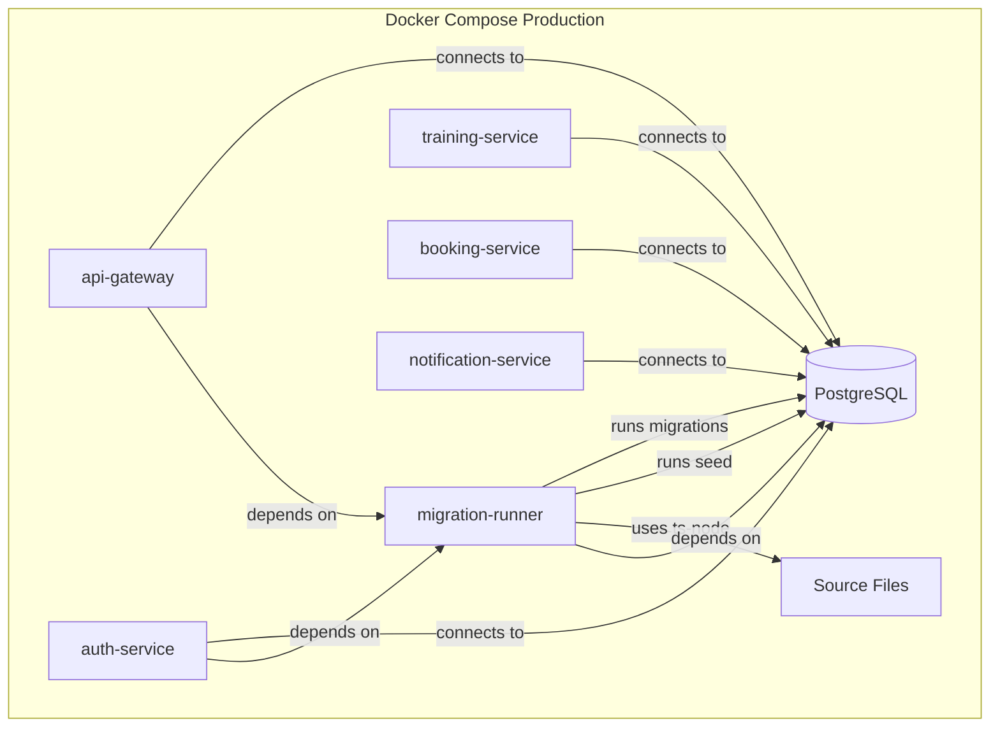

# Implementation Plan: Production-Ready Migrations and Seeding via Migration Container Approach

## Problem Statement

The current `db:migrate` and `db:seed` npm scripts fail in production because they needs ts-node and other devDependencies which are missing in production.
This plan describes how to solve that problem by using a dedicated migration container that has access to all dependencies and source files.

## Implement Migration Container Approach

### Architecture



### Implementation Steps

#### 1. Create `backend/Dockerfile.migrations`

```dockerfile
# Dockerfile for migration runner
# This container has all dependencies and source files for running migrations
FROM node:20-alpine

WORKDIR /app

# Copy package files
COPY package*.json ./

# Install ALL dependencies (including devDependencies for ts-node)
RUN npm ci

# Copy source code
COPY . .

# Set environment
ENV NODE_ENV=production

# Build the application (generates dist/ for apps)
RUN npm run build

# Default command - can be overridden
CMD ["npm", "run", "db:migrate"]
```

#### 2. Create `backend/docker-compose.migrations.yml`

```yaml
# Migration runner service
# Usage: docker-compose -f docker-compose.base.yml -f docker-compose.migrations.yml run migration-runner

services:
  migration-runner:
    build:
      context: .
      dockerfile: Dockerfile.migrations
    container_name: dreamfitness-migration-runner
    environment:
      - NODE_ENV=production
    env_file:
      - .env
      - .env.production
      - .env.docker
    depends_on:
      postgres:
        condition: service_healthy
    networks:
      - dreamfitness-network
    # Run migrations and seed, then exit
    command: >
      sh -c "npm run db:migrate && npm run db:seed"
```

#### 3. Update `backend/docker-compose.prod.yml`

Add dependency on migration-runner for each service:

```yaml
services:
  # ... existing services ...

  api-gateway:
    # ... existing config ...
    depends_on:
      migration-runner:
        condition: service_completed_successfully
      notification-service:
        condition: service_healthy
    # ... rest of config ...

  auth-service:
    # ... existing config ...
    depends_on:
      migration-runner:
        condition: service_completed_successfully
      postgres:
        condition: service_healthy
      rabbitmq:
        condition: service_healthy
    # ... rest of config ...

  # ... similar for other services ...
```

#### 4. Add npm scripts for production deployment (optional)

```json
{
  "scripts": {
    "docker:prod:migrate": "docker-compose -f docker-compose.base.yml -f docker-compose.migrations.yml run --rm migration-runner"
  }
}
```

---

## Deployment Workflow

### Option A: Automatic Migration (Recommended for Development)

Migrations run automatically before services start:

```bash
# Start all services (migrations run automatically)
docker-compose -f docker-compose.base.yml -f docker-compose.prod.yml up -d
```

### Option B: Manual Migration (Recommended for Production)

Run migrations separately before deploying services:

```bash
# Step 1: Run migrations
docker-compose -f docker-compose.base.yml -f docker-compose.migrations.yml run --rm migration-runner

# Step 2: Start services
docker-compose -f docker-compose.base.yml -f docker-compose.prod.yml up -d
```

### Option C: CI/CD Pipeline

```yaml
# Example GitLab CI/CD
deploy:
  stage: deploy
  script:
    # Run migrations
    - docker-compose -f docker-compose.base.yml -f docker-compose.migrations.yml run --rm migration-runner
    # Start services
    - docker-compose -f docker-compose.base.yml -f docker-compose.prod.yml up -d
```

---

## Benefits of This Approach

1. **Simplicity** - No complex production-specific code paths
2. **Consistency** - Same scripts work in development and production
3. **Flexibility** - Can run migrations manually or automatically
4. **Safety** - Migrations run before services start
5. **Debugging** - Easy to debug migration issues (just run the container)
6. **No compiled migrations** - ts-node handles TypeScript directly

---

## Testing

### Test Migration Container Locally

```bash
# Build migration container
docker-compose -f docker-compose.base.yml -f docker-compose.migrations.yml build

# Run migrations
docker-compose -f docker-compose.base.yml -f docker-compose.migrations.yml run --rm migration-runner

# Check logs
docker-compose -f docker-compose.base.yml -f docker-compose.migrations.yml logs migration-runner
```

### Test Full Production Stack

```bash
# Run migrations first
docker-compose -f docker-compose.base.yml -f docker-compose.migrations.yml run --rm migration-runner

# Start services
docker-compose -f docker-compose.base.yml -f docker-compose.prod.yml up -d

# Check service health
docker-compose -f docker-compose.base.yml -f docker-compose.prod.yml ps
```
