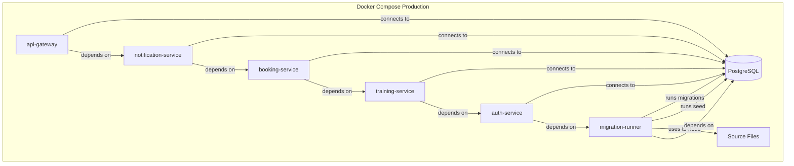

# Implementation Plan: Production-Ready Migrations and Seeding via Migration Container Approach

## Problem Statement

The current `db:migrate` and `db:seed` npm scripts fail in production because they needs ts-node and other devDependencies which are missing in production.
This plan describes how to solve that problem by using a dedicated migration container that has access to all dependencies and source files.

## Implement Migration Container Approach

### Architecture



### Implementation Steps

#### 1. Create `backend/scripts/migration-entrypoint.sh`

This entrypoint script handles automatic and manual modes based on environment variables.

```bash
#!/bin/sh
set -e

echo "Migration Runner started"
echo "RUN_MIGRATIONS=${RUN_MIGRATIONS:-false}"
echo "RUN_SEED=${RUN_SEED:-false}"

# Automatic mode: run migrations if enabled
if [ "$RUN_MIGRATIONS" = "true" ]; then
    echo "Running migrations..."
    npm run db:migrate
fi

# Automatic mode: run seed if enabled
if [ "$RUN_SEED" = "true" ]; then
    echo "Running seed..."
    npm run db:seed
fi

# Container exits after completing automatic tasks
# For manual mode, the command is passed via docker-compose run
```

#### 2. Create `backend/Dockerfile.migrations`

```dockerfile
# Dockerfile for migration runner
# This container has all dependencies and source files for running migrations
FROM node:20-alpine

WORKDIR /app

# Copy package files
COPY package*.json ./

# Install ALL dependencies (including devDependencies for ts-node)
RUN npm ci

# Copy source code
COPY . .

# Copy entrypoint script
COPY scripts/migration-entrypoint.sh /app/scripts/migration-entrypoint.sh
RUN chmod +x /app/scripts/migration-entrypoint.sh

# Set environment
ENV NODE_ENV=production

# Build the application (generates dist/ for apps)
RUN npm run build

# Use entrypoint script - handles automatic mode based on env vars
# For manual mode, pass command as argument: docker-compose run migration-runner npm run db:migrate:revert
ENTRYPOINT ["sh", "/app/scripts/migration-entrypoint.sh"]
```

#### 3. Create `backend/docker-compose.migrations.yml`

```yaml
# Migration runner service
# Supports automatic and manual modes via RUN_MIGRATIONS and RUN_SEED environment variables

services:
  migration-runner:
    build:
      context: .
      dockerfile: Dockerfile.migrations
    container_name: dreamfitness-migration-runner
    environment:
      - NODE_ENV=production
      - RUN_MIGRATIONS=${RUN_MIGRATIONS:-false}
      - RUN_SEED=${RUN_SEED:-false}
    env_file:
      - .env
      - .env.production
      - .env.docker
    depends_on:
      postgres:
        condition: service_healthy
    networks:
      - dreamfitness-network
```

#### 4. Add npm scripts for production deployment

```json
{
  "scripts": {
    "docker:migrate:auto": "docker-compose -f docker-compose.base.yml -f docker-compose.migrations.yml run --rm -e RUN_MIGRATIONS=true -e RUN_SEED=true migration-runner",
    "docker:migrate:manual": "docker-compose -f docker-compose.base.yml -f docker-compose.migrations.yml run --rm migration-runner npm run db:migrate",
    "docker:seed:manual": "docker-compose -f docker-compose.base.yml -f docker-compose.migrations.yml run --rm migration-runner npm run db:seed",
    "docker:migrate:revert": "docker-compose -f docker-compose.base.yml -f docker-compose.migrations.yml run --rm migration-runner npm run db:migrate:revert"
  }
}
```

---

## Usage Scenarios

| Scenario             | RUN_MIGRATIONS | RUN_SEED | Command                         |
| -------------------- | -------------- | -------- | ------------------------------- |
| Auto: migrate + seed | true           | true     | `npm run docker:migrate:auto`   |
| Auto: migrate only   | true           | false    | Set env vars and run container  |
| Manual: migrate      | false          | false    | `npm run docker:migrate:manual` |
| Manual: seed         | false          | false    | `npm run docker:seed:manual`    |
| Manual: revert       | false          | false    | `npm run docker:migrate:revert` |

---

## Deployment Workflow

### Option A: Automatic Migration (Recommended for Development)

Set environment variables and run migrations automatically:

```bash
# Set environment variables in .env.production or pass via command line
export RUN_MIGRATIONS=true
export RUN_SEED=true

# Run migrations and seed automatically
docker-compose -f docker-compose.base.yml -f docker-compose.migrations.yml run --rm migration-runner

# Start services
docker-compose -f docker-compose.base.yml -f docker-compose.prod.yml up -d
```

### Option B: Manual Migration (Recommended for Production)

Run migrations manually with explicit control:

```bash
# Step 1: Run migrations manually
npm run docker:migrate:manual

# Step 2: Run seed manually (optional)
npm run docker:seed:manual

# Step 3: Start services
docker-compose -f docker-compose.base.yml -f docker-compose.prod.yml up -d
```

### Option C: Revert Migrations (Manual Only)

```bash
# Revert last migration
npm run docker:migrate:revert
```

### Option D: CI/CD Pipeline

```yaml
# Example GitLab CI/CD
deploy:
  stage: deploy
  script:
    # Run migrations automatically
    - docker-compose -f docker-compose.base.yml -f docker-compose.migrations.yml run --rm -e RUN_MIGRATIONS=true -e RUN_SEED=true migration-runner
    # Start services
    - docker-compose -f docker-compose.base.yml -f docker-compose.prod.yml up -d
```

---

## Benefits of This Approach

1. **Simplicity** - No complex production-specific code paths
2. **Consistency** - Same scripts work in development and production
3. **Flexibility** - Can run migrations manually or automatically
4. **Safety** - Migrations run before services start
5. **Debugging** - Easy to debug migration issues (just run the container)
6. **No compiled migrations** - ts-node handles TypeScript directly

---

## Testing

### Test Migration Container Locally

```bash
# Build migration container
docker-compose -f docker-compose.base.yml -f docker-compose.migrations.yml build

# Test automatic mode (migrate + seed)
docker-compose -f docker-compose.base.yml -f docker-compose.migrations.yml run --rm -e RUN_MIGRATIONS=true -e RUN_SEED=true migration-runner

# Test manual mode (migrate only)
docker-compose -f docker-compose.base.yml -f docker-compose.migrations.yml run --rm migration-runner npm run db:migrate

# Test manual mode (revert)
docker-compose -f docker-compose.base.yml -f docker-compose.migrations.yml run --rm migration-runner npm run db:migrate:revert

# Check logs
docker-compose -f docker-compose.base.yml -f docker-compose.migrations.yml logs migration-runner
```

### Test Full Production Stack

```bash
# Run migrations automatically
npm run docker:migrate:auto

# Start services
docker-compose -f docker-compose.base.yml -f docker-compose.prod.yml up -d

# Check service health
docker-compose -f docker-compose.base.yml -f docker-compose.prod.yml ps
```
