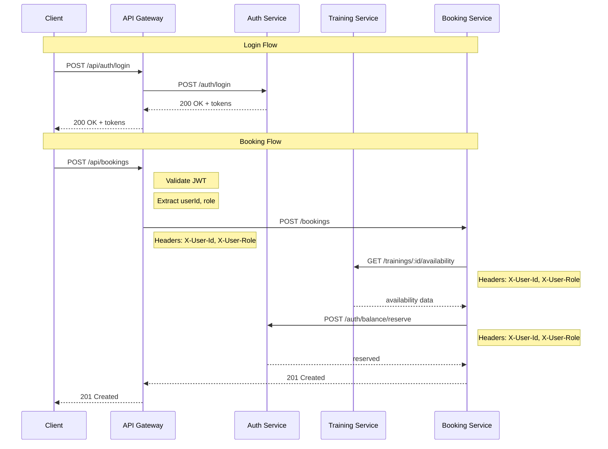

# План реализации Фазы 6: API Gateway

Этот файл лежит в папке:
`<project_root>/doc/plans`

Исходные коды бекенда лежат в папке:
`<project_root>/backend`

Далее в документе все пути указаны от `<project_root>/backend`.

---

## Контекст

### Текущая архитектура (без API Gateway)

```
┌─────────────┐     ┌─────────────────┐     ┌─────────────────┐
│   Client    │────▶│  Auth Service   │     │ Training Service│
│             │     │    (port 3001)  │     │   (port 3002)   │
│             │     │                 │     │                 │
│             │     │ • JWT validation│     │ • JWT validation│
│             │     │ • DB lookup     │     │ • No DB lookup  │
└─────────────┘     └─────────────────┘     └─────────────────┘
       │                    │                       │
       │                    │                       │
       ▼                    ▼                       ▼
┌─────────────────┐  ┌─────────────────┐  ┌─────────────────┐
│ Booking Service │  │Notification Svc │  │   Each service  │
│   (port 3003)   │  │   (port 3004)   │  │  has its own    │
│                 │  │                 │  │  JWT validation │
│ • JWT validation│  │ • JWT validation│  │                 │
│ • No DB lookup  │  │ • No DB lookup  │  │                 │
└─────────────────┘  └─────────────────┘  └─────────────────┘
```

**Проблемы текущей архитектуры:**

1. **Дублирование JWT validation** — каждый сервис содержит свой JwtStrategy и AuthModule
2. **Прокидывание токенов** — booking-service прокидывает access token в HTTP-запросах к другим сервисам
3. **Quick fix в Phase 4** — некоторые endpoints в training-service временно отключены от аутентификации

### Целевая архитектура (с API Gateway)

```
┌─────────────┐     ┌─────────────────────────────────────────────┐
│   Client    │────▶│              API Gateway (port 3000)         │
│             │     │                                             │
│             │     │  • JWT validation                           │
│             │     │  • Rate limiting                            │
│             │     │  • Error handling                           │
│             │     │  • Request routing                          │
│             │     │  • Swagger aggregation                      │
└─────────────┘     └───────────┬─────────────────────────────────┘
                                │
                ┌───────────────┼───────────────┐
                │               │               │
                ▼               ▼               ▼
        ┌───────────┐   ┌───────────┐   ┌───────────┐
        │Auth Service│  │Training Svc│  │Booking Svc│
        │  (3001)   │   │  (3002)   │   │  (3003)   │
        │           │   │           │   │           │
        │• Internal │   │• Internal │   │• Internal │
        │  Guard    │   │  Guard    │   │  Guard    │
        └───────────┘   └───────────┘   └───────────┘
```

**Преимущества:**

1. **Централизованная аутентификация** — JWT валидация только в Gateway
2. **Упрощение сервисов** — сервисы проверяют только внутренние заголовки
3. **Единая точка входа** — все запросы идут через порт 3000

---

## Структура файлов API Gateway

```
apps/api-gateway/
├── src/
│   ├── main.ts                      # Bootstrap с Swagger
│   ├── app.module.ts                # Root module
│   │
│   ├── config/
│   │   ├── config.module.ts         # Config module
│   │   ├── config.service.ts        # Config service с URL сервисов
│   │   └── index.ts
│   │
│   ├── auth/
│   │   ├── auth.module.ts           # Auth module для Gateway
│   │   ├── strategies/
│   │   │   └── jwt.strategy.ts      # JWT strategy для Gateway
│   │   └── guards/
│   │       ├── jwt-auth.guard.ts    # JWT guard
│   │       └── roles.guard.ts       # Roles guard
│   │
│   ├── proxy/
│   │   ├── proxy.module.ts          # Proxy module
│   │   ├── auth.proxy.ts            # Proxy to Auth Service
│   │   ├── training.proxy.ts        # Proxy to Training Service
│   │   ├── booking.proxy.ts         # Proxy to Booking Service
│   │   └── notification.proxy.ts    # Proxy to Notification Service
│   │
│   ├── filters/
│   │   └── proxy-exception.filter.ts # Exception filter для proxy
│   │
│   └── interceptors/
│       └── logging.interceptor.ts    # Request logging
│
└── tsconfig.app.json
```

---

## Задачи реализации

### 6.1. Config Module

**Файлы:** `apps/api-gateway/src/config/`

#### 6.1.1. ConfigService

Создать `config.service.ts` с переменными окружения:

```typescript
interface GatewayConfig {
  // Ports
  PORT: number; // default: 3000

  // Service URLs
  AUTH_SERVICE_URL: string; // default: http://localhost:3001
  TRAINING_SERVICE_URL: string; // default: http://localhost:3002
  BOOKING_SERVICE_URL: string; // default: http://localhost:3003
  NOTIFICATION_SERVICE_URL: string; // default: http://localhost:3004

  // JWT
  JWT_SECRET: string;
  JWT_ACCESS_TTL: string; // default: 15m

  // Rate Limiting
  THROTTLE_TTL: number; // default: 60
  THROTTLE_LIMIT: number; // default: 100
}
```

#### 6.1.2. Environment file

Добавить в `.env.development`:

```env
# API Gateway
PORT=3000
AUTH_SERVICE_URL=http://localhost:3001
TRAINING_SERVICE_URL=http://localhost:3002
BOOKING_SERVICE_URL=http://localhost:3003
NOTIFICATION_SERVICE_URL=http://localhost:3004
```

---

### 6.2. Auth Module

**Файлы:** `apps/api-gateway/src/auth/`

#### 6.2.1. JWT Strategy

Создать `jwt.strategy.ts`:

- Извлечение токена из Authorization header
- Валидация JWT signature
- Извлечение userId, email, role из payload
- **Без DB lookup** — только проверка подписи

```typescript
@Injectable()
export class JwtStrategy extends PassportStrategy(Strategy, "jwt") {
  constructor(configService: ConfigService) {
    super({
      jwtFromRequest: ExtractJwt.fromAuthHeaderAsBearerToken(),
      ignoreExpiration: false,
      secretOrKey: configService.get("JWT_SECRET"),
    });
  }

  validate(payload: JwtPayload): AuthenticatedUser {
    return {
      id: payload.sub,
      email: payload.email,
      role: payload.role,
    };
  }
}
```

#### 6.2.2. JWT Auth Guard

Создать `jwt-auth.guard.ts`:

```typescript
@Injectable()
export class JwtAuthGuard extends AuthGuard("jwt") {
  handleRequest(err, user, info) {
    if (err || !user) {
      throw new UnauthorizedException("Invalid token");
    }
    return user;
  }
}
```

#### 6.2.3. Roles Guard

Создать `roles.guard.ts`:

```typescript
@Injectable()
export class RolesGuard implements CanActivate {
  constructor(private reflector: Reflector) {}

  canActivate(context: ExecutionContext): boolean {
    const requiredRoles = this.reflector.getAllAndOverride<string[]>(
      ROLES_KEY,
      [context.getHandler(), context.getClass()],
    );

    if (!requiredRoles) {
      return true;
    }

    const request = context.switchToHttp().getRequest();
    const user = request.user;

    return requiredRoles.some((role) => user.role === role);
  }
}
```

---

### 6.3. Proxy Module

**Файлы:** `apps/api-gateway/src/proxy/`

#### 6.3.1. Proxy Architecture

Использовать `@nestjs/axios` или нативный `HttpService` для проксирования запросов.

**Ключевые принципы:**

1. **Прозрачное проксирование** — сохранять все query params, body, headers
2. **Добавление внутренних заголовков** — X-User-Id, X-User-Role
3. **Обработка ошибок** — трансформация ошибок от сервисов

#### 6.3.2. Auth Proxy Controller

Создать `auth.proxy.ts`:

```typescript
@Controller("api/auth")
export class AuthProxyController {
  constructor(
    private httpService: HttpService,
    private configService: ConfigService,
  ) {}

  // Public endpoints (no auth)
  @Post("register")
  async register(@Req() req: Request, @Body() body: any) {
    return this.proxyRequest(req, body, "/auth/register");
  }

  @Post("login")
  async login(@Req() req: Request, @Body() body: any) {
    return this.proxyRequest(req, body, "/auth/login");
  }

  @Post("refresh")
  async refresh(@Req() req: Request, @Body() body: any) {
    return this.proxyRequest(req, body, "/auth/refresh");
  }

  // Protected endpoints
  @Get("me")
  @UseGuards(JwtAuthGuard)
  async getProfile(@Req() req: RequestWithUser) {
    return this.proxyRequest(req, null, "/auth/me");
  }

  @Patch("me")
  @UseGuards(JwtAuthGuard)
  async updateProfile(@Req() req: RequestWithUser, @Body() body: any) {
    return this.proxyRequest(req, body, "/auth/me", "PATCH");
  }

  // ... другие endpoints

  private async proxyRequest(
    req: Request,
    body: any,
    path: string,
    method: string = "GET",
  ) {
    const url = `${this.configService.get("AUTH_SERVICE_URL")}${path}`;
    const headers = this.buildHeaders(req);

    // Proxy request
  }

  private buildHeaders(req: RequestWithUser): Record<string, string> {
    const headers: Record<string, string> = {};

    if (req.user) {
      headers["X-User-Id"] = req.user.id;
      headers["X-User-Role"] = req.user.role;
    }

    return headers;
  }
}
```

#### 6.3.3. Routing Table

| Gateway Route               | Target Service | Target Path             | Auth Required |
| --------------------------- | -------------- | ----------------------- | ------------- |
| POST /api/auth/register     | Auth Service   | POST /auth/register     | No            |
| POST /api/auth/login        | Auth Service   | POST /auth/login        | No            |
| POST /api/auth/refresh      | Auth Service   | POST /auth/refresh      | No            |
| POST /api/auth/logout       | Auth Service   | POST /auth/logout       | Yes           |
| GET /api/auth/me            | Auth Service   | GET /auth/me            | Yes           |
| PATCH /api/auth/me          | Auth Service   | PATCH /auth/me          | Yes           |
| GET /api/auth/balance       | Auth Service   | GET /auth/balance       | Yes           |
| POST /api/auth/balance/\*   | Auth Service   | POST /auth/balance/\*   | Yes           |
| GET /api/auth/transactions  | Auth Service   | GET /auth/transactions  | Yes           |
| GET /api/trainers           | Training Svc   | GET /trainers           | Yes           |
| POST /api/trainers          | Training Svc   | POST /trainers          | Yes (admin)   |
| GET /api/trainings          | Training Svc   | GET /trainings          | Yes           |
| GET /api/trainings/:id      | Training Svc   | GET /trainings/:id      | Yes           |
| GET /api/schedule/\*        | Training Svc   | GET /schedule/\*        | Yes           |
| POST /api/bookings          | Booking Svc    | POST /bookings          | Yes           |
| GET /api/bookings           | Booking Svc    | GET /bookings           | Yes           |
| DELETE /api/bookings/:id    | Booking Svc    | DELETE /bookings/:id    | Yes           |
| POST /api/waitlist/\*       | Booking Svc    | POST /waitlist/\*       | Yes           |
| GET /api/notifications      | Notification   | GET /notifications      | Yes           |
| PATCH /api/notifications/\* | Notification   | PATCH /notifications/\* | Yes           |

---

### 6.4. Internal Guard для сервисов

**Файлы:** `libs/shared/src/guards/internal.guard.ts`

#### 6.4.1. Internal Guard

Создать guard для проверки внутренних заголовков:

```typescript
@Injectable()
export class InternalGuard implements CanActivate {
  constructor(private configService: ConfigService) {}

  canActivate(context: ExecutionContext): boolean {
    const request = context.switchToHttp().getRequest();

    // Check for internal headers from Gateway
    const userId = request.headers["x-user-id"];
    const userRole = request.headers["x-user-role"];

    if (!userId || !userRole) {
      throw new UnauthorizedException("Missing internal auth headers");
    }

    // Attach user to request
    request.user = {
      id: userId,
      role: userRole,
    };

    return true;
  }
}
```

#### 6.4.2. Internal Decorator

Создать декоратор для извлечения пользователя из внутренних заголовков:

```typescript
// libs/shared/src/decorators/internal-user.decorator.ts
export const InternalUser = createParamDecorator(
  (data: string | undefined, ctx: ExecutionContext) => {
    const request = ctx.switchToHttp().getRequest();
    const userId = request.headers["x-user-id"];
    const userRole = request.headers["x-user-role"];

    if (!userId) {
      return null;
    }

    const user = { id: userId, role: userRole };
    return data ? user[data as keyof typeof user] : user;
  },
);
```

---

### 6.5. Рефакторинг сервисов

#### 6.5.1. Auth Service

**Изменения:**

1. Заменить `JwtAuthGuard` на `InternalGuard`
2. Упростить `JwtStrategy` — убрать DB lookup, использовать только заголовки
3. Убрать `AuthModule` с Passport, заменить на простой `InternalModule`

**Файлы для изменения:**

- `apps/auth-service/src/auth/auth.module.ts` → заменить на InternalModule
- `apps/auth-service/src/auth/strategies/jwt.strategy.ts` → удалить
- `apps/auth-service/src/common/guards/` → добавить InternalGuard

#### 6.5.2. Training Service

**Изменения:**

1. Заменить `JwtAuthGuard` на `InternalGuard`
2. Удалить `AuthModule` с Passport
3. Убрать quick fix для отключенной аутентификации

**Файлы для изменения:**

- `apps/training-service/src/auth/auth.module.ts` → удалить
- `apps/training-service/src/auth/strategies/jwt.strategy.ts` → удалить
- `apps/training-service/src/app.module.ts` → убрать AuthModule import

#### 6.5.3. Booking Service

**Изменения:**

1. Заменить `JwtAuthGuard` на `InternalGuard`
2. Удалить `AuthModule` с Passport
3. Обновить HTTP clients — убрать прокидывание JWT токенов

**Файлы для изменения:**

- `apps/booking-service/src/auth/auth.module.ts` → удалить
- `apps/booking-service/src/auth/strategies/jwt.strategy.ts` → удалить
- `apps/booking-service/src/clients/auth-client.service.ts` → убрать JWT из headers
- `apps/booking-service/src/clients/training-client.service.ts` → убрать JWT из headers

#### 6.5.4. Notification Service

**Изменения:**

1. Заменить `JwtAuthGuard` на `InternalGuard`
2. Удалить `AuthModule` с Passport

---

### 6.6. Rate Limiting

**Файлы:** `apps/api-gateway/src/app.module.ts`

#### 6.6.1. Throttler Configuration

```typescript
import { ThrottlerModule, ThrottlerGuard } from "@nestjs/throttler";

@Module({
  imports: [
    ThrottlerModule.forRoot([
      {
        name: "short",
        ttl: 1000, // 1 second
        limit: 3, // 3 requests per second
      },
      {
        name: "medium",
        ttl: 10000, // 10 seconds
        limit: 20, // 20 requests per 10 seconds
      },
      {
        name: "long",
        ttl: 60000, // 1 minute
        limit: 100, // 100 requests per minute
      },
    ]),
  ],
  providers: [
    {
      provide: APP_GUARD,
      useClass: ThrottlerGuard,
    },
  ],
})
export class AppModule {}
```

#### 6.6.2. Custom Rate Limits

Для специфичных endpoints можно использовать декораторы:

```typescript
@SkipThrottle()  // Отключить rate limiting
@Throttle({ default: { limit: 3, ttl: 60000 } })  // Кастомный лимит
```

---

### 6.7. Error Handling

**Файлы:** `apps/api-gateway/src/filters/`

#### 6.7.1. Proxy Exception Filter

Создать фильтр для обработки ошибок от сервисов:

```typescript
@Catch()
export class ProxyExceptionFilter implements ExceptionFilter {
  catch(exception: unknown, host: ArgumentsHost) {
    const ctx = host.switchToHttp();
    const response = ctx.getResponse();

    if (exception instanceof AxiosError) {
      const status = exception.response?.status || 503;
      const data = exception.response?.data;

      return response.status(status).json({
        type: "https://httpstatuses.com/" + status,
        title: this.getTitle(status),
        status,
        detail: data?.message || exception.message,
        instance: ctx.getRequest().url,
      });
    }

    // ... обработка других типов ошибок
  }

  private getTitle(status: number): string {
    const titles: Record<number, string> = {
      400: "Bad Request",
      401: "Unauthorized",
      403: "Forbidden",
      404: "Not Found",
      500: "Internal Server Error",
      503: "Service Unavailable",
    };
    return titles[status] || "Error";
  }
}
```

#### 6.7.2. RFC 7807 Problem Details

Стандартизированный формат ошибок:

```json
{
  "type": "https://httpstatuses.com/404",
  "title": "Not Found",
  "status": 404,
  "detail": "Training with id 123 not found",
  "instance": "/api/trainings/123"
}
```

---

### 6.8. Swagger Documentation

**Файлы:** `apps/api-gateway/src/main.ts`

#### 6.8.1. Swagger Setup

```typescript
import { SwaggerModule, DocumentBuilder } from "@nestjs/swagger";

async function bootstrap() {
  const app = await NestFactory.create(AppModule);

  const config = new DocumentBuilder()
    .setTitle("DreamFitness API")
    .setDescription("Fitness club management system API")
    .setVersion("1.0")
    .addBearerAuth()
    .addServer("http://localhost:3000")
    .build();

  const document = SwaggerModule.createDocument(app, config);
  SwaggerModule.setup("api/docs", app, document);

  await app.listen(3000);
}
```

#### 6.8.2. API Documentation Structure

Документация должна включать:

1. **Auth endpoints** — регистрация, логин, refresh, profile
2. **Training endpoints** — тренеры, тренировки, расписание
3. **Booking endpoints** — бронирование, отмена, waitlist
4. **Notification endpoints** — уведомления

---

### 6.9. Межсервисная коммуникация

#### 6.9.1. Проблема Saga

**Waitlist Promotion Saga** в booking-service требует авторизации при вызове других сервисов.

**Варианты решения:**

1. **Сервисный токен** — Gateway выдает специальный токен для внутренних вызовов
2. **Доверенные заголовки** — сервисы доверяют заголовкам от других сервисов
3. **Прямой вызов** — сервисы вызывают друг друга напрямую без Gateway

**Рекомендуемое решение:** Прямой вызов с доверенными заголовками

```
Booking Service → Training Service (прямой вызов)
Headers: X-User-Id, X-User-Role (передаются из оригинального запроса)
```

#### 6.9.2. Обновление HTTP Clients

В `auth-client.service.ts` и `training-client.service.ts`:

```typescript
// Было:
headers: {
  'Authorization': jwtToken,  // Убрать
}

// Станет:
headers: {
  'X-User-Id': userId,
  'X-User-Role': userRole,
}
```

---

## Порядок реализации

### Этап 1: API Gateway Foundation

1. [ ] Создать Config Module для Gateway
2. [ ] Создать Auth Module с JWT Strategy
3. [ ] Создать базовый proxy для Auth Service
4. [ ] Протестировать проксирование

### Этап 2: Полный Proxy

5. [ ] Создать proxy для Training Service
6. [ ] Создать proxy для Booking Service
7. [ ] Создать proxy для Notification Service
8. [ ] Добавить rate limiting

### Этап 3: Internal Guard

9. [ ] Создать InternalGuard в shared library
10. [ ] Создать декораторы для работы с внутренними заголовками
11. [ ] Добавить тесты для InternalGuard

### Этап 4: Рефакторинг сервисов

12. [ ] Рефакторинг Auth Service
13. [ ] Рефакторинг Training Service
14. [ ] Рефакторинг Booking Service
15. [ ] Рефакторинг Notification Service

### Этап 5: Error Handling & Docs

16. [ ] Создать ProxyExceptionFilter
17. [ ] Настроить Swagger документацию
18. [ ] Добавить глобальный error handling

### Этап 6: Testing

19. [ ] E2E тесты для Gateway
20. [ ] Интеграционные тесты для всей системы
21. [ ] Обновить существующие тесты

---

## DoD (Definition of Done)

### Что на выходе

- Работающий API Gateway на порту 3000
- Proxy controllers для всех сервисов
- JWT authentication и role-based authorization
- Rate limiting на endpoints
- Глобальный error handling (RFC 7807)
- Swagger UI на `/api/docs`
- Сервисы больше не валидируют JWT самостоятельно

### Минимальные проверки

- [ ] `npm run build` — успешная сборка всех приложений
- [ ] `npm run lint` — без ошибок
- [ ] E2E тесты: login → access protected endpoint → success
- [ ] E2E тесты: access protected endpoint without token → 401
- [ ] E2E тесты: access admin endpoint as client → 403
- [ ] Ручная проверка: Swagger UI доступен и содержит все endpoints
- [ ] Ручная проверка: rate limiting работает
- [ ] Ручная проверка: booking saga работает через Gateway

---

## Диаграмма потока запросов



---

## Риски и митигация

| Риск                                  | Вероятность | Влияние | Митигация                       |
| ------------------------------------- | ----------- | ------- | ------------------------------- |
| Breaking changes в сервисах           | Средняя     | Высокое | Поэтапный рефакторинг с тестами |
| Проблемы с межсервисной коммуникацией | Средняя     | Высокое | Тщательное тестирование saga    |
| Performance degradation               | Низкая      | Среднее | Monitoring и оптимизация proxy  |
| Duplicate auth logic                  | Низкая      | Низкое  | Использование shared library    |

---

## Зависимости от npm пакетов

Пакеты уже установлены в проекте:

- `@nestjs/swagger` — Swagger документация
- `@nestjs/throttler` — Rate limiting
- `@nestjs/axios` — HTTP client для proxy
- `@nestjs/passport` + `passport-jwt` — JWT authentication
- `axios` — HTTP requests

---

## Ссылки на документацию

- [ADR.md](../ADR.md) — Architecture Decision Record
- [impl-plan-top-level.md](./impl-plan-top-level.md) — Top-level план реализации
- [NestJS Documentation](https://docs.nestjs.com/) — Официальная документация
- [RFC 7807](https://tools.ietf.org/html/rfc7807) — Problem Details for HTTP APIs
