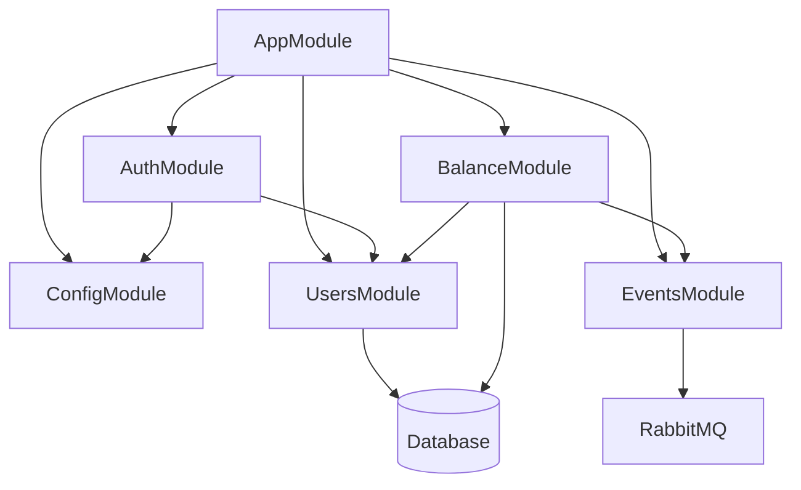

# План реализации Фазы 2: Auth Service

## Обзор

**Порт:** 3001
**Таблицы:** User, Transaction
**Зависимости:** Фаза 1 (Infrastructure & Setup) должна быть завершена

---

## Структура файлов Auth Service

Этот файл лежит в папке:
`<project_root>/doc/plans`

Исходные коды бекенда лежат в папке:
`<project_root>/backend`

Далее в документе все пути указаны от <project_root>.

```
backend/apps/auth-service/
├── src/
│   ├── main.ts                          # Entry point
│   ├── app.module.ts                    # Root module
│   │
│   ├── config/
│   │   ├── config.module.ts             # Config configuration
│   │   └── jwt.config.ts                # JWT settings
│   │
│   ├── common/
│   │   ├── decorators/
│   │   │   └── current-user.decorator.ts
│   │   └── guards/
│   │       └── jwt-auth.guard.ts
│   │
│   ├── users/
│   │   ├── users.module.ts
│   │   ├── users.controller.ts
│   │   ├── users.service.ts
│   │   ├── entities/
│   │   │   └── user.entity.ts
│   │   ├── dto/
│   │   │   ├── create-user.dto.ts
│   │   │   ├── update-user.dto.ts
│   │   │   └── user-response.dto.ts
│   │   └── repositories/
│   │       └── user.repository.ts
│   │
│   ├── auth/
│   │   ├── auth.module.ts
│   │   ├── auth.controller.ts
│   │   ├── auth.service.ts
│   │   ├── strategies/
│   │   │   └── jwt.strategy.ts
│   │   └── dto/
│   │       ├── register.dto.ts
│   │       ├── login.dto.ts
│   │       ├── login-response.dto.ts
│   │       ├── refresh-token.dto.ts
│   │       └── tokens.dto.ts
│   │
│   ├── balance/
│   │   ├── balance.module.ts
│   │   ├── balance.controller.ts
│   │   ├── balance.service.ts
│   │   ├── entities/
│   │   │   └── transaction.entity.ts
│   │   ├── dto/
│   │   │   ├── deposit.dto.ts
│   │   │   ├── reserve.dto.ts
│   │   │   ├── release.dto.ts
│   │   │   ├── refund.dto.ts
│   │   │   └── transaction-response.dto.ts
│   │   └── repositories/
│   │       └── transaction.repository.ts
│   │
│   └── events/
│       ├── events.module.ts
│       ├── events.publisher.ts
│       └── dto/
│           └── user-created.event.dto.ts
│
├── test/
│   ├── app.e2e-spec.ts
│   ├── auth.e2e-spec.ts
│   ├── balance.e2e-spec.ts
│   └── jest-e2e.json
│
└── tsconfig.app.json
```

---

## Shared Libraries Updates

### Обновить `libs/contracts/`

> **Note:** В `libs/contracts` хранятся только те DTOs и интерфейсы, которые используются несколькими сервисами или фронтендом. Внутренние DTOs с validation decorators остаются в самих сервисах.

```
libs/contracts/
├── auth/
│   ├── index.ts
│   ├── dtos/
│   │   ├── user-response.dto.ts     # Используется всеми сервисами и фронтендом
│   │   └── balance-response.dto.ts  # Используется booking service и фронтендом
│   └── interfaces/
│       ├── jwt-payload.interface.ts # Для API Gateway и других сервисов
│       └── user.interface.ts        # Базовый интерфейс пользователя
│
└── events/
    ├── auth/
    │   └── user-created.event.ts    # Публикуется Auth Service
    └── balance/
        └── balance-changed.event.ts # Публикуется Auth Service, слушается другими
```

### Разделение ответственности

| Файл                       | Расположение                              | Причина                            |
| -------------------------- | ----------------------------------------- | ---------------------------------- |
| `register.dto.ts`          | `backend/apps/auth-service/src/auth/dto/` | Внутренний DTO с validation        |
| `login.dto.ts`             | `backend/apps/auth-service/src/auth/dto/` | Внутренний DTO с validation        |
| `user-response.dto.ts`     | `backend/libs/contracts/auth/dtos/`       | Используется API Gateway, Frontend |
| `balance-response.dto.ts`  | `backend/libs/contracts/auth/dtos/`       | Используется Booking Service       |
| `jwt-payload.interface.ts` | `backend/libs/contracts/auth/interfaces/` | Используется API Gateway           |

---

## Этап 2.1: User Entity & Repository

### 2.1.1. Создать User Entity

**Файл:** `backend/apps/auth-service/src/users/entities/user.entity.ts`

```typescript
// Поля согласно ADR:
// - id: UUID (primary key)
// - email: VARCHAR(255) UNIQUE
// - password: VARCHAR(255) - хэшированный
// - name: VARCHAR(255)
// - phone: VARCHAR(20)
// - birthDate: DATE
// - gender: ENUM - male, female
// - role: ENUM - client, admin
// - balance: INTEGER - default 0
// - status: ENUM - active, blocked
// - createdAt: TIMESTAMP
// - updatedAt: TIMESTAMP (добавить для optimistic locking)
```

### 2.1.2. Создать User Repository

**Файл:** `backend/apps/auth-service/src/users/repositories/user.repository.ts`

- Расширить `Repository<User>`
- Добавить кастомные методы:
  - `findByEmail(email: string)`
  - `findByIdWithBalance(id: string)`
  - `updateBalance(id: string, amount: number)` — с optimistic locking

### 2.1.3. Создать Database Migration

**Команда:** `npm run migration:create -- -n CreateUserTable`

**Миграция должна создать таблицу users с:**

- Первичный ключ UUID
- Уникальный индекс на email
- Индекс на role для быстрой фильтрации
- Check constraint: balance >= 0

---

## Этап 2.2: Authentication Module

### 2.2.1. Установить зависимости

```bash
npm i -S -E @nestjs/jwt @nestjs/passport passport passport-jwt bcrypt
npm i -D -E @types/bcrypt @types/passport-jwt
```

### 2.2.2. Создать JWT Configuration

**Файл:** `backend/apps/auth-service/src/config/jwt.config.ts`

```typescript
// Конфигурация:
// - JWT_SECRET (из env)
// - JWT_ACCESS_TTL: 15m
// - JWT_REFRESH_TTL: 7d
```

### 2.2.3. Создать Auth Service

**Файл:** `backend/apps/auth-service/src/auth/auth.service.ts`

**Методы:**

| Метод                            | Описание                              |
| -------------------------------- | ------------------------------------- |
| register(dto)                    | Создать пользователя, хэш пароля      |
| login(dto)                       | Валидация, генерация tokens           |
| refresh(refreshToken)            | Валидация refresh token, новые tokens |
| logout(userId)                   | Инвалидировать refresh token          |
| generateTokens(user)             | Создать access + refresh tokens       |
| hashPassword(password)           | bcrypt.hash с salt rounds = 10        |
| validatePassword(password, hash) | bcrypt.compare                        |

### 2.2.4. Создать Auth Controller

**Файл:** `backend/apps/auth-service/src/auth/auth.controller.ts`

**Endpoints:**

| Method | Path           | Description     | Auth |
| ------ | -------------- | --------------- | ---- |
| POST   | /auth/register | Регистрация     | No   |
| POST   | /auth/login    | Вход            | No   |
| POST   | /auth/refresh  | Обновить tokens | No   |
| POST   | /auth/logout   | Выход           | Yes  |

### 2.2.5. DTOs для Authentication

**RegisterDto:**

```typescript
{
  email: string;        // @IsEmail()
  password: string;     // @MinLength(8), @MaxLength(50)
  name: string;         // @IsString(), @MinLength(2)
  phone?: string;       // @IsOptional(), @IsPhoneNumber()
  birthDate?: string;   // @IsOptional(), @IsDateString()
  gender?: 'male' | 'female'; // @IsOptional(), @IsEnum()
}
```

**LoginDto:**

```typescript
{
  email: string; // @IsEmail()
  password: string; // @IsString()
}
```

**LoginResponseDto:**

```typescript
{
  accessToken: string;
  refreshToken: string;
  user: UserResponseDto;
}
```

### 2.2.6. JWT Strategy

**Файл:** `backend/apps/auth-service/src/auth/strategies/jwt.strategy.ts`

- Расширить `PassportStrategy(Strategy)`
- Извлекать token из Authorization header
- Валидировать payload и возвращать user object

### 2.2.7. Current User Decorator

**Файл:** `backend/apps/auth-service/src/common/decorators/current-user.decorator.ts`

```typescript
// @CurrentUser() decorator для извлечения user из request
export const CurrentUser = createParamDecorator(
  (data: unknown, ctx: ExecutionContext) => {
    const request = ctx.switchToHttp().getRequest();
    return request.user;
  },
);
```

---

## Этап 2.3: User Profile Module

### 2.3.1. Создать Users Service

**Файл:** `backend/apps/auth-service/src/users/users.service.ts`

**Методы:**

| Метод                  | Описание                    |
| ---------------------- | --------------------------- |
| getProfile(id)         | Получить пользователя по ID |
| updateProfile(id, dto) | Обновить профиль            |
| getBalance(id)         | Получить текущий баланс     |

### 2.3.2. Создать Users Controller

**Файл:** `backend/apps/auth-service/src/users/users.controller.ts`

**Endpoints:**

| Method | Path          | Description      | Auth |
| ------ | ------------- | ---------------- | ---- |
| GET    | /auth/me      | Получить профиль | Yes  |
| PATCH  | /auth/me      | Обновить профиль | Yes  |
| GET    | /auth/balance | Получить баланс  | Yes  |

### 2.3.3. DTOs для Profile

**UpdateUserDto:**

```typescript
{
  name?: string;        // @IsOptional(), @IsString()
  phone?: string;       // @IsOptional(), @IsPhoneNumber()
  birthDate?: string;   // @IsOptional(), @IsDateString()
  gender?: 'male' | 'female'; // @IsOptional(), @IsEnum()
}
```

**UserResponseDto:**

```typescript
{
  id: string;
  email: string;
  name: string;
  phone: string | null;
  birthDate: string | null;
  gender: "male" | "female" | null;
  role: "client" | "admin";
  balance: number;
  status: "active" | "blocked";
  createdAt: string;
}
```

**BalanceResponseDto:**

```typescript
{
  balance: number;
  userId: string;
}
```

---

## Этап 2.4: Balance & Transactions Module

### 2.4.1. Создать Transaction Entity

**Файл:** `backend/apps/auth-service/src/balance/entities/transaction.entity.ts`

```typescript
// Поля согласно ADR:
// - id: UUID (primary key)
// - userId: UUID FK → users.id
// - type: ENUM - deposit, withdraw, refund, reserve, release
// - amount: INTEGER - всегда положительное
// - bookingId: UUID FK (nullable) - ссылка на бронирование
// - description: VARCHAR(500) - описание операции
// - createdAt: TIMESTAMP
```

> **Note:** Добавлены типы `reserve` и `release` для работы с Booking Service, а также `description` для читаемости истории.

### 2.4.2. Создать Transaction Repository

**Файл:** `backend/apps/auth-service/src/balance/repositories/transaction.repository.ts`

**Методы:**

- `findByUserId(userId: string, options?: PaginationOptions)`
- `createTransaction(dto: CreateTransactionDto)`

### 2.4.3. Создать Balance Service

**Файл:** `backend/apps/auth-service/src/balance/balance.service.ts`

**Методы:**

| Метод                                | Описание                         |
| ------------------------------------ | -------------------------------- |
| deposit(userId, amount, description) | Пополнить баланс                 |
| reserve(userId, amount, bookingId)   | Зарезервировать баллы (withdraw) |
| release(userId, amount, bookingId)   | Освободить резерв (refund)       |
| refund(userId, amount, bookingId)    | Вернуть баллы пользователю       |
| getTransactions(userId, filters)     | История транзакций с пагинацией  |
| checkEnoughBalance(userId, amount)   | Проверить достаточность баланса  |

**Бизнес-логика для reserve:**

```typescript
async reserve(userId: string, amount: number, bookingId: string): Promise<Transaction> {
  // 1. Проверить баланс в транзакции
  // 2. Если balance >= amount → создать withdraw транзакцию
  // 3. Уменьшить balance пользователя
  // 4. Вернуть созданную транзакцию
  // 5. Если balance < amount → throw InsufficientBalanceException
}
```

**Бизнес-логика для release:**

```typescript
async release(userId: string, amount: number, bookingId: string): Promise<Transaction> {
  // 1. Найти reserve транзакцию по bookingId
  // 2. Создать release транзакцию (возврат в систему)
  // 3. НЕ увеличивать balance пользователя (деньги ушли из системы)
}
```

### 2.4.4. Создать Balance Controller

**Файл:** `backend/apps/auth-service/src/balance/balance.controller.ts`

**Endpoints:**

| Method | Path                  | Description           | Auth    |
| ------ | --------------------- | --------------------- | ------- |
| POST   | /auth/balance/deposit | Пополнить баланс      | Admin   |
| POST   | /auth/balance/reserve | Зарезервировать баллы | Admin\* |
| POST   | /auth/balance/release | Освободить резерв     | Admin\* |
| POST   | /auth/balance/refund  | Вернуть баллы         | Admin\* |
| GET    | /auth/transactions    | История транзакций    | Yes     |

> \*Эти endpoints будут вызываться Booking Service через API Gateway с использованием service-to-service авторизации (X-Service-Name header).

### 2.4.5. DTOs для Balance

**DepositDto:**

```typescript
{
  userId: string;       // @IsUUID()
  amount: number;       // @Min(1), @Max(10000)
  description?: string; // @IsOptional(), @MaxLength(500)
}
```

**ReserveDto:**

```typescript
{
  userId: string; // @IsUUID()
  amount: number; // @Min(1)
  bookingId: string; // @IsUUID()
}
```

**ReleaseDto:**

```typescript
{
  userId: string; // @IsUUID()
  amount: number; // @Min(1)
  bookingId: string; // @IsUUID()
}
```

**RefundDto:**

```typescript
{
  userId: string; // @IsUUID()
  amount: number; // @Min(1)
  bookingId: string; // @IsUUID()
}
```

**TransactionResponseDto:**

```typescript
{
  id: string;
  type: "deposit" | "withdraw" | "refund" | "reserve" | "release";
  amount: number;
  bookingId: string | null;
  description: string | null;
  createdAt: string;
}
```

**TransactionListResponseDto:**

```typescript
{
  items: TransactionResponseDto[];
  total: number;
  page: number;
  limit: number;
}
```

### 2.4.6. Database Migration

**Команда:** `npm run migration:create -- -n CreateTransactionTable`

**Миграция должна:**

- Создать таблицу transactions
- Добавить foreign key на users.id с ON DELETE CASCADE
- Добавить foreign key на bookings.id (если существует) с ON DELETE SET NULL
- Создать индексы на userId, bookingId, createdAt

---

## Этап 2.5: Integration Events (RabbitMQ)

### 2.5.1. Установить зависимости

```bash
npm i -S -E amqplib amqp-connection-manager
npm i -D -E @types/amqplib
```

### 2.5.2. Создать Events Publisher

**Файл:** `backend/apps/auth-service/src/events/events.publisher.ts`

**Методы:**

| Метод                                     | Exchange     | Routing Key     |
| ----------------------------------------- | ------------ | --------------- |
| publishUserCreated(user)                  | events.topic | user.created    |
| publishBalanceChanged(userId, newBalance) | events.topic | balance.changed |

### 2.5.3. Event DTOs

**UserCreatedEvent:**

```typescript
{
  eventId: string; // UUID
  eventType: "user.created";
  timestamp: string; // ISO 8601
  data: {
    userId: string;
    email: string;
    name: string;
    role: "client" | "admin";
  }
}
```

**BalanceChangedEvent:**

```typescript
{
  eventId: string; // UUID
  eventType: "balance.changed";
  timestamp: string; // ISO 8601
  data: {
    userId: string;
    oldBalance: number;
    newBalance: number;
    changeAmount: number;
    transactionType: string;
  }
}
```

### 2.5.4. Интеграция с Balance Service

Обновить `BalanceService` для публикации событий:

- После успешного `deposit()` → publish `balance.changed`
- После успешного `reserve()` → publish `balance.changed`
- После успешного `release()` → publish `balance.changed`
- После успешного `refund()` → publish `balance.changed`

---

## Этап 2.6: Error Handling

### 2.6.1. Создать Custom Exceptions

**Файлы:** `backend/apps/auth-service/src/common/exceptions/`

```typescript
// user-already-exists.exception.ts
export class UserAlreadyExistsException extends BadRequestException {
  constructor(email: string) {
    super(`User with email ${email} already exists`);
  }
}

// invalid-credentials.exception.ts
export class InvalidCredentialsException extends UnauthorizedException {
  constructor() {
    super("Invalid email or password");
  }
}

// insufficient-balance.exception.ts
export class InsufficientBalanceException extends BadRequestException {
  constructor(currentBalance: number, required: number) {
    super(`Insufficient balance: ${currentBalance} < ${required}`);
  }
}

// user-blocked.exception.ts
export class UserBlockedException extends ForbiddenException {
  constructor() {
    super("User account is blocked");
  }
}
```

### 2.6.2. Global Exception Filter

**Файл:** `backend/apps/auth-service/src/common/filters/all-exceptions.filter.ts`

- Форматировать ошибки в RFC 7807 Problem Details
- Логировать ошибки

---

## Этап 2.7: Testing Strategy

### 2.7.1. Unit Tests

**Структура тестов:**

```
backend/apps/auth-service/src/
├── auth/
│   └── auth.service.spec.ts
├── users/
│   └── users.service.spec.ts
├── balance/
│   └── balance.service.spec.ts
└── events/
    └── events.publisher.spec.ts
```

**Покрытие:**

- AuthService: register, login, refresh, logout, password hashing
- UsersService: getProfile, updateProfile
- BalanceService: deposit, reserve, release, refund, checkEnoughBalance
- EventsPublisher: корректность публикации событий

### 2.7.2. E2E Tests

**Файлы:**

```
backend/apps/auth-service/test/
├── auth.e2e-spec.ts          # Регистрация, вход, refresh
├── profile.e2e-spec.ts       # Профиль и баланс
└── balance.e2e-spec.ts       # Операции с балансом
```

**Сценарии E2E тестов:**

**Auth Flow:**

1. Register → 201 Created
2. Login → 200 OK + tokens
3. GET /auth/me → 200 OK + user data
4. Logout → 200 OK
5. GET /auth/me с старым token → 401 Unauthorized

**Balance Flow:**

1. Login as admin
2. POST /auth/balance/deposit → 200 OK
3. GET /auth/balance → balance увеличился
4. POST /auth/balance/reserve → 200 OK
5. POST /auth/balance/release → 200 OK
6. GET /auth/transactions → список транзакций

**Negative Cases:**

1. Register с существующим email → 400 Bad Request
2. Login с неверным паролем → 401 Unauthorized
3. Reserve с недостаточным балансом → 400 Bad Request
4. Access protected route без token → 401 Unauthorized

### 2.7.3. Integration Tests

- Проверка RabbitMQ публикации событий (с использованием test queue)
- Проверка database transactions в balance operations

---

## Этап 2.8: Main.ts и AppModule

### 2.8.1. Main.ts

**Файл:** `backend/apps/auth-service/src/main.ts`

```typescript
async function bootstrap() {
  const app = await NestFactory.create(AppModule);

  // Validation pipe globally
  app.useGlobalPipes(
    new ValidationPipe({
      whitelist: true,
      forbidNonWhitelisted: true,
      transform: true,
    }),
  );

  // Swagger documentation
  const config = new DocumentBuilder()
    .setTitle("Auth Service API")
    .setVersion("1.0")
    .addBearerAuth()
    .build();
  const document = SwaggerModule.createDocument(app, config);
  SwaggerModule.setup("docs", app, document);

  await app.listen(3001);
}
```

### 2.8.2. App Module

**Файл:** `backend/apps/auth-service/src/app.module.ts`

```typescript
@Module({
  imports: [
    ConfigModule.forRoot({ isGlobal: true }),
    TypeOrmModule.forRootAsync({...}),
    AuthModule,
    UsersModule,
    BalanceModule,
    EventsModule,
  ],
})
export class AppModule {}
```

---

## DoD (Definition of Done)

### Функциональные требования

- [ ] User entity с миграцией
- [ ] Transaction entity с миграцией
- [ ] REST API endpoints работают:
  - POST /auth/register
  - POST /auth/login
  - POST /auth/refresh
  - POST /auth/logout
  - GET /auth/me
  - PATCH /auth/me
  - GET /auth/balance
  - POST /auth/balance/deposit
  - POST /auth/balance/reserve
  - POST /auth/balance/release
  - POST /auth/balance/refund
  - GET /auth/transactions
- [ ] JWT access и refresh tokens работают
- [ ] RabbitMQ `user.created` event публикуется при регистрации
- [ ] RabbitMQ `balance.changed` event публикуется при изменении баланса

### Нефункциональные требования

- [ ] Unit тесты выполняются без ошибок
- [ ] E2E тесты покрывают основные сценарии
- [ ] Swagger документация доступна на /api/docs
- [ ] Глобальный error handling в формате RFC 7807
- [ ] Input validation на всех endpoints

### Качество кода

- [ ] `npm run ts` — без ошибок
- [ ] `npm run lint` — без ошибок
- [ ] `npm run test` — все тесты проходят
- [ ] `npm run build` — успешная сборка

### Проверки

**Ручные проверки:**

- [ ] Регистрация нового пользователя через Swagger UI
- [ ] Вход и получение access token
- [ ] Доступ к /auth/me с токеном
- [ ] Пополнение баланса (как admin)
- [ ] RabbitMQ Management UI: проверить создание exchange и публикацию событий

---

## Диаграмма зависимостей модулей



---

## API Summary

| Method | Path                      | Description         | Auth | Role    |
| ------ | ------------------------- | ------------------- | ---- | ------- |
| POST   | /api/auth/register        | Register new user   | No   | -       |
| POST   | /api/auth/login           | Login user          | No   | -       |
| POST   | /api/auth/refresh         | Refresh tokens      | No   | -       |
| POST   | /api/auth/logout          | Logout user         | Yes  | -       |
| GET    | /api/auth/me              | Get current user    | Yes  | -       |
| PATCH  | /api/auth/me              | Update profile      | Yes  | -       |
| GET    | /api/auth/balance         | Get balance         | Yes  | -       |
| POST   | /api/auth/balance/deposit | Deposit points      | Yes  | admin   |
| POST   | /api/auth/balance/reserve | Reserve points      | Yes  | service |
| POST   | /api/auth/balance/release | Release reserve     | Yes  | service |
| POST   | /api/auth/balance/refund  | Refund points       | Yes  | service |
| GET    | /api/auth/transactions    | Transaction history | Yes  | -       |

---

## Порядок реализации

1. **User Entity & Repository** — база для всего остального
2. **Auth Module** — аутентификация (register, login, refresh, logout)
3. **Users Module** — профиль пользователя
4. **Balance Module** — операции с балансом и транзакциями
5. **Events Module** — публикация событий в RabbitMQ
6. **Error Handling** — кастомные exceptions и filters
7. **Testing** — unit и E2E тесты
8. **Documentation** — Swagger

---

## Связь с другими фазами

**Зависимости от Фазы 1:**

- NestJS monorepo структура
- libs/contracts библиотека
- libs/shared библиотека
- PostgreSQL в Docker
- RabbitMQ в Docker

**Использование в последующих фазах:**

- Фаза 4 (Booking Service) → /api/auth/balance/reserve, release, refund
- Фаза 5 (Notification Service) → слушает balance.changed events
- Фаза 6 (API Gateway) → JWT валидация, проксирование запросов
- Фаза 7 (Frontend) → login, register, profile, balance UI
