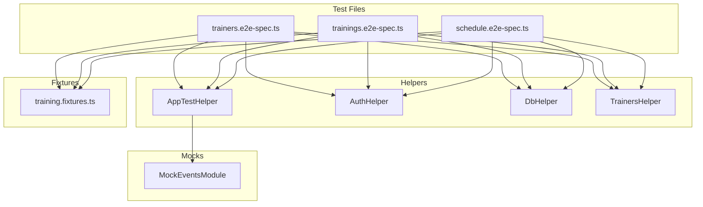

# План E2E тестирования Training Service (Этап 3.8)

## Обзор

Детальный план реализации e2e тестов для training service. Тесты покрывают 3 модуля: Trainers, Trainings, Schedule.

### Аутентификация в тестах

Training service использует [`JwtStrategy`](../../backend/apps/training-service/src/auth/strategies/jwt.strategy.ts) — lightweight стратегию, которая **не обращается к auth сервису и не делает запросов к БД**. Она проверяет только подпись JWT через `JWT_SECRET`.

Это значит, что **auth сервис НЕ нужен для e2e тестов training service**. Токены генерируются локально в тестах через `jwt.sign()` с использованием секрета из [`.env.test`](../../backend/.env.test): `JWT_SECRET=test-jwt-secret-key-for-e2e-tests`.

---

## Структура файлов

```
backend/apps/training-service/test/
├── jest-e2e.json
├── trainers.e2e-spec.ts
├── trainings.e2e-spec.ts
├── schedule.e2e-spec.ts
├── fixtures/
│   └── training.fixtures.ts
├── helpers/
│   ├── app-test.helper.ts
│   ├── auth.helper.ts
│   ├── db.helper.ts
│   └── trainers.helper.ts
└── mocks/
    └── events.module.mock.ts
```

---

## Шаг 1. Настроить тестовое окружение

### 1.1. Создать `jest-e2e.json`

**Файл:** `backend/apps/training-service/test/jest-e2e.json`

Скопировать из auth-service с идентичной структурой:

```json
{
  "moduleFileExtensions": ["js", "json", "ts"],
  "rootDir": ".",
  "testEnvironment": "node",
  "testRegex": ".e2e-spec.ts$",
  "transform": {
    "^.+\\.(t|j)s$": "ts-jest"
  },
  "moduleNameMapper": {
    "@app/contracts/(.*)": "<rootDir>/../../../libs/contracts/src/$1",
    "@app/contracts": "<rootDir>/../../../libs/contracts/src",
    "@app/shared/(.*)": "<rootDir>/../../../libs/shared/src/$1",
    "@app/shared": "<rootDir>/../../../libs/shared/src"
  }
}
```

### 1.2. Добавить скрипт запуска тестов в `package.json`

Убедиться, что в корневом `backend/package.json` есть скрипт для запуска e2e тестов training-service:

```json
"test:e2e:training-service": "jest --config apps/training-service/test/jest-e2e.json"
```

---

## Шаг 2. Создать mocks

### 2.1. Создать `mocks/events.module.mock.ts`

**Файл:** `backend/apps/training-service/test/mocks/events.module.mock.ts`

Следовать паттерну из [`auth-service/test/mocks/events.module.mock.ts`](../../backend/apps/auth-service/test/mocks/events.module.mock.ts). Замокировать [`EventsPublisher`](../../backend/apps/training-service/src/events/events.publisher.ts) и `RabbitMQPublisher`:

```typescript
import { EventsPublisher } from "../../src/events/events.publisher";
import { EventsModule as RealEventsModule } from "../../src/events/events.module";
import { RabbitMQModule, RabbitMQPublisher } from "@app/shared/rabbitmq";

export const mockEventsPublisher = {
  publishTrainingCreated: jest.fn(),
  publishTrainingUpdated: jest.fn(),
  publishTrainingCancelled: jest.fn(),
};

export class MockEventsModule {
  static overrideFrom = RealEventsModule;

  static forRoot() {
    return {
      module: MockEventsModule,
      imports: [RabbitMQModule.forRoot()],
      providers: [
        {
          provide: EventsPublisher,
          useValue: mockEventsPublisher,
        },
        {
          provide: RabbitMQPublisher,
          useValue: {
            publish: jest.fn(),
          },
        },
      ],
      exports: [EventsPublisher],
    };
  }
}
```

---

## Шаг 3. Создать helpers

### 3.1. Создать `helpers/app-test.helper.ts`

**Файл:** `backend/apps/training-service/test/helpers/app-test.helper.ts`

Переиспользовать паттерн из [`auth-service/test/helpers/app-test.helper.ts`](../../backend/apps/auth-service/test/helpers/app-test.helper.ts:13). Класс `AppTestHelper` создаёт NestJS тестовое приложение с `ValidationPipe` и мокает `EventsModule`:

```typescript
export class AppTestHelper {
  private app: INestApplication;
  private dataSource: DataSource;
  private httpServer: Server;
  private request: request.SuperTest<request.Test>;

  async init(): Promise<void> {
    const moduleFixture = await Test.createTestingModule({
      imports: [AppModule],
    })
      .overrideModule(MockEventsModule.overrideFrom)
      .useModule(MockEventsModule.forRoot())
      .compile();

    this.app = moduleFixture.createNestApplication();

    this.app.useGlobalPipes(
      new ValidationPipe({
        whitelist: true,
        forbidNonWhitelisted: true,
        transform: true,
      }),
    );

    await this.app.init();

    this.dataSource = moduleFixture.get(DataSource);
    this.httpServer = this.app.getHttpServer() as Server;
    this.request = request(
      this.httpServer,
    ) as unknown as request.SuperTest<request.Test>;
  }

  async cleanup(): Promise<void> {
    /* закрыть app */
  }
  getHttpServer(): Server {
    return this.httpServer;
  }
  getRequest(): request.SuperTest<request.Test> {
    return this.request;
  }
  getDataSource(): DataSource {
    return this.dataSource;
  }
}
```

> **Note:** Этот класс структурно идентичен auth-service версии. Можно вынести в shared, но пока дублируем для простоты.

### 3.2. Создать `helpers/auth.helper.ts`

**Файл:** `backend/apps/training-service/test/helpers/auth.helper.ts`

Генерация JWT токенов **без вызова auth сервиса**. Используется `jwt.sign()` напрямую:

```typescript
import jwt from "jsonwebtoken";

const JWT_SECRET =
  process.env.JWT_SECRET || "test-jwt-secret-key-for-e2e-tests";

export class AuthHelper {
  generateAdminToken(userId = "00000000-0000-0000-0000-000000000001"): string {
    return jwt.sign(
      { sub: userId, email: "admin@test.com", role: "admin" },
      JWT_SECRET,
      { expiresIn: "1h" },
    );
  }

  generateClientToken(userId = "00000000-0000-0000-0000-000000000002"): string {
    return jwt.sign(
      { sub: userId, email: "client@test.com", role: "client" },
      JWT_SECRET,
      { expiresIn: "1h" },
    );
  }

  generateExpiredToken(
    userId = "00000000-0000-0000-0000-000000000003",
  ): string {
    return jwt.sign(
      { sub: userId, email: "expired@test.com", role: "client" },
      JWT_SECRET,
      { expiresIn: "0ms" },
    );
  }
}
```

### 3.3. Создать `helpers/db.helper.ts`

**Файл:** `backend/apps/training-service/test/helpers/db.helper.ts`

Очистка таблиц в правильном порядке (сначала зависимые):

```typescript
import { DataSource } from "typeorm";
import { Training } from "../../src/trainings/entities/training.entity";
import { Trainer } from "../../src/trainers/entities/trainer.entity";

export class DbHelper {
  constructor(private dataSource: DataSource) {}

  async truncateTables(): Promise<void> {
    await this.dataSource.transaction(async (manager) => {
      await manager.createQueryBuilder().delete().from(Training).execute();
      await manager.createQueryBuilder().delete().from(Trainer).execute();
    });
  }
}
```

### 3.4. Создать `helpers/trainers.helper.ts`

**Файл:** `backend/apps/training-service/test/helpers/trainers.helper.ts`

HTTP helper для запросов к trainers API:

```typescript
import request from "supertest";
import { Response } from "supertest";

export type TestResponse<T> = Omit<Response, "body"> & { body: T };

export class TrainersHelper {
  constructor(private request: request.SuperTest<request.Test>) {}

  async create(
    token: string,
    data: Record<string, unknown>,
  ): Promise<TestResponse<unknown>> {
    const response = await this.request
      .post("/trainers")
      .set("Authorization", `Bearer ${token}`)
      .send(data);
    return response as unknown as TestResponse<unknown>;
  }

  async findAll(token: string): Promise<TestResponse<unknown>> {
    const response = await this.request
      .get("/trainers")
      .set("Authorization", `Bearer ${token}`);
    return response as unknown as TestResponse<unknown>;
  }

  async findById(token: string, id: string): Promise<TestResponse<unknown>> {
    const response = await this.request
      .get(`/trainers/${id}`)
      .set("Authorization", `Bearer ${token}`);
    return response as unknown as TestResponse<unknown>;
  }

  async update(
    token: string,
    id: string,
    data: Record<string, unknown>,
  ): Promise<TestResponse<unknown>> {
    const response = await this.request
      .patch(`/trainers/${id}`)
      .set("Authorization", `Bearer ${token}`)
      .send(data);
    return response as unknown as TestResponse<unknown>;
  }

  async remove(token: string, id: string): Promise<TestResponse<unknown>> {
    const response = await this.request
      .delete(`/trainers/${id}`)
      .set("Authorization", `Bearer ${token}`);
    return response as unknown as TestResponse<unknown>;
  }
}
```

---

## Шаг 4. Создать fixtures

### 4.1. Создать `fixtures/training.fixtures.ts`

**Файл:** `backend/apps/training-service/test/fixtures/training.fixtures.ts`

Фабрики для тестовых данных:

```typescript
import { TrainingType } from "@app/shared";

// --- Trainer fixtures ---

export function createTrainerDto(overrides?: Record<string, unknown>) {
  return {
    name: "Test Trainer",
    bio: "Experienced fitness trainer",
    ...overrides,
  };
}

// --- Training fixtures ---

// Дата в будущем (через 7 дней)
export function futureDate(daysAhead = 7): string {
  const date = new Date();
  date.setDate(date.getDate() + daysAhead);
  date.setHours(10, 0, 0, 0);
  return date.toISOString();
}

export function createTrainingDto(
  trainerId: string,
  overrides?: Record<string, unknown>,
) {
  return {
    title: "Morning Yoga",
    description: "Relaxing morning yoga session",
    type: TrainingType.YOGA,
    trainerId,
    scheduledAt: futureDate(7),
    durationMinutes: 60,
    capacity: 20,
    price: 500,
    ...overrides,
  };
}
```

---

## Шаг 5. E2E тесты — Trainers

### Файл: `test/trainers.e2e-spec.ts`

```
describe('TrainersController (e2e)')

  beforeAll: init AppTestHelper, DbHelper, AuthHelper, TrainersHelper
  afterAll: cleanup
  beforeEach: truncateTables, reset mockEventsPublisher mocks

  describe('POST /trainers')
    ✓ should create a new trainer with valid data (admin token) → 201
      - Отправить createTrainerDto() с admin token
      - Проверить 201, body содержит id, name, bio, isActive=true

    ✓ should return 400 when name is missing → 400
      - Отправить { bio: 'test' } с admin token

    ✓ should return 400 when name exceeds 255 chars → 400
      - Отправить { name: 'a'.repeat(256) }

    ✓ should return 401 when no auth token → 401
      - Отправить без Authorization header

    ✓ should return 401 when token is expired → 401
      - Использовать expiredToken

  describe('GET /trainers')
    ✓ should return list of active trainers → 200
      - Создать 2 тренеров
      - Получить список, проверить length=2

    ✓ should return only active trainers (exclude deactivated) → 200
      - Создать 2 тренеров
      - Деактивировать 1 через DELETE
      - Получить список, проверить length=1

    ✓ should return empty array when no trainers exist → 200
      - Пустая БД → []

    ✓ should return 401 when no auth token → 401

  describe('GET /trainers/:id')
    ✓ should return trainer by ID → 200
      - Создать тренера, запросить по id

    ✓ should return 404 for non-existent trainer → 404
      - Запросить с несуществующим UUID

    ✓ should return 401 when no auth token → 401

  describe('PATCH /trainers/:id')
    ✓ should update trainer name → 200
      - Обновить name, проверить в response

    ✓ should update trainer bio → 200

    ✓ should deactivate trainer via isActive=false → 200
      - PATCH с { isActive: false }

    ✓ should return 404 for non-existent trainer → 404

    ✓ should return 401 when no auth token → 401

  describe('DELETE /trainers/:id')
    ✓ should deactivate trainer (soft delete) → 200
      - DELETE, затем GET /trainers — тренера нет в списке
      - GET /trainers/:id — тренер с isActive=false

    ✓ should return 404 for non-existent trainer → 404

    ✓ should return 401 when no auth token → 401
```

**Итого: ~18 тестов**

---

## Шаг 6. E2E тесты — Trainings

### Файл: `test/trainings.e2e-spec.ts`

```
describe('TrainingsController (e2e)')

  beforeAll: init helpers
  afterAll: cleanup
  beforeEach: truncateTables, reset mocks

  describe('POST /trainings')
    ✓ should create a training with valid data and active trainer → 201
      - Создать тренера, создать тренировку с trainerId
      - Проверить response: id, title, type, status='scheduled', availableSlots

    ✓ should publish training.created event → проверка mockEventsPublisher.publishTrainingCreated

    ✓ should return 400 when trainer does not exist → 400
      - Использовать несуществующий UUID как trainerId

    ✓ should return 400 when trainer is not active → 400
      - Создать тренера, деактивировать, попытаться создать тренировку

    ✓ should return 400 when scheduledAt is in the past → 400
      - Использовать дату в прошлом

    ✓ should return 400 on schedule conflict → 409
      - Создать 2 тренировки с одинаковым trainerId и пересекающимся временем

    ✓ should return 400 when title is missing → 400

    ✓ should return 400 when type is invalid → 400

    ✓ should return 400 when capacity exceeds 100 → 400

    ✓ should return 400 when durationMinutes is less than 15 → 400

    ✓ should return 400 when extra fields are provided → 400
      - Отправить с extraField

    ✓ should return 401 when no auth token → 401

  describe('GET /trainings')
    ✓ should return paginated list of trainings → 200
      - Создать несколько тренировок, проверить data[], total

    ✓ should return empty list when no trainings exist → 200
      - data=[], total=0

    ✓ should filter by type → 200
      - Создать yoga + crossfit, запросить ?type=yoga → 1 результат

    ✓ should filter by trainerId → 200
      - Создать 2 тренеров, тренировки для каждого, фильтровать

    ✓ should filter by date range → 200
      - ?dateFrom=...&dateTo=...

    ✓ should respect pagination (page, limit) → 200
      - Создать 5 тренировок, запросить ?page=1&limit=2 → 2 results

    ✓ should return 401 when no auth token → 401

  describe('GET /trainings/:id')
    ✓ should return training details by ID → 200
      - Проверить все поля response

    ✓ should return 404 for non-existent training → 404

    ✓ should return 401 when no auth token → 401

  describe('GET /trainings/:id/availability')
    ✓ should return availability info → 200
      - Проверить { trainingId, capacity, currentParticipants, availableSlots, isAvailable }

    ✓ should return isAvailable=true when slots available → 200

    ✓ should return 404 for non-existent training → 404

    ✓ should return 401 when no auth token → 401

  describe('PATCH /trainings/:id')
    ✓ should update training title → 200

    ✓ should publish training.updated event → проверка mock

    ✓ should return 400 when updating cancelled training → 400
      - Создать, отменить, попытаться обновить

    ✓ should return 404 for non-existent training → 404

    ✓ should return 401 when no auth token → 401

  describe('DELETE /trainings/:id')
    ✓ should cancel training (set status=cancelled) → 200
      - DELETE, затем GET — status='cancelled'

    ✓ should publish training.cancelled event → проверка mock

    ✓ should return 400 when cancelling already cancelled training → 400
      - Дважды DELETE один и тот же id

    ✓ should return 404 for non-existent training → 404

    ✓ should return 401 when no auth token → 401
```

**Итого: ~30 тестов**

---

## Шаг 7. E2E тесты — Schedule

### Файл: `test/schedule.e2e-spec.ts`

```
describe('ScheduleController (e2e)')

  beforeAll: init helpers
  afterAll: cleanup
  beforeEach: truncateTables, reset mocks

  describe('GET /schedule/week')
    ✓ should return weekly schedule → 200
      - Создать тренировки на текущей неделе
      - Проверить структуру: weekStart, weekEnd, days[7]
      - Проверить что дни содержат тренировки

    ✓ should return schedule for specific week → 200
      - GET /schedule/week?date=2026-04-13
      - Проверить weekStart — начало указанной недели (понедельник)

    ✓ should return empty days for week without trainings → 200
      - Не создавать тренировки
      - Проверить days[7] с пустыми trainings[]

    ✓ should return 401 when no auth token → 401

  describe('GET /schedule/trainer/:id')
    ✓ should return trainer schedule → 200
      - Создать тренера, создать тренировки
      - Запросить расписание тренера
      - Проверить { trainer: { id, name }, trainings: [...] }

    ✓ should return 404 for non-existent trainer → 404
      - Использовать несуществующий UUID

    ✓ should filter by date range → 200
      - ?dateFrom=...&dateTo=...

    ✓ should use default 30-day range when no dates provided → 200

    ✓ should return 401 when no auth token → 401
```

**Итого: ~8 тестов**

---

## Общая спецификация тестов

| Файл                    | Количество тестов |
| ----------------------- | ----------------- |
| `trainers.e2e-spec.ts`  | ~18               |
| `trainings.e2e-spec.ts` | ~30               |
| `schedule.e2e-spec.ts`  | ~8                |
| **Всего**               | **~56**           |

---

## Диаграмма зависимостей тестовых файлов



---

## Порядок реализации

1. Создать `jest-e2e.json` и скрипт запуска
2. Создать `mocks/events.module.mock.ts`
3. Создать `helpers/app-test.helper.ts`
4. Создать `helpers/auth.helper.ts`
5. Создать `helpers/db.helper.ts`
6. Создать `helpers/trainers.helper.ts`
7. Создать `fixtures/training.fixtures.ts`
8. Создать `trainers.e2e-spec.ts`
9. Создать `trainings.e2e-spec.ts`
10. Создать `schedule.e2e-spec.ts`
11. Запустить тесты, убедиться что все проходят

---

## Требования к окружению

Для запуска e2e тестов должны быть доступны:

- **PostgreSQL** — база `dreamfitness_test` (с применёнными миграциями)
- **RabbitMQ** — переменные окружения указаны, но actual publishing мокается (RabbitMQ может не работать, но `RabbitMQModule.forRoot()` должен успешно инициализироваться)
- **Переменные окружения** из [`backend/.env.test`](../../backend/.env.test)

Команда запуска:

```bash
cd backend && npm run test:e2e:training-service
```

---

## Переиспользование кода

| Компонент          | Переиспользуется? | Комментарий                                                                                                                                                              |
| ------------------ | ----------------- | ------------------------------------------------------------------------------------------------------------------------------------------------------------------------ |
| `AppTestHelper`    | Дублируется       | Структура идентична auth-service, отличается только импорт `AppModule` и `MockEventsModule`. Вынос в shared нецелесообразен из-за жёсткой привязки к конкретному сервису |
| `DbHelper`         | Нет               | Разные entity для очистки                                                                                                                                                |
| `AuthHelper`       | **Уникальный**    | В auth-service работает через HTTP (register/login). В training-service — через `jwt.sign()` напрямую                                                                    |
| `MockEventsModule` | Дублируется       | Паттерн идентичен, но разные mock-методы (publishTrainingCreated и т.д.)                                                                                                 |
| `Fixtures`         | Нет               | Уникальные данные для каждого сервиса                                                                                                                                    |
