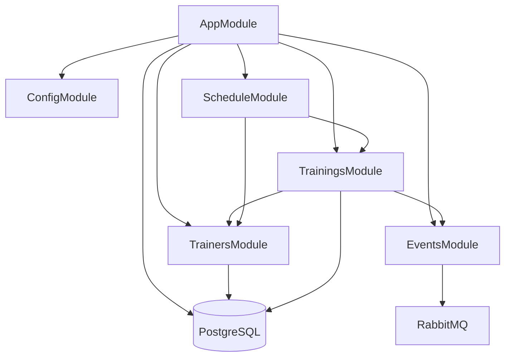

# План реализации Фазы 3: Training Service

## Обзор

**Порт:** 3002
**Таблицы:** Trainer, Training
**Зависимости:** Фаза 1 (Infrastructure & Setup) — завершена, Фаза 2 (Auth Service) — завершена

---

## Решения по контрактам

Перед началом реализации нужно обновить существующие контракты в `libs/contracts/src/training/`, чтобы они соответствовали DB-схеме из InitialSchema миграции:

| Аспект                       | Решение                                                             |
| ---------------------------- | ------------------------------------------------------------------- |
| Время тренировки             | `scheduled_at` + `duration_minutes` (не startTime/endTime)          |
| Дополнительные поля Training | Добавить `description`, `status`, `updated_at` через новую миграцию |
| currentParticipants          | Вычисляемое поле (COUNT bookings со status=confirmed)               |
| Поля Trainer                 | `name`, `bio`, `avatarUrl`, `isActive` (не email/specialization)    |

---

## Дополнительные требования

Во время реализации данного плана (при кодировании) нужно использовать nest-expert skill и typescript skill.

---

## Структура файлов Training Service

```
backend/apps/training-service/
├── src/
│   ├── main.ts                              # Entry point с Swagger
│   ├── app.module.ts                        # Root module
│   │
│   ├── config/
│   │   ├── config.module.ts                 # Config configuration
│   │   └── config.service.ts                # Config service
│   │
│   ├── database/
│   │   └── database.module.ts               # TypeORM connection
│   │
│   ├── trainers/
│   │   ├── trainers.module.ts
│   │   ├── trainers.controller.ts
│   │   ├── trainers.service.ts
│   │   ├── entities/
│   │   │   └── trainer.entity.ts
│   │   ├── dto/
│   │   │   ├── create-trainer.dto.ts
│   │   │   ├── update-trainer.dto.ts
│   │   │   └── trainer-response.dto.ts
│   │   └── repositories/
│   │       └── trainer.repository.ts
│   │
│   ├── trainings/
│   │   ├── trainings.module.ts
│   │   ├── trainings.controller.ts
│   │   ├── trainings.service.ts
│   │   ├── entities/
│   │   │   └── training.entity.ts
│   │   ├── dto/
│   │   │   ├── create-training.dto.ts
│   │   │   ├── update-training.dto.ts
│   │   │   ├── training-response.dto.ts
│   │   │   └── training-filter.dto.ts
│   │   └── repositories/
│   │       └── training.repository.ts
│   │
│   ├── schedule/
│   │   ├── schedule.module.ts
│   │   ├── schedule.controller.ts
│   │   └── schedule.service.ts
│   │
│   └── events/
│       ├── events.module.ts
│       └── events.publisher.ts
│
├── test/
│   ├── jest-e2e.json
│   ├── trainers.e2e-spec.ts
│   ├── trainings.e2e-spec.ts
│   ├── schedule.e2e-spec.ts
│   ├── fixtures/
│   │   └── training.fixtures.ts
│   └── helpers/
│       ├── app-test.helper.ts
│       └── db.helper.ts
│
└── tsconfig.app.json
```

---

## Этап 3.0: Обновление контрактов и миграции

### 3.0.1. Обновить DTOs в `libs/contracts/src/training/training.dto.ts`

Переписать файл, чтобы соответствовать DB-схеме:

**CreateTrainingDto:**

```typescript
{
  title: string;            // @IsString(), @MinLength(2), @MaxLength(255)
  description?: string;     // @IsOptional(), @IsString(), @MaxLength(1000)
  type: TrainingType;       // @IsEnum(TrainingType)
  trainerId: string;        // @IsUUID()
  scheduledAt: string;      // @IsDateString()
  durationMinutes: number;  // @IsInt(), @Min(15), @Max(480)
  capacity: number;         // @IsInt(), @Min(1), @Max(100)
  price: number;            // @IsInt(), @Min(0)
}
```

**UpdateTrainingDto:**

```typescript
{
  title?: string;
  description?: string;
  type?: TrainingType;
  trainerId?: string;
  scheduledAt?: string;
  durationMinutes?: number;
  capacity?: number;
  price?: number;
  status?: TrainingStatus;
}
```

**TrainingResponseDto:**

```typescript
{
  id: string;
  title: string;
  description: string | null;
  type: TrainingType;
  trainerId: string;
  trainerName?: string;          // Добавляется при join с trainers
  scheduledAt: string;
  durationMinutes: number;
  capacity: number;
  currentParticipants: number;   // Вычисляемое поле
  availableSlots: number;        // capacity - currentParticipants
  price: number;
  status: TrainingStatus;
  createdAt: string;
  updatedAt: string;
}
```

**CreateTrainerDto:**

```typescript
{
  name: string;             // @IsString(), @MinLength(2), @MaxLength(255)
  bio?: string;             // @IsOptional(), @IsString(), @MaxLength(2000)
  avatarUrl?: string;       // @IsOptional(), @IsUrl()
}
```

**UpdateTrainerDto:**

```typescript
{
  name?: string;
  bio?: string;
  avatarUrl?: string;
  isActive?: boolean;       // @IsOptional(), @IsBoolean()
}
```

**TrainerResponseDto:**

```typescript
{
  id: string;
  name: string;
  bio: string | null;
  avatarUrl: string | null;
  isActive: boolean;
  createdAt: string;
  updatedAt: string;
}
```

**TrainingFilterDto:**

```typescript
{
  type?: TrainingType;
  trainerId?: string;
  dateFrom?: string;        // @IsOptional(), @IsDateString()
  dateTo?: string;          // @IsOptional(), @IsDateString()
  page?: number;            // @IsOptional(), @IsInt(), @Min(1), default 1
  limit?: number;           // @IsOptional(), @IsInt(), @Min(1), @Max(50), default 10
}
```

### 3.0.2. Добавить enums в shared

**Файл:** `backend/libs/shared/src/enums/training.enums.ts`

```typescript
export enum TrainingType {
  YOGA = "yoga",
  PILATES = "pilates",
  CROSSFIT = "crossfit",
  BOXING = "boxing",
  STRENGTH = "strength",
  CARDIO = "cardio",
  DANCE = "dance",
  STRETCHING = "stretching",
}

export enum TrainingStatus {
  SCHEDULED = "scheduled",
  CANCELLED = "cancelled",
  COMPLETED = "completed",
}
```

Обновить `backend/libs/shared/src/enums/index.ts` чтобы экспортировать новый файл.

### 3.0.3. Обновить events в `libs/contracts/src/training/training.events.ts`

Привести в соответствие с новыми полями:

```typescript
export interface TrainingCreatedEvent {
  eventType: "training.created";
  data: {
    trainingId: string;
    title: string;
    type: string;
    trainerId: string;
    scheduledAt: string;
    durationMinutes: number;
    capacity: number;
    price: number;
  };
}

export interface TrainingUpdatedEvent {
  eventType: "training.updated";
  data: {
    trainingId: string;
    changes: Record<string, unknown>;
    updatedAt: string;
  };
}

export interface TrainingCancelledEvent {
  eventType: "training.cancelled";
  data: {
    trainingId: string;
    reason?: string;
    cancelledAt: string;
  };
}
```

### 3.0.4. Создать миграцию для новых колонок trainings

**Команда:** `npm run migration:create -- -n AddTrainingDescriptionAndStatus`

Миграция должна:

1. Добавить колонку `description` (text, nullable) в `trainings`
2. Добавить колонку `status` (training_status_enum, default 'scheduled') в `trainings`
3. Добавить колонку `updated_at` (timestamp, default now()) в `trainings`
4. Создать enum тип `training_status_enum`
5. Обновить `updated_at` через триггер при UPDATE

> **Note:** Нужно также обновить InitialSchema миграцию? Нет — существующая миграция уже применена. Новые колонки добавляются отдельной миграцией.

---

## Этап 3.1: Config и Database Module

### 3.1.1. Создать ConfigModule и ConfigService

**Файлы:**

- `backend/apps/training-service/src/config/config.module.ts`
- `backend/apps/training-service/src/config/config.service.ts`

Следовать паттерну из auth-service:

```typescript
// config.service.ts
interface DatabaseConfig {
  host: string;
  port: number;
  username: string;
  password: string;
  database: string;
}

@Injectable()
export class ConfigService {
  constructor(
    @Inject("DATABASE_CONFIG") private readonly dbConfig: DatabaseConfig,
  ) {}

  getDatabaseConfig(): DatabaseConfig {
    return this.dbConfig;
  }
}
```

**Файл:** `backend/apps/training-service/src/config/index.ts` — barrel export.

### 3.1.2. Создать DatabaseModule

**Файл:** `backend/apps/training-service/src/database/database.module.ts`

```typescript
@Module({
  imports: [
    TypeOrmModule.forRootAsync({
      imports: [ConfigModule],
      inject: [ConfigService],
      useFactory: (configService: ConfigService) => ({
        type: "postgres" as const,
        host: configService.getDatabaseConfig().host,
        port: configService.getDatabaseConfig().port,
        username: configService.getDatabaseConfig().username,
        password: configService.getDatabaseConfig().password,
        database: configService.getDatabaseConfig().database,
        entities: [Trainer, Training],
        synchronize: false,
        logging: process.env.NODE_ENV === "development",
      }),
    }),
  ],
})
export class DatabaseModule {}
```

---

## Этап 3.2: Trainer Module

### 3.2.1. Создать Trainer Entity

**Файл:** `backend/apps/training-service/src/trainers/entities/trainer.entity.ts`

```typescript
@Entity("trainers")
export class Trainer {
  @PrimaryGeneratedColumn("uuid")
  id: string;

  @Column({ type: "varchar", length: 255 })
  name: string;

  @Column({ type: "text", nullable: true })
  bio: string | null;

  @Column({ type: "varchar", length: 500, name: "avatar_url", nullable: true })
  avatarUrl: string | null;

  @Column({ type: "boolean", name: "is_active", default: true })
  isActive: boolean;

  @CreateDateColumn({ name: "created_at" })
  createdAt: Date;

  @UpdateDateColumn({ name: "updated_at" })
  updatedAt: Date;
}
```

### 3.2.2. Создать Trainer Repository

**Файл:** `backend/apps/training-service/src/trainers/repositories/trainer.repository.ts`

Методы:

- `findActive()` — все активные тренеры
- `findById(id)` — найти по ID
- `findByName(name)` — поиск по имени

### 3.2.3. Создать Trainer DTOs

**Файлы:**

- `backend/apps/training-service/src/trainers/dto/create-trainer.dto.ts`
- `backend/apps/training-service/src/trainers/dto/update-trainer.dto.ts`
- `backend/apps/training-service/src/trainers/dto/trainer-response.dto.ts`

> **Note:** Внутренние DTOs с validation decorators создаются внутри сервиса. Контракты в `@app/contracts` содержат интерфейсы для межсервисного использования.

### 3.2.4. Создать TrainersService

**Файл:** `backend/apps/training-service/src/trainers/trainers.service.ts`

| Метод             | Описание                                                  |
| ----------------- | --------------------------------------------------------- |
| `create(dto)`     | Создать тренера (admin only)                              |
| `update(id, dto)` | Обновить данные тренера (admin only)                      |
| `remove(id)`      | Деактивировать тренера (soft delete через isActive=false) |
| `findById(id)`    | Получить тренера по ID                                    |
| `findActive()`    | Список активных тренеров                                  |

### 3.2.5. Создать TrainersController

**Файл:** `backend/apps/training-service/src/trainers/trainers.controller.ts`

**Endpoints:**

| Method | Path          | Description              | Auth | Role  |
| ------ | ------------- | ------------------------ | ---- | ----- |
| POST   | /trainers     | Создать тренера          | Yes  | admin |
| GET    | /trainers     | Список активных тренеров | Yes  | -     |
| GET    | /trainers/:id | Получить тренера         | Yes  | -     |
| PATCH  | /trainers/:id | Обновить тренера         | Yes  | admin |
| DELETE | /trainers/:id | Деактивировать тренера   | Yes  | admin |

> **Note:** Auth будет работать через X-User-Id и X-User-Role headers от API Gateway. Для текущей фазы используем JWT guard напрямую (как в auth-service).

### 3.2.6. Создать TrainersModule

**Файл:** `backend/apps/training-service/src/trainers/trainers.module.ts`

```typescript
@Module({
  imports: [TypeOrmModule.forFeature([Trainer])],
  controllers: [TrainersController],
  providers: [TrainersService, TrainerRepository],
  exports: [TrainersService],
})
export class TrainersModule {}
```

---

## Этап 3.3: Training Module

### 3.3.1. Создать Training Entity

**Файл:** `backend/apps/training-service/src/trainings/entities/training.entity.ts`

```typescript
@Entity("trainings")
@Index(["trainerId"])
@Index(["scheduledAt"])
@Index(["type"])
export class Training {
  @PrimaryGeneratedColumn("uuid")
  id: string;

  @Column({ type: "uuid", name: "trainer_id" })
  trainerId: string;

  @ManyToOne(() => Trainer, { onDelete: "RESTRICT" })
  @JoinColumn({ name: "trainer_id" })
  trainer: Trainer;

  @Column({ type: "varchar", length: 255 })
  title: string;

  @Column({ type: "text", nullable: true })
  description: string | null;

  @Column({ type: "training_type_enum" })
  type: TrainingType;

  @Column({ type: "timestamp", name: "scheduled_at" })
  scheduledAt: Date;

  @Column({ type: "integer", name: "duration_minutes" })
  durationMinutes: number;

  @Column({ type: "integer" })
  capacity: number;

  @Column({ type: "integer" })
  price: number;

  @Column({
    type: "training_status_enum",
    default: TrainingStatus.SCHEDULED,
  })
  status: TrainingStatus;

  @CreateDateColumn({ name: "created_at" })
  createdAt: Date;

  @UpdateDateColumn({ name: "updated_at" })
  updatedAt: Date;
}
```

### 3.3.2. Создать Training Repository

**Файл:** `backend/apps/training-service/src/trainings/repositories/training.repository.ts`

Методы:

- `findById(id)` — найти по ID
- `findWithFilters(filterDto)` — фильтрация по type, trainerId, dateFrom, dateTo с пагинацией
- `countActiveBookings(trainingId)` — количество confirmed bookings
- `findByDateRange(dateFrom, dateTo)` — для schedule
- `findByTrainerAndDateRange(trainerId, dateFrom, dateTo)` — для schedule по тренеру

### 3.3.3. Создать Training DTOs

**Файлы:**

- `backend/apps/training-service/src/trainings/dto/create-training.dto.ts`
- `backend/apps/training-service/src/trainings/dto/update-training.dto.ts`
- `backend/apps/training-service/src/trainings/dto/training-response.dto.ts`
- `backend/apps/training-service/src/trainings/dto/training-filter.dto.ts`

### 3.3.4. Создать TrainingsService

**Файл:** `backend/apps/training-service/src/trainings/trainings.service.ts`

| Метод                 | Описание                                                                    |
| --------------------- | --------------------------------------------------------------------------- |
| `create(dto)`         | Создать тренировку (admin only). Проверить что trainer существует и активен |
| `update(id, dto)`     | Обновить тренировку (admin only)                                            |
| `remove(id)`          | Отменить тренировку — установить status=cancelled (admin only)              |
| `findById(id)`        | Получить тренировку по ID с availableSlots                                  |
| `findAll(filterDto)`  | Список тренировок с фильтрами и пагинацией                                  |
| `getAvailability(id)` | Проверить доступность мест                                                  |

**Бизнес-правила create:**

```
1. Проверить что trainerId существует и trainer.isActive = true
2. Проверить что scheduledAt в будущем
3. Проверить что нет пересечений по времени у тренера
4. Создать тренировку
5. Опубликовать TrainingCreated event
```

**Бизнес-правила getAvailability:**

```
1. Найти тренировку по ID
2. Посчитать currentParticipants = COUNT(confirmed bookings)
3. Вернуть { trainingId, capacity, currentParticipants, availableSlots, isAvailable }
```

> **Note:** `currentParticipants` пока не может быть точно вычислен в Training Service, так как bookings находятся в Booking Service. Для текущей фазы используем 0 как placeholder. Реальное значение будет доступно после реализации Booking Service (Фаза 4) через HTTP вызов или view.

### 3.3.5. Создать TrainingsController

**Файл:** `backend/apps/training-service/src/trainings/trainings.controller.ts`

**Endpoints:**

| Method | Path                        | Description                   | Auth | Role  |
| ------ | --------------------------- | ----------------------------- | ---- | ----- |
| POST   | /trainings                  | Создать тренировку            | Yes  | admin |
| GET    | /trainings                  | Список тренировок с фильтрами | Yes  | -     |
| GET    | /trainings/:id              | Детали тренировки             | Yes  | -     |
| PATCH  | /trainings/:id              | Обновить тренировку           | Yes  | admin |
| DELETE | /trainings/:id              | Отменить тренировку           | Yes  | admin |
| GET    | /trainings/:id/availability | Проверка доступных мест       | Yes  | -     |

### 3.3.6. Создать TrainingsModule

**Файл:** `backend/apps/training-service/src/trainings/trainings.module.ts`

```typescript
@Module({
  imports: [TypeOrmModule.forFeature([Training]), TrainersModule, EventsModule],
  controllers: [TrainingsController],
  providers: [TrainingsService, TrainingRepository],
  exports: [TrainingsService],
})
export class TrainingsModule {}
```

---

## Этап 3.4: Schedule Module

### 3.4.1. Создать ScheduleService

**Файл:** `backend/apps/training-service/src/schedule/schedule.service.ts`

| Метод                                               | Описание                                    |
| --------------------------------------------------- | ------------------------------------------- |
| `getWeekSchedule(weekStart?)`                       | Расписание на неделю (по умолчанию текущая) |
| `getTrainerSchedule(trainerId, dateFrom?, dateTo?)` | Расписание по тренеру                       |

**Логика getWeekSchedule:**

```
1. Определить startOfWeek (понедельник начало дня) и endOfWeek (воскресенье конец дня)
2. Получить все тренировки в этом диапазоне через repository
3. Сгруппировать по дням
4. Для каждой тренировки добавить trainer info
5. Вернуть структурированный результат
```

### 3.4.2. Создать ScheduleController

**Файл:** `backend/apps/training-service/src/schedule/schedule.controller.ts`

**Endpoints:**

| Method | Path                  | Description           | Auth | Role |
| ------ | --------------------- | --------------------- | ---- | ---- |
| GET    | /schedule/week        | Недельное расписание  | Yes  | -    |
| GET    | /schedule/trainer/:id | Расписание по тренеру | Yes  | -    |

**Query params для /schedule/week:**

```
?date=2026-04-13   — начало недели (необязательный, по умолчанию текущая)
```

**Query params для /schedule/trainer/:id:**

```
?dateFrom=2026-04-13&dateTo=2026-04-20
```

### 3.4.3. Создать ScheduleModule

**Файл:** `backend/apps/training-service/src/schedule/schedule.module.ts`

```typescript
@Module({
  imports: [TrainingsModule, TrainersModule],
  controllers: [ScheduleController],
  providers: [ScheduleService],
})
export class ScheduleModule {}
```

---

## Этап 3.5: Integration Events (RabbitMQ)

### 3.5.1. Создать EventsModule

**Файл:** `backend/apps/training-service/src/events/events.module.ts`

Импортировать `RabbitMQModule` из `@app/shared/rabbitmq`.

### 3.5.2. Создать EventsPublisher

**Файл:** `backend/apps/training-service/src/events/events.publisher.ts`

| Метод                                           | Routing Key          | Описание                  |
| ----------------------------------------------- | -------------------- | ------------------------- |
| `publishTrainingCreated(training)`              | `training.created`   | При создании тренировки   |
| `publishTrainingUpdated(training, changes)`     | `training.updated`   | При обновлении тренировки |
| `publishTrainingCancelled(trainingId, reason?)` | `training.cancelled` | При отмене тренировки     |

**Формат события:**

```typescript
{
  eventId: string;       // UUID
  eventType: string;     // 'training.created' | 'training.updated' | 'training.cancelled'
  timestamp: string;     // ISO 8601
  data: { ... }
}
```

### 3.5.3. Интеграция с TrainingsService

Обновить `TrainingsService` для публикации событий:

- После успешного `create()` → publish `training.created`
- После успешного `update()` → publish `training.updated`
- После успешного `remove()` (cancel) → publish `training.cancelled`

---

## Этап 3.6: Error Handling

### 3.6.1. Создать Custom Exceptions

**Файлы:** `backend/apps/training-service/src/common/exceptions/`

```typescript
// trainer-not-found.exception.ts
export class TrainerNotFoundException extends NotFoundException {
  constructor(id: string) {
    super(`Trainer with ID ${id} not found`);
  }
}

// trainer-not-active.exception.ts
export class TrainerNotActiveException extends BadRequestException {
  constructor(id: string) {
    super(`Trainer with ID ${id} is not active`);
  }
}

// training-not-found.exception.ts
export class TrainingNotFoundException extends NotFoundException {
  constructor(id: string) {
    super(`Training with ID ${id} not found`);
  }
}

// training-already-cancelled.exception.ts
export class TrainingAlreadyCancelledException extends BadRequestException {
  constructor(id: string) {
    super(`Training with ID ${id} is already cancelled`);
  }
}

// schedule-conflict.exception.ts
export class ScheduleConflictException extends ConflictException {
  constructor(trainerId: string, scheduledAt: string) {
    super(`Trainer ${trainerId} has a schedule conflict at ${scheduledAt}`);
  }
}

// past-date.exception.ts
export class PastDateException extends BadRequestException {
  constructor() {
    super("Cannot create training in the past");
  }
}
```

### 3.6.2. Использовать HttpExceptionFilter и LoggingInterceptor из @app/shared

Как в auth-service — зарегистрировать глобально в `app.module.ts`:

```typescript
providers: [
  { provide: 'APP_FILTER', useClass: HttpExceptionFilter },
  { provide: 'APP_INTERCEPTOR', useClass: LoggingInterceptor },
],
```

---

## Этап 3.7: Main.ts и AppModule

### 3.7.1. Обновить main.ts

**Файл:** `backend/apps/training-service/src/main.ts`

```typescript
async function bootstrap() {
  const app = await NestFactory.create(AppModule);

  app.useGlobalPipes(
    new ValidationPipe({
      whitelist: true,
      forbidNonWhitelisted: true,
      transform: true,
    }),
  );

  const config = new DocumentBuilder()
    .setTitle("Training Service API")
    .setDescription("Training and schedule management API")
    .setVersion("1.0")
    .addBearerAuth()
    .build();
  const document = SwaggerModule.createDocument(app, config);
  SwaggerModule.setup("docs", app, document);

  const port = process.env.PORT || 3002;
  await app.listen(port);
  console.log(`Training Service is running on port ${port}`);
}
```

### 3.7.2. Обновить app.module.ts

**Файл:** `backend/apps/training-service/src/app.module.ts`

```typescript
@Module({
  imports: [
    ConfigModule,
    DatabaseModule,
    TrainersModule,
    TrainingsModule,
    ScheduleModule,
    EventsModule,
  ],
  providers: [
    { provide: "APP_FILTER", useClass: HttpExceptionFilter },
    { provide: "APP_INTERCEPTOR", useClass: LoggingInterceptor },
  ],
})
export class AppModule {}
```

---

## Этап 3.8: Testing

### 3.8.1. Настроить тестовое окружение

**Файл:** `backend/apps/training-service/test/jest-e2e.json`

Следовать паттерну из auth-service:

```json
{
  "moduleFileExtensions": ["js", "json", "ts"],
  "rootDir": ".",
  "testEnvironment": "node",
  "testRegex": ".e2e-spec.ts$",
  "transform": {
    "^.+\\.(t|j)s$": "ts-jest"
  },
  "moduleNameMapper": {
    "@app/contracts/(.*)": "<rootDir>/../../../libs/contracts/src/$1",
    "@app/contracts": "<rootDir>/../../../libs/contracts/src",
    "@app/shared/(.*)": "<rootDir>/../../../libs/shared/src/$1",
    "@app/shared": "<rootDir>/../../../libs/shared/src"
  }
}
```

### 3.8.2. Создать test helpers

**Файлы:**

- `backend/apps/training-service/test/helpers/app-test.helper.ts` — создание тестового приложения
- `backend/apps/training-service/test/helpers/db.helper.ts` — очистка БД
- `backend/apps/training-service/test/fixtures/training.fixtures.ts` — тестовые данные

### 3.8.3. E2E тесты — Trainers

**Файл:** `backend/apps/training-service/test/trainers.e2e-spec.ts`

**Сценарии:**

1. POST /trainers → 201 Created (admin)
2. GET /trainers → 200 OK (список активных)
3. GET /trainers/:id → 200 OK (детали)
4. PATCH /trainers/:id → 200 OK (обновление)
5. DELETE /trainers/:id → 200 OK (деактивация)
6. POST /trainers → 403 Forbidden (client)
7. GET /trainers → только активные (деактивированные не видны)
8. POST /trainers с невалидными данными → 400 Bad Request

### 3.8.4. E2E тесты — Trainings

**Файл:** `backend/apps/training-service/test/trainings.e2e-spec.ts`

**Сценарии:**

1. POST /trainings → 201 Created (admin, с валидным trainerId)
2. GET /trainings → 200 OK (список с пагинацией)
3. GET /trainings/:id → 200 OK (детали)
4. GET /trainings/:id/availability → 200 OK
5. PATCH /trainings/:id → 200 OK (обновление)
6. DELETE /trainings/:id → 200 OK (отмена)
7. POST /trainings с неактивным тренером → 400 Bad Request
8. POST /trainings с прошлой датой → 400 Bad Request
9. GET /trainings?type=yoga → фильтрация по типу
10. GET /trainings?dateFrom=...&dateTo=... → фильтрация по дате

### 3.8.5. E2E тесты — Schedule

**Файл:** `backend/apps/training-service/test/schedule.e2e-spec.ts`

**Сценарии:**

1. GET /schedule/week → 200 OK (расписание на неделю)
2. GET /schedule/week?date=2026-04-13 → 200 OK (конкретная неделя)
3. GET /schedule/trainer/:id → 200 OK (расписание тренера)
4. GET /schedule/week — пустое расписание для недели без тренировок

### 3.8.6. Unit тесты

**Файлы:**

- `backend/apps/training-service/src/trainers/trainers.service.spec.ts`
- `backend/apps/training-service/src/trainings/trainings.service.spec.ts`
- `backend/apps/training-service/src/schedule/schedule.service.spec.ts`

---

## Обновления shared libraries

### Обновить `libs/shared/src/index.ts`

Добавить экспорт новых enums:

```typescript
export * from "./enums/training.enums";
```

---

## Диаграмма зависимостей модулей



---

## API Summary

| Method | Path                        | Description                   | Auth | Role  |
| ------ | --------------------------- | ----------------------------- | ---- | ----- |
| POST   | /trainers                   | Создать тренера               | Yes  | admin |
| GET    | /trainers                   | Список активных тренеров      | Yes  | -     |
| GET    | /trainers/:id               | Получить тренера              | Yes  | -     |
| PATCH  | /trainers/:id               | Обновить тренера              | Yes  | admin |
| DELETE | /trainers/:id               | Деактивировать тренера        | Yes  | admin |
| POST   | /trainings                  | Создать тренировку            | Yes  | admin |
| GET    | /trainings                  | Список тренировок с фильтрами | Yes  | -     |
| GET    | /trainings/:id              | Детали тренировки             | Yes  | -     |
| PATCH  | /trainings/:id              | Обновить тренировку           | Yes  | admin |
| DELETE | /trainings/:id              | Отменить тренировку           | Yes  | admin |
| GET    | /trainings/:id/availability | Проверка доступных мест       | Yes  | -     |
| GET    | /schedule/week              | Недельное расписание          | Yes  | -     |
| GET    | /schedule/trainer/:id       | Расписание по тренеру         | Yes  | -     |

---

## Порядок реализации

1. **Обновить контракты** — привести DTOs и events в соответствие с DB
2. **Создать миграцию** — добавить description, status, updated_at в trainings
3. **Config и Database** — базовая инфраструктура сервиса
4. **Trainer Module** — entity, repository, service, controller
5. **Training Module** — entity, repository, service, controller
6. **Schedule Module** — запросы расписания
7. **Events Module** — публикация событий в RabbitMQ
8. **Error Handling** — кастомные exceptions
9. **Testing** — unit и E2E тесты

---

## Связь с другими фазами

**Зависимости от Фазы 1:**

- NestJS monorepo структура
- libs/contracts библиотека
- libs/shared библиотека
- PostgreSQL в Docker
- RabbitMQ в Docker

**Зависимости от Фазы 2:**

- Паттерны ConfigModule, DatabaseModule, EventsModule
- Shared guards и decorators из @app/shared
- RabbitMQ публикация через @golevelup/nestjs-rabbitmq

**Использование в последующих фазах:**

- Фаза 4 (Booking Service) → GET /trainings/:id/availability, HTTP проверка
- Фаза 5 (Notification Service) → слушает training.created, training.cancelled, training.reminder events
- Фаза 6 (API Gateway) → проксирование /api/trainings/_ и /api/schedule/_ запросов
- Фаза 7 (Frontend) → расписание, список тренировок, карточки тренировок

---

## DoD (Definition of Done)

### Функциональные требования

- [ ] Trainer entity с полной CRUD функциональностью
- [ ] Training entity с CRUD + отмена (status transition)
- [ ] Schedule API для недельного расписания и расписания по тренеру
- [ ] Фильтрация тренировок по type, trainerId, dateFrom, dateTo
- [ ] Проверка доступности мест `/trainings/:id/availability`
- [ ] RabbitMQ events публикуются при создании, обновлении, отмене

### Нефункциональные требования

- [ ] Unit тесты для TrainersService, TrainingsService, ScheduleService
- [ ] E2E тесты для всех endpoints
- [ ] Swagger документация доступна на /docs
- [ ] Глобальный error handling через HttpExceptionFilter из @app/shared
- [ ] Input validation на всех endpoints через ValidationPipe

### Качество кода

- [ ] `npm run ts` — без ошибок
- [ ] `npm run lint` — без ошибок
- [ ] `npm run test` — все тесты проходят
- [ ] `npm run build:training-service` — успешная сборка

### Ручные проверки

- [ ] Создание тренера через Swagger UI
- [ ] Создание тренировки с привязкой к тренеру
- [ ] Получение расписания на неделю
- [ ] Отмена тренировки (status → cancelled)
- [ ] RabbitMQ Management UI: проверить публикацию training.created event
