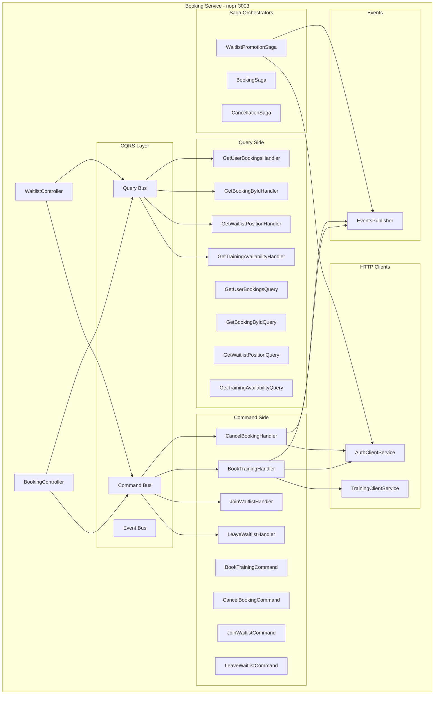
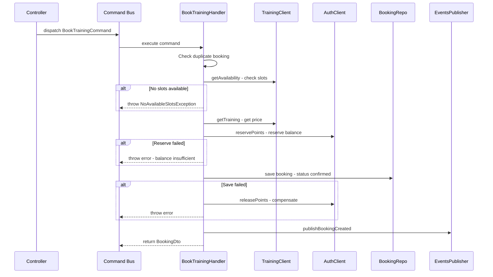
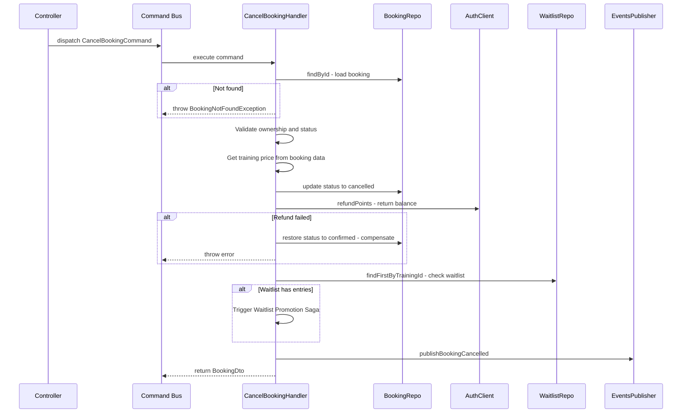
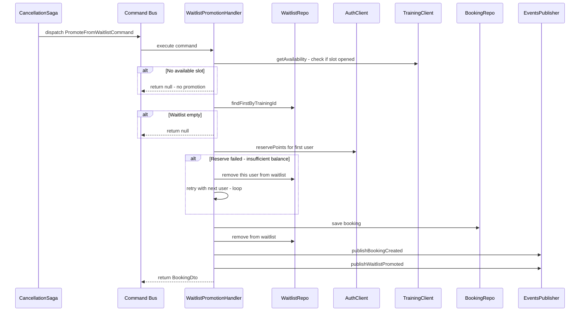
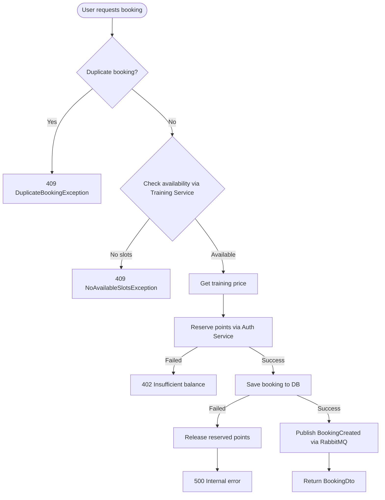
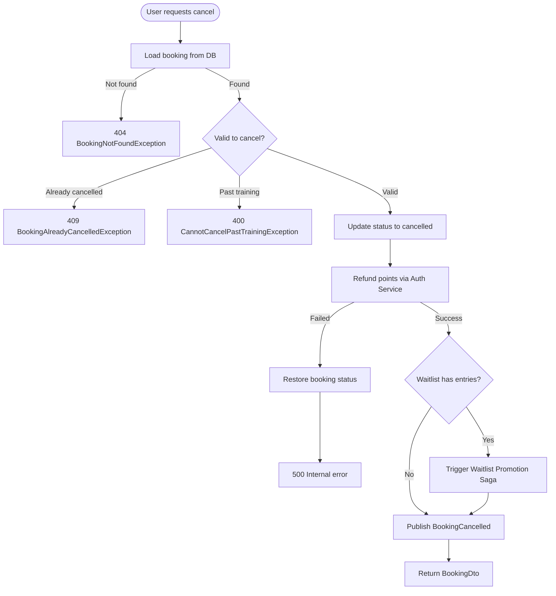
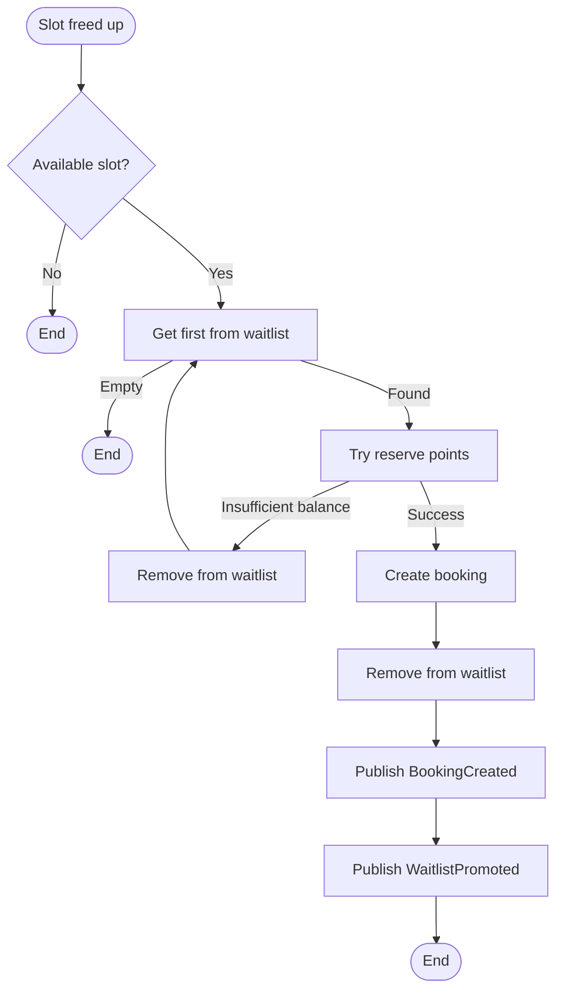

# Фаза 4: Booking Service (с CQRS) — Детальный план реализации

Этот файл лежит в папке: `<project_root>/doc/plans`

Исходные коды бекенда лежат в папке: `<project_root>/backend`

Далее в документе все пути указаны от `<project_root>/backend`.

При кодировании нужно использовать следующие skills:

- typescript
- nestjs-patterns

---

## Контекст

Фазы 1–3 реализованы. Booking Service — пустой scaffold с `app.module.ts` и `main.ts`. Таблицы `bookings` и `waitlist` уже созданы в начальной миграции `src/migrations/1744032000000-InitialSchema.ts`. Enum `booking_status_enum` уже существует в БД.

**Зависимости от предыдущих фаз:**

| Зависимость                  | Что используем                                                                                                                                      |
| ---------------------------- | --------------------------------------------------------------------------------------------------------------------------------------------------- |
| Auth Service (порт 3001)     | `POST /auth/balance/reserve`, `POST /auth/balance/release`, `POST /auth/balance/refund` — HTTP sync                                                 |
| Training Service (порт 3002) | `GET /trainings/:id`, `GET /trainings/:id/availability` — HTTP sync                                                                                 |
| `@app/contracts`             | `BookingDto`, `CreateBookingDto`, `CancelBookingDto`, `JoinWaitlistDto`, `BookingCreatedEvent`, `BookingCancelledEvent`, `WaitlistJoinedEvent`      |
| `@app/shared`                | `RabbitMQModule`, `RabbitMQPublisher`, `JwtAuthGuard`, `HttpExceptionFilter`, `LoggingInterceptor`, `PaginationParams`, `ROUTING_KEYS`, `EXCHANGES` |

---

## Архитектура Booking Service



---

## Структура файлов

```
apps/booking-service/
├── src/
│   ├── app.module.ts
│   ├── main.ts
│   ├── config/
│   │   ├── config.module.ts
│   │   └── config.service.ts
│   ├── database/
│   │   └── database.module.ts
│   ├── auth/
│   │   ├── auth.module.ts
│   │   └── strategies/
│   │       └── jwt.strategy.ts
│   ├── common/
│   │   └── exceptions/
│   │       ├── index.ts
│   │       ├── booking-not-found.exception.ts
│   │       ├── booking-already-cancelled.exception.ts
│   │       ├── duplicate-booking.exception.ts
│   │       ├── no-available-slots.exception.ts
│   │       ├── already-on-waitlist.exception.ts
│   │       ├── not-on-waitlist.exception.ts
│   │       └── cannot-cancel-past-training.exception.ts
│   ├── bookings/
│   │   ├── bookings.module.ts
│   │   ├── bookings.controller.ts
│   │   ├── dto/
│   │   │   ├── index.ts
│   │   │   ├── booking-response.dto.ts
│   │   │   ├── booking-list-response.dto.ts
│   │   │   └── booking-filter.dto.ts
│   │   ├── entities/
│   │   │   └── booking.entity.ts
│   │   └── repositories/
│   │       └── booking.repository.ts
│   ├── waitlist/
│   │   ├── waitlist.module.ts
│   │   ├── waitlist.controller.ts
│   │   ├── dto/
│   │   │   ├── index.ts
│   │   │   ├── waitlist-response.dto.ts
│   │   │   └── waitlist-position-response.dto.ts
│   │   ├── entities/
│   │   │   └── waitlist.entity.ts
│   │   └── repositories/
│   │       └── waitlist.repository.ts
│   ├── cqrs/
│   │   ├── cqrs.module.ts
│   │   ├── commands/
│   │   │   ├── index.ts
│   │   │   ├── book-training.command.ts
│   │   │   ├── book-training.handler.ts
│   │   │   ├── cancel-booking.command.ts
│   │   │   ├── cancel-booking.handler.ts
│   │   │   ├── join-waitlist.command.ts
│   │   │   ├── join-waitlist.handler.ts
│   │   │   ├── leave-waitlist.command.ts
│   │   │   └── leave-waitlist.handler.ts
│   │   ├── queries/
│   │   │   ├── index.ts
│   │   │   ├── get-user-bookings.query.ts
│   │   │   ├── get-user-bookings.handler.ts
│   │   │   ├── get-booking-by-id.query.ts
│   │   │   ├── get-booking-by-id.handler.ts
│   │   │   ├── get-waitlist-position.query.ts
│   │   │   ├── get-waitlist-position.handler.ts
│   │   │   ├── get-training-availability.query.ts
│   │   │   └── get-training-availability.handler.ts
│   │   ├── sagas/
│   │   │   ├── index.ts
│   │   │   ├── booking.saga.ts
│   │   │   ├── cancellation.saga.ts
│   │   │   └── waitlist-promotion.saga.ts
│   │   └── events/
│   │       ├── index.ts
│   │       ├── booking-created.event.ts
│   │       ├── booking-cancelled.event.ts
│   │       ├── waitlist-joined.event.ts
│   │       └── waitlist-promoted.event.ts
│   ├── clients/
│   │   ├── clients.module.ts
│   │   ├── auth-client.service.ts
│   │   └── training-client.service.ts
│   └── events/
│       ├── events.module.ts
│       └── events.publisher.ts
├── tsconfig.app.json
└── test/
    ├── jest-e2e.json
    ├── booking.e2e-spec.ts
    ├── waitlist.e2e-spec.ts
    ├── saga.e2e-spec.ts
    ├── fixtures/
    │   └── booking.fixtures.ts
    ├── helpers/
    │   ├── app-test.helper.ts
    │   ├── auth.helper.ts
    │   ├── booking.helper.ts
    │   ├── db.helper.ts
    │   └── waitlist.helper.ts
    └── mocks/
        ├── events.module.mock.ts
        ├── auth-client.mock.ts
        └── training-client.mock.ts
```

---

## Шаги реализации

### Шаг 4.0. Установка зависимостей

Установить пакет `@nestjs/cqrs` как production dependency:

```bash
cd backend && npm i -S -E @nestjs/cqrs
```

Установить `@nestjs/axios` и `axios` для HTTP-коммуникации с другими сервисами:

```bash
cd backend && npm i -S -E @nestjs/axios axios
```

> **Обоснование:** Booking Service выполняет синхронные HTTP-вызовы к Auth Service и Training Service. `@nestjs/axios` — рекомендуемый NestJS способ работы с HTTP-клиентами, интегрируется через `HttpModule`.

---

### Шаг 4.1. Конфигурация и инфраструктурные модули

#### 4.1.1. ConfigModule и ConfigService

Проект использует `@nestjs/config` для загрузки env-файлов на основе `NODE_ENV`:

- `NODE_ENV` не задан → `.env.development`
- `NODE_ENV=test` → `.env.test`
- `NODE_ENV=production` → `.env.production`

`app.module.ts` уже импортирует `ConfigModule` из `@nestjs/config` с `isGlobal: true`. Создать кастомный `ConfigService` для типизированного доступа к переменным.

Создать `apps/booking-service/src/config/config.service.ts`:

```typescript
import { Injectable } from "@nestjs/common";
import { ConfigService as NestConfigService } from "@nestjs/config";

@Injectable()
export class ConfigService {
  constructor(private readonly configService: NestConfigService) {}

  getDatabaseConfig() {
    return {
      host: this.configService.get<string>("DATABASE_HOST", "localhost"),
      port: this.configService.get<number>("DATABASE_PORT", 5432),
      username: this.configService.get<string>("DATABASE_USER"),
      password: this.configService.get<string>("DATABASE_PASSWORD"),
      database: this.configService.get<string>("DATABASE_NAME", "dreamfitness"),
    };
  }

  getAuthServiceUrl(): string {
    return this.configService.get<string>(
      "AUTH_SERVICE_URL",
      "http://localhost:3001",
    );
  }

  getTrainingServiceUrl(): string {
    return this.configService.get<string>(
      "TRAINING_SERVICE_URL",
      "http://localhost:3002",
    );
  }

  get(key: string): string | undefined {
    return this.configService.get<string>(key);
  }
}
```

Создать `apps/booking-service/src/config/config.module.ts`:

```typescript
import { Global, Module } from "@nestjs/common";
import { ConfigService } from "./config.service";

@Global()
@Module({
  providers: [ConfigService],
  exports: [ConfigService],
})
export class ConfigModule {}
```

> **Примечание:** `@nestjs/config` `ConfigModule.forRoot()` уже подключён в `app.module.ts` с `isGlobal: true`. Кастомный `ConfigModule` — это тонкая обёртка для предоставления типизированного `ConfigService`.

Обновить `.env.example`, `.env.development`, `.env.test` — добавить:

```
AUTH_SERVICE_URL=http://localhost:3001
TRAINING_SERVICE_URL=http://localhost:3002
```

#### 4.1.2. DatabaseModule

Создать `apps/booking-service/src/database/database.module.ts` — по аналогии с auth-service. Регистрирует TypeORM с entities: `Booking`, `Waitlist`.

#### 4.1.3. AuthModule (JWT validation)

Создать `apps/booking-service/src/auth/auth.module.ts` и `jwt.strategy.ts` — по аналогии с training-service. JWT strategy извлекает `userId` и `email` из токена.

#### 4.1.4. Обновить main.ts

Обновить `apps/booking-service/src/main.ts`:

- Добавить `ValidationPipe` (whitelist, forbidNonWhitelisted, transform)
- Добавить Swagger setup (DocumentBuilder + BearerAuth)
- Порт из `process.env.BOOKING_SERVICE_PORT || 3003`

#### 4.1.5. Обновить app.module.ts

`apps/booking-service/src/app.module.ts` уже импортирует `ConfigModule` из `@nestjs/config`. Дополнить остальными модулями:

```typescript
import { Module } from "@nestjs/common";
import { ConfigModule } from "@nestjs/config";
import { DatabaseModule } from "./database/database.module";
import { AuthModule } from "./auth/auth.module";
import { BookingsModule } from "./bookings/bookings.module";
import { WaitlistModule } from "./waitlist/waitlist.module";
import { CqrsModule } from "./cqrs/cqrs.module";
import { ClientsModule } from "./clients/clients.module";
import { EventsModule } from "./events/events.module";
import { HttpExceptionFilter, LoggingInterceptor } from "@app/shared";

@Module({
  imports: [
    ConfigModule.forRoot({
      envFilePath: `.env.${process.env.NODE_ENV || "development"}`,
      isGlobal: true,
    }),
    DatabaseModule,
    AuthModule,
    BookingsModule,
    WaitlistModule,
    CqrsModule,
    ClientsModule,
    EventsModule,
  ],
  controllers: [],
  providers: [
    { provide: "APP_FILTER", useClass: HttpExceptionFilter },
    { provide: "APP_INTERCEPTOR", useClass: LoggingInterceptor },
  ],
})
export class AppModule {}
```

---

### Шаг 4.2. Entities и Repositories

#### 4.2.1. Booking Entity

Создать `apps/booking-service/src/bookings/entities/booking.entity.ts`:

```typescript
@Entity("bookings")
@Index(["userId"])
@Index(["trainingId"])
@Index(["status"])
export class Booking {
  @PrimaryGeneratedColumn("uuid")
  id: string;

  @Column({ type: "uuid", name: "user_id" })
  userId: string;

  @Column({ type: "uuid", name: "training_id" })
  trainingId: string;

  @Column({
    type: "enum",
    enum: BookingStatus,
    default: BookingStatus.CONFIRMED,
  })
  status: BookingStatus;

  @CreateDateColumn({ name: "created_at" })
  createdAt: Date;

  @UpdateDateColumn({ name: "updated_at" })
  updatedAt: Date;
}
```

Нужно создать enum `BookingStatus` в shared libs: `libs/shared/src/enums/booking.enums.ts`:

```typescript
export enum BookingStatus {
  CONFIRMED = "confirmed",
  CANCELLED = "cancelled",
}
```

И экспортировать его через `libs/shared/src/enums/index.ts`.

#### 4.2.2. Waitlist Entity

Создать `apps/booking-service/src/waitlist/entities/waitlist.entity.ts`:

```typescript
@Entity("waitlist")
@Index(["userId"])
@Index(["trainingId"])
export class Waitlist {
  @PrimaryGeneratedColumn("uuid")
  id: string;

  @Column({ type: "uuid", name: "user_id" })
  userId: string;

  @Column({ type: "uuid", name: "training_id" })
  trainingId: string;

  @CreateDateColumn({ name: "created_at" })
  createdAt: Date;
}
```

#### 4.2.3. BookingRepository

Создать `apps/booking-service/src/bookings/repositories/booking.repository.ts`. Методы:

| Метод                                                       | Описание                                             |
| ----------------------------------------------------------- | ---------------------------------------------------- |
| `findById(id: string)`                                      | Найти бронирование по ID                             |
| `findByUserId(userId: string, filters: PaginationParams)`   | Список бронирований пользователя с пагинацией        |
| `findByUserAndTraining(userId: string, trainingId: string)` | Проверка существующего бронирования                  |
| `countConfirmedByTrainingId(trainingId: string)`            | Количество подтверждённых бронирований на тренировку |
| `save(booking: Partial<Booking>)`                           | Сохранить бронирование                               |
| `findConfirmedByTrainingId(trainingId: string)`             | Все подтверждённые бронирования для тренировки       |

#### 4.2.4. WaitlistRepository

Создать `apps/booking-service/src/waitlist/repositories/waitlist.repository.ts`. Методы:

| Метод                                                       | Описание                                    |
| ----------------------------------------------------------- | ------------------------------------------- |
| `findByUserAndTraining(userId: string, trainingId: string)` | Проверка наличия в waitlist                 |
| `findFirstByTrainingId(trainingId: string)`                 | Первый в очереди (по `createdAt` ASC)       |
| `getPositionByUserId(userId: string, trainingId: string)`   | Позиция пользователя в очереди (через RANK) |
| `countByTrainingId(trainingId: string)`                     | Размер очереди                              |
| `save(entry: Partial<Waitlist>)`                            | Сохранить запись                            |
| `remove(id: string)`                                        | Удалить запись                              |
| `findByTrainingId(trainingId: string)`                      | Все записи для тренировки                   |

---

### Шаг 4.3. Custom Exceptions

Создать `apps/booking-service/src/common/exceptions/`:

| Exception                           | HTTP Status | Описание                                          |
| ----------------------------------- | ----------- | ------------------------------------------------- |
| `BookingNotFoundException`          | 404         | Бронирование не найдено                           |
| `BookingAlreadyCancelledException`  | 409         | Бронирование уже отменено                         |
| `DuplicateBookingException`         | 409         | Пользователь уже записан на эту тренировку        |
| `NoAvailableSlotsException`         | 409         | Нет свободных мест                                |
| `AlreadyOnWaitlistException`        | 409         | Пользователь уже в листе ожидания                 |
| `NotOnWaitlistException`            | 404         | Пользователь не в листе ожидания                  |
| `CannotCancelPastTrainingException` | 400         | Нельзя отменить бронирование прошедшей тренировки |

Все exceptions наследуются от `HttpException` с соответствующими статусами.

---

### Шаг 4.4. HTTP Clients (межсервисная коммуникация)

#### 4.4.1. ClientsModule

Создать `apps/booking-service/src/clients/clients.module.ts`:

- Импортирует `HttpModule.register()` из `@nestjs/axios`
- Провайдит `AuthClientService` и `TrainingClientService`
- Экспортирует оба сервиса

#### 4.4.2. AuthClientService

Создать `apps/booking-service/src/clients/auth-client.service.ts`:

```typescript
@Injectable()
export class AuthClientService {
  // POST http://auth-service:3001/auth/balance/reserve
  async reservePoints(
    userId: string,
    amount: number,
    bookingId: string,
  ): Promise<TransactionResponseDto>;

  // POST http://auth-service:3001/auth/balance/release
  async releasePoints(
    userId: string,
    amount: number,
    bookingId: string,
  ): Promise<TransactionResponseDto>;

  // POST http://auth-service:3001/auth/balance/refund
  async refundPoints(
    userId: string,
    amount: number,
    bookingId: string,
  ): Promise<TransactionResponseDto>;
}
```

Каждый метод:

- Делает HTTP-запрос через `HttpService` (axios)
- Передаёт заголовки `X-User-Id` для внутренней авторизации
- Обрабатывает ошибки (timeout, 5xx, 4xx) и выбрасывает domain exceptions
- Имеет timeout 5s и retry конфигурацию

> **Важно:** Auth Service endpoints `/auth/balance/reserve`, `/auth/balance/release`, `/auth/balance/refund` ожидают DTO с полями `userId`, `amount`, `bookingId`. Booking Service будет передавать эти данные в теле запроса.

#### 4.4.3. TrainingClientService

Создать `apps/booking-service/src/clients/training-client.service.ts`:

```typescript
@Injectable()
export class TrainingClientService {
  // GET http://training-service:3002/trainings/:id
  async getTraining(trainingId: string): Promise<TrainingResponseDto>;

  // GET http://training-service:3002/trainings/:id/availability
  async getAvailability(trainingId: string): Promise<AvailabilityResponseDto>;
}
```

Каждый метод:

- Делает HTTP-запрос через `HttpService`
- Обрабатывает ошибки (timeout, not found, etc.)
- Timeout 5s

---

### Шаг 4.5. Events Publisher

#### 4.5.1. EventsModule

Создать `apps/booking-service/src/events/events.module.ts` — по аналогии с auth-service events module.

#### 4.5.2. EventsPublisher

Создать `apps/booking-service/src/events/events.publisher.ts`:

```typescript
@Injectable()
export class EventsPublisher {
  async publishBookingCreated(data: {
    bookingId;
    trainingId;
    userId;
    bookedAt;
  }): Promise<void>;
  async publishBookingCancelled(data: {
    bookingId;
    trainingId;
    userId;
    reason;
    cancelledAt;
  }): Promise<void>;
  async publishWaitlistJoined(data: {
    waitlistId;
    trainingId;
    userId;
    position;
    joinedAt;
  }): Promise<void>;
  async publishWaitlistPromoted(data: {
    waitlistId;
    trainingId;
    userId;
    promotedAt;
  }): Promise<void>;
}
```

Использует `RabbitMQPublisher` из `@app/shared/rabbitmq`. Routing keys из `ROUTING_KEYS` констант:

- `booking.created`
- `booking.cancelled`
- `waitlist.joined`
- `waitlist.promoted`

---

### Шаг 4.6. CQRS Setup

#### 4.6.1. CqrsModule

Создать `apps/booking-service/src/cqrs/cqrs.module.ts`:

- Импортирует `CqrsModule` из `@nestjs/cqrs`
- Регистрирует все command handlers, query handlers, и sagas
- Провайдит handlers и sagas

---

### Шаг 4.7. CQRS Events (внутренние события CQRS)

Создать внутренние event классы в `apps/booking-service/src/cqrs/events/`:

| Event                   | Описание                                           |
| ----------------------- | -------------------------------------------------- |
| `BookingCreatedEvent`   | Генерируется после успешного создания бронирования |
| `BookingCancelledEvent` | Генерируется после успешной отмены                 |
| `WaitlistJoinedEvent`   | Генерируется после добавления в waitlist           |
| `WaitlistPromotedEvent` | Генерируется после продвижения из waitlist         |

> **Отличие от RabbitMQ events:** Это внутренние NestJS CQRS events (implement `IEvent`), которые используются saga orchestrators. Saga слушает эти события через `ofType()` и выполняет последующие действия (например, публикация в RabbitMQ).

---

### Шаг 4.8. Command Side (Write Operations)

#### 4.8.1. BookTrainingCommand + Handler

**Command:**

```typescript
export class BookTrainingCommand {
  constructor(
    public readonly userId: string,
    public readonly trainingId: string,
  ) {}
}
```

**Handler (`BookTrainingHandler`):**

Реализует `ICommandHandler<BookTrainingCommand>`. Это **Saga Orchestrator** для процесса бронирования.



**Шаги handler:**

1. Проверить отсутствие дублирующего бронирования (`BookingRepository.findByUserAndTraining`)
2. Проверить доступность мест через `TrainingClientService.getAvailability()`
3. Если мест нет → выбросить `NoAvailableSlotsException`
4. Получить цену тренировки через `TrainingClientService.getTraining()`
5. Зарезервировать баллы через `AuthClientService.reservePoints(userId, price, bookingId)`
6. Сохранить бронирование через `BookingRepository.save()` (status: confirmed)
7. Если шаг 6 упал → компенсация: `AuthClientService.releasePoints()`
8. Опубликовать `BookingCreatedEvent` через CQRS Event Bus
9. Вернуть `BookingDto`

> **Примечание:** Booking ID генерируется перед вызовом reserve, чтобы передать его в Auth Service.

#### 4.8.2. CancelBookingCommand + Handler

**Command:**

```typescript
export class CancelBookingCommand {
  constructor(
    public readonly bookingId: string,
    public readonly userId: string,
    public readonly reason?: string,
  ) {}
}
```

**Handler (`CancelBookingHandler`):**

Реализует `ICommandHandler<CancelBookingCommand>`.



**Шаги handler:**

1. Загрузить бронирование (`BookingRepository.findById`)
2. Проверить: существует, принадлежит пользователю, не отменено
3. Сохранить текущий статус для компенсации
4. Обновить статус на `cancelled`
5. Получить цену тренировки (сохранить в booking или запросить повторно)
6. Вернуть баллы через `AuthClientService.refundPoints()`
7. Если шаг 6 упал → компенсация: восстановить статус `confirmed`
8. Проверить waitlist на наличие ожидающих
9. Если есть → запустить Waitlist Promotion Saga (отправить команду или событие)
10. Опубликовать `BookingCancelledEvent` через CQRS Event Bus
11. Вернуть обновлённый `BookingDto`

#### 4.8.3. JoinWaitlistCommand + Handler

**Command:**

```typescript
export class JoinWaitlistCommand {
  constructor(
    public readonly userId: string,
    public readonly trainingId: string,
  ) {}
}
```

**Handler (`JoinWaitlistHandler`):**

1. Проверить, что пользователь не имеет активного бронирования на эту тренировку
2. Проверить, что пользователь ещё не в waitlist
3. Проверить через `TrainingClientService.getTraining()`, что тренировка существует
4. Сохранить запись в waitlist
5. Получить позицию в очереди
6. Опубликовать `WaitlistJoinedEvent` через CQRS Event Bus
7. Вернуть `WaitlistDto` с позицией

#### 4.8.4. LeaveWaitlistCommand + Handler

**Command:**

```typescript
export class LeaveWaitlistCommand {
  constructor(
    public readonly userId: string,
    public readonly trainingId: string,
  ) {}
}
```

**Handler (`LeaveWaitlistHandler`):**

1. Найти запись в waitlist (`WaitlistRepository.findByUserAndTraining`)
2. Если не найдена → `NotOnWaitlistException`
3. Удалить запись (`WaitlistRepository.remove`)
4. Опубликовать `WaitlistLeftEvent` через CQRS Event Bus (опционально)
5. Вернуть void

---

### Шаг 4.9. Query Side (Read Operations)

#### 4.9.1. GetUserBookingsQuery + Handler

**Query:**

```typescript
export class GetUserBookingsQuery {
  constructor(
    public readonly userId: string,
    public readonly filters?: PaginationParams & { status?: BookingStatus },
  ) {}
}
```

**Handler:** Загружает список бронирований пользователя через `BookingRepository.findByUserId()` с пагинацией. Возвращает `PaginatedResult<BookingDto>`.

#### 4.9.2. GetBookingByIdQuery + Handler

**Query:**

```typescript
export class GetBookingByIdQuery {
  constructor(
    public readonly bookingId: string,
    public readonly userId: string,
  ) {}
}
```

**Handler:** Загружает бронирование по ID, проверяет что принадлежит пользователю. Возвращает `BookingDto`.

#### 4.9.3. GetWaitlistPositionQuery + Handler

**Query:**

```typescript
export class GetWaitlistPositionQuery {
  constructor(
    public readonly userId: string,
    public readonly trainingId: string,
  ) {}
}
```

**Handler:** Вычисляет позицию пользователя в waitlist через SQL `RANK() OVER (ORDER BY created_at)`. Возвращает `{ position, totalInQueue, waitlistId }`.

#### 4.9.4. GetTrainingAvailabilityQuery + Handler

**Query:**

```typescript
export class GetTrainingAvailabilityQuery {
  constructor(public readonly trainingId: string) {}
}
```

**Handler:** Делегирует запрос в `TrainingClientService.getAvailability()`. Дополнительно enrich-данные количеством записей из локальной БД. Возвращает availability DTO.

---

### Шаг 4.10. Saga Implementation

Саги в NestJS CQRS реализуются как классы с методами, помеченными `@Saga()`. Они возвращают `Observable<IEvent>` и реагируют на события через `ofType()`.

#### 4.10.1. Booking Saga

> Примечание: Основная saga-логика бронирования реализована внутри `BookTrainingHandler` (orchestration approach). Saga здесь обрабатывает post-commit действия.

```typescript
@Injectable()
export class BookingSaga {
  @Saga()
  bookingCreated = (events$: Observable<any>): Observable<any> => {
    return events$.pipe(
      ofType(BookingCreatedEvent),
      map((event) => {
        // Логирование, метрики, дополнительные действия
        this.logger.log(`Booking created: ${event.bookingId}`);
        return null; // Не генерируем новые события
      }),
    );
  };
}
```

#### 4.10.2. Cancellation Saga

Основная логика отмены — в `CancelBookingHandler`. Saga обрабатывает post-commit:

```typescript
@Injectable()
export class CancellationSaga {
  @Saga()
  bookingCancelled = (events$: Observable<any>): Observable<any> => {
    return events$.pipe(
      ofType(BookingCancelledEvent),
      map((event) => {
        this.logger.log(
          `Booking cancelled: ${event.bookingId}, triggering waitlist promotion check`,
        );
        // Инициация проверки waitlist promotion
        return new CheckWaitlistPromotionEvent(event.trainingId);
      }),
    );
  };
}
```

#### 4.10.3. Waitlist Promotion Saga

Это самая сложная saga. Она инициируется при отмене бронирования.



**Command:**

```typescript
export class PromoteFromWaitlistCommand {
  constructor(public readonly trainingId: string) {}
}
```

**Handler (`PromoteFromWaitlistHandler`):**

1. Проверить доступность места через `TrainingClientService.getAvailability()`
2. Если нет свободных мест → вернуть null
3. Получить первого в очереди (`WaitlistRepository.findFirstByTrainingId()`)
4. Если очередь пуста → вернуть null
5. Попробовать зарезервировать баллы через `AuthClientService.reservePoints()`
6. Если не хватило баллов → удалить из waitlist, перейти к следующему (цикл)
7. Создать бронирование (`BookingRepository.save()`)
8. Удалить из waitlist (`WaitlistRepository.remove()`)
9. Опубликовать `BookingCreatedEvent` и `WaitlistPromotedEvent`
10. Вернуть `BookingDto`

> **Важно:** Saga обрабатывает scenario, когда несколько пользователей в waitlist, но у первого недостаточно баллов. Она должна попытаться продвинуть следующего.

---

### Шаг 4.11. Controllers

#### 4.11.1. BookingsController

Создать `apps/booking-service/src/bookings/bookings.controller.ts`:

```
@ApiTags('Bookings')
@Controller('bookings')
```

| Endpoint               | Method | Auth         | Описание                                                             |
| ---------------------- | ------ | ------------ | -------------------------------------------------------------------- |
| `/bookings`            | POST   | JwtAuthGuard | Создать бронирование — dispatches `BookTrainingCommand`              |
| `/bookings`            | GET    | JwtAuthGuard | Список бронирований пользователя — dispatches `GetUserBookingsQuery` |
| `/bookings/:id`        | GET    | JwtAuthGuard | Детали бронирования — dispatches `GetBookingByIdQuery`               |
| `/bookings/:id/cancel` | POST   | JwtAuthGuard | Отменить бронирование — dispatches `CancelBookingCommand`            |

**Controller methods:**

- `create(@Body() dto: CreateBookingDto, @CurrentUser() user)` — строит `BookTrainingCommand`, dispatches через `CommandBus`, возвращает `BookingDto`
- `findAll(@CurrentUser() user, @Query() filters)` — dispatches `GetUserBookingsQuery`
- `findOne(@Param('id') id, @CurrentUser() user)` — dispatches `GetBookingByIdQuery`
- `cancel(@Param('id') id, @Body() dto: CancelBookingDto, @CurrentUser() user)` — dispatches `CancelBookingCommand`

> **Контракты:** DTOs для request/response должны соответствовать `@app/contracts/booking`: `CreateBookingDto`, `CancelBookingDto`, `BookingDto`.

#### 4.11.2. WaitlistController

Создать `apps/booking-service/src/waitlist/waitlist.controller.ts`:

```
@ApiTags('Waitlist')
@Controller('waitlist')
```

| Endpoint             | Method | Auth         | Описание                                               |
| -------------------- | ------ | ------------ | ------------------------------------------------------ |
| `/waitlist`          | POST   | JwtAuthGuard | Встать в очередь — dispatches `JoinWaitlistCommand`    |
| `/waitlist/position` | GET    | JwtAuthGuard | Узнать позицию — dispatches `GetWaitlistPositionQuery` |
| `/waitlist`          | DELETE | JwtAuthGuard | Покинуть очередь — dispatches `LeaveWaitlistCommand`   |

**Controller methods:**

- `join(@Body() dto: JoinWaitlistDto, @CurrentUser() user)` — dispatches `JoinWaitlistCommand`
- `getPosition(@Query('trainingId') trainingId, @CurrentUser() user)` — dispatches `GetWaitlistPositionQuery`
- `leave(@Query('trainingId') trainingId, @CurrentUser() user)` — dispatches `LeaveWaitlistCommand`

---

### Шаг 4.12. DTOs (Response / Filter)

Создать response DTOs внутри booking-service (ближе к модулю, как рекомендует nestjs-patterns skill):

#### `booking-response.dto.ts`

```typescript
export class BookingResponseDto {
  id: string;
  userId: string;
  trainingId: string;
  status: BookingStatus;
  createdAt: string;
  updatedAt: string;
}
```

#### `booking-list-response.dto.ts`

```typescript
export class BookingListResponseDto {
  items: BookingResponseDto[];
  total: number;
  page: number;
  limit: number;
}
```

#### `booking-filter.dto.ts`

```typescript
export class BookingFilterDto {
  @IsOptional()
  @IsEnum(BookingStatus)
  status?: BookingStatus;

  @IsOptional()
  @IsUUID()
  trainingId?: string;

  @IsOptional()
  @IsInt()
  @Min(1)
  page?: number;

  @IsOptional()
  @IsInt()
  @Min(1)
  @Max(50)
  limit?: number;
}
```

#### `waitlist-response.dto.ts`

```typescript
export class WaitlistResponseDto {
  id: string;
  userId: string;
  trainingId: string;
  position: number;
  joinedAt: string;
}
```

#### `waitlist-position-response.dto.ts`

```typescript
export class WaitlistPositionResponseDto {
  position: number;
  totalInQueue: number;
  waitlistId: string;
}
```

---

### Шаг 4.13. Обновление contracts lib

Проверить и при необходимости обновить `libs/contracts/src/booking/`:

- Убедиться, что `BookingDto` имеет поле `updatedAt` (для соответствия с entity)
- Добавить `WaitlistPromotedEvent` в `booking.events.ts` (если отсутствует)
- Добавить `JoinWaitlistDto` и `LeaveWaitlistDto` если их нет
- Убедиться, что все DTOs в contracts соответствуют API booking-service

---

### Шаг 4.14. Модули и их связи

#### BookingsModule

```typescript
@Module({
  imports: [TypeOrmModule.forFeature([Booking])],
  controllers: [BookingsController],
  providers: [BookingRepository],
  exports: [BookingRepository],
})
export class BookingsModule {}
```

#### WaitlistModule

```typescript
@Module({
  imports: [TypeOrmModule.forFeature([Waitlist])],
  controllers: [WaitlistController],
  providers: [WaitlistRepository],
  exports: [WaitlistRepository],
})
export class WaitlistModule {}
```

#### CqrsModule

```typescript
@Module({
  imports: [
    CqrsModule,
    BookingsModule,
    WaitlistModule,
    ClientsModule,
    EventsModule,
  ],
  providers: [
    // Command Handlers
    BookTrainingHandler,
    CancelBookingHandler,
    JoinWaitlistHandler,
    LeaveWaitlistHandler,
    PromoteFromWaitlistHandler,
    // Query Handlers
    GetUserBookingsHandler,
    GetBookingByIdHandler,
    GetWaitlistPositionHandler,
    GetTrainingAvailabilityHandler,
    // Sagas
    BookingSaga,
    CancellationSaga,
    WaitlistPromotionSaga,
  ],
})
export class BookingCqrsModule {}
```

---

### Шаг 4.15. Обновить shared enums

Добавить `BookingStatus` enum в `libs/shared/src/enums/booking.enums.ts` и экспортировать через `libs/shared/src/enums/index.ts`.

---

### Шаг 4.16. Тестирование

#### 4.16.1. E2E тесты

Создать `apps/booking-service/test/`:

**`booking.e2e-spec.ts`:**

- Создание бронирования (happy path)
- Создание бронирования — нет мест
- Создание бронирования — недостаточно баллов
- Создание бронирования — дублирование
- Получение списка бронирований
- Получение бронирования по ID
- Отмена бронирования (happy path)
- Отмена чужого бронирования (403)
- Отмена уже отменённого бронирования

**`waitlist.e2e-spec.ts`:**

- Встать в waitlist (happy path)
- Встать в waitlist — уже в очереди
- Получить позицию в waitlist
- Покинуть waitlist
- Покинуть waitlist — не в очереди

**`saga.e2e-spec.ts`:**

- Waitlist promotion: отмена бронирования → пользователь из waitlist автоматически записан
- Waitlist promotion: у первого в очереди нет баллов → записан второй

**Test infrastructure:**

- `test/helpers/app-test.helper.ts` — создание тестового NestJS приложения
- `test/helpers/auth.helper.ts` — генерация JWT токенов для тестов
- `test/helpers/booking.helper.ts` — хелперы для создания бронирований через API
- `test/helpers/waitlist.helper.ts` — хелперы для waitlist операций
- `test/helpers/db.helper.ts` — очистка БД между тестами
- `test/fixtures/booking.fixtures.ts` — тестовые данные
- `test/mocks/events.module.mock.ts` — мок RabbitMQ для тестов
- `test/mocks/auth-client.mock.ts` — provider-level мок AuthClientService
- `test/mocks/training-client.mock.ts` — provider-level мок TrainingClientService

> **Стратегия мокирования:** E2E тесты booking-service используют provider-level моки для `AuthClientService` и `TrainingClientService` — по аналогии с существующим паттерном мокирования `EventsPublisher` в auth-service и training-service. Моки подключаются через `overrideProvider()` в `app-test.helper.ts`. Это позволяет тестировать полный pipeline (controller → guard → pipe → CQRS bus → handler) без запуска внешних сервисов, обеспечивая быстрые и детерминированные тесты. Сценарии ошибок (insufficient balance, timeout, service unavailable) легко эмулируются через `jest.fn().mockRejectedValue()`. Контракт между сервисами гарантируется через shared `@app/contracts` lib и TypeScript типы.

**`test/jest-e2e.json`:**

```json
{
  "moduleFileExtensions": ["js", "json", "ts"],
  "rootDir": ".",
  "testEnvironment": "node",
  "testRegex": ".e2e-spec.ts$",
  "transform": {
    "^.+\\.(t|j)s$": "ts-jest"
  },
  "moduleNameMapper": {
    "@app/contracts/(.*)": "<rootDir>/../../libs/contracts/src/$1",
    "@app/contracts": "<rootDir>/../../libs/contracts/src",
    "@app/shared/(.*)": "<rootDir>/../../libs/shared/src/$1",
    "@app/shared": "<rootDir>/../../libs/shared/src"
  }
}
```

---

### Шаг 4.17. Обновить package.json скрипты

Добавить скрипты для E2E тестов booking-service:

```json
"test:e2e:booking": "cross-env NODE_ENV=test jest --config apps/booking-service/test/jest-e2e.json --runInBand",
"test:e2e:booking:watch": "cross-env NODE_ENV=test jest --config apps/booking-service/test/jest-e2e.json --watch --runInBand"
```

---

## Mermaid: Booking Saga Flow (полный процесс)



## Mermaid: Cancellation Saga Flow



## Mermaid: Waitlist Promotion Saga Flow



---

## Порядок реализации

Рекомендуемый порядок выполнения шагов:

1. **Шаг 4.0** — Установка зависимостей
2. **Шаг 4.1** — ConfigModule, DatabaseModule, AuthModule, main.ts, app.module.ts
3. **Шаг 4.2** — Entities и Repositories
4. **Шаг 4.3** — Custom Exceptions
5. **Шаг 4.5** — Events Publisher
6. **Шаг 4.4** — HTTP Clients (AuthClientService, TrainingClientService)
7. **Шаг 4.6** — CQRS Setup (CqrsModule)
8. **Шаг 4.7** — CQRS Events
9. **Шаг 4.8** — Command Side (BookTraining, CancelBooking, JoinWaitlist, LeaveWaitlist)
10. **Шаг 4.9** — Query Side (GetUserBookings, GetBookingById, GetWaitlistPosition, GetTrainingAvailability)
11. **Шаг 4.10** — Sagas (BookingSaga, CancellationSaga, WaitlistPromotionSaga)
12. **Шаг 4.11** — Controllers
13. **Шаг 4.12** — DTOs
14. **Шаг 4.13** — Обновление contracts lib
15. **Шаг 4.15** — Обновление shared enums
16. **Шаг 4.14** — Финальная сборка модулей
17. **Шаг 4.16** — Тестирование (unit + e2e)
18. **Шаг 4.17** — Обновление package.json скриптов

---

## DoD — Definition of Done

**Что на выходе:**

- Работающий Booking Service на порту 3003
- Booking и Waitlist entities
- CQRS структура: 5 command handlers, 4 query handlers, 3 sagas
- REST API endpoints: `/bookings`, `/bookings/:id`, `/bookings/:id/cancel`, `/waitlist`, `/waitlist/position`
- HTTP клиенты для Auth Service и Training Service
- 3 Saga: Booking, Cancellation, Waitlist Promotion с compensating actions
- RabbitMQ publisher для `booking.created`, `booking.cancelled`, `waitlist.joined`, `waitlist.promoted`

**Минимальные проверки:**

- [ ] `npm run build:booking-service` — успешная сборка
- [ ] `npm run lint` — без ошибок
- [ ] Unit тесты: все command handlers и query handlers
- [ ] Unit тесты: saga orchestration logic
- [ ] E2E тесты: booking flow (создание → получение → отмена)
- [ ] E2E тесты: waitlist flow (join → position check → leave)
- [ ] Integration тесты: HTTP клиенты к Auth и Training services
- [ ] Контракты: DTOs в `@app/contracts/booking` соответствуют API
- [ ] Ручная проверка: compensating transactions работают при ошибках
- [ ] Ручная проверка: waitlist promotion срабатывает при отмене бронирования
- [ ] Ручная проверка: RabbitMQ management UI — события публикуются
