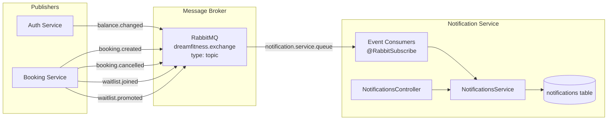
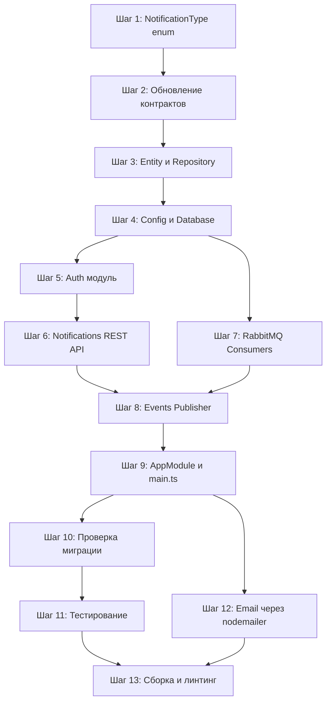

# Фаза 5: Notification Service — Детальный план реализации

Этот файл лежит в папке:
`<project_root>/doc/plans`

Исходные коды бекенда лежат в папке:
`<project_root>/backend`

Далее в документе все пути указаны от `<project_root>`.

## Контекст

Notification Service — первый микросервис в проекте, который выступает **потребителем** RabbitMQ событий. Он подписывается на события от Auth Service, Booking Service и Training Service и создаёт in-app уведомления для пользователей.

Согласно ADR (раздел 7.3), notification queue подписана на следующие routing keys:

- `booking.created`
- `booking.cancelled`
- `balance.changed`
- `training.reminder`

Дополнительно из анализа publishers:

- `waitlist.joined` — публикуется Booking Service
- `waitlist.promoted` — публикуется Booking Service

## Зависимости от предыдущих фаз

| Зависимость                                                                    | Фаза              | Статус              |
| ------------------------------------------------------------------------------ | ----------------- | ------------------- |
| NestJS monorepo structure                                                      | Фаза 1            | ✅ Реализовано      |
| `@app/contracts` — notification DTOs и events                                  | Фаза 1            | ✅ Реализовано      |
| `@app/shared` — RabbitMQ module, enums, guards                                 | Фаза 1            | ✅ Реализовано      |
| Auth Service публикует `balance.changed`                                       | Фаза 2            | ✅ Реализовано      |
| Booking Service публикует `booking.created`, `booking.cancelled`, `waitlist.*` | Фаза 4            | ✅ Реализовано      |
| Таблица `notifications` в БД                                                   | Фаза 1 (миграция) | ✅ Требует проверки |

---

## Архитектура сервиса

### Порты и таблицы

- **Порт:** 3004
- **Таблицы:** `notifications`

### Диаграмма взаимодействия



### Структура файлов

```
backend/apps/notification-service/
├── src/
│   ├── app.module.ts
│   ├── main.ts
│   ├── config/
│   │   ├── config.module.ts
│   │   ├── config.service.ts
│   │   └── index.ts
│   ├── database/
│   │   └── database.module.ts
│   ├── auth/
│   │   ├── auth.module.ts
│   │   ├── index.ts
│   │   └── strategies/
│   │       └── jwt.strategy.ts
│   ├── notifications/
│   │   ├── notifications.module.ts
│   │   ├── notifications.controller.ts
│   │   ├── notifications.service.ts
│   │   ├── dto/
│   │   │   ├── index.ts
│   │   │   ├── create-notification.dto.ts
│   │   │   ├── notification-filter.dto.ts
│   │   │   ├── notification-response.dto.ts
│   │   │   ├── notification-list-response.dto.ts
│   │   │   └── unread-count-response.dto.ts
│   │   ├── entities/
│   │   │   └── notification.entity.ts
│   │   └── repositories/
│   │       └── notification.repository.ts
│   ├── consumers/
│   │   ├── consumers.module.ts
│   │   ├── booking-event.consumer.ts
│   │   ├── balance-event.consumer.ts
│   │   └── training-event.consumer.ts
│   └── common/
│       └── exceptions/
│           ├── index.ts
│           └── notification-not-found.exception.ts
├── test/
│   ├── jest-e2e.json
│   ├── notification.e2e-spec.ts
│   ├── consumer.e2e-spec.ts
│   ├── helpers/
│   │   ├── app-test.helper.ts
│   │   ├── auth.helper.ts
│   │   ├── db.helper.ts
│   │   └── notification.helper.ts
│   ├── fixtures/
│   │   └── notification.fixtures.ts
│   └── mocks/
│       └── consumers.mock.ts
└── tsconfig.app.json
```

---

## Шаги реализации

### Шаг 1. Обновление shared enums — NotificationType

**Цель:** Добавить enum `NotificationType` в shared библиотеку для использования в entity и contracts.

**Файлы:**

| Действие | Файл                                                  |
| -------- | ----------------------------------------------------- |
| Создать  | `backend/libs/shared/src/enums/notification.enums.ts` |
| Изменить | `backend/libs/shared/src/enums/index.ts`              |

**NotificationType enum:**

```typescript
export enum NotificationType {
  BOOKING_CONFIRMATION = "booking_confirmation",
  BOOKING_CANCELLATION = "booking_cancellation",
  BALANCE_CHANGE = "balance_change",
  TRAINING_REMINDER = "training_reminder",
  WAITLIST_JOINED = "waitlist_joined",
  WAITLIST_PROMOTED = "waitlist_promoted",
}
```

---

### Шаг 2. Обновление контрактов — event DTOs

**Цель:** Актуализировать контракты для consumers. Проверить, что существующие contracts соответствуют потребностям notification service.

**Файлы:**

| Действие  | Файл                                                             |
| --------- | ---------------------------------------------------------------- |
| Проверить | `backend/libs/contracts/src/notification/notification.dto.ts`    |
| Проверить | `backend/libs/contracts/src/notification/notification.events.ts` |
| Проверить | `backend/libs/contracts/src/booking/booking.events.ts`           |
| Проверить | `backend/libs/contracts/src/auth/auth.events.ts`                 |

**Анализ контрактов:**

Существующие DTOs в `notification.dto.ts`:

- `CreateNotificationDto` — поля: `userId`, `title`, `message`, `type` (info/warning/success/error), `metadata?`
- `NotificationDto` — response DTO с `id`, `userId`, `title`, `message`, `type`, `isRead`, `metadata?`, `createdAt`, `readAt?`
- `UpdateNotificationDto` — `isRead?`
- `MarkAsReadDto` — `notificationId`
- `MarkAllAsReadDto` — `userId`

Существующие events в `notification.events.ts`:

- `NotificationCreatedEvent` — для публикации после создания уведомления
- `NotificationReadEvent` — для публикации после прочтения

**Необходимые изменения:**

Поле `type` в `CreateNotificationDto` и `NotificationDto` использует `'info' | 'warning' | 'success' | 'error'`, что не совпадает с `NotificationType` enum из ADR (booking, cancellation, transaction, reminder). Нужно привести к единообразию — заменить строковый union на `NotificationType` enum из shared.

**Обновлённые DTOs:**

`CreateNotificationDto`:

```typescript
export class CreateNotificationDto {
  @IsUUID()
  userId: string;

  @IsEnum(NotificationType)
  type: NotificationType;

  @IsString()
  title: string;

  @IsString()
  content: string;

  @IsOptional()
  @IsObject()
  metadata?: Record<string, unknown>;
}
```

> **Примечание:** Поле `message` в существующих DTOs нужно переименовать в `content` для соответствия схеме БД из ADR. Поле `readAt` убираем (в ADR его нет, достаточно `isRead`).

---

### Шаг 3. Notification Entity и Repository

**Цель:** Создать TypeORM entity и custom repository для таблицы `notifications`.

**Файлы:**

| Действие | Файл                                                                                          |
| -------- | --------------------------------------------------------------------------------------------- |
| Создать  | `backend/apps/notification-service/src/notifications/entities/notification.entity.ts`         |
| Создать  | `backend/apps/notification-service/src/notifications/repositories/notification.repository.ts` |

**Notification Entity:**

```typescript
@Entity("notifications")
@Index(["userId"])
@Index(["userId", "isRead"])
export class Notification {
  @PrimaryGeneratedColumn("uuid")
  id: string;

  @Column({ type: "uuid", name: "user_id" })
  userId: string;

  @Column({ type: "enum", enum: NotificationType })
  type: NotificationType;

  @Column({ type: "varchar", length: 255 })
  title: string;

  @Column({ type: "text" })
  content: string;

  @Column({ type: "boolean", default: false, name: "is_read" })
  isRead: boolean;

  @CreateDateColumn({ name: "created_at" })
  createdAt: Date;
}
```

> Соответствует схеме из ADR раздел 5.2 (Notification): id, userId, type (enum), title, content, isRead, createdAt.

**NotificationRepository:**

Custom repository с методами:

- `findByUserId(userId, filter)` — список уведомлений с пагинацией и фильтрацией по `isRead` и `type`
- `findById(id)` — одно уведомление по ID
- `markAsRead(id)` — отметить как прочитанное
- `markAllAsRead(userId)` — отметить все как прочитанные
- `getUnreadCount(userId)` — количество непрочитанных
- `createNotification(data)` — создать уведомление

---

### Шаг 4. Config и Database модули

**Цель:** Создать конфигурацию и подключение к БД по аналогии с другими сервисами.

**Файлы:**

| Действие | Файл                                                                |
| -------- | ------------------------------------------------------------------- |
| Создать  | `backend/apps/notification-service/src/config/config.module.ts`     |
| Создать  | `backend/apps/notification-service/src/config/config.service.ts`    |
| Создать  | `backend/apps/notification-service/src/config/index.ts`             |
| Создать  | `backend/apps/notification-service/src/database/database.module.ts` |

**ConfigService** предоставляет:

- `getDatabaseConfig()` — host, port, username, password, database
- `get(key)` — generic getter

**DatabaseModule** — TypeORM `forRootAsync` с entity `Notification`.

---

### Шаг 5. Auth модуль (JWT validation)

**Цель:** Добавить JWT authentication для защиты REST endpoints. Аналогично booking-service.

**Файлы:**

| Действие | Файл                                                                    |
| -------- | ----------------------------------------------------------------------- |
| Создать  | `backend/apps/notification-service/src/auth/auth.module.ts`             |
| Создать  | `backend/apps/notification-service/src/auth/index.ts`                   |
| Создать  | `backend/apps/notification-service/src/auth/strategies/jwt.strategy.ts` |

Реализация идентична [`auth.module.ts`](backend/apps/booking-service/src/auth/auth.module.ts) и [`jwt.strategy.ts`](backend/apps/booking-service/src/auth/strategies/jwt.strategy.ts) в booking-service: lightweight JWT validation без database lookup.

---

### Шаг 6. Notifications модуль (REST API)

**Цель:** Реализовать CRUD операции для in-app уведомлений.

**Файлы:**

| Действие | Файл                                                                                          |
| -------- | --------------------------------------------------------------------------------------------- |
| Создать  | `backend/apps/notification-service/src/notifications/notifications.module.ts`                 |
| Создать  | `backend/apps/notification-service/src/notifications/notifications.service.ts`                |
| Создать  | `backend/apps/notification-service/src/notifications/notifications.controller.ts`             |
| Создать  | `backend/apps/notification-service/src/notifications/dto/*.ts`                                |
| Создать  | `backend/apps/notification-service/src/notifications/dto/index.ts`                            |
| Создать  | `backend/apps/notification-service/src/common/exceptions/notification-not-found.exception.ts` |
| Создать  | `backend/apps/notification-service/src/common/exceptions/index.ts`                            |

#### REST Endpoints

| Метод   | Путь                          | Описание                                                 | Auth       |
| ------- | ----------------------------- | -------------------------------------------------------- | ---------- |
| `POST`  | `/notifications`              | Создание уведомления вручную                             | Admin Only |
| `GET`   | `/notifications`              | Список уведомлений пользователя с пагинацией и фильтрами | JWT        |
| `GET`   | `/notifications/unread-count` | Количество непрочитанных                                 | JWT        |
| `PATCH` | `/notifications/:id/read`     | Отметить как прочитанное                                 | JWT        |
| `PATCH` | `/notifications/read-all`     | Отметить все как прочитанные                             | JWT        |

> **Примечание:** Endpoint `POST /notifications` для создания уведомления доступен **только для админов** (role = admin). Основной поток создания уведомлений — через RabbitMQ consumers. REST endpoint полезен для ручного создания и тестирования.

#### DTOs

**`NotificationFilterDto`** — query parameters для `GET /notifications`:

```typescript
export class NotificationFilterDto {
  @IsOptional()
  @IsEnum(NotificationType)
  type?: NotificationType;

  @IsOptional()
  @IsBoolean()
  @Transform(({ value }) => value === "true")
  isRead?: boolean;

  @IsOptional()
  @IsInt()
  @Min(1)
  @Type(() => Number)
  page?: number = 1;

  @IsOptional()
  @IsInt()
  @Min(1)
  @Max(100)
  @Type(() => Number)
  limit?: number = 10;
}
```

**`NotificationResponseDto`:**

```typescript
export class NotificationResponseDto {
  id: string;
  userId: string;
  type: NotificationType;
  title: string;
  content: string;
  isRead: boolean;
  createdAt: Date;
}
```

**`NotificationListResponseDto`:**

```typescript
export class NotificationListResponseDto {
  items: NotificationResponseDto[];
  total: number;
  page: number;
  limit: number;
}
```

**`UnreadCountResponseDto`:**

```typescript
export class UnreadCountResponseDto {
  count: number;
}
```

#### Контроль доступа

Пользователь может видеть и управлять только **своими** уведомлениями:

- `userId` извлекается из JWT token (`req.user.id`)
- Все запросы фильтруются по `userId` из token
- Попытка прочитать чужое уведомление → `403 Forbidden`

---

### Шаг 7. RabbitMQ Consumers

**Цель:** Подписаться на события из RabbitMQ и создавать уведомления на их основе.

**Файлы:**

| Действие | Файл                                                                         |
| -------- | ---------------------------------------------------------------------------- |
| Создать  | `backend/apps/notification-service/src/consumers/consumers.module.ts`        |
| Создать  | `backend/apps/notification-service/src/consumers/booking-event.consumer.ts`  |
| Создать  | `backend/apps/notification-service/src/consumers/balance-event.consumer.ts`  |
| Создать  | `backend/apps/notification-service/src/consumers/training-event.consumer.ts` |

#### Подписки

Для подписки на RabbitMQ используется декоратор `@RabbitSubscribe` из `@golevelup/nestjs-rabbitmq`. Каждый consumer метод подписывается на конкретный routing key в exchange `dreamfitness.exchange`.

**Общий паттерн consumer:**

```typescript
@Injectable()
export class BookingEventConsumer {
  constructor(private readonly notificationsService: NotificationsService) {}

  @RabbitSubscribe({
    exchange: "dreamfitness.exchange",
    routingKey: "booking.created",
    queue: "notification.service.queue",
  })
  async handleBookingCreated(msg: EventMessage<BookingCreatedEvent["data"]>) {
    // Создать уведомление
  }
}
```

> **Важно:** Тип `EventMessage` уже определён в [`rabbitmq.publisher.ts`](backend/libs/shared/src/rabbitmq/rabbitmq.publisher.ts:5-10). Publisher оборачивает данные в этот формат. Consumer получает именно `EventMessage<T>` где `T` — тип `data` из event.

#### BookingEventConsumer

| Routing Key         | Метод                    | Notification Type      | Title Pattern                       |
| ------------------- | ------------------------ | ---------------------- | ----------------------------------- |
| `booking.created`   | `handleBookingCreated`   | `BOOKING_CONFIRMATION` | «Запись на тренировку подтверждена» |
| `booking.cancelled` | `handleBookingCancelled` | `BOOKING_CANCELLATION` | «Запись на тренировку отменена»     |
| `waitlist.joined`   | `handleWaitlistJoined`   | `WAITLIST_JOINED`      | «Вы добавлены в лист ожидания»      |
| `waitlist.promoted` | `handleWaitlistPromoted` | `WAITLIST_PROMOTED`    | «Место освободилось! Вы записаны»   |

**Данные из событий для content:**

- `booking.created`: `bookingId`, `trainingId`, `userId`, `bookedAt`
- `booking.cancelled`: `bookingId`, `trainingId`, `userId`, `reason?`, `cancelledAt`
- `waitlist.joined`: `waitlistId`, `trainingId`, `userId`, `position`, `joinedAt`
- `waitlist.promoted`: `waitlistId`, `trainingId`, `userId`, `promotedAt`

#### BalanceEventConsumer

| Routing Key       | Метод                  | Notification Type | Title Pattern       |
| ----------------- | ---------------------- | ----------------- | ------------------- |
| `balance.changed` | `handleBalanceChanged` | `BALANCE_CHANGE`  | «Изменение баланса» |

**Данные из события:** `userId`, `oldBalance`, `newBalance`, `amount`, `description?`

#### TrainingEventConsumer

| Routing Key         | Метод                    | Notification Type   | Title Pattern              |
| ------------------- | ------------------------ | ------------------- | -------------------------- |
| `training.reminder` | `handleTrainingReminder` | `TRAINING_REMINDER` | «Напоминание о тренировке» |

> **Примечание:** Событие `training.reminder` определено в routing keys (константа `TRAINING_REMINDER`), но Training Service пока его не публикует. Consumer создаётся для будущего использования. Событие будет опубликовано когда будет реализован scheduler в Training Service.

---

### Шаг 8. Events Publisher (Notification Events)

**Цель:** Публикация `notification.created` события после создания уведомления.

**Файлы:**

| Действие | Файл                                                               |
| -------- | ------------------------------------------------------------------ |
| Создать  | `backend/apps/notification-service/src/events/events.module.ts`    |
| Создать  | `backend/apps/notification-service/src/events/events.publisher.ts` |

Паттерн аналогичен [`events.publisher.ts`](backend/apps/auth-service/src/events/events.publisher.ts) в auth-service.

Использует routing key `notification.created` из `ROUTING_KEYS.NOTIFICATION_CREATED`.

---

### Шаг 9. Обновление AppModule и main.ts

**Цель:** Собрать все модули вместе и настроить приложение.

**Файлы:**

| Действие | Файл                                                  |
| -------- | ----------------------------------------------------- |
| Изменить | `backend/apps/notification-service/src/app.module.ts` |
| Изменить | `backend/apps/notification-service/src/main.ts`       |

**AppModule** импортирует:

- `ConfigModule.forRoot(...)`
- `DatabaseModule`
- `AuthModule`
- `RabbitMQModule.forRoot()`
- `NotificationsModule`
- `ConsumersModule`
- `EventsModule`
- Глобальные провайдеры: `HttpExceptionFilter`, `LoggingInterceptor`

**main.ts** — аналогично booking-service:

- `ValidationPipe` с `whitelist`, `forbidNonWhitelisted`, `transform`
- Swagger setup
- Порт из `NOTIFICATION_SERVICE_PORT` или 3004

---

### Шаг 10. Проверка миграции notifications

**Цель:** Убедиться, что таблица `notifications` существует в БД и соответствует entity.

**Действие:**

Проверить существующую миграцию. Если таблица не соответствует entity — создать новую миграцию.

Поля таблицы по ADR:

- `id` UUID PRIMARY KEY
- `user_id` UUID NOT NULL REFERENCES users(id)
- `type` ENUM NOT NULL
- `title` VARCHAR(255) NOT NULL
- `content` TEXT NOT NULL
- `is_read` BOOLEAN DEFAULT FALSE
- `created_at` TIMESTAMP DEFAULT NOW()

---

### Шаг 11. Тестирование

**Цель:** Unit и E2E тесты для notification service.

**Файлы:**

| Действие        | Файл                                                                       |
| --------------- | -------------------------------------------------------------------------- |
| Создать         | `backend/apps/notification-service/test/jest-e2e.json`                     |
| Создать         | `backend/apps/notification-service/test/helpers/app-test.helper.ts`        |
| Создать         | `backend/apps/notification-service/test/helpers/auth.helper.ts`            |
| Создать         | `backend/apps/notification-service/test/helpers/db.helper.ts`              |
| Создать         | `backend/apps/notification-service/test/helpers/notification.helper.ts`    |
| Создать         | `backend/apps/notification-service/test/fixtures/notification.fixtures.ts` |
| Создать         | `backend/apps/notification-service/test/mocks/consumers.mock.ts`           |
| Создать         | `backend/apps/notification-service/test/notification.e2e-spec.ts`          |
| Создать         | `backend/apps/notification-service/test/consumer.e2e-spec.ts`              |
| Добавить скрипт | `backend/package.json` — `test:e2e:notification`                           |

#### Паттерн тестирования

Аналогично booking-service:

- `AppTestHelper` — создаёт тестовое приложение, мокает `RabbitMQModule` и `EventsPublisher`
- `AuthHelper` — генерирует JWT tokens для тестов
- `DbHelper` — truncate и seed таблиц
- `NotificationHelper` — HTTP request helpers для notification endpoints

#### E2E тесты: Notification REST API

**`notification.e2e-spec.ts`:**

```
describe POST /notifications (admin only)
  ✓ should create notification as admin
  ✓ should return 403 when non-admin tries to create
  ✓ should return 400 when invalid data provided

describe GET /notifications
  ✓ should return user notifications with pagination
  ✓ should return empty list when no notifications
  ✓ should filter by isRead=true
  ✓ should filter by type
  ✓ should not return other user notifications

describe GET /notifications/unread-count
  ✓ should return 0 when no unread notifications
  ✓ should return correct unread count
  ✓ should not count other user notifications

describe PATCH /notifications/:id/read
  ✓ should mark notification as read
  ✓ should return 404 when notification not found
  ✓ should return 403 when notification belongs to another user
  ✓ should be idempotent — marking already read as read

describe PATCH /notifications/read-all
  ✓ should mark all user notifications as read
  ✓ should not affect other user notifications
```

#### E2E тесты: Consumers

**`consumer.e2e-spec.ts`:**

```
describe BookingEventConsumer
  ✓ handleBookingCreated should create notification in DB
  ✓ handleBookingCancelled should create notification in DB
  ✓ handleWaitlistJoined should create notification in DB
  ✓ handleWaitlistPromoted should create notification in DB

describe BalanceEventConsumer
  ✓ handleBalanceChanged should create notification in DB

describe TrainingEventConsumer
  ✓ handleTrainingReminder should create notification in DB
```

> Эти тесты вызывают consumer методы напрямую (unit-стиль), а не через RabbitMQ.

#### Скрипт в package.json

```json
"test:e2e:notification": "cross-env NODE_ENV=test jest --config apps/notification-service/test/jest-e2e.json --runInBand"
```

---

### Шаг 12. Email Notifications (nodemailer)

**Цель:** Полноценная интеграция с nodemailer для отправки email уведомлений.

**Зависимости:**

Установить `nodemailer` и его типы:

```bash
cd backend && npm i -S -E nodemailer && npm i -D -E @types/nodemailer
```

**Файлы:**

| Действие | Файл                                                           |
| -------- | -------------------------------------------------------------- |
| Создать  | `backend/apps/notification-service/src/email/email.module.ts`  |
| Создать  | `backend/apps/notification-service/src/email/email.service.ts` |
| Создать  | `backend/apps/notification-service/src/email/templates/`       |

**EmailModule:**

Регистрирует `NodemailerModule` (или создаёт `Transporter` через `createTransport`) с конфигурацией SMTP из environment переменных.

**Environment переменные (добавить в `.env.development`):**

```env
# Email (SMTP)
SMTP_HOST=smtp.ethereal.email
SMTP_PORT=587
SMTP_SECURE=false
SMTP_USER=your-user@ethereal.email
SMTP_PASSWORD=your-password
SMTP_FROM="DreamFitness <noreply@dreamfitness.club>"
```

> Для разработки используется [Ethereal Email](https://ethereal.email/) — тестовый SMTP сервер от Nodemailer. Письма реально отправляются и доступны по URL в логах.

**EmailService:**

```typescript
@Injectable()
export class EmailService {
  private readonly logger = new Logger(EmailService.name);

  constructor(private readonly transporter: Transporter) {}

  async sendNotificationEmail(
    to: string,
    subject: string,
    html: string,
  ): Promise<void> {
    try {
      const result = await this.transporter.sendMail({
        from: process.env.SMTP_FROM,
        to,
        subject,
        html,
      });
      this.logger.log(`Email sent to ${to}: ${result.messageId}`);
    } catch (error) {
      this.logger.error(`Failed to send email to ${to}`, error);
      // Не бросаем исключение — email не должен блокировать создание уведомления
    }
  }
}
```

**Шаблоны писем:**

Простые HTML шаблоны для каждого типа уведомления:

- `booking-confirmation.hbs` — подтверждение записи на тренировку
- `booking-cancellation.hbs` — отмена записи
- `balance-change.hbs` — изменение баланса
- `training-reminder.hbs` — напоминание о тренировке
- `waitlist-joined.hbs` — добавление в лист ожидания
- `waitlist-promoted.hbs` — продвижение из листа ожидания

> Используется [handlebars](https://handlebarsjs.com/) для шаблонизации. Установить: `npm i -S -E handlebars @types/handlebars`.

**Интеграция с consumers:**

После создания in-app уведомления, consumer вызывает `EmailService.sendNotificationEmail()` для отправки email. Email отправляется асинхронно и ошибка не блокирует создание in-app уведомления.

**ConfigService — добавить:**

```typescript
getSmtpConfig() {
  return {
    host: this.configService.get<string>('SMTP_HOST', 'localhost'),
    port: this.configService.get<number>('SMTP_PORT', 587),
    secure: this.configService.get<boolean>('SMTP_SECURE', false),
    user: this.configService.get<string>('SMTP_USER'),
    password: this.configService.get<string>('SMTP_PASSWORD'),
    from: this.configService.get<string>('SMTP_FROM', 'DreamFitness <noreply@dreamfitness.club>'),
  };
}
```

---

### Шаг 13. Проверка сборки и линтинга

**Цель:** Убедиться, что сервис собирается и проходит линтинг.

**Проверки:**

- [ ] `npm run build:notification-service` — без ошибок
- [ ] `npm run ts` — без ошибок
- [ ] `npm run lint` — без ошибок
- [ ] `npm run test` — все unit тесты проходят
- [ ] `npm run test:e2e:notification` — все E2E тесты проходят

---

## Порядок реализации



---

## DoD — Definition of Done

**Что на выходе:**

- Работающий Notification Service на порту 3004
- `Notification` entity с TypeORM
- REST API endpoints:
  - `POST /notifications` — создание уведомления (admin only)
  - `GET /notifications` — список с пагинацией и фильтрами
  - `GET /notifications/unread-count` — количество непрочитанных
  - `PATCH /notifications/:id/read` — отметить как прочитанное
  - `PATCH /notifications/read-all` — отметить все как прочитанные
- RabbitMQ consumers:
  - `booking.created` → уведомление о подтверждении записи
  - `booking.cancelled` → уведомление об отмене записи
  - `balance.changed` → уведомление об изменении баланса
  - `waitlist.joined` → уведомление о добавлении в лист ожидания
  - `waitlist.promoted` → уведомление о продвижении из листа ожидания
  - `training.reminder` → уведомление-напоминание (consumer готов, publisher TBD)
- Email service с nodemailer (Ethereal Email для разработки)
- Unit и E2E тесты

**Минимальные проверки:**

- [ ] `npm run build:notification-service` — без ошибок
- [ ] `npm run ts` — без ошибок
- [ ] `npm run lint` — без ошибок
- [ ] Контракты: event DTOs в `@app/contracts/notification` соответствуют consumers
- [ ] E2E тесты: REST API endpoints работают корректно
- [ ] E2E тесты: consumer обработчики создают корректные уведомления
- [ ] Ручная проверка: RabbitMQ management UI — notification.service.queue привязана к exchange
