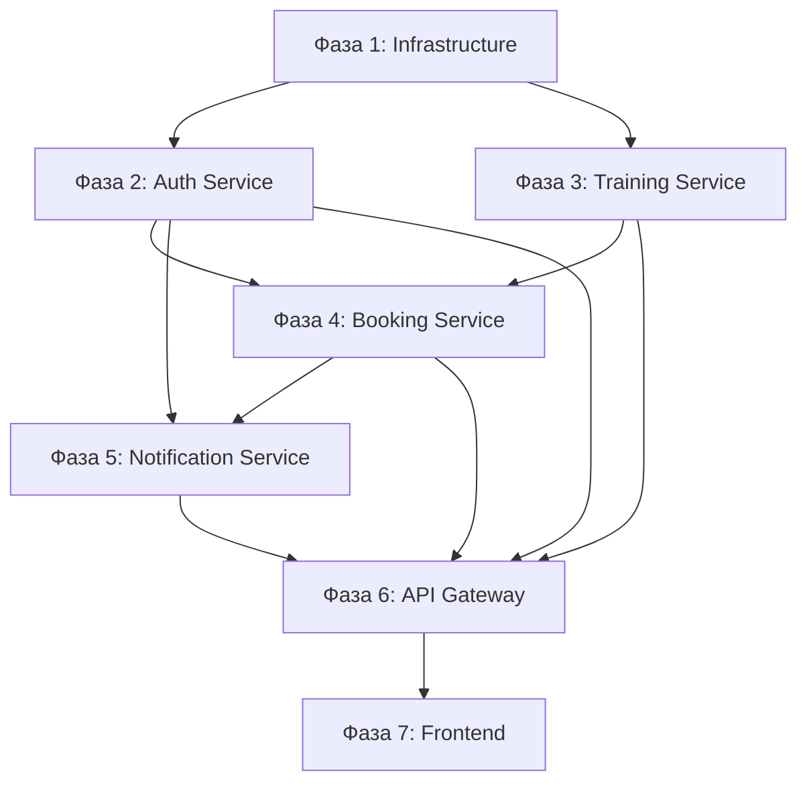

# План реализации DreamFitness

Этот файл лежит в папке:
`<project_root>/doc/plans`

Исходные коды бекенда лежат в папке:
`<project_root>/backend`

Далее в документе все пути указаны от <project_root>.

## Подход

**Horizontal Layers** — сначала весь backend со всеми микросервисами, потом frontend.

---

## Начальные шаблоны

В проекте уже есть начальные шаблоны, которые нужно использовать как базу для разработки:

### Backend Template (`/backend`)

Базовый NestJS проект с преднастроенным окружением:

- **Фреймворк:** NestJS с TypeScript
- **ORM:** TypeORM с PostgreSQL
- **Конфигурация:** `nest-cli.json`, `tsconfig.json`, eslint, prettier
- **Docker:** `docker-compose.yml` для локальной разработки
- **Структура:** Базовые файлы в `/src` (app.module.ts, main.ts)
- **База данных:** data-source.ts для миграций, seed скрипты

> **Важно:** При переходе к Фазе 1 нужно реструктурировать существующий проект в monorepo mode, сохранив настройки.

### Frontend Template (`/frontend`)

Базовый React + Vite проект с преднастроенным UI kit:

- **Фреймворк:** React 19 + Vite 7
- **UI Kit:** shadcn/ui (уже установлен, есть button компонент)
- **Стилизация:** Tailwind CSS 4
- **Конфигурация:** `components.json`, vite.config.ts, tsconfig
- **Структура:** Базовые компоненты в `/src/components/ui`

> **Важно:** При разработке фронтенда (Фаза 7) использовать существующий шаблон, добавляя новые компоненты и страницы.

---

## Фаза 1: Infrastructure & Setup

### 1.1. NestJS Monorepo Setup

- [ ] Реструктурировать backend в NestJS monorepo mode
- [ ] Создать структуру папок `apps/` и `libs/`
- [ ] Настроить `nest-cli.json` для monorepo
- [ ] Создать пустые приложения:
  - `api-gateway`
  - `auth-service`
  - `training-service`
  - `booking-service`
  - `notification-service`

### 1.2. Shared Libraries

- [ ] Создать `libs/contracts` — DTOs и interfaces для межсервисной коммуникации
- [ ] Создать `libs/shared` — общие утилиты, guards, decorators
- [ ] Настроить paths в `tsconfig.json`

### 1.3. Database Infrastructure

- [ ] Обновить `docker-compose.yml` для PostgreSQL + RabbitMQ
- [ ] Настроить TypeORM data source для monorepo
- [ ] Создать базовую миграцию для всех таблиц

### 1.4. RabbitMQ Infrastructure

- [ ] Настроить exchanges и queues
- [ ] Создать общие модули для Pub/Sub

### DoD

**Что на выходе:**

- Работающий NestJS monorepo с 5 приложениями (api-gateway, auth-service, training-service, booking-service, notification-service)
- 2 shared библиотеки: `@app/contracts` и `@app/shared`
- Docker Compose с PostgreSQL и RabbitMQ
- Базовая миграция для всех таблиц

**Минимальные проверки:**

- [ ] `npm run build` — успешная сборка всех приложений
- [ ] `npm run lint` — без ошибок
- [ ] Docker Compose `up` — все контейнеры здоровы
- [ ] TypeORM migration `run` — миграции применены без ошибок
- [ ] RabbitMQ — exchanges и queues созданы (проверить через management UI)

---

## Фаза 2: Auth Service

**Порт:** 3001
**Таблицы:** User, Transaction

### 2.1. User Entity & Repository

- [ ] Создать `User` entity с полями из ADR
- [ ] Создать `Transaction` entity
- [ ] Настроить TypeORM repository

### 2.2. Authentication Module

- [ ] Реализовать регистрацию (с хешированием пароля)
- [ ] Реализовать вход (JWT generation)
- [ ] Реализовать refresh token flow
- [ ] Реализовать logout

### 2.3. User Profile Module

- [ ] GET /auth/me — получение профиля
- [ ] PATCH /auth/me — обновление профиля
- [ ] GET /auth/balance — получение баланса

### 2.4. Balance & Transactions Module

- [ ] POST /auth/balance/deposit — пополнение баланса
- [ ] POST /auth/balance/reserve — резервирование баллов (для Booking)
- [ ] POST /auth/balance/release — освобождение резерва
- [ ] POST /auth/balance/refund — возврат баллов
- [ ] GET /auth/transactions — история транзакций

### 2.5. Integration Events

- [ ] Опубликовать `UserCreated` event
- [ ] Слушать `BalanceChanged` для уведомлений

### DoD

**Что на выходе:**

- Работающий Auth Service на порту 3001
- User и Transaction entities с миграциями
- REST API endpoints: `/auth/register`, `/auth/login`, `/auth/refresh`, `/auth/logout`, `/auth/me`, `/auth/balance/*`, `/auth/transactions`
- JWT access и refresh tokens
- RabbitMQ publisher для `UserCreated` event

**Минимальные проверки:**

- [ ] Unit тесты: AuthModule, UsersModule (min 70% coverage)
- [ ] E2E тесты: регистрация → логин → доступ к `/auth/me`
- [ ] E2E тесты: balance flow (deposit → reserve → release → refund)
- [ ] Контракты: DTOs в `@app/contracts` соответствуют API
- [ ] `npm run lint` — без ошибок
- [ ] `npm run test` — все тесты проходят
- [ ] Ручная проверка: RabbitMQ management UI — `UserCreated` event публикуется

---

## Фаза 3: Training Service

**Порт:** 3002
**Таблицы:** Trainer, Training

### 3.1. Trainer Module

- [ ] Создать `Trainer` entity
- [ ] CRUD операции для тренеров (admin only)
- [ ] GET /trainers — список активных тренеров

### 3.2. Training Module

- [ ] Создать `Training` entity
- [ ] CRUD операции для тренировок (admin only)
- [ ] GET /trainings — список тренировок с фильтрами
- [ ] GET /trainings/:id — детали тренировки
- [ ] GET /trainings/:id/availability — проверка доступных мест

### 3.3. Schedule Queries

- [ ] GET /schedule/week — недельное расписание
- [ ] GET /schedule/trainer/:id — расписание по тренеру
- [ ] Фильтрация по типу тренировки и дате

### DoD

**Что на выходе:**

- Работающий Training Service на порту 3002
- Trainer и Training entities с миграциями
- REST API endpoints: `/trainers`, `/trainings`, `/schedule/*`
- Admin endpoints для CRUD тренировок и тренеров
- Проверка доступных мест `/trainings/:id/availability`

**Минимальные проверки:**

- [ ] Unit тесты: TrainingModule, TrainerModule (min 70% coverage)
- [ ] E2E тесты: создание тренера → создание тренировки → получение расписания
- [ ] E2E тесты: фильтрация по типу и дате
- [ ] Контракты: DTOs в `@app/contracts/training` соответствуют API
- [ ] `npm run lint` — без ошибок
- [ ] `npm run test` — все тесты проходят

---

## Фаза 4: Booking Service (с CQRS)

**Порт:** 3003
**Таблицы:** Booking, Waitlist

### 4.1. Entities & Repositories

- [ ] Создать `Booking` entity
- [ ] Создать `Waitlist` entity
- [ ] Настроить repositories

### 4.2. CQRS Setup

- [ ] Установить и настроить @nestjs/cqrs
- [ ] Создать структуру commands/queries/handlers

### 4.3. Command Side (Write Operations)

- [ ] `BookTrainingCommand` + handler
- [ ] `CancelBookingCommand` + handler
- [ ] `JoinWaitlistCommand` + handler
- [ ] `LeaveWaitlistCommand` + handler

### 4.4. Query Side (Read Operations)

- [ ] `GetUserBookingsQuery` + handler
- [ ] `GetBookingByIdQuery` + handler
- [ ] `GetWaitlistPositionQuery` + handler
- [ ] `GetTrainingAvailabilityQuery` + handler

### 4.5. Saga Implementation (Orchestration)

**Booking Saga:**

- [ ] Step 1: Проверить доступность мест (HTTP → Training Service)
- [ ] Step 2: Зарезервировать баллы (HTTP → Auth Service)
- [ ] Step 3: Создать booking
- [ ] Step 4: Опубликовать `BookingCreated` event
- [ ] Compensating actions на каждом шаге

**Cancellation Saga:**

- [ ] Step 1: Обновить статус booking на cancelled
- [ ] Step 2: Вернуть баллы (HTTP → Auth Service)
- [ ] Step 3: Promote из waitlist (если есть)
- [ ] Step 4: Опубликовать `BookingCancelled` event

**Waitlist Promotion Saga:**

- [ ] Step 1: Найти первого в очереди
- [ ] Step 2: Зарезервировать баллы
- [ ] Step 3: Создать booking
- [ ] Step 4: Удалить из waitlist
- [ ] Step 5: Опубликовать `BookingCreated` event

### 4.6. HTTP Clients

- [ ] Создать HttpModule для коммуникации с Auth Service
- [ ] Создать HttpModule для коммуникации с Training Service
- [ ] Обработать timeout и retry

### DoD

**Что на выходе:**

- Работающий Booking Service на порту 3003
- Booking и Waitlist entities с миграциями
- CQRS структура: commands, queries, handlers, sagas
- REST API endpoints: `/bookings`, `/bookings/:id`, `/waitlist`
- 3 Saga: Booking, Cancellation, Waitlist Promotion

**Минимальные проверки:**

- [ ] Unit тесты: все command handlers и query handlers
- [ ] Unit тесты: saga orchestration logic
- [ ] E2E тесты: booking flow (создание → получение → отмена)
- [ ] E2E тесты: waitlist flow (join → position check → leave)
- [ ] Integration тесты: HTTP клиенты к Auth и Training services
- [ ] Контракты: DTOs в `@app/contracts/booking` соответствуют API
- [ ] `npm run lint` — без ошибок
- [ ] `npm run test` — все тесты проходят
- [ ] Ручная проверка: compensating transactions работают при ошибках

---

## Фаза 5: Notification Service

**Порт:** 3004
**Таблицы:** Notification

### 5.1. Notification Entity & Repository

- [ ] Создать `Notification` entity
- [ ] Настроить repository

### 5.2. In-App Notifications

- [ ] POST /notifications — создание уведомления
- [ ] GET /notifications — список уведомлений пользователя
- [ ] PATCH /notifications/:id/read — отметить как прочитанное
- [ ] GET /notifications/unread-count — количество непрочитанных

### 5.3. RabbitMQ Consumers

- [ ] Consumer для `booking.created` → создать уведомление
- [ ] Consumer для `booking.cancelled` → создать уведомление
- [ ] Consumer для `balance.changed` → создать уведомление
- [ ] Consumer для `training.reminder` → создать уведомление

### 5.4. Email Notifications (опционально)

- [ ] Интеграция с nodemailer
- [ ] Шаблоны писем

### DoD

**Что на выходе:**

- Работающий Notification Service на порту 3004
- Notification entity с миграцией
- REST API endpoints: `/notifications`, `/notifications/:id/read`, `/notifications/unread-count`
- RabbitMQ consumers для всех event types

**Минимальные проверки:**

- [ ] Unit тесты: NotificationModule (min 70% coverage)
- [ ] E2E тесты: создание → список → mark as read
- [ ] Integration тесты: RabbitMQ consumers получают events
- [ ] Контракты: event DTOs в `@app/contracts/notification` соответствуют consumers
- [ ] `npm run lint` — без ошибок
- [ ] `npm run test` — все тесты проходят

---

## Фаза 6: API Gateway

**Порт:** 3000

> **Текущая архитектура (без API Gateway):**
> Клиент обращается напрямую к портам сервисов. Каждый сервис independently валидирует JWT access token.
> Для межсервисного взаимодействия booking-service прокидывает access token пользователя
> в HTTP-запросах к training-service и auth-service.
> Это создаёт дублирование: каждый сервис содержит свой JWT validation guard и auth module.
>
> **После реализации API Gateway:**
>
> - Вся аутентификация и авторизация переносится в Gateway
> - Gateway валидирует JWT и передаёт userId/role через внутренние заголовки - X-User-Id и X-User-Role
> - Сервисы убирают JWT validation guard и auth module, оставляя только проверку внутренних заголовков
> - Прокидывание access token в межсервисных вызовах больше не нужно — сервисы доверяют заголовкам от Gateway
> - Saga в booking-service - promote-from-waitlist - потребует отдельного решения для авторизации
>   - либо сервисный токен для внутренних вызовов через Gateway
>   - либо доверенные внутренние заголовки без токена

> **Known Issue (Phase 4):** В текущей реализации GET /trainings/:id и GET /trainings/:id/availability в training-service временно отключены для аутентификации, чтобы saga в booking-service мог вызывать их без JWT. Это quick fix для Phase 4. В Phase 6 будет реализовано правильное решение через API Gateway с сервисным токеном или доверенными заголовками.

### 6.1. Basic Setup

- [ ] Создать NestJS приложение
- [ ] Настроить proxy controllers для каждого сервиса

### 6.2. Authentication & Authorization

- [ ] JWT validation guard
- [ ] Извлечение userId и role из token
- [ ] Передача X-User-Id и X-User-Role headers в сервисы
- [ ] Role-based guards - client/admin
- [ ] Убрать JWT validation из сервисов, заменить на InternalGuard проверяющий X-User-Id и X-User-Role заголовки
- [ ] Убрать прокидывание access token в межсервисных HTTP клиентах

### 6.3. Routing

```
/api/auth/*      → Auth Service (3001)
/api/trainings/* → Training Service (3002)
/api/bookings/*  → Booking Service (3003)
/api/notifications/* → Notification Service (3004)
```

### 6.4. Rate Limiting

- [ ] Настроить @nestjs/throttler
- [ ] Разные лимиты для разных endpoints

### 6.5. Error Handling

- [ ] Глобальный exception filter
- [ ] Стандартизация ошибок (RFC 7807 Problem Details)

### 6.6. Swagger Documentation

- [ ] Настроить @nestjs/swagger
- [ ] Агрегировать схемы всех сервисов
- [ ] Настроить Bearer auth в Swagger UI
- [ ] Endpoint: /api/docs

### DoD

**Что на выходе:**

- Работающий API Gateway на порту 3000
- Proxy controllers для всех services
- JWT authentication и role-based authorization
- Rate limiting на endpoints
- Глобальный error handling (RFC 7807)
- Swagger UI на `/api/docs`
- Сервисы больше не валидируют JWT самостоятельно

**Минимальные проверки:**

- [ ] E2E тесты: proxy routing для каждого сервиса
- [ ] E2E тесты: JWT validation (valid/invalid/expired tokens)
- [ ] E2E тесты: role-based access (client vs admin)
- [ ] Integration тесты: rate limiting работает
- [ ] Ручная проверка: Swagger UI доступен и содержит все endpoints
- [ ] `npm run lint` — без ошибок
- [ ] `npm run test` — все тесты проходят

---

## Фаза 7: Frontend

### 7.1. Project Setup

- [ ] Установить TanStack Router и Query
- [ ] Установить Zustand
- [ ] Установить ky, react-hook-form, zod
- [ ] Настроить API client с ky

### 7.2. Auth Flow

- [ ] Auth store (Zustand)
- [ ] Login page
- [ ] Register page
- [ ] Protected routes
- [ ] Token refresh handling

### 7.3. Layouts

- [ ] ClientLayout (top nav desktop, bottom nav mobile)
- [ ] AdminLayout (sidebar)
- [ ] Header component
- [ ] Notifications bell

### 7.4. Client Pages

**Dashboard:**

- [ ] Balance card
- [ ] Upcoming trainings widget
- [ ] Quick actions

**Schedule:**

- [ ] Weekly calendar view
- [ ] Filters (type, trainer)
- [ ] Training cards

**Booking:**

- [ ] Training details
- [ ] Availability status
- [ ] Book button / Waitlist button

**Profile:**

- [ ] User info display
- [ ] Edit profile form
- [ ] Top-up balance flow

**History:**

- [ ] Past trainings list
- [ ] Upcoming bookings list
- [ ] Waitlist positions
- [ ] Cancel booking action

**Notifications:**

- [ ] Notifications list
- [ ] Mark as read
- [ ] Filter by type

### 7.5. Admin Pages

**Admin Dashboard:**

- [ ] Stats widgets
- [ ] Recent activity

**Schedule Management:**

- [ ] Trainings table
- [ ] Create training form
- [ ] Edit training form
- [ ] Delete training dialog
- [ ] View participants

**Users Management:**

- [ ] Users table
- [ ] User details drawer
- [ ] Block/unblock user

**Reports:**

- [ ] Loading charts
- [ ] Financial reports

### 7.6. Common Components

- [ ] Loading spinner
- [ ] Empty states
- [ ] Confirm dialogs
- [ ] Toast notifications (sonner)

### DoD

**Что на выходе:**

- Работающий React frontend с Vite
- Client pages: Dashboard, Schedule, Booking, Profile, History, Notifications
- Admin pages: Dashboard, Schedule Management, Users Management, Reports
- Auth flow: login, register, protected routes, token refresh
- Responsive layout: desktop и mobile

**Минимальные проверки:**

- [ ] Unit тесты: Zustand stores, utility functions
- [ ] Component тесты: ключевые компоненты (React Testing Library)
- [ ] E2E тесты (Playwright):
  - Auth flow: login → redirect to dashboard
  - Booking flow: schedule → select training → book → confirmation
  - Admin flow: login → create training → verify in schedule
- [ ] `npm run lint` — без ошибок
- [ ] `npm run build` — успешная сборка
- [ ] Accessibility: Lighthouse accessibility score ≥ 80
- [ ] Ручная проверка: responsive на разных экранах

---

## Диаграмма зависимостей фаз



---

## Приоритеты реализации

| Приоритет | Фаза                 | Обоснование                                      |
| --------- | -------------------- | ------------------------------------------------ |
| 1         | Infrastructure       | База для всего проекта                           |
| 2         | Auth Service         | Аутентификация нужна для всех остальных сервисов |
| 3         | Training Service     | Данные нужны для бронирования                    |
| 4         | Booking Service      | Ключевая бизнес-логика + учебные паттерны        |
| 5         | Notification Service | Важно, но не блокирует основные флоу             |
| 6         | API Gateway          | Единая точка входа                               |
| 7         | Frontend             | Визуализация всего backend                       |
