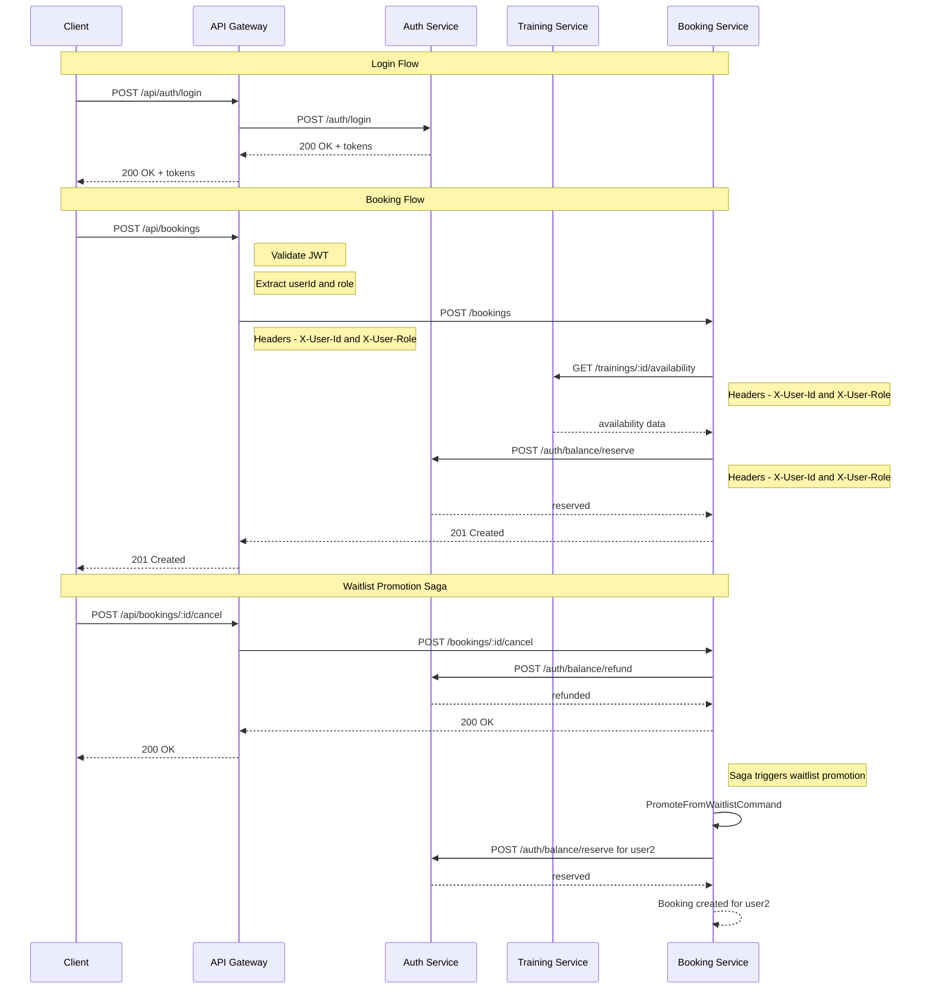

# План ручного тестирования через API Gateway (Фаза 6)

Этот файл лежит в папке:
`<project_root>/doc/plans`

Исходные коды бекенда лежат в папке:
`<project_root>/backend`

Далее в документе все пути указаны от `<project_root>/backend`.

---

## Ключевые изменения в Фазе 6

### Архитектура

Все запросы теперь идут через **API Gateway** на порту **3000**.

```
Client → API Gateway (3000) → Services (3001, 3002, 3003, 3004)
```

### Маршруты

| Сервис           | Было (напрямую)                | Стало (через Gateway)              |
| ---------------- | ------------------------------ | ---------------------------------- |
| Auth Service     | `http://localhost:3001/auth/*` | `http://localhost:3000/api/auth/*` |
| Training Service | `http://localhost:3002/*`      | `http://localhost:3000/api/*`      |
| Booking Service  | `http://localhost:3003/*`      | `http://localhost:3000/api/*`      |
| Notification Svc | `http://localhost:3004/*`      | `http://localhost:3000/api/*`      |

### Аутентификация

- JWT валидация происходит **только в API Gateway**
- Сервисы используют `InternalGuard` и проверяют заголовки `X-User-Id`, `X-User-Role`
- Gateway добавляет эти заголовки автоматически после валидации JWT

---

## Предварительные шаги

### 1. Запустить инфраструктуру (PostgreSQL + RabbitMQ)

```powershell
cd backend
docker compose up -d
```

**Проверка:** контейнеры `dreamfitness-postgres` и `dreamfitness-rabbitmq` запущены.

```powershell
docker ps
```

### 2. Запустить миграции

```powershell
cd backend
npm run db:migrate
```

### 3. Запустить seed

```powershell
cd backend
npm run db:seed
```

**Ожидаемый результат:** созданы admin и test пользователи.

### 4. Запустить API Gateway

```powershell
cd backend
npm run start:dev:api-gateway
```

**Ожидаемый результат:**

```
API Gateway is running on port 3000
Swagger UI available at http://localhost:3000/api/docs
```

### 5. Запустить auth-service

В отдельном терминале:

```powershell
cd backend
npm run start:dev:auth-service
```

**Ожидаемый результат:** `Auth Service is running on port 3001`.

### 6. Запустить training-service

В отдельном терминале:

```powershell
cd backend
npm run start:dev:training-service
```

**Ожидаемый результат:** `Training Service is running on port 3002`.

### 7. Запустить booking-service

В отдельном терминале:

```powershell
cd backend
npm run start:dev:booking-service
```

**Ожидаемый результат:** `Booking Service is running on port 3003`.

### 8. Запустить notification-service (опционально)

В отдельном терминале:

```powershell
cd backend
npm run start:dev:notification-service
```

**Ожидаемый результат:** `Notification Service is running on port 3004`.

> **Примечание:** notification-service можно не запускать, если не тестируете уведомления. Booking saga работает без него.

---

## Настройка сессий HTTPie

Для удобства тестирования создадим две сессии: `admin` и `user`.

### 9. Получить JWT токен администратора

```powershell
http POST http://localhost:3000/api/auth/login email="admin@dreamfitness.com" password="admin123"
```

**Ожидаемый результат:** 200 OK.

```json
{
  "accessToken": "...",
  "refreshToken": "...",
  "user": {
    "id": "...",
    "email": "admin@dreamfitness.com",
    "role": "admin"
  }
}
```

Сохранить `accessToken` в сессии `admin`:

```powershell
http --session=admin -A bearer -a <ACCESS_TOKEN> http://localhost:3000/api/auth/me
```

### 10. Получить JWT токен тестового пользователя

```powershell
http POST http://localhost:3000/api/auth/login email="test@example.com" password="test12345"
```

**Ожидаемый результат:** 200 OK.

Сохранить `accessToken` в сессии `user`:

```powershell
http --session=user -A bearer -a <ACCESS_TOKEN> http://localhost:3000/api/auth/me
```

### 11. Получить ID тестового пользователя

```powershell
http GET http://localhost:3000/api/auth/me --session=user
```

Сохранить `id` как `<USER_ID>`.

### 12. Пополнить баланс тестового пользователя

Seed создаёт пользователей с `balance: 0`. Для бронирования нужны баллы.

```powershell
http POST http://localhost:3000/api/auth/balance/deposit --session=admin userId="<USER_ID>" amount:=5000
```

**Ожидаемый результат:** 200 OK, баланс пользователя пополнен.

### 13. Создать тренера (для тренировок)

```powershell
http POST http://localhost:3000/api/trainers --session=admin name="Тренер Тест" bio="Для тестирования бронирования"
```

Сохранить `id` как `<TRAINER_ID>`.

### 14. Создать тренировку с capacity=1 (для тестирования waitlist)

Тренировка с 1 местом позволяет быстро заполнить её и проверить waitlist.

```powershell
http POST http://localhost:3000/api/trainings --session=admin title="Тестовая тренировка 1 место" type="yoga" trainerId="<TRAINER_ID>" scheduledAt="2026-06-20T10:00:00Z" durationMinutes:=60 capacity:=1 price:=500
```

Сохранить `id` как `<TRAINING_ID_1>`.

### 15. Создать вторую тренировку с capacity=10 (для обычного бронирования)

```powershell
http POST http://localhost:3000/api/trainings --session=admin title="Тестовая тренировка 10 мест" type="crossfit" trainerId="<TRAINER_ID>" scheduledAt="2026-06-21T10:00:00Z" durationMinutes:=60 capacity:=10 price:=300
```

Сохранить `id` как `<TRAINING_ID_2>`.

---

## Сценарий 1: Booking Workflow

### 16. Успешное бронирование тренировки (happy path)

```powershell
http POST http://localhost:3000/api/bookings --session=user trainingId="<TRAINING_ID_2>"
```

**Ожидаемый результат:** 201 Created.

```json
{
  "id": "<BOOKING_ID>",
  "userId": "<USER_ID>",
  "trainingId": "<TRAINING_ID_2>",
  "status": "confirmed",
  "createdAt": "...",
  "updatedAt": "..."
}
```

Сохранить `id` как `<BOOKING_ID>`.

**Проверки:**

- Баланс пользователя уменьшился на 300 (стоимость тренировки)

```powershell
http GET http://localhost:3000/api/auth/me --session=user
```

Убедиться, что `balance` = 5000 - 300 = 4700.

### 17. Получение списка бронирований пользователя

```powershell
http GET http://localhost:3000/api/bookings --session=user
```

**Ожидаемый результат:** 200 OK.

```json
{
  "items": [
    {
      "id": "<BOOKING_ID>",
      "userId": "<USER_ID>",
      "trainingId": "<TRAINING_ID_2>",
      "status": "confirmed",
      "createdAt": "...",
      "updatedAt": "..."
    }
  ],
  "total": 1,
  "page": 1,
  "limit": 10
}
```

### 18. Получение бронирования по ID

```powershell
http GET http://localhost:3000/api/bookings/<BOOKING_ID> --session=user
```

**Ожидаемый результат:** 200 OK, данные бронирования.

### 19. Повторное бронирование той же тренировки (negative — Duplicate)

```powershell
http POST http://localhost:3000/api/bookings --session=user trainingId="<TRAINING_ID_2>"
```

**Ожидаемый результат:** 409 Conflict — `DuplicateBookingException`.

### 20. Бронирование несуществующей тренировки (negative)

```powershell
http POST http://localhost:3000/api/bookings --session=user trainingId="00000000-0000-0000-0000-000000000000"
```

**Ожидаемый результат:** 404 Not Found или 503 Service Unavailable.

### 21. Доступ без токена (negative)

```powershell
http POST http://localhost:3000/api/bookings trainingId="<TRAINING_ID_2>"
```

**Ожидаемый результат:** 401 Unauthorized.

---

## Сценарий 2: Training Cancellation

### 22. Отмена бронирования

Бронирование создано на шаге 16. Теперь отменяем:

```powershell
http POST http://localhost:3000/api/bookings/<BOOKING_ID>/cancel --session=user reason="Не смогу прийти"
```

**Ожидаемый результат:** 200 OK.

```json
{
  "id": "<BOOKING_ID>",
  "userId": "<USER_ID>",
  "trainingId": "<TRAINING_ID_2>",
  "status": "cancelled",
  "createdAt": "...",
  "updatedAt": "..."
}
```

**Проверки:**

- Баланс пользователя вернулся к исходному значению (4700 + 300 = 5000):

```powershell
http GET http://localhost:3000/api/auth/me --session=user
```

### 23. Повторная отмена того же бронирования (negative)

```powershell
http POST http://localhost:3000/api/bookings/<BOOKING_ID>/cancel --session=user
```

**Ожидаемый результат:** 409 Conflict — `BookingAlreadyCancelledException`.

### 24. Отмена несуществующего бронирования (negative)

```powershell
http POST http://localhost:3000/api/bookings/00000000-0000-0000-0000-000000000000/cancel --session=user
```

**Ожидаемый результат:** 404 Not Found — `BookingNotFoundException`.

---

## Сценарий 3: Waitlist Promotion

Этот сценарий проверяет полный цикл: заполнение тренировки → добавление в waitlist → отмена → автоматическое продвижение из очереди.

### 25. Забронировать тренировку с capacity=1 (заполнить все места)

```powershell
http POST http://localhost:3000/api/bookings --session=user trainingId="<TRAINING_ID_1>"
```

**Ожидаемый результат:** 201 Created. Сохранить `id` как `<BOOKING_ID_WL>`.

### 26. Создать второго тестового пользователя

```powershell
http POST http://localhost:3000/api/auth/register email="test2@example.com" password="test12345" name="Test User 2"
```

Получить токен:

```powershell
http POST http://localhost:3000/api/auth/login email="test2@example.com" password="test12345"
```

Сохранить `accessToken` в сессии `user2`:

```powershell
http --session=user2 -A bearer -a <ACCESS_TOKEN> http://localhost:3000/api/auth/me
```

Получить ID:

```powershell
http GET http://localhost:3000/api/auth/me --session=user2
```

Сохранить `id` как `<USER2_ID>`.

### 27. Пополнить баланс второго пользователя

```powershell
http POST http://localhost:3000/api/auth/balance/deposit --session=admin userId="<USER2_ID>" amount:=5000
```

### 28. Попытка забронировать заполненную тренировку (negative — No Available Slots)

```powershell
http POST http://localhost:3000/api/bookings --session=user2 trainingId="<TRAINING_ID_1>"
```

**Ожидаемый результат:** 409 Conflict — `NoAvailableSlotsException`.

### 29. Встать в waitlist на заполненную тренировку

```powershell
http POST http://localhost:3000/api/waitlist --session=user2 trainingId="<TRAINING_ID_1>"
```

**Ожидаемый результат:** 201 Created.

```json
{
  "id": "<WAITLIST_ID>",
  "userId": "<USER2_ID>",
  "trainingId": "<TRAINING_ID_1>",
  "position": 1,
  "joinedAt": "..."
}
```

### 30. Проверить позицию в waitlist

```powershell
http GET "http://localhost:3000/api/waitlist/position?trainingId=<TRAINING_ID_1>" --session=user2
```

**Ожидаемый результат:** 200 OK.

```json
{
  "position": 1,
  "totalInQueue": 1
}
```

### 31. Отменить бронирование первого пользователя (триггер waitlist promotion)

```powershell
http POST http://localhost:3000/api/bookings/<BOOKING_ID_WL>/cancel --session=user reason="Освобождаю место"
```

**Ожидаемый результат:** 200 OK, бронирование отменено.

**Проверка waitlist promotion:**

- Второй пользователь автоматически получил бронирование
- Баланс второго пользователя уменьшился на стоимость тренировки (500)

Проверить баланс второго пользователя:

```powershell
http GET http://localhost:3000/api/auth/me --session=user2
```

Убедиться, что `balance` = 5000 - 500 = 4500.

Проверить бронирования второго пользователя:

```powershell
http GET http://localhost:3000/api/bookings --session=user2
```

Должно быть бронирование со `status: "confirmed"` на `<TRAINING_ID_1>`.

Проверить, что waitlist пуст:

```powershell
http GET "http://localhost:3000/api/waitlist/position?trainingId=<TRAINING_ID_1>" --session=user2
```

**Ожидаемый результат:** 404 Not Found — `NotOnWaitlistException` (пользователь больше не в очереди).

---

## Дополнительные проверки API Gateway

### 32. Проверка Swagger UI

Открыть в браузере: http://localhost:3000/api/docs

- [ ] Документация загружается
- [ ] Отображаются группы: **Auth**, **Trainers**, **Trainings**, **Bookings**, **Waitlist**, **Notifications**
- [ ] Кнопка **Authorize** работает — ввести `Bearer <TOKEN>` и авторизоваться
- [ ] Можно выполнить запрос прямо из Swagger UI

### 33. Проверка Rate Limiting

Выполнить несколько запросов подряд:

```powershell
# Выполнить 5+ раз быстро
http GET http://localhost:3000/api/trainings --session=user
```

**Ожидаемый результат:** при превышении лимита возвращается 429 Too Many Requests.

### 34. Проверка ошибок (RFC 7807 Problem Details)

Вызвать заведомо ошибочный запрос:

```powershell
http GET http://localhost:3000/api/trainings/00000000-0000-0000-0000-000000000000 --session=user
```

**Ожидаемый результат:** 404 Not Found с телом в формате Problem Details:

```json
{
  "type": "https://httpstatuses.com/404",
  "title": "Not Found",
  "status": 404,
  "detail": "Training with id 00000000-0000-0000-0000-000000000000 not found",
  "instance": "/api/trainings/00000000-0000-0000-0000-000000000000"
}
```

### 35. Проверка недоступности сервисов напрямую

Убедиться, что сервисы не принимают запросы без внутренних заголовков:

```powershell
# Напрямую к auth-service (должен вернуть 401)
http GET http://localhost:3001/auth/me

# Напрямую к training-service (должен вернуть 401)
http GET http://localhost:3002/trainers

# Напрямую к booking-service (должен вернуть 401)
http GET http://localhost:3003/bookings
```

**Ожидаемый результат:** 401 Unauthorized с сообщением `Missing internal auth headers`.

---

## RabbitMQ

### 36. Проверка RabbitMQ Management UI

Открыть: http://localhost:15672 (dreamfitness / dreamfitness123)

- [ ] Exchange `dreamfitness.exchange` существует
- [ ] После шага 16 видно `booking.created` событие
- [ ] После шага 22 видно `booking.cancelled` событие
- [ ] После шага 29 видно `waitlist.joined` событие
- [ ] После шага 31 видно `booking.created` (продвижение из waitlist) и `waitlist.promoted` события

---

## Чек-лист результатов

### Booking Workflow

| #   | Тест                                 | Статус |
| --- | ------------------------------------ | ------ |
| 16  | Успешное бронирование                | [ ]    |
| 17  | Список бронирований                  | [ ]    |
| 18  | Получение бронирования по ID         | [ ]    |
| 19  | Повторное бронирование (negative)    | [ ]    |
| 20  | Несуществующая тренировка (negative) | [ ]    |
| 21  | Доступ без токена (negative)         | [ ]    |

### Training Cancellation

| #   | Тест                                   | Статус |
| --- | -------------------------------------- | ------ |
| 22  | Отмена бронирования                    | [ ]    |
| 23  | Повторная отмена (negative)            | [ ]    |
| 24  | Несуществующее бронирование (negative) | [ ]    |

### Waitlist Promotion

| #   | Тест                          | Статус |
| --- | ----------------------------- | ------ |
| 25  | Заполнение тренировки         | [ ]    |
| 26  | Создание второго пользователя | [ ]    |
| 27  | Пополнение баланса user2      | [ ]    |
| 28  | Нет свободных мест (negative) | [ ]    |
| 29  | Встать в waitlist             | [ ]    |
| 30  | Проверка позиции в waitlist   | [ ]    |
| 31  | Waitlist promotion при отмене | [ ]    |

### API Gateway

| #   | Тест                              | Статус |
| --- | --------------------------------- | ------ |
| 32  | Swagger UI                        | [ ]    |
| 33  | Rate Limiting                     | [ ]    |
| 34  | RFC 7807 Problem Details          | [ ]    |
| 35  | Прямой доступ к сервисам заблокир | [ ]    |

### Infrastructure

| #   | Тест                   | Статус |
| --- | ---------------------- | ------ |
| 36  | RabbitMQ Management UI | [ ]    |

---

## Диаграмма потока запросов



---

## Известные проблемы и ограничения

### 1. Различия в маршрутах waitlist

Gateway ожидает `GET /api/waitlist/:trainingId`, но booking-service использует `GET /waitlist/position?trainingId=...`.

**Решение:** Используйте `GET /api/waitlist/position?trainingId=...` (через catch-all маршрут).

### 2. Отмена бронирования

Gateway имеет `DELETE /api/bookings/:id`, но booking-service ожидает `POST /bookings/:id/cancel`.

**Решение:** Используйте `POST /api/bookings/:id/cancel` (через catch-all маршрут).

### 3. Notification Service

Если notification-service не запущен, события RabbitMQ будут накапливаться в очереди. Это не влияет на функциональность бронирования.

---

## Полезные команды

### Остановка всех сервисов

```powershell
# Остановить все Node.js процессы
taskkill /F /IM node.exe

# Остановить Docker контейнеры
docker compose down
```

### Просмотр логов

```powershell
# Логи Docker контейнеров
docker compose logs -f

# Логи конкретного контейнера
docker compose logs -f dreamfitness-postgres
docker compose logs -f dreamfitness-rabbitmq
```

### Очистка базы данных

```powershell
cd backend
npm run db:reset
```

---

## Ссылки

- [impl-plan-phase6-api-gateway.md](./impl-plan-phase6-api-gateway.md) — План реализации API Gateway
- [manual-testing-phase4-booking-service.md](./manual-testing-phase4-booking-service.md) — План тестирования Phase 4
- [ADR.md](../ADR.md) — Architecture Decision Record
