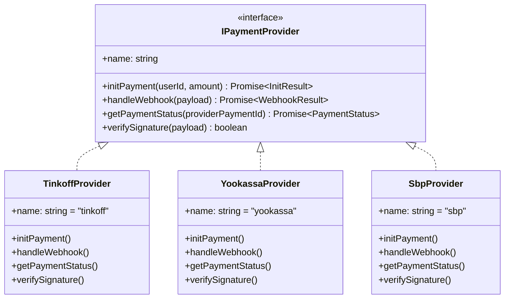
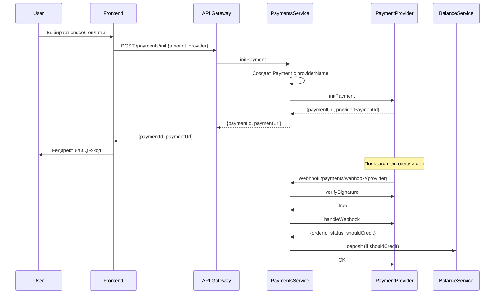

# Архитектура множественных платежных провайдеров

## 1. Проблемы текущей реализации

### 1.1 Жесткая привязка к Тинькофф

**Payment entity:**

```typescript
// Поля специфичны только для Тинькофф
tinkoffPaymentId: string | null; // Не подходит для ЮKassa, СБП
tinkoffStatus: string | null; // Не подходит для других провайдеров
```

**ITinkoffClient интерфейс:**

- Методы специфичны для Тинькофф API
- Нельзя переиспользовать для ЮKassa или СБП

**PaymentsService:**

- Метод `mapTinkoffStatusToPaymentStatus` - только для Тинькофф
- Webhook обработка завязана на формат Тинькофф

### 1.2 Что можно переиспользовать

| Компонент          | Переиспользование             |
| ------------------ | ----------------------------- |
| Payment entity     | ❌ Требует рефакторинга       |
| PaymentRepository  | ✅ Почти полностью            |
| PaymentsService    | ⚠️ Частично (базовая логика)  |
| PaymentsController | ⚠️ Требует параметра provider |
| BalanceService     | ✅ Полностью                  |
| API Gateway proxy  | ✅ Полностью                  |

---

## 2. Предлагаемая архитектура

### 2.1 Strategy Pattern для провайдеров



### 2.2 Обновленная Payment entity

```typescript
@Entity("payments")
export class Payment {
  @PrimaryGeneratedColumn("uuid")
  id: string;

  @Column({ type: "uuid", name: "user_id" })
  userId: string;

  @Column({ type: "integer" })
  amount: number;

  @Column({
    type: "enum",
    enum: PaymentStatus,
    default: PaymentStatus.PENDING,
  })
  status: PaymentStatus;

  // NEW: Провайдер платежа
  @Column({
    type: "varchar",
    length: 50,
    name: "provider_name",
  })
  providerName: string; // 'tinkoff', 'yookassa', 'sbp'

  // NEW: ID платежа у провайдера (универсальное)
  @Column({
    type: "varchar",
    length: 100,
    name: "provider_payment_id",
    nullable: true,
  })
  providerPaymentId: string | null;

  // NEW: Статус от провайдера (универсальное)
  @Column({
    type: "varchar",
    length: 50,
    name: "provider_status",
    nullable: true,
  })
  providerStatus: string | null;

  @Column({ type: "varchar", length: 500, nullable: true })
  description: string | null;

  // NEW: Метаданные провайдера (гибкое хранение)
  @Column({ type: "jsonb", nullable: true })
  metadata: Record<string, unknown> | null;

  @CreateDateColumn({ name: "created_at" })
  createdAt: Date;

  @UpdateDateColumn({ name: "updated_at" })
  updatedAt: Date;
}
```

### 2.3 Интерфейс IPaymentProvider

```typescript
// backend/apps/auth-service/src/payments/interfaces/payment-provider.interface.ts

export interface InitPaymentResult {
  success: boolean;
  providerPaymentId: string;
  paymentUrl?: string; // Для redirect-схем (Тинькофф, ЮKassa)
  qrCode?: string; // Для СБП (QR-код)
  deepLink?: string; // Для мобильных приложений
  errorCode?: string;
  errorMessage?: string;
}

export interface WebhookResult {
  orderId: string;
  status: PaymentStatus;
  amount: number;
  shouldCreditBalance: boolean;
}

export interface IPaymentProvider {
  readonly name: string; // 'tinkoff' | 'yookassa' | 'sbp'

  initPayment(
    orderId: string,
    amount: number,
    description: string,
    metadata?: Record<string, unknown>,
  ): Promise<InitPaymentResult>;

  handleWebhook(payload: Record<string, unknown>): Promise<WebhookResult>;

  getPaymentStatus(providerPaymentId: string): Promise<{
    status: PaymentStatus;
    providerStatus: string;
  }>;

  verifySignature(payload: Record<string, unknown>): boolean;
}
```

### 2.4 Обновленный PaymentsService

```typescript
@Injectable()
export class PaymentsService {
  constructor(
    private readonly paymentRepository: PaymentRepository,
    private readonly balanceService: BalanceService,
    // NEW: Map провайдеров
    @Inject("PAYMENT_PROVIDERS")
    private readonly providers: Map<string, IPaymentProvider>,
  ) {}

  async initPayment(
    userId: string,
    dto: InitPaymentDto,
    providerName: string = "tinkoff", // NEW: параметр провайдера
  ): Promise<{ paymentId: string; paymentUrl?: string; qrCode?: string }> {
    const provider = this.providers.get(providerName);
    if (!provider) {
      throw new Error(`Unknown payment provider: ${providerName}`);
    }

    const payment = await this.paymentRepository.createPayment({
      userId,
      amount: dto.amount,
      providerName, // NEW: сохраняем провайдера
      description: `Пополнение баланса: ${dto.amount} баллов`,
    });

    const result = await provider.initPayment(
      payment.id,
      dto.amount,
      `Пополнение баланса DreamFitness: ${dto.amount} баллов`,
    );

    if (!result.success) {
      await this.paymentRepository.updateStatus(
        payment.id,
        PaymentStatus.REJECTED,
        result.providerPaymentId,
        "ERROR",
      );
      throw new Error(result.errorMessage);
    }

    await this.paymentRepository.updateStatus(
      payment.id,
      PaymentStatus.PENDING,
      result.providerPaymentId,
      "INITED",
    );

    return {
      paymentId: payment.id,
      paymentUrl: result.paymentUrl,
      qrCode: result.qrCode,
    };
  }

  // Webhook routing по провайдеру
  async handleWebhook(
    providerName: string,
    payload: Record<string, unknown>,
  ): Promise<{ status: string }> {
    const provider = this.providers.get(providerName);
    if (!provider) {
      throw new Error(`Unknown provider: ${providerName}`);
    }

    // Verify signature
    if (!provider.verifySignature(payload)) {
      return { status: "OK" }; // Не раскрываем информацию
    }

    const result = await provider.handleWebhook(payload);

    const payment = await this.paymentRepository.findById(result.orderId);
    if (!payment) {
      return { status: "OK" };
    }

    // Idempotency check
    if (payment.status === PaymentStatus.CONFIRMED) {
      return { status: "OK" };
    }

    await this.paymentRepository.updateStatus(
      payment.id,
      result.status,
      payment.providerPaymentId,
      result.providerStatus,
    );

    if (result.shouldCreditBalance) {
      await this.balanceService.deposit({
        userId: payment.userId,
        amount: result.amount,
        description: `Пополнение через ${providerName}`,
      });
    }

    return { status: "OK" };
  }
}
```

---

## 3. Структура файлов

```
backend/apps/auth-service/src/payments/
├── entities/
│   └── payment.entity.ts          # Обновленная entity
├── interfaces/
│   ├── payment-provider.interface.ts  # NEW: Общий интерфейс
│   └── tinkoff-client.interface.ts    # Оставить для внутреннего использования
├── providers/                     # NEW: Папка провайдеров
│   ├── tinkoff.provider.ts        # Рефакторинг из tinkoff-client.service.ts
│   ├── yookassa.provider.ts       # NEW
│   └── sbp.provider.ts            # NEW
├── repositories/
│   └── payment.repository.ts      # Минимальные изменения
├── payments.service.ts            # Обновленная логика
├── payments.controller.ts         # Обновленные endpoints
└── payments.module.ts             # Регистрация провайдеров
```

---

## 4. API Endpoints

### 4.1 Инициация платежа

```typescript
// POST /payments/init
{
  amount: number;
  provider?: string;  // 'tinkoff' | 'yookassa' | 'sbp' (default: 'tinkoff')
}

// Response
{
  paymentId: string;
  paymentUrl?: string;   // Для redirect-провайдеров
  qrCode?: string;       // Для СБП
}
```

### 4.2 Webhooks

```
POST /payments/webhook/tinkoff   → TinkoffProvider
POST /payments/webhook/yookassa  → YookassaProvider
POST /payments/webhook/sbp       → SbpProvider
```

---

## 5. Миграция данных

### 5.1 Миграция Payment entity

```sql
-- Добавить новые колонки
ALTER TABLE payments
  ADD COLUMN provider_name VARCHAR(50) DEFAULT 'tinkoff',
  ADD COLUMN provider_payment_id VARCHAR(100),
  ADD COLUMN provider_status VARCHAR(50);

-- Скопировать данные из старых колонок
UPDATE payments
  SET provider_payment_id = tinkoff_payment_id,
      provider_status = tinkoff_status
  WHERE tinkoff_payment_id IS NOT NULL;

-- Удалить старые колонки
ALTER TABLE payments
  DROP COLUMN tinkoff_payment_id,
  DROP COLUMN tinkoff_status;
```

---

## 6. Переиспользование кода

### 6.1 Что переиспользуется без изменений

| Компонент           | Статус                                 |
| ------------------- | -------------------------------------- |
| `PaymentRepository` | ✅ Только переименовать поля в методах |
| `BalanceService`    | ✅ Без изменений                       |
| `API Gateway proxy` | ✅ Без изменений                       |
| `Frontend hooks`    | ⚠️ Добавить параметр `provider`        |
| `TopUpBalance`      | ⚠️ Добавить выбор способа оплаты       |

### 6.2 Что требует рефакторинга

| Компонент              | Изменения                                   |
| ---------------------- | ------------------------------------------- |
| `Payment entity`       | Переименовать поля, добавить `providerName` |
| `TinkoffClientService` | Переделать в `TinkoffProvider`              |
| `PaymentsService`      | Routing по провайдерам                      |
| `PaymentsController`   | Новые webhook endpoints                     |
| `PaymentsModule`       | Регистрация Map провайдеров                 |

---

## 7. План реализации

### Этап 1: Рефакторинг Payment entity

- [ ] Создать миграцию для новых колонок
- [ ] Обновить Payment entity
- [ ] Обновить PaymentRepository

### Этап 2: Абстракция провайдеров

- [ ] Создать IPaymentProvider интерфейс
- [ ] Переделать TinkoffClientService → TinkoffProvider
- [ ] Обновить PaymentsModule (Map провайдеров)

### Этап 3: Обновление PaymentsService

- [ ] Routing по провайдерам
- [ ] Обновить initPayment
- [ ] Обновить handleWebhook

### Этап 4: Обновление Controller

- [ ] Добавить параметр provider в DTO
- [ ] Разделить webhook endpoints

### Этап 5: Frontend

- [ ] Добавить выбор способа оплаты в TopUpBalance
- [ ] Обновить API hooks

---

## 8. Диаграмма потока оплаты


