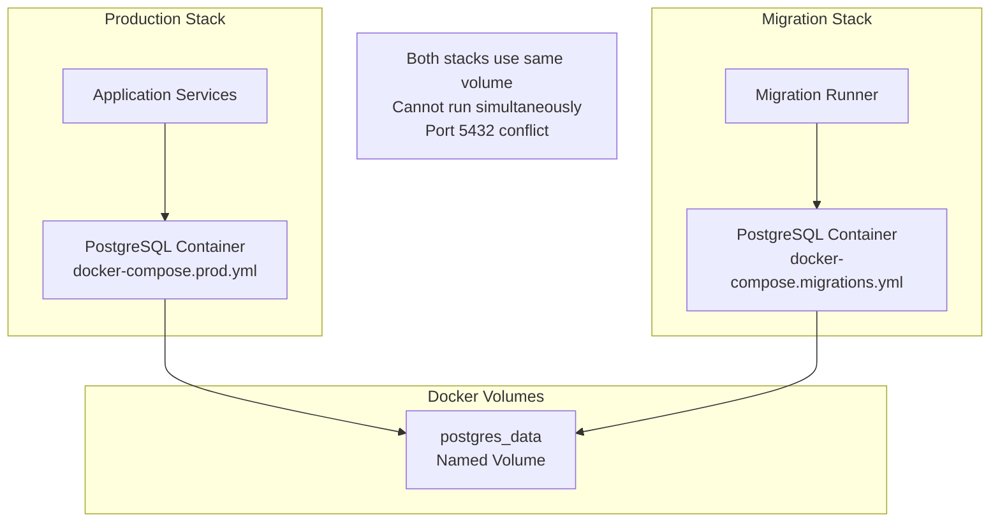
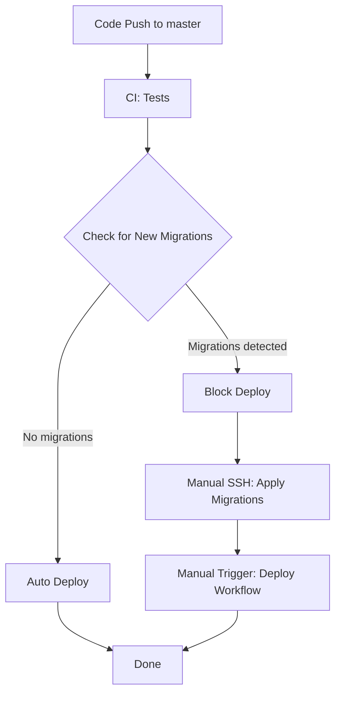

# Production Database Migration Procedure

## Overview

This document describes the procedure for applying database migrations to production environment.

## Key Principles

1. **Manual migrations for production** - Migrations should be run manually before deploying new code
2. **Backup first** - Always backup database before applying migrations
3. **Test in staging** - Verify migrations in staging environment first
4. **Rollback plan** - Have a plan to revert if migration fails

## Architecture

Both [`docker-compose.migrations.yml`](../../docker-compose.migrations.yml) and [`docker-compose.prod.yml`](../../docker-compose.prod.yml) use the SAME named volume `postgres_data`:



**Key insight**: Since both stacks use the same volume, migrations will operate on production data. But they cannot run simultaneously due to port conflict on 5432.

## Migration Procedure

### Prerequisites

- Access to production server via SSH
- Database backup completed
- Migration tested in staging environment

### Step 1: SSH to Production Server

```bash
ssh github-runner@fitness.ddns.net
cd /home/github-runner/dream-fitness
```

### Step 2: Backup Database

```bash
# Create backup before migration
docker exec dreamfitness-postgres pg_dump -U dreamfitness dreamfitness > backup_$(date +%Y%m%d_%H%M%S).sql

# Verify backup was created
ls -la backup_*.sql
```

### Step 3: Pull Latest Code

```bash
git pull origin master
```

### Step 4: Stop Production Services

```bash
# Stop all application services
docker compose -f docker-compose.prod.yml down

# Verify all containers are stopped
docker ps
```

> **Note**: This stops all containers including PostgreSQL. The data persists in the `postgres_data` volume.

### Step 5: Run Migrations

```bash
# Run migrations with data seeding
docker compose -f docker-compose.migrations.yml run --rm -e RUN_MIGRATIONS=true -e RUN_SEED=true migration-runner

# Or run migrations only - no seeding
docker compose -f docker-compose.migrations.yml run --rm migration-runner npm run db:migrate
```

This command:

- Starts a temporary PostgreSQL container using the same `postgres_data` volume
- Builds the migration-runner image
- Runs migrations against production data
- Automatically removes the container after completion

### Step 6: Start Production Services

```bash
docker compose -f docker-compose.prod.yml up -d --build
```

### Step 7: Verify Deployment

```bash
# Check all services are healthy
docker compose -f docker-compose.prod.yml ps

# Test health endpoint
curl https://fitness.ddns.net/health

# Check logs if needed
docker compose -f docker-compose.prod.yml logs -f --tail=50
```

## Rollback Procedure

If migration fails or causes issues:

### Option A: Revert Migration

```bash
# Stop production
docker compose -f docker-compose.prod.yml down

# Revert last migration
docker compose -f docker-compose.migrations.yml run --rm migration-runner npm run db:migrate:revert

# Start production
docker compose -f docker-compose.prod.yml up -d
```

### Option B: Restore from Backup

```bash
# Stop production
docker compose -f docker-compose.prod.yml down

# Start only postgres
docker compose -f docker-compose.prod.yml up -d postgres

# Restore database
cat backup_YYYYMMDD_HHMMSS.sql | docker exec -i dreamfitness-postgres psql -U dreamfitness dreamfitness

# Start all services
docker compose -f docker-compose.prod.yml up -d
```

## CI/CD Integration

### Current Pipeline

The CI/CD pipeline in [`.github/workflows/ci-cd.yml`](../../.github/workflows/ci-cd.yml) does NOT handle migrations automatically. This is intentional for production safety.

### Recommended Workflow



### Implementation

Add the following job to [`.github/workflows/ci-cd.yml`](../../.github/workflows/ci-cd.yml):

```yaml
# Stage 5: Check for migrations
check-migrations:
  runs-on: self-hosted
  needs: integration-tests
  outputs:
    has_migrations: ${{ steps.check.outputs.has_migrations }}
  steps:
    - uses: actions/checkout@v6
      with:
        fetch-depth: 0 # Need full history for git diff

    - name: Check for new migration files
      id: check
      run: |
        # Get list of changed migration files
        MIGRATION_FILES=$(git diff --name-only origin/master~1 origin/master -- 'backend/apps/*/src/migrations/*.ts' 2>/dev/null || echo "")

        if [ -n "$MIGRATION_FILES" ]; then
          echo "has_migrations=true" >> $GITHUB_OUTPUT
          echo "::warning::New migrations detected:"
          echo "$MIGRATION_FILES"
        else
          echo "has_migrations=false" >> $GITHUB_OUTPUT
          echo "No new migrations detected"
        fi

# Stage 6: Deploy (conditional)
deploy:
  runs-on: self-hosted
  needs: check-migrations
  if: needs.check-migrations.outputs.has_migrations == 'false'
  # ... existing deploy steps ...
```

### How It Works

1. **check-migrations job**:
   - Compares current commit with previous commit
   - Checks for changes in `backend/apps/*/src/migrations/*.ts`
   - Sets output variable `has_migrations`

2. **deploy job**:
   - Only runs if `has_migrations == 'false'`
   - Automatic deployment for code-only changes

3. **When migrations exist**:
   - Deploy job is skipped
   - Developer receives warning in GitHub Actions
   - Manual process required:
     1. SSH to production
     2. Apply migrations (follow procedure above)
     3. Manually trigger deploy or re-run workflow

### Manual Deploy After Migrations

After applying migrations manually, trigger deploy via:

```bash
# Option 1: GitHub CLI
gh workflow run ci-cd.yml --ref master

# Option 2: GitHub UI
# Actions > CI/CD Pipeline > Run workflow

# Option 3: Manual deploy on server
cd /home/github-runner/dream-fitness
docker compose -f docker-compose.prod.yml up -d --build
```

## Quick Reference Commands

| Action              | Command                                                                                               |
| ------------------- | ----------------------------------------------------------------------------------------------------- |
| Backup database     | `docker exec dreamfitness-postgres pg_dump -U dreamfitness dreamfitness > backup.sql`                 |
| Stop production     | `docker compose -f docker-compose.prod.yml down`                                                      |
| Run migrations      | `docker compose -f docker-compose.migrations.yml run --rm -e RUN_MIGRATIONS=true migration-runner`    |
| Run migrations only | `docker compose -f docker-compose.migrations.yml run --rm migration-runner npm run db:migrate`        |
| Run seed only       | `docker compose -f docker-compose.migrations.yml run --rm migration-runner npm run db:seed`           |
| Revert migration    | `docker compose -f docker-compose.migrations.yml run --rm migration-runner npm run db:migrate:revert` |
| Start production    | `docker compose -f docker-compose.prod.yml up -d --build`                                             |
| Check tables        | `docker exec dreamfitness-postgres psql -U dreamfitness -d dreamfitness -c "\dt"`                     |

## Best Practices Summary

1. **Always backup** before migrations
2. **Test migrations** in staging first
3. **Stop production** before running migrations
4. **Use backward-compatible migrations** when possible
5. **Have rollback plan** ready
6. **Monitor application** after deployment
7. **Document all changes** in migration files
