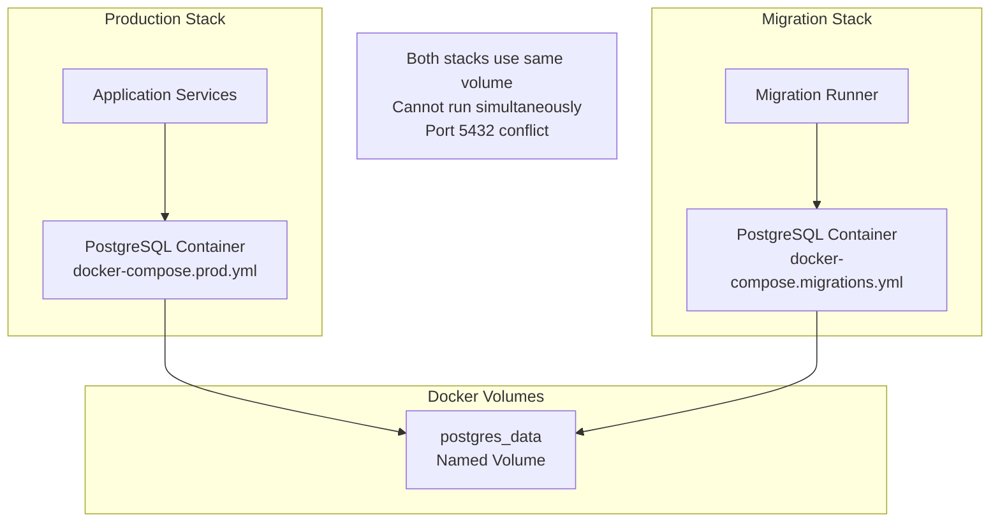
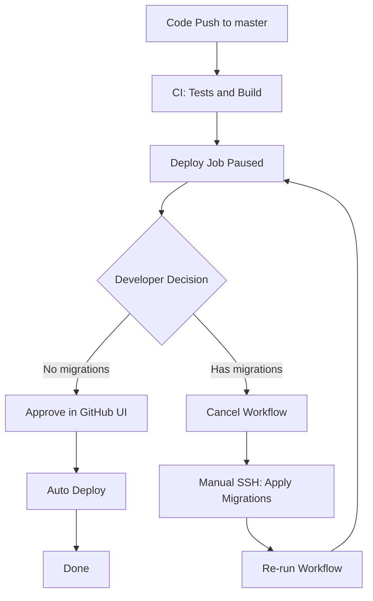

# Production Database Migration Procedure

## Overview

This document describes the procedure for applying database migrations to production environment.

## Key Principles

1. **Manual migrations for production** - Migrations should be run manually before deploying new code
2. **Backup first** - Always backup database before applying migrations
3. **Test in staging** - Verify migrations in staging environment first
4. **Rollback plan** - Have a plan to revert if migration fails

## Architecture

Both [`docker-compose.migrations.yml`](../../docker-compose.migrations.yml) and [`docker-compose.prod.yml`](../../docker-compose.prod.yml) use the SAME named volume `postgres_data`:



**Key insight**: Since both stacks use the same volume, migrations will operate on production data. But they cannot run simultaneously due to port conflict on 5432.

## Migration Procedure

### Prerequisites

- Access to production server via SSH
- Database backup completed
- Migration tested in staging environment

### Step 1: SSH to Production Server

```bash
ssh github-runner@fitness.ddns.net
cd /home/github-runner/dream-fitness
```

### Step 2: Backup Database

```bash
# Create backup before migration
docker exec dreamfitness-postgres pg_dump -U dreamfitness dreamfitness > backup_$(date +%Y%m%d_%H%M%S).sql

# Verify backup was created
ls -la backup_*.sql
```

### Step 3: Pull Latest Code

```bash
git pull origin master
```

### Step 4: Stop Production Services

```bash
# Stop all application services
docker compose -f docker-compose.prod.yml down

# Verify all containers are stopped
docker ps
```

> **Note**: This stops all containers including PostgreSQL. The data persists in the `postgres_data` volume.

### Step 5: Run Migrations

```bash
# Run migrations with data seeding
docker compose -f docker-compose.migrations.yml run --rm -e RUN_MIGRATIONS=true -e RUN_SEED=true migration-runner

# Or run migrations only - no seeding
docker compose -f docker-compose.migrations.yml run --rm migration-runner npm run db:migrate
```

This command:

- Starts a temporary PostgreSQL container using the same `postgres_data` volume
- Builds the migration-runner image
- Runs migrations against production data
- Automatically removes the container after completion

### Step 6: Start Production Services

```bash
docker compose -f docker-compose.prod.yml up -d --build
```

### Step 7: Verify Deployment

```bash
# Check all services are healthy
docker compose -f docker-compose.prod.yml ps

# Test health endpoint
curl https://fitness.ddns.net/health

# Check logs if needed
docker compose -f docker-compose.prod.yml logs -f --tail=50
```

## Rollback Procedure

If migration fails or causes issues:

### Option A: Revert Migration

```bash
# Stop production
docker compose -f docker-compose.prod.yml down

# Revert last migration
docker compose -f docker-compose.migrations.yml run --rm migration-runner npm run db:migrate:revert

# Start production
docker compose -f docker-compose.prod.yml up -d
```

### Option B: Restore from Backup

```bash
# Stop production
docker compose -f docker-compose.prod.yml down

# Start only postgres
docker compose -f docker-compose.prod.yml up -d postgres

# Restore database
cat backup_YYYYMMDD_HHMMSS.sql | docker exec -i dreamfitness-postgres psql -U dreamfitness dreamfitness

# Start all services
docker compose -f docker-compose.prod.yml up -d
```

## CI/CD Integration

### Current Pipeline

The CI/CD pipeline in [`.github/workflows/ci-cd.yml`](../../.github/workflows/ci-cd.yml) uses **GitHub Environment Protection** for manual approval before deployment. This ensures developer reviews migration status before deploying.

### Workflow



### GitHub Environment Setup

Before using this workflow, configure GitHub Environment:

1. Go to repository **Settings** > **Environments**
2. Click **New environment** → Name it `production`
3. Configure protection rules:
   - ✅ **Required reviewers** → Add yourself or team
   - ✅ **Wait timer** → Optional: Add delay for last-minute checks
4. Save environment

### Implementation

Deploy job in [`.github/workflows/ci-cd.yml`](../../.github/workflows/ci-cd.yml):

```yaml
deploy:
  runs-on: self-hosted
  needs: integration-tests
  environment: production # This enables manual approval
  steps:
    - uses: actions/checkout@v6

    - name: Deploy to production
      run: |
        cd /home/github-runner/dream-fitness
        docker compose -f docker-compose.prod.yml up -d --build

    - name: Health check
      run: |
        curl -f https://fitness.ddns.net/health || exit 1
```

### How It Works

1. **Workflow starts automatically** on push to master
2. **Tests and build run** without interruption
3. **Deploy job pauses** at `environment: production`
4. **Developer reviews** in GitHub Actions UI:
   - Check commit history for migration files
   - Check `backend/apps/*/src/migrations/*.ts` changes
5. **Developer decides**:
   - **No migrations**: Click **Approve** → Auto deploy
   - **Has migrations**: Click **Cancel** → Manual process

### When Migrations Exist

If migrations detected during review:

1. **Cancel** the workflow in GitHub Actions UI
2. **SSH to production** and apply migrations:

```bash
ssh github-runner@fitness.ddns.net
cd /home/github-runner/dream-fitness
git pull origin master

# Backup database
docker exec dreamfitness-postgres pg_dump -U dreamfitness dreamfitness > backup_$(date +%Y%m%d_%H%M%S).sql

# Stop production
docker compose -f docker-compose.prod.yml down

# Run migrations
docker compose -f docker-compose.migrations.yml run --rm -e RUN_MIGRATIONS=true migration-runner

# Start production
docker compose -f docker-compose.prod.yml up -d --build
```

3. **Verify** deployment is healthy
4. **Done** - no need to re-run workflow

### Manual Deploy Without Migrations

If workflow was cancelled but no migrations needed:

```bash
# Option 1: Re-run workflow in GitHub UI
# Actions > CI/CD Pipeline > Re-run jobs

# Option 2: Manual deploy on server
cd /home/github-runner/dream-fitness
git pull origin master
docker compose -f docker-compose.prod.yml up -d --build
```

## Quick Reference Commands

| Action              | Command                                                                                               |
| ------------------- | ----------------------------------------------------------------------------------------------------- |
| Backup database     | `docker exec dreamfitness-postgres pg_dump -U dreamfitness dreamfitness > backup.sql`                 |
| Stop production     | `docker compose -f docker-compose.prod.yml down`                                                      |
| Run migrations      | `docker compose -f docker-compose.migrations.yml run --rm -e RUN_MIGRATIONS=true migration-runner`    |
| Run migrations only | `docker compose -f docker-compose.migrations.yml run --rm migration-runner npm run db:migrate`        |
| Run seed only       | `docker compose -f docker-compose.migrations.yml run --rm migration-runner npm run db:seed`           |
| Revert migration    | `docker compose -f docker-compose.migrations.yml run --rm migration-runner npm run db:migrate:revert` |
| Start production    | `docker compose -f docker-compose.prod.yml up -d --build`                                             |
| Check tables        | `docker exec dreamfitness-postgres psql -U dreamfitness -d dreamfitness -c "\dt"`                     |

## Best Practices Summary

1. **Always backup** before migrations
2. **Test migrations** in staging first
3. **Stop production** before running migrations
4. **Use backward-compatible migrations** when possible
5. **Have rollback plan** ready
6. **Monitor application** after deployment
7. **Document all changes** in migration files
