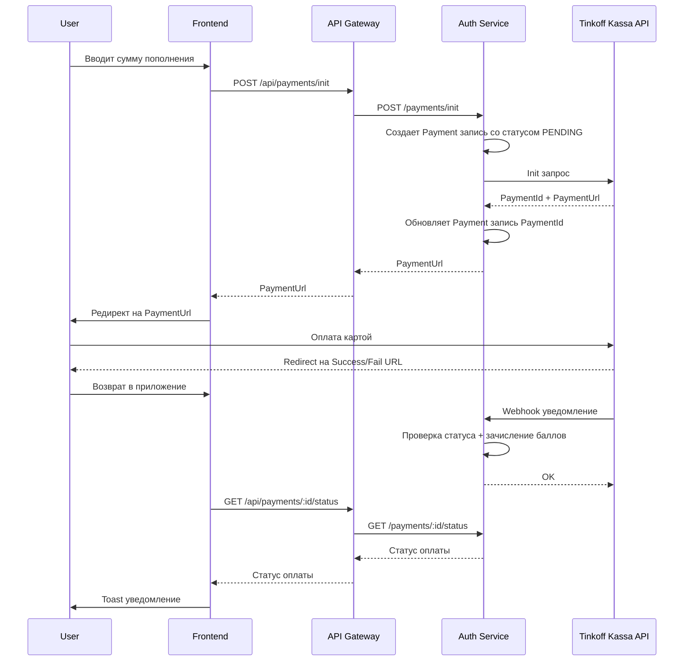

# План интеграции Тинькофф Кассы

## 1. Обзор

### Цель

Реализовать пополнение баланса через Тинькофф Кассу с использованием redirect-схемы.

### Выбранный подход

- **Режим:** Тестовый стенд Тинькофф Кассы
- **Схема оплаты:** Redirect (пользователь перенаправляется на страницу Тинькофф)
- **Сценарий:** Базовый - успех/неудача

---

## 2. Архитектура

### 2.1 Поток оплаты



### 2.2 Компоненты системы

| Компонент         | Ответственность                                         |
| ----------------- | ------------------------------------------------------- |
| **Frontend**      | Инициация оплаты, редирект, отображение результата      |
| **API Gateway**   | Прокси запросов к Auth Service                          |
| **Auth Service**  | Создание платежей, обработка webhook, зачисление баллов |
| **Tinkoff Kassa** | Приём оплаты, уведомления о статусе                     |

---

## 3. Изменения в Backend

### 3.1 Новая сущность Payment

**Файл:** `backend/apps/auth-service/src/payments/entities/payment.entity.ts`

| Поле             | Тип       | Описание                                           |
| ---------------- | --------- | -------------------------------------------------- |
| id               | UUID      | Primary key                                        |
| userId           | UUID FK   | Пользователь                                       |
| amount           | INTEGER   | Сумма в баллах (1 балл = 1 рубль)                  |
| status           | ENUM      | PENDING, AUTHORIZED, CONFIRMED, CANCELED, REJECTED |
| tinkoffPaymentId | VARCHAR   | ID платежа в Тинькофф                              |
| tinkoffStatus    | VARCHAR   | Статус от Тинькофф                                 |
| description      | VARCHAR   | Описание платежа                                   |
| metadata         | JSONB     | Дополнительные данные                              |
| createdAt        | TIMESTAMP | Дата создания                                      |
| updatedAt        | TIMESTAMP | Дата обновления                                    |

### 3.2 Enum статусов платежа

```typescript
enum PaymentStatus {
  PENDING = "PENDING", // Создан, ожидает оплаты
  AUTHORIZED = "AUTHORIZED", // Средства заблокированы
  CONFIRMED = "CONFIRMED", // Успешно оплачен
  CANCELED = "CANCELED", // Отменен
  REJECTED = "REJECTED", // Отклонен
}
```

### 3.3 Новые API endpoints

**В Auth Service:**

| Метод | Endpoint               | Описание                      |
| ----- | ---------------------- | ----------------------------- |
| POST  | `/payments/init`       | Инициация платежа             |
| POST  | `/payments/webhook`    | Webhook от Тинькофф           |
| GET   | `/payments/:id/status` | Статус платежа                |
| GET   | `/payments`            | История платежей пользователя |

**В API Gateway:**

Добавить прокси для `/api/payments/*` → Auth Service

### 3.4 DTOs

**InitPaymentDto:**

```typescript
{
  amount: number; // Сумма в баллах (целое число)
}
```

**InitPaymentResponseDto:**

```typescript
{
  paymentId: string; // UUID нашего платежа
  paymentUrl: string; // URL для редиректа
}
```

**PaymentStatusResponseDto:**

```typescript
{
  id: string;
  amount: number;
  status: PaymentStatus;
  createdAt: string;
}
```

### 3.5 Tinkoff API Client

**Файл:** `backend/apps/auth-service/src/payments/tinkoff-client.service.ts`

Методы:

- `initPayment(amountKopeks, orderId)` - инициация платежа. `orderId` = UUID нашей записи Payment, `amountKopeks` = amount \* 100
- `getPaymentState(paymentId)` - получение статуса
- `verifyToken(payload)` - проверка подписи webhook

**Важно:** Frontend не работает с Тинькофф API напрямую. Все запросы идут через Backend.

### 3.6 Webhook обработка

Тинькофф отправляет POST запрос с данными о платеже:

- Token - подпись запроса
- PaymentId - ID платежа
- Status - статус (AUTHORIZED, CONFIRMED, REJECTED)
- Amount - сумма в копейках

Алгоритм обработки:

1. Проверить подпись Token
2. Найти Payment по tinkoffPaymentId
3. Обновить статус
4. Если CONFIRMED - зачислить баллы на баланс
5. Вернуть OK

---

## 4. Изменения в Frontend

### 4.1 Обновление TopUpBalance компонента

**Файл:** `frontend/src/components/client/profile/TopUpBalance.tsx`

Изменения:

1. Заменить прямой вызов deposit на initPayment
2. После успешной инициации - редирект на paymentUrl
3. Убрать текст "Интеграция с Тинькофф — в разработке"

### 4.2 Новая страница результата оплаты

**Файл:** `frontend/src/pages/PaymentResult.tsx`

Страницы:

- `/payment/success` - успешная оплата
- `/payment/fail` - ошибка оплаты

Функционал:

- Отображение статуса оплаты
- Кнопка возврата в профиль
- Автоматическое обновление баланса

### 4.3 Новые API hooks

**Файл:** `frontend/src/hooks/use-payments.ts`

```typescript
export const useInitPayment = () => { ... }
export const usePaymentStatus = (paymentId: string) => { ... }
export const usePaymentHistory = () => { ... }
```

### 4.4 Обновление роутинга

Добавить маршруты:

- `/payment/success?paymentId=...`
- `/payment/fail?paymentId=...`

---

## 5. Конфигурация

### 5.1 Переменные окружения Backend

**Development (.env.development):**

```env
# Tinkoff Kassa - тестовый режим
TINKOFF_TERMINAL_KEY=тестовый_ключ
TINKOFF_SECRET_KEY=тестовый_секрет
TINKOFF_API_URL=https://securepay.tinkoff.ru/v2
# Для разработки webhook не используется - polling при возврате пользователя
TINKOFF_WEBHOOK_URL=
```

**Production (.env.production):**

```env
# Tinkoff Kassa
TINKOFF_TERMINAL_KEY=прод_ключ
TINKOFF_SECRET_KEY=прод_секрет
TINKOFF_API_URL=https://securepay.tinkoff.ru/v2
TINKOFF_WEBHOOK_URL=https://fitness.ddns.net/api/payments/webhook
```

### 5.2 Тестирование webhook

**Проблема:** Тинькофф не может отправить webhook на `localhost:3000`.

**Решения:**

1. **Для разработки:** Использовать polling статуса при возврате пользователя (без webhook)
2. **Для полноценного теста:** Использовать [ngrok](https://ngrok.com/) для проброса порта:

   ```bash
   ngrok http 3000
   ```

   Затем указать полученный URL в `TINKOFF_WEBHOOK_URL`

3. **Production:** Webhook работает напрямую на `https://fitness.ddns.net`

### 5.3 Как получить тестовые ключи

1. Зарегистрироваться в [Личном кабинете Тинькофф Кассы](https://www.tinkoff.ru/kassa/)
2. В настройках терминала найти:
   - **Terminal Key** - идентификатор терминала
   - **Secret Key** - секретный ключ для подписи запросов
3. Для тестового режима использовать демо-терминал (если доступен)

### 5.3 Тестовые карты Тинькофф

Для оплаты в тестовом режиме использовать следующие номера карт:

| Номер карты         | Результат       | CVV   | Срок          |
| ------------------- | --------------- | ----- | ------------- |
| 4300 0000 0000 0777 | Успешная оплата | Любой | Любой будущий |
| 5000 0000 0000 0009 | Успешная оплата | Любой | Любой будущий |
| 4000 0000 0000 0002 | Отказ банка     | Любой | Любой будущий |
| 4000 0000 0000 0069 | Ошибка карты    | Любой | Любой будущий |

**Важно:** Для тестирования 3-D Secure использовать карту `4300 0000 0000 0777`

Подробнее: [Тестовые карты Тинькофф](https://www.tinkoff.ru/kassa/develop/pay/test/#test-cards)

---

## 6. План реализации

### Этап 1: Backend - инфраструктура

- [ ] Создать Payment entity
- [ ] Создать PaymentRepository
- [ ] Добавить миграцию для таблицы payments
- [ ] Создать TinkoffClientService

### Этап 2: Backend - API

- [ ] Создать PaymentsModule
- [ ] Реализовать PaymentsController
- [ ] Реализовать PaymentsService
- [ ] Добавить DTOs (в /backend/libs/contracts) и валидацию
- [ ] Настроить прокси в API Gateway

### Этап 3: Backend - Webhook

- [ ] Реализовать endpoint для webhook
- [ ] Добавить проверку подписи Token
- [ ] Реализовать логику зачисления баллов
- [ ] Добавить логирование

### Этап 4: Frontend

- [ ] Обновить типы (Разработчик делает сам. Подождать пока он выполнит необходимые команды.)
- [ ] Создать usePayments hook
- [ ] Обновить TopUpBalance компонент
- [ ] Создать страницы PaymentSuccess и PaymentFail
- [ ] Добавить маршруты

### Этап 5: Тестирование

- [ ] Ручное тестирование с тестовыми картами

---

## 7. Риски и ограничения

### 7.1 Риски

| Риск                 | Митигация                                                  |
| -------------------- | ---------------------------------------------------------- |
| Webhook не дошёл     | Polling статуса при возврате пользователя                  |
| Дублирование webhook | Идемпотентность по tinkoffPaymentId                        |
| Неверная сумма       | Конвертация баллов в копейки при вызове API: amount \* 100 |

### 7.2 Ограничения текущей реализации

- Нет частичных возвратов
- Нет повторных попыток при неудаче
- Нет сохранения данных карты

---

## 8. Документация Тинькофф Кассы

- [Документация API](https://www.tinkoff.ru/kassa/develop/api/)
- [Тестовый стенд](https://www.tinkoff.ru/kassa/develop/pay/test/)
- [Тестовые карты](https://www.tinkoff.ru/kassa/develop/pay/test/#test-cards)
