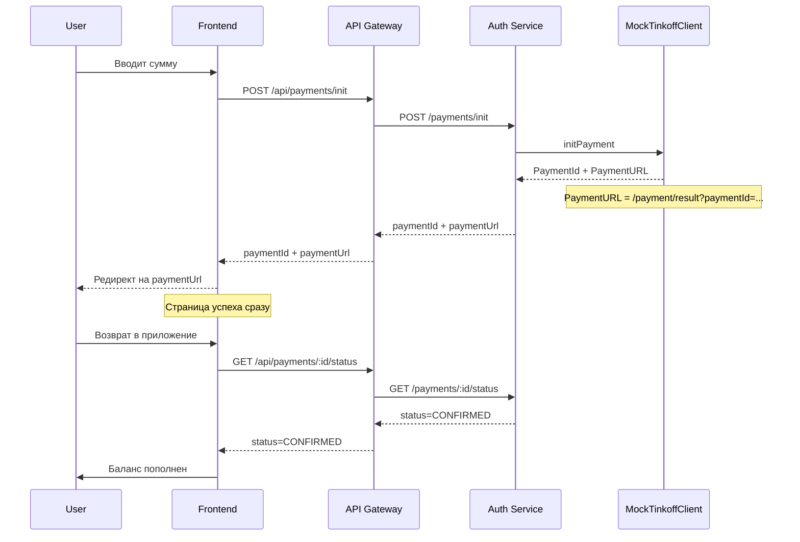

# План: Mock-режим для Тинькофф Кассы

## Проблема

Нет возможности зарегистрироваться в Тинькофф Касса без ИП/ООО. Нужен способ отладить код без реальных учетных данных.

## Решение

Backend mock-режим: API возвращает успех сразу, без страницы оплаты.

---

## Архитектура

### Текущая структура

```
PaymentsModule
├── TinkoffClientService (реальный API)
├── PaymentsService
└── PaymentsController
```

### Новая структура

```
PaymentsModule
├── ITinkoffClient (интерфейс)
├── TinkoffClientService (реальный API)
├── MockTinkoffClientService (mock реализация)
├── PaymentsService
└── PaymentsController
```

### Поток в mock-режиме



---

## Изменения

### 1. Интерфейс ITinkoffClient

**Файл:** `backend/apps/auth-service/src/payments/interfaces/tinkoff-client.interface.ts`

```typescript
export interface ITinkoffClient {
  initPayment(
    amountKopeks: number,
    orderId: string,
    description?: string,
    receipt?: TinkoffReceipt,
  ): Promise<TinkoffInitResponse>;

  getPaymentState(paymentId: string): Promise<TinkoffGetStateResponse>;

  verifyToken(payload: Record<string, unknown>): boolean;
}
```

### 2. MockTinkoffClientService

**Файл:** `backend/apps/auth-service/src/payments/mock-tinkoff-client.service.ts`

| Метод             | Поведение                                   |
| ----------------- | ------------------------------------------- |
| `initPayment`     | Возвращает успех, генерирует mock PaymentId |
| `getPaymentState` | Возвращает статус CONFIRMED                 |
| `verifyToken`     | Всегда возвращает true                      |

**Логика initPayment:**

1. Генерирует mock PaymentId = `mock_${orderId}`
2. Возвращает PaymentURL = `/payment/result?paymentId=${mockPaymentId}`
3. Сразу обновляет статус платежа на CONFIRMED через PaymentsService
4. Зачисляет баллы на баланс

### 3. Обновление PaymentsModule

**Файл:** `backend/apps/auth-service/src/payments/payments.module.ts`

Использовать `useFactory` для выбора реализации:

```typescript
{
  provide: 'TINKOFF_CLIENT',
  useFactory: (configService: ConfigService) => {
    const isMock = configService.get('TINKOFF_MOCK') === 'true';
    return isMock
      ? new MockTinkoffClientService()
      : new TinkoffClientService(httpService, configService);
  },
  inject: [ConfigService, HttpService],
}
```

### 4. Переменные окружения

**Файл:** `backend/.env.development`

Добавить:

```env
# Tinkoff Mock Mode - для разработки без регистрации
TINKOFF_MOCK=true
```

---

## Файлы для изменения

| Файл                                              | Действие                            |
| ------------------------------------------------- | ----------------------------------- |
| `payments/interfaces/tinkoff-client.interface.ts` | Создать                             |
| `payments/mock-tinkoff-client.service.ts`         | Создать                             |
| `payments/payments.module.ts`                     | Изменить                            |
| `payments/payments.service.ts`                    | Изменить (инъекция через интерфейс) |
| `.env.development`                                | Добавить TINKOFF_MOCK=true          |

---

## Тестирование

1. Установить `TINKOFF_MOCK=true` в `.env.development`
2. Перезапустить backend
3. Вызвать `POST /api/payments/init` с суммой
4. Проверить:
   - Payment создан со статусом CONFIRMED
   - Баланс пополнен
   - PaymentURL указывает на `/payment/result`

---

## Важно

- Mock-режим только для development
- В production `TINKOFF_MOCK=false` или отсутствует
- Логирование помечает mock-операции: `[MOCK] Payment initialized...`
