# План реализации: Admin Pages (7.6)

Этот документ описывает детальный план реализации административных страниц для DreamFitness.

## Контекст

- **Frontend ADR:** [`/doc/Frontend-ADR.md`](../../../doc/Frontend-ADR.md)
- **UI Requirements:** [`/doc/UI.md`](../../../doc/UI.md)
- **API Documentation:** [`/doc/API.md`](../../../doc/API.md)
- **Top-level Plan:** [`/doc/plans/impl-plan-top-level.md`](../../../doc/plans/impl-plan-top-level.md)
- **Client Pages Plan:** [`/frontend/doc/plans/impl-plan-client-pages.md`](./impl-plan-client-pages.md)

---

## Текущее состояние

### Уже реализовано

| Компонент             | Файл                                                                           | Статус      |
| --------------------- | ------------------------------------------------------------------------------ | ----------- |
| AdminLayout           | [`AdminLayout.tsx`](../../src/components/layout/AdminLayout.tsx)               | ✅ Готов    |
| Sidebar               | [`Sidebar.tsx`](../../src/components/layout/Sidebar.tsx)                       | ✅ Готов    |
| Header                | [`Header.tsx`](../../src/components/layout/Header.tsx)                         | ✅ Готов    |
| Routes                | [`routes.ts`](../../src/lib/routes.ts)                                         | ✅ Готов    |
| Types                 | [`api.generated.ts`](../../src/types/api.generated.ts)                         | ✅ Готов    |
| Constants             | [`constants.ts`](../../src/types/constants.ts)                                 | ✅ Готов    |
| API Client            | [`api-client.ts`](../../src/lib/api-client.ts)                                 | ✅ Готов    |
| UI Components         | [`/components/ui/`](../../src/components/ui/)                                  | ✅ Готов    |
| AdminDashboardPage    | [`AdminDashboardPage.tsx`](../../src/pages/admin/AdminDashboardPage.tsx)       | ⚠️ Заглушка |
| AdminSchedulePage     | [`AdminSchedulePage.tsx`](../../src/pages/admin/AdminSchedulePage.tsx)         | ⚠️ Заглушка |
| AdminScheduleEditPage | [`AdminScheduleEditPage.tsx`](../../src/pages/admin/AdminScheduleEditPage.tsx) | ⚠️ Заглушка |
| AdminUsersPage        | [`AdminUsersPage.tsx`](../../src/pages/admin/AdminUsersPage.tsx)               | ⚠️ Заглушка |
| AdminReportsPage      | [`AdminReportsPage.tsx`](../../src/pages/admin/AdminReportsPage.tsx)           | ⚠️ Заглушка |

### Требуется реализовать

| Страница             | Приоритет | Сложность |
| -------------------- | --------- | --------- |
| Admin Dashboard      | Высокий   | Средняя   |
| Trainers Management  | Высокий   | Средняя   |
| Trainings Management | Высокий   | Высокая   |
| Users Management     | Средний   | Средняя   |
| User Detail Page     | Средний   | Низкая    |
| Reports              | Низкий    | Высокая   |

---

## Архитектура

### Структура файлов

```
frontend/src/
├── pages/admin/
│   ├── AdminDashboardPage.tsx      # Главная страница админа
│   ├── AdminSchedulePage.tsx       # Список тренировок
│   ├── AdminScheduleEditPage.tsx   # Создание/редактирование тренировки
│   ├── AdminUsersPage.tsx          # Управление пользователями
│   ├── AdminUserDetailPage.tsx     # Детальная страница пользователя
│   └── AdminReportsPage.tsx        # Отчёты и статистика
│
├── components/admin/               # Компоненты административной части
│   ├── dashboard/
│   │   ├── StatsWidget.tsx         # Виджет статистики
│   │   ├── RecentActivity.tsx      # Последние действия
│   │   └── QuickStats.tsx          # Быстрая статистика
│   ├── trainers/
│   │   ├── TrainersTable.tsx       # Таблица тренеров
│   │   ├── TrainerForm.tsx         # Форма создания/редактирования тренера
│   │   └── TrainerDeleteDialog.tsx # Диалог удаления тренера
│   ├── trainings/
│   │   ├── TrainingsTable.tsx      # Таблица тренировок
│   │   ├── TrainingForm.tsx        # Форма создания/редактирования тренировки
│   │   ├── TrainingFilters.tsx     # Фильтры для таблицы
│   │   ├── ParticipantsDrawer.tsx  # Drawer со списком записавшихся
│   │   └── TrainingDeleteDialog.tsx# Диалог удаления тренировки
│   ├── users/
│   │   ├── UsersTable.tsx          # Таблица пользователей
│   │   ├── UserFilters.tsx         # Фильтры для таблицы
│   │   ├── UserInfoCard.tsx        # Карточка информации о пользователе
│   │   ├── UserTransactionsList.tsx# Список транзакций пользователя
│   │   ├── UserBookingsList.tsx    # Список бронирований пользователя
│   │   └── BlockUserDialog.tsx     # Диалог блокировки пользователя
│   └── reports/
│       ├── LoadingChart.tsx        # График загрузки
│       ├── PopularTrainingsChart.tsx # Топ популярных тренировок
│       └── FinancialReport.tsx     # Финансовый отчёт
│
├── hooks/
│   ├── use-trainings.ts            # ✅ Уже есть (требуется расширение)
│   ├── use-trainers.ts             # Требуется создать
│   ├── use-users.ts                # Требуется создать
│   └── use-reports.ts              # Требуется создать
│
└── schemas/
    ├── trainer.schema.ts           # Требуется создать
    └── training.schema.ts          # Требуется создать
```

---

## Диаграмма зависимостей компонентов

```mermaid
graph TD
    subgraph Pages
        ADP[AdminDashboardPage]
        ASP[AdminSchedulePage]
        ASE[AdminScheduleEditPage]
        AUP[AdminUsersPage]
        AUD[AdminUserDetailPage]
        ARP[AdminReportsPage]
    end

    subgraph Dashboard Components
        SW[StatsWidget]
        RA[RecentActivity]
        QS[QuickStats]
    end

    subgraph Trainers Components
        TT[TrainersTable]
        TF[TrainerForm]
        TDD[TrainerDeleteDialog]
    end

    subgraph Trainings Components
        TRT[TrainingsTable]
        TRF[TrainingForm]
        TFilters[TrainingFilters]
        PD[ParticipantsDrawer]
        TRDelete[TrainingDeleteDialog]
    end

    subgraph Users Components
        UT[UsersTable]
        UF[UserFilters]
        UIC[UserInfoCard]
        UTL[UserTransactionsList]
        UBL[UserBookingsList]
        BUD[BlockUserDialog]
    end

    subgraph Reports Components
        LC[LoadingChart]
        PTC[PopularTrainingsChart]
        FR[FinancialReport]
    end

    subgraph Hooks
        useTrain[use-trainings]
        useTrainer[use-trainers]
        useUser[use-users]
        useReport[use-reports]
    end

    ADP --> SW
    ADP --> RA
    ADP --> QS

    ASP --> TRT
    ASP --> TFilters
    ASP --> PD
    ASP --> TRDelete

    ASE --> TRF
    ASE --> TF

    AUP --> UT
    AUP --> UF
    AUP --> BUD

    AUD --> UIC
    AUD --> UTL
    AUD --> UBL
    AUD --> BUD

    ARP --> LC
    ARP --> PTC
    ARP --> FR

    SW --> useTrain
    SW --> useUser

    RA --> useTrain
    RA --> useUser

    TRT --> useTrain
    TRF --> useTrain
    TRF --> useTrainer
    TFilters --> useTrainer

    TT --> useTrainer
    TF --> useTrainer

    UT --> useUser
    UF --> useUser
    UIC --> useUser
    UTL --> useUser
    UBL --> useUser

    LC --> useReport
    PTC --> useReport
    FR --> useReport
```



---

## Детальный план реализации

### 7.6.1. Хуки для работы с API

#### use-trainers.ts

**Назначение:** Хуки для работы с тренерами.

**API Endpoints:**

- `GET /api/trainers` — список тренеров
- `GET /api/trainers/:id` — детали тренера
- `POST /api/trainers` — создать тренера
- `PATCH /api/trainers/:id` — обновить тренера
- `DELETE /api/trainers/:id` — деактивировать тренера

**Хуки:**

```typescript
// useTrainers — список тренеров
export const useTrainers = (activeOnly?: boolean) => {
  // queryKey: ['trainers', activeOnly]
  // queryFn: GET /api/trainers?activeOnly=...
};

// useTrainer — детали тренера
export const useTrainer = (id: string) => {
  // queryKey: ['trainers', id]
  // queryFn: GET /api/trainers/:id
};

// useCreateTrainer — создание тренера
export const useCreateTrainer = () => {
  // mutationFn: POST /api/trainers { name, bio?, avatarUrl? }
  // onSuccess: invalidate ['trainers']
};

// useUpdateTrainer — обновление тренера
export const useUpdateTrainer = () => {
  // mutationFn: PATCH /api/trainers/:id { name?, bio?, avatarUrl?, isActive? }
  // onSuccess: invalidate ['trainers'], ['trainers', id]
};

// useDeleteTrainer — деактивация тренера
export const useDeleteTrainer = () => {
  // mutationFn: DELETE /api/trainers/:id
  // onSuccess: invalidate ['trainers']
};
```

---

#### use-trainings.ts (расширение)

**Дополнительные хуки для админки:**

```typescript
// useCreateTraining — создание тренировки
export const useCreateTraining = () => {
  // mutationFn: POST /api/trainings { title, type, trainerId, scheduledAt, durationMinutes, capacity, price }
  // onSuccess: invalidate ['trainings'], ['schedule']
};

// useUpdateTraining — обновление тренировки
export const useUpdateTraining = () => {
  // mutationFn: PATCH /api/trainings/:id { ...fields, status? }
  // onSuccess: invalidate ['trainings'], ['trainings', id], ['schedule']
};

// useDeleteTraining — отмена тренировки
export const useDeleteTraining = () => {
  // mutationFn: DELETE /api/trainings/:id
  // onSuccess: invalidate ['trainings'], ['schedule']
};

// useTrainingParticipants — список записавшихся
export const useTrainingParticipants = (trainingId: string) => {
  // queryKey: ['trainings', trainingId, 'participants']
  // queryFn: GET /api/bookings/training/:trainingId/count
};
```

---

#### use-users.ts

**Назначение:** Хуки для управления пользователями.

**API Endpoints:**

- `GET /api/auth/users` — список пользователей
- `GET /api/auth/users/:id` — детали пользователя
- `PATCH /api/auth/users/:id/status` — блокировка/разблокировка

**Хуки:**

```typescript
export interface UserFilters {
  search?: string;
  role?: 'client' | 'admin';
  status?: 'active' | 'blocked';
  page?: number;
  limit?: number;
}

// useUsers — список пользователей
export const useUsers = (filters?: UserFilters) => {
  // queryKey: ['users', filters]
  // queryFn: GET /api/auth/users?...
};

// useUser — детали пользователя
export const useUser = (id: string) => {
  // queryKey: ['users', id]
  // queryFn: GET /api/auth/users/:id
};

// useBlockUser — блокировка пользователя
export const useBlockUser = () => {
  // mutationFn: PATCH /api/auth/users/:id/status { status: 'blocked' }
  // onSuccess: invalidate ['users'], ['users', id]
};

// useUnblockUser — разблокировка пользователя
export const useUnblockUser = () => {
  // mutationFn: PATCH /api/auth/users/:id/status { status: 'active' }
  // onSuccess: invalidate ['users'], ['users', id]
};
```

---

#### use-reports.ts

**Назначение:** Хуки для отчётов и статистики.

**Примечание:** Backend API для отчётов ещё не реализован. Сейчас можно использовать заглушки или агрегировать данные из существующих endpoints.

**Хуки:**

```typescript
// useLoadingStats — статистика загрузки
export const useLoadingStats = (dateFrom?: Date, dateTo?: Date) => {
  // queryKey: ['reports', 'loading', dateFrom, dateTo]
  // queryFn: GET /api/reports/loading?from=...&to=...
  // Пока backend не готов — моковые данные
};

// usePopularTrainings — топ популярных тренировок
export const usePopularTrainings = (limit?: number) => {
  // queryKey: ['reports', 'popular-trainings', limit]
  // queryFn: GET /api/reports/popular?limit=...
  // Пока backend не готов — моковые данные
};

// useFinancialReport — финансовый отчёт
export const useFinancialReport = (dateFrom: Date, dateTo: Date) => {
  // queryKey: ['reports', 'financial', dateFrom, dateTo]
  // queryFn: GET /api/reports/financial?from=...&to=...
  // Пока backend не готов — моковые данные
};
```

---

### 7.6.2. Admin Dashboard Page

**Файл:** [`AdminDashboardPage.tsx`](../../src/pages/admin/AdminDashboardPage.tsx)

**Требования из UI.md:**

- Общая статистика загрузки за неделю
- Количество активных клиентов
- Последние действия

**Компоненты:**

#### StatsWidget

**Файл:** `components/admin/dashboard/StatsWidget.tsx`

**Пропсы:**

```typescript
interface StatsWidgetProps {
  title: string;
  value: number | string;
  description?: string;
  icon?: React.ReactNode;
  trend?: {
    value: number;
    isPositive: boolean;
  };
  isLoading?: boolean;
}
```

**Функционал:**

- Отображение одной метрики
- Skeleton при загрузке
- Опциональный тренд (стрелка вверх/вниз)

**UI:**

```
┌─────────────────────────────────┐
│ 📊 Активные клиенты             │
│ ─────────────────────────────── │
│       156                       │
│       ↑ 12% за неделю           │
└─────────────────────────────────┘
```

---

#### QuickStats

**Файл:** `components/admin/dashboard/QuickStats.tsx`

**Пропсы:**

```typescript
// Нет пропсов, использует хуки
```

**Функционал:**

- Сетка из 4 StatsWidget
- Метрики: активные клиенты, тренировок на неделе, средняя заполняемость

**UI:**

```
┌─────────────────────────────────────────────────────────────────┐
│ ┌──────────────────┐ ┌──────────────────┐  ┌──────────────────┐ │
│ │ Активные клиенты │ │ Тренировок       │  │ Средняя заполн.  │ │
│ │      156         │ │      42          │  │      65%         │ │
│ │   ↑ 12%          │ │   ↑ 5            │  │   ↑ 8%           │ │
│ └──────────────────┘ └──────────────────┘  └──────────────────┘ │
└─────────────────────────────────────────────────────────────────┘
```

---

#### RecentActivity

**Файл:** `components/admin/dashboard/RecentActivity.tsx`

**Пропсы:**

```typescript
interface RecentActivityProps {
  limit?: number;
}
```

**Функционал:**

- Список последних действий (бронирования, отмены, регистрации)
- Время относительно сейчас (5 минут назад, 2 часа назад)
- Иконка по типу действия
- Empty state

**UI:**

```
┌─────────────────────────────────────────────────────────────────────────────┐
│ Последние действия                                            [Все →]       │
├─────────────────────────────────────────────────────────────────────────────┤
│ ✓ Иван П. записался на Yoga                    5 минут назад                 │
│ ✗ Мария С. отменила CrossFit                   15 минут назад                │
│ + Новый пользователь: Алексей                   1 час назад                   │
│ ✓ Дмитрий К. записался на Boxing               2 часа назад                  │
└─────────────────────────────────────────────────────────────────────────────┘
```

---

### 7.6.3. Trainers Management

**Примечание:** Управление тренерами реализуется через модальное окно или drawer, а не отдельные страницы.

#### TrainersTable

**Файл:** `components/admin/trainers/TrainersTable.tsx`

**Пропсы:**

```typescript
interface TrainersTableProps {
  trainers: TrainerResponseDto[];
  isLoading?: boolean;
  onEdit: (trainer: TrainerResponseDto) => void;
  onDelete: (trainer: TrainerResponseDto) => void;
}
```

**Функционал:**

- Таблица с тренерами
- Колонки: Имя, Биография, Статус, Создан, Действия
- Кнопки редактирования и удаления
- Empty state

**UI:**

```
┌─────────────────────────────────────────────────────────────────────────────┐
│ Тренеры                                                    [+ Добавить]     │
├─────────────────────────────────────────────────────────────────────────────┤
│ Имя              │ Биография           │ Статус   │ Действия               │
├──────────────────┼─────────────────────┼──────────┼────────────────────────┤
│ Анна Иванова     │ Опыт 5 лет...       │ Активен  │ [✏️] [🗑️]             │
│ Михаил Петров    │ Сертифицирован...   │ Активен  │ [✏️] [🗑️]             │
│ Елена Сидорова   │ Специалист по...    │ Неактивен│ [✏️] [🗑️]             │
└─────────────────────────────────────────────────────────────────────────────┘
```

---

#### TrainerForm

**Файл:** `components/admin/trainers/TrainerForm.tsx`

**Пропсы:**

```typescript
interface TrainerFormProps {
  trainer?: TrainerResponseDto; // undefined = создание
  onSuccess?: () => void;
  onCancel?: () => void;
}
```

**Функционал:**

- Форма создания/редактирования тренера
- Валидация через Zod
- Отправка POST/PATCH запроса

**Поля формы:**

- Имя (обязательно)
- Биография (опционально)
- URL аватара (опционально)
- Статус (активен/неактивен) — только при редактировании

---

#### TrainerDeleteDialog

**Файл:** `components/admin/trainers/TrainerDeleteDialog.tsx`

**Пропсы:**

```typescript
interface TrainerDeleteDialogProps {
  open: boolean;
  onOpenChange: (open: boolean) => void;
  trainer: TrainerResponseDto | null;
  onConfirm: () => void;
  isLoading?: boolean;
}
```

**Функционал:**

- Диалог подтверждения удаления
- Предупреждение о последствиях
- Кнопки "Отмена" и "Деактивировать"

---

### 7.6.4. Trainings Management

#### TrainingsTable

**Файл:** `components/admin/trainings/TrainingsTable.tsx`

**Пропсы:**

```typescript
interface TrainingsTableProps {
  trainings: TrainingResponseDto[];
  isLoading?: boolean;
  onEdit: (training: TrainingResponseDto) => void;
  onDelete: (training: TrainingResponseDto) => void;
  onViewParticipants: (training: TrainingResponseDto) => void;
}
```

**Функционал:**

- Таблица с тренировками
- Колонки: Название, Тип, Тренер, Дата/Время, Места, Лист ожидания, Статус, Действия
- **Места:** Формат "X/Y" где X - записавшихся, Y - вместимость
- **Лист ожидания:** Если тренировка заполнена и есть лист ожидания, то количество ожидающих показывается в столбце "Лист ожидания"
- Цветовая индикация статуса
- Кнопки: редактировать, удалить, посмотреть участников

**UI:**

```
┌─────────────────────────────────────────────────────────────────────────────────────────┐
│ Тренировки                                    [+ Создать тренировку]                    │
├─────────────────────────────────────────────────────────────────────────────────────────┤
│ Название    │ Тип     │ Тренер        │ Дата       │ Места │ Лист │ Статус │ Действия │
├─────────────┼─────────┼───────────────┼────────────┼───────┼──────┼────────┼──────────┤
│ Morning Yoga│ yoga    │ Анна Иванова  │ 15 янв 10:00│ 5/20 │  —   │ 🟢     │ [👥][✏️][🗑️] │
│ CrossFit    │ crossfit│ Михаил Петров │ 15 янв 18:00│ 20/20│  3   │ 🟡     │ [👥][✏️][🗑️] │
│ Boxing      │ boxing  │ Сергей        │ 16 янв 19:00│ 0/15 │  —   │ 🔴     │ [👥][✏️][🗑️] │
└─────────────────────────────────────────────────────────────────────────────────────────┘
```

---

#### TrainingFilters

**Файл:** `components/admin/trainings/TrainingFilters.tsx`

**Пропсы:**

```typescript
interface TrainingFiltersProps {
  filters: TrainingFilters;
  onFiltersChange: (filters: TrainingFilters) => void;
  trainers: TrainerResponseDto[];
}
```

**Функционал:**

- Фильтр по типу тренировки (dropdown)
- Фильтр по тренеру (dropdown)
- Фильтр по статусу (dropdown)
- Фильтр по дате (date picker)
- Кнопка "Сбросить"

---

#### TrainingForm

**Файл:** `components/admin/trainings/TrainingForm.tsx`

**Пропсы:**

```typescript
interface TrainingFormProps {
  training?: TrainingResponseDto; // undefined = создание
  trainers: TrainerResponseDto[];
  onSuccess?: () => void;
  onCancel?: () => void;
}
```

**Функционал:**

- Форма создания/редактирования тренировки
- Валидация через Zod
- Автоматический расчёт длительности

**Поля формы:**

- Название (обязательно)
- Тип тренировки (dropdown, обязательно)
- Тренер (dropdown, обязательно)
- Дата и время начала (datetime picker, обязательно)
- Длительность в минутах (number, обязательно, default: 60)
- Лимит мест (number, обязательно, min: 1)
- Стоимость в баллах (number, обязательно, min: 0)
- Описание (textarea, опционально)
- Статус (dropdown) — только при редактировании

---

#### ParticipantsDrawer

**Файл:** `components/admin/trainings/ParticipantsDrawer.tsx`

**Пропсы:**

```typescript
interface ParticipantsDrawerProps {
  open: boolean;
  onOpenChange: (open: boolean) => void;
  training: TrainingResponseDto | null;
  participants: BookingResponseDto[];
  isLoading?: boolean;
}
```

**Функционал:**

- Drawer со списком записавшихся пользователей
- Информация о тренировке в заголовке
- Список участников с именами и временем записи
- Empty state если нет записавшихся

**UI:**

```
┌─────────────────────────────────────────────────────────────────────────────┐
│ Участники: Morning Yoga                                       [✕]           │
│ 15 января, 10:00 • 5 из 20 мест                                              │
├─────────────────────────────────────────────────────────────────────────────┤
│ 1. Иван Петров                                               14 янв, 09:32  │
│ 2. Мария Сидорова                                            14 янв, 10:15  │
│ 3. Алексей Козлов                                            14 янв, 14:22  │
│ 4. Елена Новикова                                             15 янв, 08:01  │
│ 5. Дмитрий Морозов                                           15 янв, 09:45  │
└─────────────────────────────────────────────────────────────────────────────┘
```

---

#### TrainingDeleteDialog

**Файл:** `components/admin/trainings/TrainingDeleteDialog.tsx`

**Пропсы:**

```typescript
interface TrainingDeleteDialogProps {
  open: boolean;
  onOpenChange: (open: boolean) => void;
  training: TrainingResponseDto | null;
  onConfirm: () => void;
  isLoading?: boolean;
}
```

**Функционал:**

- Диалог подтверждения отмены тренировки
- Предупреждение о возврате баллов записавшимся
- Кнопки "Отмена" и "Отменить тренировку"

---

### 7.6.5. Users Management

#### UsersTable

**Файл:** `components/admin/users/UsersTable.tsx`

**Пропсы:**

```typescript
interface UsersTableProps {
  users: UserResponseDto[];
  isLoading?: boolean;
  onView: (user: UserResponseDto) => void;
  onBlock: (user: UserResponseDto) => void;
  onUnblock: (user: UserResponseDto) => void;
}
```

**Функционал:**

- Таблица с пользователями
- Колонки: Имя, Email, Телефон, Баланс, Статус, Дата регистрации, Действия
- Цветовая индикация статуса
- Пагинация

**UI:**

```
┌─────────────────────────────────────────────────────────────────────────────┐
│ Пользователи                                                                │
├─────────────────────────────────────────────────────────────────────────────┤
│ Имя           │ Email            │ Телефон      │ Баланс │ Статус │ Действия │
├───────────────┼──────────────────┼───────────────┼────────┼────────┼──────────┤
│ Иван Петров   │ ivan@mail.com    │ +79991234567 │ 1,500  │ 🟢     │ [👁️][🔒] │
│ Мария Сидорова│ maria@mail.com   │ +79997654321 │ 200    │ 🟢     │ [👁️][🔒] │
│ Алексей Козлов│ alex@mail.com    │ +79991112233 │ 0      │ 🔴     │ [👁️][🔓] │
└─────────────────────────────────────────────────────────────────────────────┘
```

---

#### UserFilters

**Файл:** `components/admin/users/UserFilters.tsx`

**Пропсы:**

```typescript
interface UserFiltersProps {
  filters: UserFilters;
  onFiltersChange: (filters: UserFilters) => void;
}
```

**Функционал:**

- Поиск по имени/email (text input)
- Фильтр по статусу (dropdown)
- Фильтр по роли (dropdown)
- Кнопка "Сбросить"

---

### 7.6.6. User Detail Page

**Файл:** [`AdminUserDetailPage.tsx`](../../src/pages/admin/AdminUserDetailPage.tsx)

**Маршрут:** `/admin/users/:userId`

**Требования:**

- Отдельная страница с детальной информацией о пользователе
- Возможность поделиться ссылкой на страницу с другим администратором
- История транзакций и бронирований

**Компоненты:**

#### UserInfoCard

**Файл:** `components/admin/users/UserInfoCard.tsx`

**Пропсы:**

```typescript
interface UserInfoCardProps {
  user: UserResponseDto;
  isLoading?: boolean;
  onBlock?: () => void;
  onUnblock?: () => void;
}
```

**Функционал:**

- Карточка с основной информацией о пользователе
- Кнопки блокировки/разблокировки
- Skeleton при загрузке

**UI:**

```
┌─────────────────────────────────────────────────────────────────────────────┐
│ Иван Петров                                                   [🔒 Заблокировать] │
│ ─────────────────────────────────────────────────────────────────────────── │
│ Email: ivan@mail.com                                                        │
│ Телефон: +7 999 123 45 67                                                   │
│ Дата рождения: 15.05.1990                                                   │
│ Пол: Мужской                                                                │
│ Баланс: 1,500 баллов                                                        │
│ Статус: Активен                                                             │
│ Дата регистрации: 01.01.2024                                                │
└─────────────────────────────────────────────────────────────────────────────┘
```

---

#### UserTransactionsList

**Файл:** `components/admin/users/UserTransactionsList.tsx`

**Пропсы:**

```typescript
interface UserTransactionsListProps {
  userId: string;
  limit?: number;
}
```

**Функционал:**

- Список последних транзакций пользователя
- Пагинация или кнопка "Показать ещё"
- Skeleton при загрузке
- Empty state

**UI:**

```
┌─────────────────────────────────────────────────────────────────────────────┐
│ Последние транзакции                                                        │
│ ─────────────────────────────────────────────────────────────────────────── │
│ • Депозит +500 баллов                                    10 янв             │
│ • Списание -300 баллов (Yoga)                            08 янв             │
│ • Депозит +1000 баллов                                   01 янв             │
│                                                                             │
│ [Показать ещё →]                                                            │
└─────────────────────────────────────────────────────────────────────────────┘
```

---

#### UserBookingsList

**Файл:** `components/admin/users/UserBookingsList.tsx`

**Пропсы:**

```typescript
interface UserBookingsListProps {
  userId: string;
  limit?: number;
}
```

**Функционал:**

- Список последних бронирований пользователя
- Статус бронирования (записан, посещено, отменено)
- Пагинация или кнопка "Показать ещё"
- Skeleton при загрузке
- Empty state

**UI:**

```
┌─────────────────────────────────────────────────────────────────────────────┐
│ Последние тренировки                                                        │
│ ─────────────────────────────────────────────────────────────────────────── │
│ • Yoga, 15 янв 10:00 (записан)                                              │
│ • CrossFit, 10 янв 18:00 (посещено)                                         │
│ • Boxing, 05 янв 19:00 (отменено)                                           │
│                                                                             │
│ [Показать ещё →]                                                            │
└─────────────────────────────────────────────────────────────────────────────┘
```

---

#### AdminUserDetailPage Layout

**UI:**

```
┌─────────────────────────────────────────────────────────────────────────────┐
│ [← Назад к списку]                                                          │
│                                                                             │
│ ┌─────────────────────────────────────────────────────────────────────────┐ │
│ │ UserInfoCard                                                            │ │
│ └─────────────────────────────────────────────────────────────────────────┘ │
│                                                                             │
│ ┌───────────────────────────────┐ ┌───────────────────────────────────────┐ │
│ │ UserTransactionsList          │ │ UserBookingsList                      │ │
│ │                               │ │                                       │ │
│ │                               │ │                                       │ │
│ └───────────────────────────────┘ └───────────────────────────────────────┘ │
└─────────────────────────────────────────────────────────────────────────────┘
```

---

### 7.6.7. BlockUserDialog

**Файл:** `components/admin/users/BlockUserDialog.tsx`

**Пропсы:**

```typescript
interface BlockUserDialogProps {
  open: boolean;
  onOpenChange: (open: boolean) => void;
  user: UserResponseDto | null;
  onConfirm: () => void;
  isLoading?: boolean;
}
```

**Функционал:**

- Диалог подтверждения блокировки
- Предупреждение о последствиях
- Кнопки "Отмена" и "Заблокировать"

---

### 7.6.8. Reports Page

**Примечание:** Страница отчётов требует backend API, который ещё не реализован. Сейчас можно реализовать UI с моковыми данными.

#### LoadingChart

**Файл:** `components/admin/reports/LoadingChart.tsx`

**Пропсы:**

```typescript
interface LoadingChartProps {
  data: {
    date: string;
    loading: number;
  }[];
  isLoading?: boolean;
}
```

**Функционал:**

- График загрузки по дням/неделям
- Использовать recharts
- Skeleton при загрузке

---

#### PopularTrainingsChart

**Файл:** `components/admin/reports/PopularTrainingsChart.tsx`

**Пропсы:**

```typescript
interface PopularTrainingsChartProps {
  data: {
    name: string;
    type: string;
    bookings: number;
  }[];
  isLoading?: boolean;
}
```

**Функционал:**

- Bar chart с топ тренировками
- Skeleton при загрузке

---

#### FinancialReport

**Файл:** `components/admin/reports/FinancialReport.tsx`

**Пропсы:**

```typescript
interface FinancialReportProps {
  data: {
    period: string;
    deposits: number;
    withdrawals: number;
    refunds: number;
  }[];
  isLoading?: boolean;
}
```

**Функционал:**

- Таблица с финансовыми данными
- Итоговые суммы
- Экспорт в CSV (заглушка, toast "Ещё не реализовано")

---

## Общие компоненты

### DataTable

**Файл:** `components/common/DataTable.tsx`

**Назначение:** Переиспользуемый компонент таблицы с пагинацией и сортировкой.

**Пропсы:**

```typescript
interface Column<T> {
  key: keyof T | string;
  header: string;
  render?: (item: T) => React.ReactNode;
  sortable?: boolean;
}

interface DataTableProps<T> {
  columns: Column<T>[];
  data: T[];
  isLoading?: boolean;
  emptyMessage?: string;
  onRowClick?: (item: T) => void;
}
```

---

### PageHeader

**Файл:** `components/common/PageHeader.tsx`

**Назначение:** Заголовок страницы с опциональными действиями.

**Пропсы:**

```typescript
interface PageHeaderProps {
  title: string;
  description?: string;
  actions?: React.ReactNode;
}
```

---

## Состояния загрузки

### Skeleton компоненты

Для каждой таблицы и виджета реализовать skeleton состояния:

```typescript
// Dashboard skeletons
<StatsWidgetSkeleton />
<RecentActivitySkeleton />

// Table skeletons
<TrainersTableSkeleton />
<TrainingsTableSkeleton />
<UsersTableSkeleton />

// Chart skeletons
<ChartSkeleton />
```

---

## Обработка ошибок

### Error Boundary

Обернуть каждую страницу в Error Boundary с возможностью перезагрузки.

### API Error handling

При ошибках API показывать toast с описанием ошибки:

```typescript
// В хуках
onError: error => {
  toast.error(getErrorMessage(error));
};
```

---

## Порядок реализации

### Этап 1: Хуки (Foundation)

1. `use-trainers.ts` — хуки для тренеров
2. Расширение `use-trainings.ts` — мутации для админки
3. `use-users.ts` — хуки для пользователей
4. `use-reports.ts` — хуки для отчётов (с моками)

### Этап 2: Admin Dashboard

1. `StatsWidget` — виджет статистики
2. `QuickStats` — сетка статистики
3. `RecentActivity` — последние действия
4. `AdminDashboardPage` — интеграция

### Этап 3: Trainers Management

1. `TrainersTable` — таблица тренеров
2. `TrainerForm` — форма создания/редактирования
3. `TrainerDeleteDialog` — диалог удаления
4. Интеграция в AdminDashboardPage (drawer/modal)

### Этап 4: Trainings Management

1. `TrainingFilters` — фильтры
2. `TrainingsTable` — таблица тренировок
3. `TrainingForm` — форма создания/редактирования
4. `ParticipantsDrawer` — drawer с участниками
5. `TrainingDeleteDialog` — диалог удаления
6. `AdminSchedulePage` — список тренировок
7. `AdminScheduleEditPage` — создание/редактирование

### Этап 5: Users Management

1. `UserFilters` — фильтры
2. `UsersTable` — таблица пользователей
3. `BlockUserDialog` — диалог блокировки
4. `AdminUsersPage` — интеграция

### Этап 6: User Detail Page

1. `UserInfoCard` — карточка информации о пользователе
2. `UserTransactionsList` — список транзакций
3. `UserBookingsList` — список бронирований
4. `AdminUserDetailPage` — страница с деталями пользователя

### Этап 7: Reports

1. `LoadingChart` — график загрузки
2. `PopularTrainingsChart` — топ тренировок
3. `FinancialReport` — финансовый отчёт
4. `AdminReportsPage` — интеграция

### Этап 8: Общие компоненты

1. `DataTable` — переиспользуемая таблица
2. `PageHeader` — заголовок страницы
3. Skeleton компоненты

---

## DoD (Definition of Done)

### Функциональные требования

- [ ] Admin Dashboard отображает статистику и последние действия
- [ ] Trainers Management позволяет CRUD операции с тренерами
- [ ] Trainings Management позволяет CRUD операции с тренировками
- [ ] Users Management позволяет просмотр и блокировку пользователей
- [ ] User Detail Page отображает детальную информацию о пользователе с возможностью обмена ссылкой
- [ ] Reports отображает графики и таблицы (с моковыми данными)

### Нефункциональные требования

- [ ] Все страницы адаптивны (desktop, tablet)
- [ ] Skeleton loaders для всех загружаемых данных
- [ ] Empty states для всех списков
- [ ] Toast уведомления для действий
- [ ] Обработка ошибок API
- [ ] Accessibility: семантическая разметка, ARIA атрибуты

### Технические требования

- [ ] `npm run ts` — без ошибок
- [ ] `npm run lint` — без ошибок
- [ ] `npm run build` — успешная сборка
- [ ] Все компоненты используют типы из `api.generated.ts`

---

## Риски и зависимости

### Зависимости

| Зависимость           | Статус   | Влияние                     |
| --------------------- | -------- | --------------------------- |
| Backend API Trainings | ✅ Готов | Нет                         |
| Backend API Trainers  | ✅ Готов | Нет                         |
| Backend API Reports   | ❌ Нет   | Использовать моковые данные |
| Auth Flow             | ✅ Готов | Нет                         |
| AdminLayout           | ✅ Готов | Нет                         |
| UI Components         | ✅ Готов | Нет                         |

### Риски

| Риск                                               | Вероятность | Влияние | Митигация                               |
| -------------------------------------------------- | ----------- | ------- | --------------------------------------- |
| Отсутствие API для Reports                         | Высокая     | Низкое  | Использовать моковые данные             |
| Сложность форм с datetime                          | Средняя     | Среднее | Использовать существующий DatePicker    |
| Блокировка пользователя с активными бронированиями | Средняя     | Среднее | Проверять наличие активных бронирований |

---

## Примечания

1. **Backend API для Reports** — отчёты не реализованы на backend. Сейчас достаточно реализовать UI с моковыми данными.

2. **Управление тренерами** — реализуется через drawer/modal на странице Dashboard или отдельной вкладкой в Sidebar.

3. **Типы тренировок** — использовать `TRAINING_TYPE_OPTIONS` из [`constants.ts`](../../src/types/constants.ts).

4. **Статусы тренировок** — использовать `TRAINING_STATUS_OPTIONS` из [`constants.ts`](../../src/types/constants.ts).

5. **Навигация** — использовать `ROUTES` из [`routes.ts`](../../src/lib/routes.ts) для типобезопасной навигации.

6. **Формы** — использовать React Hook Form + Zod по аналогии с [`auth.schema.ts`](../../src/schemas/auth.schema.ts).

7. **Графики** — использовать recharts, так как он хорошо интегрируется с React и имеет хорошие TypeScript типы.
