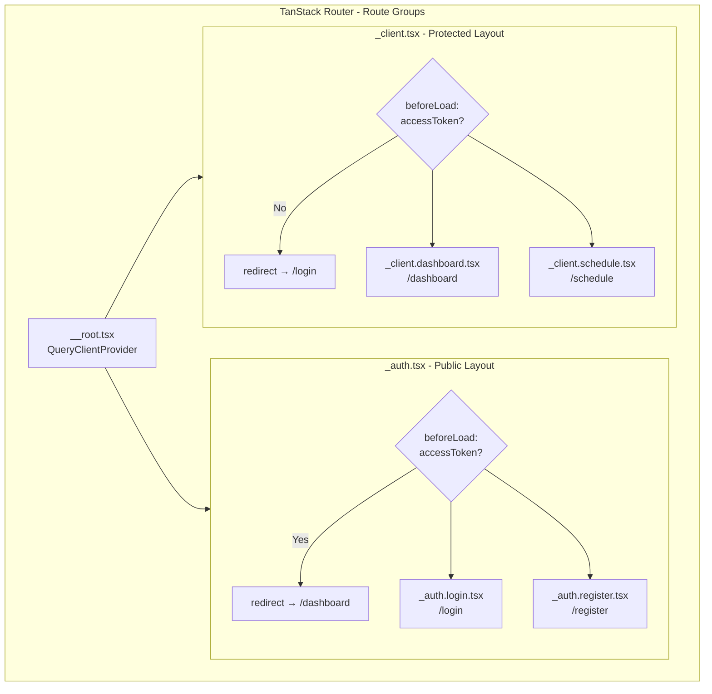

# План реализации Auth Flow

Этот файл лежит в папке: `frontend/doc/plans`

## Контекст

Данный план детализирует реализацию пункта 7.3 из [top-level плана](../../../doc/plans/impl-plan-top-level.md).

### Уже реализовано

На основе анализа существующего кода:

1. **Auth Store** ([`auth-store.ts`](../../src/stores/auth-store.ts)):
   - Zustand store с persist middleware
   - Хранение `accessToken` в sessionStorage
   - Методы: `logout`, `refreshTokens`, `setAccessToken`, `setUser`, `setLoading`
   - Типизация через сгенерированные типы из OpenAPI

2. **API Client** ([`api-client.ts`](../../src/lib/api-client.ts)):
   - ky instance с автоинъекцией токена
   - Автоматический refresh при 401 ответе
   - Обработка ошибок с кастомным `ApiError` классом

3. **Типы** ([`types.ts`](../../src/types/types.ts)):
   - Сгенерированные типы из OpenAPI спецификации
   - Domain-organized экспорты

4. **Зависимости установлены**:
   - `@tanstack/react-router` - маршрутизация
   - `@tanstack/react-query` - серверное состояние
   - `zustand` - клиентское состояние
   - `ky` - HTTP клиент
   - `react-hook-form` + `@hookform/resolvers` - формы
   - `zod` - валидация

---

## Структура файлов

```
frontend/src/
├── components/
│   ├── auth/
│   │   ├── login-form.tsx
│   │   ├── register-form.tsx
│   │   └── protected-route.tsx
│   └── ui/
│       ├── input.tsx          # Нужно добавить
│       ├── label.tsx          # Нужно добавить
│       ├── card.tsx           # Нужно добавить
│       └── form.tsx           # Нужно добавить
├── pages/
│   └── auth/
│       ├── login.tsx
│       └── register.tsx
├── hooks/
│   └── use-auth.ts
├── schemas/
│   └── auth.schema.ts
├── routes/
│   ├── __root.tsx
│   ├── _auth.tsx              # Layout route для auth страниц
│   ├── _auth.login.tsx        # /login (наследует _auth.tsx)
│   ├── _auth.register.tsx     # /register (наследует _auth.tsx)
│   ├── _client.tsx            # Layout route для защищённых страниц
│   ├── _client.dashboard.tsx  # /dashboard (наследует _client.tsx)
│   └── index.tsx              # / - редирект
└── router.tsx
```

> **Примечание:** Префикс `_` в TanStack Router обозначает **Route Groups** — маршруты, которые не добавляются к URL пути, но создают логическую группировку. Например, `_auth.login.tsx` создаёт маршрут `/login`, а не `/_auth/login`.

---

## Задачи

### 1. UI Components для форм

Добавить недостающие shadcn/ui компоненты:

- [ ] `input.tsx` - текстовые поля для форм
- [ ] `label.tsx` - метки для полей
- [ ] `card.tsx` - карточки для страниц авторизации
- [ ] `form.tsx` - компоненты форм (FormItem, FormLabel, FormControl, FormMessage)

**Команды установки:**

```bash
cd frontend
npx shadcn add input
npx shadcn add label
npx shadcn add card
npx shadcn add form
```

---

### 2. Zod Schemas для валидации

Создать файл [`schemas/auth.schema.ts`](../../src/schemas/auth.schema.ts):

```typescript
import {z} from 'zod';

export const loginSchema = z.object({
  email: z.string().email('Некорректный email'),
  password: z.string().min(1, 'Введите пароль'),
});

export const registerSchema = z
  .object({
    name: z.string().min(2, 'Минимум 2 символа'),
    email: z.string().email('Некорректный email'),
    phone: z.string().regex(/^\+7\d{10}$/, 'Формат: +79991234567'),
    birthDate: z.string().refine(val => {
      const date = new Date(val);
      const now = new Date();
      return date < now && date > new Date('1900-01-01');
    }, 'Некорректная дата рождения'),
    gender: z.enum(['male', 'female'], {
      errorMap: () => ({message: 'Выберите пол'}),
    }),
    password: z.string().min(8, 'Минимум 8 символов'),
    confirmPassword: z.string(),
  })
  .refine(data => data.password === data.confirmPassword, {
    message: 'Пароли не совпадают',
    path: ['confirmPassword'],
  });

export type LoginForm = z.infer<typeof loginSchema>;
export type RegisterForm = z.infer<typeof registerSchema>;
```

---

### 3. TanStack Router Setup

Используем **Route Groups** для организации маршрутов без дублирования кода:

- `_auth.tsx` — layout route для публичных страниц (login, register)
- `_client.tsx` — layout route для защищённых страниц (dashboard, schedule, etc.)

#### 3.1. Создать [`routes/__root.tsx`](../../src/routes/__root.tsx)

Базовый layout с QueryClientProvider:

```typescript
import { createRootRoute, Outlet } from '@tanstack/react-router';
import { QueryClient, QueryClientProvider } from '@tanstack/react-query';

const queryClient = new QueryClient({
  defaultOptions: {
    queries: {
      staleTime: 1000 * 60 * 5, // 5 минут
      retry: 1,
    },
  },
});

export const Route = createRootRoute({
  component: () => (
    <QueryClientProvider client={queryClient}>
      <Outlet />
    </QueryClientProvider>
  ),
});
```

#### 3.2. Создать [`routes/_auth.tsx`](../../src/routes/_auth.tsx)

Layout route для публичных страниц. Проверяет, что пользователь НЕ авторизован:

```typescript
import { createFileRoute, redirect, Outlet } from '@tanstack/react-router';
import { useAuthStore } from '@/stores/auth-store';

/**
 * Layout route для публичных страниц (login, register).
 * Если пользователь уже авторизован — редирект на dashboard.
 * Префикс _ означает Route Group — маршрут не добавляется к URL.
 */
export const Route = createFileRoute('/_auth')({
  beforeLoad: () => {
    const { accessToken } = useAuthStore.getState();
    if (accessToken) {
      throw redirect({ to: '/dashboard' });
    }
  },
  component: () => <Outlet />,
});
```

#### 3.3. Создать [`routes/_auth.login.tsx`](../../src/routes/_auth.login.tsx)

Наследует проверку авторизации от `_auth.tsx`:

```typescript
import {createFileRoute} from '@tanstack/react-router';
import {LoginPage} from '@/pages/auth/login';

export const Route = createFileRoute('/_auth/login')({
  component: LoginPage,
});
```

#### 3.4. Создать [`routes/_auth.register.tsx`](../../src/routes/_auth.register.tsx)

Наследует проверку авторизации от `_auth.tsx`:

```typescript
import {createFileRoute} from '@tanstack/react-router';
import {RegisterPage} from '@/pages/auth/register';

export const Route = createFileRoute('/_auth/register')({
  component: RegisterPage,
});
```

#### 3.5. Создать [`routes/_client.tsx`](../../src/routes/_client.tsx)

Layout route для защищённых страниц. Проверяет, что пользователь авторизован:

```typescript
import { createFileRoute, redirect, Outlet } from '@tanstack/react-router';
import { useAuthStore } from '@/stores/auth-store';

/**
 * Layout route для защищённых страниц клиента.
 * Если пользователь не авторизован — редирект на login.
 */
export const Route = createFileRoute('/_client')({
  beforeLoad: () => {
    const { accessToken, isLoading } = useAuthStore.getState();

    if (isLoading) {
      // Можно показать спиннер или вернуть pending state
      return;
    }

    if (!accessToken) {
      throw redirect({ to: '/login' });
    }
  },
  component: () => <Outlet />,
});
```

#### 3.6. Создать [`routes/_client.dashboard.tsx`](../../src/routes/_client.dashboard.tsx)

Пример защищённой страницы:

```typescript
import { createFileRoute } from '@tanstack/react-router';

export const Route = createFileRoute('/_client/dashboard')({
  component: DashboardPage,
});

const DashboardPage = () => {
  return <div>Dashboard</div>;
};
```

#### 3.7. Создать [`routes/index.tsx`](../../src/routes/index.tsx)

Редирект на dashboard или login:

```typescript
import {createFileRoute, redirect} from '@tanstack/react-router';
import {useAuthStore} from '@/stores/auth-store';

export const Route = createFileRoute('/')({
  beforeLoad: () => {
    const {accessToken} = useAuthStore.getState();
    if (accessToken) {
      throw redirect({to: '/dashboard'});
    }
    throw redirect({to: '/login'});
  },
});
```

#### 3.8. Создать [`router.tsx`](../../src/router.tsx)

```typescript
import {createRouter} from '@tanstack/react-router';
import {Route as rootRoute} from './routes/__root';
import {Route as authRoute} from './routes/_auth';
import {Route as authLoginRoute} from './routes/_auth.login';
import {Route as authRegisterRoute} from './routes/_auth.register';
import {Route as clientRoute} from './routes/_client';
import {Route as clientDashboardRoute} from './routes/_client.dashboard';
import {Route as indexRoute} from './routes/index';

const routeTree = rootRoute.addChildren([
  authRoute.addChildren([authLoginRoute, authRegisterRoute]),
  clientRoute.addChildren([clientDashboardRoute]),
  indexRoute,
]);

export const router = createRouter({routeTree});

declare module '@tanstack/react-router' {
  interface Register {
    router: typeof router;
  }
}
```

---

### 4. Auth Hooks

Создать [`hooks/use-auth.ts`](../../src/hooks/use-auth.ts):

```typescript
import {useMutation, useQuery, useQueryClient} from '@tanstack/react-query';
import {useNavigate} from '@tanstack/react-router';
import {useAuthStore} from '@/stores/auth-store';
import {api} from '@/lib/api-client';
import type {LoginDto, RegisterDto, UserProfileDto} from '@/types';

export const useLogin = () => {
  const navigate = useNavigate();
  const {setAccessToken, setUser} = useAuthStore();

  return useMutation({
    mutationFn: (data: LoginDto) =>
      api.post<{accessToken: string; user: UserProfileDto}>(
        '/auth/login',
        data,
      ),
    onSuccess: response => {
      setAccessToken(response.accessToken);
      setUser(response.user);
      navigate({to: '/dashboard'});
    },
  });
};

export const useRegister = () => {
  const navigate = useNavigate();

  return useMutation({
    mutationFn: (data: RegisterDto) => api.post('/auth/register', data),
    onSuccess: () => {
      navigate({to: '/login'});
    },
  });
};

export const useLogout = () => {
  const navigate = useNavigate();
  const queryClient = useQueryClient();
  const {logout: clearAuth} = useAuthStore();

  return useMutation({
    mutationFn: () => api.post('/auth/logout'),
    onSuccess: () => {
      clearAuth();
      queryClient.clear();
      navigate({to: '/login'});
    },
  });
};

export const useProfile = () => {
  const {accessToken} = useAuthStore();

  return useQuery({
    queryKey: ['profile'],
    queryFn: () => api.get<UserProfileDto>('/auth/me'),
    enabled: !!accessToken,
  });
};
```

---

### 5. Auth Components

#### 5.1. Создать [`components/auth/login-form.tsx`](../../src/components/auth/login-form.tsx)

```typescript
import { useForm } from 'react-hook-form';
import { zodResolver } from '@hookform/resolvers/zod';
import { useLogin } from '@/hooks/use-auth';
import { loginSchema, type LoginForm } from '@/schemas/auth.schema';
import { Button } from '@/components/ui/button';
import { Input } from '@/components/ui/input';
import {
  Card,
  CardContent,
  CardDescription,
  CardHeader,
  CardTitle,
} from '@/components/ui/card';
import {
  Form,
  FormControl,
  FormField,
  FormItem,
  FormLabel,
  FormMessage,
} from '@/components/ui/form';

export const LoginForm = () => {
  const loginMutation = useLogin();

  const form = useForm<LoginForm>({
    resolver: zodResolver(loginSchema),
    defaultValues: {
      email: '',
      password: '',
    },
  });

  const onSubmit = (data: LoginForm) => {
    loginMutation.mutate(data);
  };

  return (
    <Card className="w-full max-w-md">
      <CardHeader>
        <CardTitle>Вход</CardTitle>
        <CardDescription>
          Войдите в свой аккаунт DreamFitness
        </CardDescription>
      </CardHeader>
      <CardContent>
        <Form {...form}>
          <form onSubmit={form.handleSubmit(onSubmit)} className="space-y-4">
            <FormField
              name="email"
              render={({ field }) => (
                <FormItem>
                  <FormLabel>Email</FormLabel>
                  <FormControl>
                    <Input
                      type="email"
                      placeholder="user@example.com"
                      {...field}
                    />
                  </FormControl>
                  <FormMessage />
                </FormItem>
              )}
            />
            <FormField
              name="password"
              render={({ field }) => (
                <FormItem>
                  <FormLabel>Пароль</FormLabel>
                  <FormControl>
                    <Input type="password" {...field} />
                  </FormControl>
                  <FormMessage />
                </FormItem>
              )}
            />
            {loginMutation.isError && (
              <p className="text-sm text-red-500">
                Неверный email или пароль
              </p>
            )}
            <Button
              type="submit"
              className="w-full"
              disabled={loginMutation.isPending}
            >
              {loginMutation.isPending ? 'Вход...' : 'Войти'}
            </Button>
          </form>
        </Form>
      </CardContent>
    </Card>
  );
};
```

#### 5.2. Создать [`components/auth/register-form.tsx`](../../src/components/auth/register-form.tsx)

```typescript
import { useForm } from 'react-hook-form';
import { zodResolver } from '@hookform/resolvers/zod';
import { Link } from '@tanstack/react-router';
import { useRegister } from '@/hooks/use-auth';
import {
  registerSchema,
  type RegisterForm,
} from '@/schemas/auth.schema';
import { Button } from '@/components/ui/button';
import { Input } from '@/components/ui/input';
import {
  Card,
  CardContent,
  CardDescription,
  CardHeader,
  CardTitle,
} from '@/components/ui/card';
import {
  Form,
  FormControl,
  FormField,
  FormItem,
  FormLabel,
  FormMessage,
} from '@/components/ui/form';
import { GENDER_OPTIONS } from '@/types/constants';

export const RegisterForm = () => {
  const registerMutation = useRegister();

  const form = useForm<RegisterForm>({
    resolver: zodResolver(registerSchema),
    defaultValues: {
      name: '',
      email: '',
      phone: '',
      birthDate: '',
      gender: 'male',
      password: '',
      confirmPassword: '',
    },
  });

  const onSubmit = (data: RegisterForm) => {
    registerMutation.mutate(data);
  };

  return (
    <Card className="w-full max-w-md">
      <CardHeader>
        <CardTitle>Регистрация</CardTitle>
        <CardDescription>
          Создайте аккаунт DreamFitness
        </CardDescription>
      </CardHeader>
      <CardContent>
        <Form {...form}>
          <form onSubmit={form.handleSubmit(onSubmit)} className="space-y-4">
            {/* Поля формы... */}
            <FormField
              name="name"
              render={({ field }) => (
                <FormItem>
                  <FormLabel>Имя</FormLabel>
                  <FormControl>
                    <Input {...field} />
                  </FormControl>
                  <FormMessage />
                </FormItem>
              )}
            />
            {/* Остальные поля аналогично */}

            <Button
              type="submit"
              className="w-full"
              disabled={registerMutation.isPending}
            >
              {registerMutation.isPending ? 'Регистрация...' : 'Зарегистрироваться'}
            </Button>

            <p className="text-center text-sm">
              Уже есть аккаунт?{' '}
              <Link to="/login" className="text-primary underline">
                Войти
              </Link>
            </p>
          </form>
        </Form>
      </CardContent>
    </Card>
  );
};
```

#### 5.3. Создать [`components/auth/protected-route.tsx`](../../src/components/auth/protected-route.tsx)

```typescript
import { Navigate } from '@tanstack/react-router';
import { useAuthStore } from '@/stores/auth-store';
import type { UserRole } from '@/types';

interface ProtectedRouteProps {
  children: React.ReactNode;
  requiredRole?: UserRole;
}

export const ProtectedRoute: React.FC<ProtectedRouteProps> = ({
  children,
  requiredRole,
}) => {
  const { user, isLoading, accessToken } = useAuthStore();

  if (isLoading) {
    return (
      <div className="flex min-h-screen items-center justify-center">
        {/* Loading spinner */}
      </div>
    );
  }

  if (!accessToken) {
    return <Navigate to="/login" />;
  }

  if (requiredRole && user?.role !== requiredRole) {
    return <Navigate to="/unauthorized" />;
  }

  return <>{children}</>;
};
```

---

### 6. Auth Pages

#### 6.1. Создать [`pages/auth/login.tsx`](../../src/pages/auth/login.tsx)

```typescript
import { Link } from '@tanstack/react-router';
import { LoginForm } from '@/components/auth/login-form';

export const LoginPage = () => {
  return (
    <div className="flex min-h-screen items-center justify-center bg-background">
      <div className="w-full max-w-md space-y-4">
        <LoginForm />
        <p className="text-center text-sm">
          Нет аккаунта?{' '}
          <Link to="/register" className="text-primary underline">
            Зарегистрироваться
          </Link>
        </p>
      </div>
    </div>
  );
};
```

#### 6.2. Создать [`pages/auth/register.tsx`](../../src/pages/auth/register.tsx)

```typescript
import { RegisterForm } from '@/components/auth/register-form';

export const RegisterPage = () => {
  return (
    <div className="flex min-h-screen items-center justify-center bg-background">
      <RegisterForm />
    </div>
  );
};
```

---

### 7. Обновить main.tsx

```typescript
import { StrictMode } from 'react';
import { createRoot } from 'react-dom/client';
import { RouterProvider } from '@tanstack/react-router';
import { router } from './router';
import './index.css';

createRoot(document.getElementById('root')!).render(
  <StrictMode>
    <RouterProvider router={router} />
  </StrictMode>,
);
```

---

### 8. Инициализация Auth State

Добавить инициализацию в [`stores/auth-store.ts`](../../src/stores/auth-store.ts):

```typescript
// Добавить функцию инициализации
export const initializeAuth = async () => {
  const {accessToken, setLoading, refreshTokens} = useAuthStore.getState();

  setLoading(true);

  if (accessToken) {
    try {
      // Попытка получить профиль пользователя
      await useAuthStore.getState().refreshTokens();
    } catch {
      // Токен невалидный, пользователь будет разлогинен
    }
  }

  setLoading(false);
};

// Вызвать при старте приложения
initializeAuth();
```

---

## Диаграмма Route Groups Architecture



## Диаграмма Auth Flow

```mermaid
flowchart TD
    subgraph "Login Flow"
        A[User visits /login] --> B{Route: _auth.tsx}
        B --> C{beforeLoad: accessToken?}
        C -->|Yes| D[redirect → /dashboard]
        C -->|No| E[Render LoginPage]
        E --> F[Submit credentials]
        F --> G{API Response}
        G -->|Success| H[Store tokens in Zustand]
        H --> I[navigate → /dashboard]
        G -->|Error| J[Show error message]
    end

    subgraph "Token Refresh Flow"
        K[API Request] --> L{Response 401?}
        L -->|No| M[Return response]
        L -->|Yes| N[Call /auth/refresh]
        N --> O{Refresh Success?}
        O -->|Yes| P[Update accessToken]
        P --> Q[Retry original request]
        O -->|No| R[logout]
        R --> S[redirect → /login]
    end

    subgraph "Protected Route Flow"
        T[User visits /dashboard] --> U{Route: _client.tsx}
        U --> V{beforeLoad: accessToken?}
        V -->|No| W[redirect → /login]
        V -->|Yes| X[Render DashboardPage]
    end
```



---

## DoD - Definition of Done

**Что на выходе:**

- Работающий Login page с формой валидации
- Работающий Register page с формой валидации
- Protected routes с проверкой авторизации
- Автоматический refresh токена при 401
- Redirect на dashboard после успешного логина
- Redirect на login при отсутствии токена

**Минимальные проверки:**

- [ ] `npm run lint` — без ошибок
- [ ] `npm run build` — успешная сборка
- [ ] Ручная проверка: Login flow работает
- [ ] Ручная проверка: Register flow работает
- [ ] Ручная проверка: Protected routes редиректят на login
- [ ] Ручная проверка: Token refresh работает при истёкшем токене

---

## Порядок реализации

1. Установить shadcn/ui компоненты (input, label, card, form)
2. Создать Zod schemas для валидации
3. Настроить TanStack Router с базовыми маршрутами
4. Создать auth hooks (useLogin, useRegister, useLogout, useProfile)
5. Создать LoginForm компонент
6. Создать RegisterForm компонент
7. Создать ProtectedRoute компонент
8. Создать страницы Login и Register
9. Обновить main.tsx для использования Router
10. Добавить инициализацию auth state
11. Протестировать все сценарии
