# План реализации: Client Pages (7.5)

Этот документ описывает детальный план реализации клиентских страниц для DreamFitness.

## Контекст

- **Frontend ADR:** [`/doc/Frontend-ADR.md`](../../../../doc/Frontend-ADR.md)
- **UI Requirements:** [`/doc/UI.md`](../../../../doc/UI.md)
- **API Documentation:** [`/doc/API.md`](../../../../doc/API.md)
- **Top-level Plan:** [`/doc/plans/impl-plan-top-level.md`](../../../../doc/plans/impl-plan-top-level.md)

---

## Текущее состояние

### Уже реализовано

| Компонент           | Файл                                                                         | Статус      |
| ------------------- | ---------------------------------------------------------------------------- | ----------- |
| Auth Store          | [`auth-store.ts`](../../src/stores/auth-store.ts)                            | ✅ Готов    |
| UI Store            | [`ui-store.ts`](../../src/stores/ui-store.ts)                                | ✅ Готов    |
| API Client          | [`api-client.ts`](../../src/lib/api-client.ts)                               | ✅ Готов    |
| Types               | [`types.ts`](../../src/types/types.ts)                                       | ✅ Готов    |
| Constants           | [`constants.ts`](../../src/types/constants.ts)                               | ✅ Готов    |
| Routes              | [`routes.ts`](../../src/lib/routes.ts)                                       | ✅ Готов    |
| Auth Hooks          | [`use-auth.ts`](../../src/hooks/use-auth.ts)                                 | ✅ Готов    |
| Notifications Hooks | [`use-notifications.ts`](../../src/hooks/use-notifications.ts)               | ✅ Готов    |
| ClientLayout        | [`ClientLayout.tsx`](../../src/components/layout/ClientLayout.tsx)           | ✅ Готов    |
| Header              | [`Header.tsx`](../../src/components/layout/Header.tsx)                       | ✅ Готов    |
| NotificationsBell   | [`NotificationsBell.tsx`](../../src/components/layout/NotificationsBell.tsx) | ✅ Готов    |
| BottomNav           | [`BottomNav.tsx`](../../src/components/layout/BottomNav.tsx)                 | ✅ Готов    |
| UI Components       | [`/components/ui/`](../../src/components/ui/)                                | ✅ Готов    |
| DashboardPage       | [`DashboardPage.tsx`](../../src/pages/client/DashboardPage.tsx)              | ⚠️ Заглушка |
| BookingPage         | [`BookingPage.tsx`](../../src/pages/client/BookingPage.tsx)                  | ⚠️ Заглушка |

### Требуется реализовать

| Страница      | Приоритет | Сложность |
| ------------- | --------- | --------- |
| Dashboard     | Высокий   | Средняя   |
| Schedule      | Высокий   | Высокая   |
| Booking       | Высокий   | Средняя   |
| Profile       | Средний   | Средняя   |
| History       | Средний   | Средняя   |
| Notifications | Средний   | Низкая    |

---

## Архитектура

### Структура файлов

```
frontend/src/
├── pages/client/
│   ├── DashboardPage.tsx      # Главная страница клиента
│   ├── SchedulePage.tsx       # Расписание тренировок
│   ├── BookingPage.tsx        # Страница бронирования
│   ├── ProfilePage.tsx        # Профиль пользователя
│   ├── HistoryPage.tsx        # История тренировок
│   └── NotificationsPage.tsx  # Все уведомления
│
├── components/client/         # Компоненты клиентской части
│   ├── dashboard/
│   │   ├── BalanceCard.tsx
│   │   ├── UpcomingTrainings.tsx
│   │   └── QuickActions.tsx
│   ├── schedule/
│   │   ├── WeeklyCalendar.tsx
│   │   ├── TrainingCard.tsx
│   │   └── ScheduleFilters.tsx
│   ├── booking/
│   │   ├── TrainingDetails.tsx
│   │   ├── AvailabilityStatus.tsx
│   │   └── BookingActions.tsx
│   ├── profile/
│   │   ├── ProfileInfo.tsx
│   │   ├── EditProfileForm.tsx
│   │   └── TopUpBalance.tsx
│   ├── history/
│   │   ├── PastTrainings.tsx
│   │   ├── UpcomingBookings.tsx
│   │   └── WaitlistPositions.tsx
│   └── notifications/
│       ├── NotificationItem.tsx
│       └── NotificationFilters.tsx
│
├── hooks/
│   ├── use-auth.ts            # ✅ Уже есть
│   ├── use-notifications.ts   # ✅ Уже есть
│   ├── use-trainings.ts       # Требуется создать
│   ├── use-bookings.ts        # Требуется создать
│   ├── use-waitlist.ts        # Требуется создать
│   └── use-balance.ts         # Требуется создать
│
└── schemas/
    ├── auth.schema.ts         # ✅ Уже есть
    ├── booking.schema.ts      # Требуется создать
    └── user.schema.ts         # Требуется создать
```

---

## Диаграмма зависимостей компонентов

```mermaid
graph TD
    subgraph Pages
        DP[DashboardPage]
        SP[SchedulePage]
        BP[BookingPage]
        PP[ProfilePage]
        HP[HistoryPage]
        NP[NotificationsPage]
    end

    subgraph Dashboard Components
        BC[BalanceCard]
        UT[UpcomingTrainings]
        QA[QuickActions]
    end

    subgraph Schedule Components
        WC[WeeklyCalendar]
        TC[TrainingCard]
        SF[ScheduleFilters]
    end

    subgraph Booking Components
        TD[TrainingDetails]
        AS[AvailabilityStatus]
        BA[BookingActions]
    end

    subgraph Profile Components
        PI[ProfileInfo]
        EPF[EditProfileForm]
        TUB[TopUpBalance]
    end

    subgraph History Components
        PT[PastTrainings]
        UB[UpcomingBookings]
        WP[WaitlistPositions]
    end

    subgraph Hooks
        useAuth[use-auth]
        useTrain[use-trainings]
        useBook[use-bookings]
        useWait[use-waitlist]
        useBal[use-balance]
        useNotif[use-notifications]
    end

    DP --> BC
    DP --> UT
    DP --> QA

    SP --> WC
    SP --> TC
    SP --> SF

    BP --> TD
    BP --> AS
    BP --> BA

    PP --> PI
    PP --> EPF
    PP --> TUB

    HP --> PT
    HP --> UB
    HP --> WP

    BC --> useBal
    UT --> useBook
    UT --> useTrain

    WC --> useTrain
    TC --> useTrain

    TD --> useTrain
    AS --> useTrain
    BA --> useBook
    BA --> useWait

    PI --> useAuth
    EPF --> useAuth
    TUB --> useBal

    PT --> useBook
    UB --> useBook
    WP --> useWait

    NP --> useNotif
```



---

## Детальный план реализации

### 7.5.1. Хуки для работы с API

#### use-trainings.ts

**Назначение:** Хуки для работы с тренировками и расписанием.

**API Endpoints:**

- `GET /api/trainings` — список тренировок с фильтрами
- `GET /api/trainings/:id` — детали тренировки
- `GET /api/trainers` — список тренеров
- `GET /api/schedule` — расписание
- `GET /api/schedule/:date` — расписание по дате

**Хуки:**

```typescript
// useTrainings — список тренировок с фильтрацией
export const useTrainings = (filters?: TrainingFilters) => {
  // queryKey: ['trainings', filters]
  // queryFn: GET /api/trainings?type=...&trainerId=...&date=...
};

// useTraining — детали одной тренировки
export const useTraining = (id: string) => {
  // queryKey: ['trainings', id]
  // queryFn: GET /api/trainings/:id
};

// useTrainers — список тренеров
export const useTrainers = () => {
  // queryKey: ['trainers']
  // queryFn: GET /api/trainers
};

// useSchedule — расписание
export const useSchedule = (date?: string) => {
  // queryKey: ['schedule', date]
  // queryFn: GET /api/schedule/:date или GET /api/schedule
};
```

**Типы:**

```typescript
interface TrainingFilters {
  type?: TrainingType;
  trainerId?: string;
  dateFrom?: string;
  dateTo?: string;
  status?: TrainingStatus;
}
```

---

#### use-bookings.ts

**Назначение:** Хуки для работы с бронированиями.

**API Endpoints:**

- `GET /api/bookings` — список бронирований пользователя
- `GET /api/bookings/:id` — детали бронирования
- `POST /api/bookings` — создать бронирование
- `DELETE /api/bookings/:id` — отменить бронирование

**Хуки:**

```typescript
// useBookings — список бронирований
export const useBookings = (filters?: BookingFilters) => {
  // queryKey: ['bookings', filters]
  // queryFn: GET /api/bookings?status=...
};

// useBooking — детали бронирования
export const useBooking = (id: string) => {
  // queryKey: ['bookings', id]
  // queryFn: GET /api/bookings/:id
};

// useCreateBooking — создание бронирования
export const useCreateBooking = () => {
  // mutationFn: POST /api/bookings { trainingId }
  // onSuccess: invalidate ['bookings'], ['trainings']
};

// useCancelBooking — отмена бронирования
export const useCancelBooking = () => {
  // mutationFn: DELETE /api/bookings/:id { reason? }
  // onSuccess: invalidate ['bookings'], ['trainings']
};
```

**Типы:**

```typescript
interface BookingFilters {
  status?: BookingStatus;
  upcoming?: boolean;
  past?: boolean;
}
```

---

#### use-waitlist.ts

**Назначение:** Хуки для работы с листом ожидания.

**API Endpoints:**

- `GET /api/waitlist` — список позиций в очереди
- `GET /api/waitlist/:trainingId` — позиция в очереди для тренировки
- `POST /api/waitlist` — встать в очередь
- `DELETE /api/waitlist/:trainingId` — выйти из очереди

**Хуки:**

```typescript
// useWaitlist — список позиций в очереди
export const useWaitlist = () => {
  // queryKey: ['waitlist']
  // queryFn: GET /api/waitlist
};

// useWaitlistPosition — позиция для конкретной тренировки
export const useWaitlistPosition = (trainingId: string) => {
  // queryKey: ['waitlist', trainingId]
  // queryFn: GET /api/waitlist/:trainingId
};

// useJoinWaitlist — встать в очередь
export const useJoinWaitlist = () => {
  // mutationFn: POST /api/waitlist { trainingId }
  // onSuccess: invalidate ['waitlist']
};

// useLeaveWaitlist — выйти из очереди
export const useLeaveWaitlist = () => {
  // mutationFn: DELETE /api/waitlist/:trainingId
  // onSuccess: invalidate ['waitlist']
};
```

---

#### use-balance.ts

**Назначение:** Хуки для работы с балансом и транзакциями.

**API Endpoints:**

- `GET /api/auth/balance` — текущий баланс
- `GET /api/auth/transactions` — история транзакций
- `POST /api/auth/balance/deposit` — пополнение баланса

**Хуки:**

```typescript
// useBalance — текущий баланс
export const useBalance = () => {
  // queryKey: ['balance']
  // queryFn: GET /api/auth/balance
};

// useTransactions — история транзакций
export const useTransactions = (filters?: TransactionFilters) => {
  // queryKey: ['transactions', filters]
  // queryFn: GET /api/auth/transactions
};

// useDeposit — пополнение баланса (для интеграции с платёжной системой)
export const useDeposit = () => {
  // mutationFn: POST /api/auth/balance/deposit
  // onSuccess: invalidate ['balance'], ['transactions']
};
```

---

### 7.5.2. Dashboard Page

**Файл:** [`DashboardPage.tsx`](../../src/pages/client/DashboardPage.tsx)

**Требования из UI.md:**

- Текущий баланс баллов
- Карточка с ближайшими предстоящими тренировками (2-3 шт.)
- Кнопка быстрого перехода к расписанию
- Список последних уведомлений

**Компоненты:**

#### BalanceCard

**Файл:** `components/client/dashboard/BalanceCard.tsx`

**Пропсы:**

```typescript
interface BalanceCardProps {
  balance: number;
  isLoading?: boolean;
}
```

**Функционал:**

- Отображение текущего баланса
- Кнопка "Пополнить" → переход к Profile
- Skeleton при загрузке

**UI:**

```
┌─────────────────────────────────┐
│ Ваш баланс                      │
│ ┌─────────────────────────────┐ │
│ │     1,500 баллов            │ │
│ │     [Пополнить]             │ │
│ └─────────────────────────────┘ │
└─────────────────────────────────┘
```

---

#### UpcomingTrainings

**Файл:** `components/client/dashboard/UpcomingTrainings.tsx`

**Пропсы:**

```typescript
interface UpcomingTrainingsProps {
  trainings: TrainingResponseDto[];
  isLoading?: boolean;
}
```

**Функционал:**

- Отображение 2-3 ближайших тренировок
- Каждая тренировка — компактная карточка
- Клик → переход на страницу бронирования
- Empty state: "Нет предстоящих тренировок"

**UI:**

```
┌─────────────────────────────────┐
│ Предстоящие тренировки          │
│ ┌─────────────────────────────┐ │
│ │ Yoga • 15 янв, 10:00        │ │
│ │ Тренер: Анна                │ │
│ └─────────────────────────────┘ │
│ ┌─────────────────────────────┐ │
│ │ CrossFit • 16 янв, 18:00    │ │
│ │ Тренер: Михаил              │ │
│ └─────────────────────────────┘ │
└─────────────────────────────────┘
```

---

#### QuickActions

**Файл:** `components/client/dashboard/QuickActions.tsx`

**Пропсы:**

```typescript
// Нет пропсов, использует навигацию
```

**Функционал:**

- Кнопка "Найти тренировку" → Schedule
- Кнопка "История" → History

**UI:**

```
┌─────────────────────────────────┐
│ Быстрые действия                │
│ [Найти тренировку] [История]    │
└─────────────────────────────────┘
```

---

### 7.5.3. Schedule Page

**Файл:** `pages/client/SchedulePage.tsx`

**Требования из UI.md:**

- Календарь (недельный вид)
- Просмотр тренировок по дням недели
- Фильтрация по типу тренировки
- Фильтрация по тренеру
- Клик по тренировке → переход на страницу бронирования

**Компоненты:**

#### WeeklyCalendar

**Файл:** `components/client/schedule/WeeklyCalendar.tsx`

**Пропсы:**

```typescript
interface WeeklyCalendarProps {
  trainings: TrainingResponseDto[];
  selectedDate: Date;
  onDateSelect: (date: Date) => void;
  isLoading?: boolean;
}
```

**Функционал:**

- Отображение недели (7 дней)
- Навигация между неделями (← →)
- Подсветка текущего дня
- Подсветка выбранного дня
- Индикатор наличия тренировок в дне

**UI:**

```
┌─────────────────────────────────────────────┐
│        ←   Январь 2024   →                  │
├─────────────────────────────────────────────┤
│  Пн   Вт   Ср   Чт   Пт   Сб   Вс          │
│  15   16   17   18   19   20   21          │
│  •         •    •         •                │
└─────────────────────────────────────────────┘
```

---

#### TrainingCard

**Файл:** `components/client/schedule/TrainingCard.tsx`

**Пропсы:**

```typescript
interface TrainingCardProps {
  training: TrainingResponseDto;
  onClick?: () => void;
}
```

**Функционал:**

- Отображение информации о тренировке
- Статус доступности мест
- Клик → переход на BookingPage

**UI:**

```
┌─────────────────────────────────────┐
│ Morning Yoga                        │
│ ─────────────────────────────────── │
│ 🕐 10:00 - 11:00                    │
│ 👤 Анна Иванова                     │
│ 📍 Зал 1                            │
│ 💰 500 баллов                       │
│ ─────────────────────────────────── │
│ [5 из 20 мест]                      │
└─────────────────────────────────────┘
```

---

#### ScheduleFilters

**Файл:** `components/client/schedule/ScheduleFilters.tsx`

**Пропсы:**

```typescript
interface ScheduleFiltersProps {
  filters: TrainingFilters;
  onFiltersChange: (filters: TrainingFilters) => void;
  trainers: TrainerResponseDto[];
}
```

**Функционал:**

- Dropdown для выбора типа тренировки
- Dropdown для выбора тренера
- Кнопка "Сбросить фильтры"

**UI:**

```
┌─────────────────────────────────────────────┐
│ [Тип тренировки ▼]  [Тренер ▼]  [Сбросить] │
└─────────────────────────────────────────────┘
```

---

### 7.5.4. Booking Page

**Файл:** [`BookingPage.tsx`](../../src/pages/client/BookingPage.tsx)

**Требования из UI.md:**

**При наличии мест:**

- Информация о тренировке (название, тренер, время, длительность)
- Количество свободных мест
- Стоимость в баллах
- Текущий баланс пользователя
- Кнопка "Записаться"

**При отсутствии мест:**

- Информация о тренировке
- Статус "Мест нет"
- Текущая позиция в очереди (если уже в очереди)
- Кнопка "Встать в очередь" (если не в очереди)

**Компоненты:**

#### TrainingDetails

**Файл:** `components/client/booking/TrainingDetails.tsx`

**Пропсы:**

```typescript
interface TrainingDetailsProps {
  training: TrainingResponseDto;
  trainer?: TrainerResponseDto;
}
```

**Функционал:**

- Отображение полной информации о тренировке
- Дата и время
- Длительность
- Описание
- Тренер

**UI:**

```
┌─────────────────────────────────────┐
│ Morning Yoga                        │
│                                     │
│ 📅 15 января 2024                   │
│ 🕐 10:00 - 11:00 (60 мин)           │
│ 👤 Анна Иванова                     │
│ 📍 Зал 1                            │
│                                     │
│ Описание:                           │
│ Утренняя йога для начинающих...     │
└─────────────────────────────────────┘
```

---

#### AvailabilityStatus

**Файл:** `components/client/booking/AvailabilityStatus.tsx`

**Пропсы:**

```typescript
interface AvailabilityStatusProps {
  availableSpots: number;
  totalCapacity: number;
  price: number;
  userBalance: number;
}
```

**Функционал:**

- Отображение количества мест
- Визуальный индикатор (зелёный/жёлтый/красный)
- Стоимость в баллах
- Достаточность баланса

**UI:**

```
┌─────────────────────────────────────┐
│ Доступно мест: 5 из 20              │
│ ████████████░░░░░░░░ 25%            │
│                                     │
│ Стоимость: 500 баллов               │
│ Ваш баланс: 1,500 баллов ✓          │
└─────────────────────────────────────┘
```

---

#### BookingActions

**Файл:** `components/client/booking/BookingActions.tsx`

**Пропсы:**

```typescript
interface BookingActionsProps {
  trainingId: string;
  hasAvailableSpots: boolean;
  userBalance: number;
  price: number;
  isAlreadyBooked: boolean;
  waitlistPosition?: number;
  isInWaitlist: boolean;
}
```

**Функционал:**

- Кнопка "Записаться" (если есть места и баланс)
- Кнопка "Встать в очередь" (если нет мест)
- Кнопка "Выйти из очереди" (если уже в очереди)
- Disabled состояния

**UI:**

```
При наличии мест:
┌─────────────────────────────────────┐
│ [Записаться за 500 баллов]          │
└─────────────────────────────────────┘

При отсутствии мест:
┌─────────────────────────────────────┐
│ ⚠️ Мест нет                         │
│ [Встать в очередь]                  │
└─────────────────────────────────────┘

Если уже в очереди:
┌─────────────────────────────────────┐
│ Вы в очереди, позиция: 3            │
│ [Выйти из очереди]                  │
└─────────────────────────────────────┘
```

---

### 7.5.5. Profile Page

**Файл:** `pages/client/ProfilePage.tsx`

**Требования из UI.md:**

- Имя пользователя
- Email
- Телефон
- Дата рождения
- Пол
- Текущий баланс баллов
- Кнопка "Пополнить баланс"
- Возможность изменения личных данных

**Компоненты:**

#### ProfileInfo

**Файл:** `components/client/profile/ProfileInfo.tsx`

**Пропсы:**

```typescript
interface ProfileInfoProps {
  user: UserProfileDto;
  onEdit?: () => void;
}
```

**Функционал:**

- Отображение информации о пользователе
- Кнопка "Редактировать"

**UI:**

```
┌─────────────────────────────────────┐
│ Иван Иванов                         │
│ ─────────────────────────────────── │
│ Email: ivan@example.com             │
│ Телефон: +7 999 123 45 67           │
│ Дата рождения: 15.05.1990           │
│ Пол: Мужской                        │
│                                     │
│ Баланс: 1,500 баллов                │
│ [Пополнить]  [Редактировать]        │
└─────────────────────────────────────┘
```

---

#### EditProfileForm

**Файл:** `components/client/profile/EditProfileForm.tsx`

**Пропсы:**

```typescript
interface EditProfileFormProps {
  user: UserProfileDto;
  onSuccess?: () => void;
  onCancel?: () => void;
}
```

**Функционал:**

- Форма редактирования профиля
- Валидация через Zod
- Отправка PATCH /api/auth/me

**Поля формы:**

- Имя (обязательно)
- Телефон (обязательно)
- Дата рождения (обязательно)
- Пол (обязательно)

---

#### TopUpBalance

**Файл:** `components/client/profile/TopUpBalance.tsx`

**Пропсы:**

```typescript
interface TopUpBalanceProps {
  currentBalance: number;
  onSuccess?: () => void;
}
```

**Функционал:**

- Выбор суммы пополнения
- Интеграция с Тинькофф Кассой (будущее)
- Toast об успешном пополнении

**UI:**

```
┌─────────────────────────────────────┐
│ Пополнение баланса                  │
│                                     │
│ Текущий баланс: 1,500 баллов        │
│                                     │
│ Сумма: [____500____] баллов         │
│                                     │
│ Быстрый выбор:                      │
│ [500] [1000] [2000] [5000]          │
│                                     │
│ [Пополнить]                         │
└─────────────────────────────────────┘
```

---

### 7.5.6. History Page

**Файл:** `pages/client/HistoryPage.tsx`

**Требования из UI.md:**

- Список прошедших тренировок
- Список предстоящих тренировок
- Список активных записей в лист ожидания (с указанием позиции)
- Отмена бронирования (с диалогом подтверждения)
- Выход из листа ожидания

**Компоненты:**

#### UpcomingBookings

**Файл:** `components/client/history/UpcomingBookings.tsx`

**Пропсы:**

```typescript
interface UpcomingBookingsProps {
  bookings: BookingResponseDto[];
  isLoading?: boolean;
}
```

**Функционал:**

- Список предстоящих бронирований
- Кнопка отмены с подтверждением
- Empty state

**UI:**

```
┌─────────────────────────────────────┐
│ Предстоящие тренировки              │
│ ┌─────────────────────────────────┐ │
│ │ Morning Yoga • 15 янв, 10:00    │ │
│ │ [Отменить]                      │ │
│ └─────────────────────────────────┘ │
└─────────────────────────────────────┘
```

---

#### PastTrainings

**Файл:** `components/client/history/PastTrainings.tsx`

**Пропсы:**

```typescript
interface PastTrainingsProps {
  bookings: BookingResponseDto[];
  isLoading?: boolean;
}
```

**Функционал:**

- Список прошедших тренировок
- Статус (посещено/отменено)
- Empty state

**UI:**

```
┌─────────────────────────────────────┐
│ Прошедшие тренировки                │
│ ┌─────────────────────────────────┐ │
│ │ CrossFit • 10 янв, 18:00        │ │
│ │ ✓ Посещено                      │ │
│ └─────────────────────────────────┘ │
│ ┌─────────────────────────────────┐ │
│ │ Yoga • 8 янв, 10:00             │ │
│ │ ✗ Отменено                      │ │
│ └─────────────────────────────────┘ │
└─────────────────────────────────────┘
```

---

#### WaitlistPositions

**Файл:** `components/client/history/WaitlistPositions.tsx`

**Пропсы:**

```typescript
interface WaitlistPositionsProps {
  waitlist: WaitlistResponseDto[];
  isLoading?: boolean;
}
```

**Функционал:**

- Список позиций в очереди
- Отображение позиции
- Кнопка выхода из очереди
- Empty state

**UI:**

```
┌─────────────────────────────────────┐
│ Лист ожидания                       │
│ ┌─────────────────────────────────┐ │
│ │ Pilates • 20 янв, 14:00         │ │
│ │ Позиция в очереди: 3            │ │
│ │ [Выйти из очереди]              │ │
│ └─────────────────────────────────┘ │
└─────────────────────────────────────┘
```

---

### 7.5.7. Notifications Page

**Файл:** `pages/client/NotificationsPage.tsx`

**Требования из UI.md:**

- Полный список уведомлений
- Возможность отметить как прочитанное
- Фильтрация по типу (бронирование, отмена, транзакции, напоминания)

**Компоненты:**

#### NotificationItem

**Файл:** `components/client/notifications/NotificationItem.tsx`

**Пропсы:**

```typescript
interface NotificationItemProps {
  notification: NotificationResponseDto;
  onMarkAsRead?: () => void;
}
```

**Функционал:**

- Отображение уведомления
- Иконка по типу
- Время создания
- Статус прочитано/непрочитано
- Кнопка "Отметить как прочитанное"

**UI:**

```
┌─────────────────────────────────────┐
│ ✓ Запись на тренировку подтверждена │
│   Morning Yoga • 15 янв, 10:00      │
│   2 часа назад                      │
└─────────────────────────────────────┘
```

---

#### NotificationFilters

**Файл:** `components/client/notifications/NotificationFilters.tsx`

**Пропсы:**

```typescript
interface NotificationFiltersProps {
  selectedType?: NotificationType;
  onTypeChange: (type?: NotificationType) => void;
}
```

**Функционал:**

- Tabs или Dropdown для фильтрации
- Опции: Все, Бронирование, Отмена, Транзакции, Напоминания

---

## Общие компоненты

### ConfirmDialog

**Файл:** `components/common/ConfirmDialog.tsx`

**Используется для:**

- Отмена бронирования
- Выход из листа ожидания

**Пропсы:**

```typescript
interface ConfirmDialogProps {
  open: boolean;
  onOpenChange: (open: boolean) => void;
  title: string;
  description: string;
  confirmText?: string;
  cancelText?: string;
  onConfirm: () => void;
  isLoading?: boolean;
  variant?: 'default' | 'destructive';
}
```

---

### EmptyState

**Файл:** `components/common/EmptyState.tsx`

**Используется для:**

- Нет предстоящих тренировок
- Нет прошедших тренировок
- Нет уведомлений
- Нет позиций в очереди

**Пропсы:**

```typescript
interface EmptyStateProps {
  icon?: React.ReactNode;
  title: string;
  description?: string;
  action?: {
    label: string;
    onClick: () => void;
  };
}
```

---

## Состояния загрузки

### Skeleton компоненты

Для каждой страницы реализовать skeleton состояния:

```typescript
// Dashboard skeletons
<BalanceCardSkeleton />
<UpcomingTrainingsSkeleton />

// Schedule skeletons
<WeeklyCalendarSkeleton />
<TrainingCardSkeleton />

// Booking skeletons
<TrainingDetailsSkeleton />

// Profile skeletons
<ProfileInfoSkeleton />

// History skeletons
<BookingListSkeleton />

// Notifications skeletons
<NotificationListSkeleton />
```

---

## Обработка ошибок

### Error Boundary

Обернуть каждую страницу в Error Boundary с возможностью перезагрузки.

### API Error handling

При ошибках API показывать toast с описанием ошибки:

```typescript
// В хуках
onError: error => {
  toast.error(getErrorMessage(error));
};
```

---

## Порядок реализации

### Этап 1: Хуки (Foundation)

1. `use-trainings.ts` — хуки для тренировок
2. `use-bookings.ts` — хуки для бронирований
3. `use-waitlist.ts` — хуки для листа ожидания
4. `use-balance.ts` — хуки для баланса

### Этап 2: Dashboard Page

1. `BalanceCard` — карточка баланса
2. `UpcomingTrainings` — предстоящие тренировки
3. `QuickActions` — быстрые действия
4. `DashboardPage` — интеграция

### Этап 3: Schedule Page

1. `ScheduleFilters` — фильтры
2. `TrainingCard` — карточка тренировки
3. `WeeklyCalendar` — календарь
4. `SchedulePage` — интеграция

### Этап 4: Booking Page

1. `TrainingDetails` — детали тренировки
2. `AvailabilityStatus` — статус доступности
3. `BookingActions` — действия бронирования
4. `BookingPage` — интеграция

### Этап 5: Profile Page

1. `ProfileInfo` — информация профиля
2. `EditProfileForm` — форма редактирования
3. `TopUpBalance` — пополнение баланса
4. `ProfilePage` — интеграция

### Этап 6: History Page

1. `UpcomingBookings` — предстоящие бронирования
2. `PastTrainings` — прошедшие тренировки
3. `WaitlistPositions` — позиции в очереди
4. `HistoryPage` — интеграция

### Этап 7: Notifications Page

1. `NotificationItem` — элемент уведомления
2. `NotificationFilters` — фильтры
3. `NotificationsPage` — интеграция

### Этап 8: Общие компоненты

1. `ConfirmDialog` — диалог подтверждения
2. `EmptyState` — пустое состояние
3. Skeleton компоненты

---

## DoD (Definition of Done)

### Функциональные требования

- [ ] Dashboard отображает баланс, предстоящие тренировки, быстрые действия
- [ ] Schedule отображает недельный календарь с фильтрами
- [ ] Booking позволяет записаться на тренировку или встать в очередь
- [ ] Profile отображает информацию и позволяет редактировать
- [ ] History отображает прошедшие и предстоящие тренировки, очередь
- [ ] Notifications отображает все уведомления с фильтрацией

### Нефункциональные требования

- [ ] Все страницы адаптивны (mobile, tablet, desktop)
- [ ] Skeleton loaders для всех загружаемых данных
- [ ] Empty states для всех списков
- [ ] Toast уведомления для действий пользователя
- [ ] Обработка ошибок API
- [ ] Accessibility: семантическая разметка, ARIA атрибуты

### Технические требования

- [ ] `npm run lint` — без ошибок
- [ ] `npm run build` — успешная сборка
- [ ] TypeScript strict mode — без ошибок
- [ ] Все компоненты используют типы из `types.ts`

---

## Риски и зависимости

### Зависимости

| Зависимость   | Статус   | Влияние |
| ------------- | -------- | ------- |
| Backend API   | ✅ Готов | Нет     |
| Auth Flow     | ✅ Готов | Нет     |
| Layouts       | ✅ Готов | Нет     |
| UI Components | ✅ Готов | Нет     |
| Types         | ✅ Готов | Нет     |

### Риски

| Риск                         | Вероятность | Влияние | Митигация                                    |
| ---------------------------- | ----------- | ------- | -------------------------------------------- |
| Изменения в API              | Низкая      | Среднее | Типы генерируются из OpenAPI                 |
| Сложность WeeklyCalendar     | Средняя     | Среднее | Использовать существующий Calendar компонент |
| Интеграция с Тинькофф Кассой | Высокая     | Низкое  | Отложить на следующий этап                   |

---

## Примечания

1. **Пополнение баланса** — интеграция с Тинькофф Кассой будет реализована в отдельном этапе. Сейчас достаточно UI для выбора суммы.

2. **Типы тренировок** — использовать `TRAINING_TYPE_OPTIONS` из [`constants.ts`](../../src/types/constants.ts).

3. **Навигация** — использовать `ROUTES` из [`routes.ts`](../../src/lib/routes.ts) для типобезопасной навигации.

4. **Формы** — использовать React Hook Form + Zod по аналогии с [`auth.schema.ts`](../../src/schemas/auth.schema.ts).
