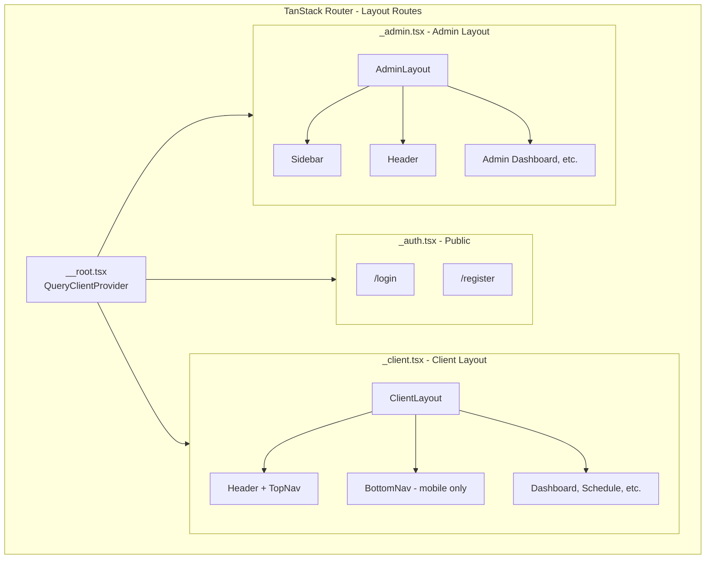
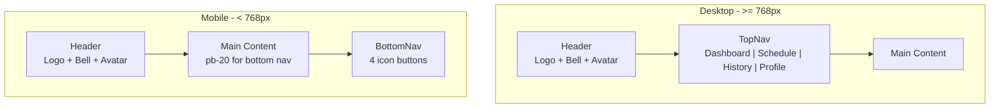
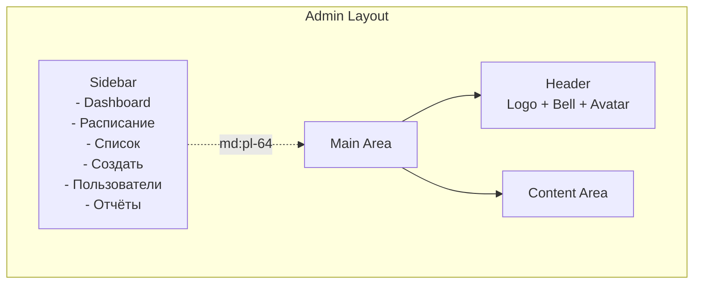

# План реализации Layouts

Этот файл лежит в папке: `frontend/doc/plans`

## Контекст

Данный план детализирует реализацию пункта 7.4 из [top-level плана](../../../doc/plans/impl-plan-top-level.md).

### Уже реализовано

На основе анализа существующего кода:

1. **TanStack Router Setup**:
   - [`__root.tsx`](../../src/routes/__root.tsx) — корневой layout с QueryClientProvider
   - [`_auth.tsx`](../../src/routes/_auth.tsx) — layout route для публичных страниц
   - [`_client.tsx`](../../src/routes/_client.tsx) — layout route для защищённых страниц клиента

2. **Auth Flow** (пункт 7.3):
   - Auth store с Zustand
   - API client с автоинъекцией токена
   - Login/Register pages
   - Protected routes

3. **UI Components**:
   - shadcn/ui компоненты: button, card, form, input, label, calendar, popover, date-picker

4. **Routes Constants** ([`lib/routes.ts`](../../src/lib/routes.ts)):
   - PUBLIC_ROUTES, CLIENT_ROUTES, ADMIN_ROUTES, MISC_ROUTES

---

## Структура файлов

> **Соглашение по наименованию:** Все файлы React компонентов именуются в **PascalCase**, идентично названию экспортируемого компонента.

```
frontend/src/
├── components/
│   ├── layout/
│   │   ├── ClientLayout.tsx       # Layout для клиента (top/bottom nav)
│   │   ├── AdminLayout.tsx        # Layout для админа (sidebar)
│   │   ├── Header.tsx             # Header компонент
│   │   ├── Sidebar.tsx            # Sidebar для админа
│   │   ├── BottomNav.tsx          # Bottom navigation для mobile клиента
│   │   ├── TopNav.tsx             # Top navigation для desktop клиента
│   │   └── NotificationsBell.tsx  # Bell icon с badge и dropdown
│   └── ui/
│       ├── Button.tsx             # Переименовать из button.tsx
│       ├── Calendar.tsx           # Переименовать из calendar.tsx
│       ├── Card.tsx               # Переименовать из card.tsx
│       ├── DatePicker.tsx         # Переименовать из date-picker.tsx
│       ├── Form.tsx               # Переименовать из form.tsx
│       ├── Input.tsx              # Переименовать из input.tsx
│       ├── Label.tsx              # Переименовать из label.tsx
│       ├── Popover.tsx            # Переименовать из popover.tsx
│       ├── button-variants.ts     # Оставить как есть (не компонент)
│       └── index.ts               # Обновить импорты
├── stores/
│   ├── auth-store.ts              # Существует
│   └── ui-store.ts                # Новый: sidebarOpen, toasts
├── hooks/
│   └── use-notifications.ts       # Hook для уведомлений
└── routes/
    ├── _client.tsx                # Обновить: добавить ClientLayout
    ├── _admin.tsx                 # Новый: layout route для админа
    └── ...existing routes
```

---

## Задачи

### 0. Переименование существующих UI файлов

> **Приоритет:** Высокий — должно быть выполнено первым для соответствия соглашениям проекта.

Переименовать файлы в `src/components/ui/` в PascalCase:

| Текущее название  | Новое название   |
| ----------------- | ---------------- |
| `button.tsx`      | `Button.tsx`     |
| `calendar.tsx`    | `Calendar.tsx`   |
| `card.tsx`        | `Card.tsx`       |
| `date-picker.tsx` | `DatePicker.tsx` |
| `form.tsx`        | `Form.tsx`       |
| `input.tsx`       | `Input.tsx`      |
| `label.tsx`       | `Label.tsx`      |
| `popover.tsx`     | `Popover.tsx`    |

**Важно:** После переименования нужно обновить все импорты в файлах, которые используют эти компоненты.

**Файлы для обновления импортов:**

- [`components/ui/index.ts`](../../src/components/ui/index.ts)
- [`components/auth/LoginForm.tsx`](../../src/components/auth/LoginForm.tsx)
- [`components/auth/RegisterForm.tsx`](../../src/components/auth/RegisterForm.tsx)
- [`components/ui/DatePicker.tsx`](../../src/components/ui/date-picker.tsx) — использует Calendar, Popover
- [`pages/auth/LoginPage.tsx`](../../src/pages/auth/LoginPage.tsx)

---

### 1. UI Store

Создать [`stores/ui-store.ts`](../../src/stores/ui-store.ts) для управления UI состоянием:

```typescript
import {create} from 'zustand';

interface UIState {
  sidebarOpen: boolean;
  notificationsOpen: boolean;
}

interface UIActions {
  toggleSidebar: () => void;
  setSidebarOpen: (open: boolean) => void;
  setNotificationsOpen: (open: boolean) => void;
}

export const useUIStore = create<UIState & UIActions>(set => ({
  sidebarOpen: false,
  notificationsOpen: false,

  toggleSidebar: () => set(state => ({sidebarOpen: !state.sidebarOpen})),
  setSidebarOpen: open => set({sidebarOpen: open}),
  setNotificationsOpen: open => set({notificationsOpen: open}),
}));
```

---

### 2. Notifications Hook

Создать [`hooks/use-notifications.ts`](../../src/hooks/use-notifications.ts):

```typescript
import {useQuery} from '@tanstack/react-query';
import {useAuthStore} from '@/stores/auth-store';
import {api} from '@/lib/api-client';
import type {components} from '@/types/api.generated';

type NotificationResponse = components['schemas']['NotificationResponseDto'];

export const useNotifications = (limit?: number) => {
  const {accessToken} = useAuthStore();

  return useQuery({
    queryKey: ['notifications', limit],
    queryFn: () =>
      api.get<NotificationResponse[]>('/notifications', {
        searchParams: limit ? {limit: String(limit)} : undefined,
      }),
    enabled: !!accessToken,
  });
};

export const useUnreadCount = () => {
  const {accessToken} = useAuthStore();

  return useQuery({
    queryKey: ['notifications', 'unread-count'],
    queryFn: () => api.get<{count: number}>('/notifications/unread-count'),
    enabled: !!accessToken,
    refetchInterval: 60000, // Refetch every minute
  });
};
```

---

### 3. Notifications Bell Component

Создать [`components/layout/NotificationsBell.tsx`](../../src/components/layout/NotificationsBell.tsx):

**Требования из UI.md:**

- Bell icon в хедере
- Индикатор непрочитанных уведомлений (badge)
- Выпадающий список последних 5 уведомлений
- Ссылка «Все уведомления»

```typescript
import { Link } from '@tanstack/react-router';
import { Bell } from 'lucide-react';
import { useNotifications, useUnreadCount } from '@/hooks/use-notifications';
import { useUIStore } from '@/stores/ui-store';
import { Button } from '@/components/ui/button';
import { ROUTES } from '@/lib/routes';

export const NotificationsBell: React.FC = () => {
  const { data: unreadData } = useUnreadCount();
  const { data: notifications } = useNotifications(5);
  const { notificationsOpen, setNotificationsOpen } = useUIStore();

  const unreadCount = unreadData?.count ?? 0;

  return (
    <Popover open={notificationsOpen} onOpenChange={setNotificationsOpen}>
      <PopoverTrigger asChild>
        <Button variant="ghost" size="icon" className="relative">
          <Bell className="h-5 w-5" />
          {unreadCount > 0 && (
            <span className="absolute -top-1 -right-1 h-5 w-5 rounded-full bg-primary text-primary-foreground text-xs flex items-center justify-center">
              {unreadCount > 9 ? '9+' : unreadCount}
            </span>
          )}
        </Button>
      </PopoverTrigger>
      <PopoverContent align="end" className="w-80">
        <div className="flex items-center justify-between mb-2">
          <h4 className="font-medium">Уведомления</h4>
          {unreadCount > 0 && (
            <Badge variant="secondary">{unreadCount} новых</Badge>
          )}
        </div>
        <div className="max-h-64 overflow-y-auto">
          {notifications?.map((notification) => (
            <NotificationItem key={notification.id} notification={notification} />
          ))}
          {(!notifications || notifications.length === 0) && (
            <p className="text-sm text-muted-foreground text-center py-4">
              Нет уведомлений
            </p>
          )}
        </div>
        <Link
          to={ROUTES.NOTIFICATIONS}
          className="block text-center text-sm text-primary mt-2 hover:underline"
          onClick={() => setNotificationsOpen(false)}
        >
          Все уведомления
        </Link>
      </PopoverContent>
    </Popover>
  );
};
```

---

### 4. Header Component

Создать [`components/layout/Header.tsx`](../../src/components/layout/Header.tsx):

**Требования из UI.md:**

- Logo
- Bell icon (notifications)
- Avatar с dropdown меню

```typescript
import { Link } from '@tanstack/react-router';
import { User, LogOut, Settings } from 'lucide-react';
import { useAuthStore } from '@/stores/auth-store';
import { useLogout } from '@/hooks/use-auth';
import { NotificationsBell } from './NotificationsBell';
import { Button } from '@/components/ui/button';
import { Avatar, AvatarFallback } from '@/components/ui/avatar';
import { ROUTES } from '@/lib/routes';

export const Header: React.FC = () => {
  const { user } = useAuthStore();
  const logoutMutation = useLogout();

  const initials = user?.name
    ?.split(' ')
    .map((n) => n[0])
    .join('')
    .toUpperCase() ?? '?';

  return (
    <header className="sticky top-0 z-50 w-full border-b bg-background/95 backdrop-blur supports-[backdrop-filter]:bg-background/60">
      <div className="container flex h-14 items-center justify-between">
        {/* Logo */}
        <Link to={ROUTES.DASHBOARD} className="flex items-center space-x-2">
          <span className="text-xl font-bold text-primary">DreamFitness</span>
        </Link>

        {/* Right side */}
        <div className="flex items-center space-x-4">
          {/* Notifications */}
          <NotificationsBell />

          {/* User menu */}
          <DropdownMenu>
            <DropdownMenuTrigger asChild>
              <Button variant="ghost" className="relative h-8 w-8 rounded-full">
                <Avatar className="h-8 w-8">
                  <AvatarFallback>{initials}</AvatarFallback>
                </Avatar>
              </Button>
            </DropdownMenuTrigger>
            <DropdownMenuContent align="end">
              <DropdownMenuLabel>
                <div className="flex flex-col space-y-1">
                  <p className="text-sm font-medium">{user?.name}</p>
                  <p className="text-xs text-muted-foreground">{user?.email}</p>
                </div>
              </DropdownMenuLabel>
              <DropdownMenuSeparator />
              <DropdownMenuItem asChild>
                <Link to={ROUTES.PROFILE}>
                  <User className="mr-2 h-4 w-4" />
                  Профиль
                </Link>
              </DropdownMenuItem>
              <DropdownMenuSeparator />
              <DropdownMenuItem
                onClick={() => logoutMutation.mutate()}
                className="text-destructive"
              >
                <LogOut className="mr-2 h-4 w-4" />
                Выйти
              </DropdownMenuItem>
            </DropdownMenuContent>
          </DropdownMenu>
        </div>
      </div>
    </header>
  );
};
```

---

### 5. Top Navigation (Desktop Client)

Создать [`components/layout/TopNav.tsx`](../../src/components/layout/TopNav.tsx):

**Требования из UI.md:**

- Top navigation bar для desktop/tablet (>= 768px)
- Навигационные ссылки: Dashboard, Schedule, History, Profile

```typescript
import { Link, useLocation } from '@tanstack/react-router';
import { LayoutDashboard, Calendar, Clock, User } from 'lucide-react';
import { ROUTES } from '@/lib/routes';
import { cn } from '@/lib/utils';

interface NavItem {
  label: string;
  href: string;
  icon: React.ComponentType<{ className?: string }>;
}

const NAV_ITEMS: NavItem[] = [
  { label: 'Главная', href: ROUTES.DASHBOARD, icon: LayoutDashboard },
  { label: 'Расписание', href: ROUTES.SCHEDULE, icon: Calendar },
  { label: 'История', href: ROUTES.HISTORY, icon: Clock },
  { label: 'Профиль', href: ROUTES.PROFILE, icon: User },
];

export const TopNav: React.FC = () => {
  const location = useLocation();

  return (
    <nav className="hidden md:flex items-center space-x-6">
      {NAV_ITEMS.map((item) => {
        const isActive = location.pathname === item.href;
        return (
          <Link
            key={item.href}
            to={item.href}
            className={cn(
              'flex items-center space-x-2 text-sm font-medium transition-colors hover:text-primary',
              isActive ? 'text-primary' : 'text-muted-foreground'
            )}
          >
            <item.icon className="h-4 w-4" />
            <span>{item.label}</span>
          </Link>
        );
      })}
    </nav>
  );
};
```

---

### 6. Bottom Navigation (Mobile Client)

Создать [`components/layout/BottomNav.tsx`](../../src/components/layout/BottomNav.tsx):

**Требования из UI.md:**

- Bottom navigation для mobile (< 768px)
- Навигационные ссылки: Dashboard, Schedule, History, Profile

```typescript
import { Link, useLocation } from '@tanstack/react-router';
import { LayoutDashboard, Calendar, Clock, User } from 'lucide-react';
import { ROUTES } from '@/lib/routes';
import { cn } from '@/lib/utils';

interface NavItem {
  label: string;
  href: string;
  icon: React.ComponentType<{ className?: string }>;
}

const NAV_ITEMS: NavItem[] = [
  { label: 'Главная', href: ROUTES.DASHBOARD, icon: LayoutDashboard },
  { label: 'Расписание', href: ROUTES.SCHEDULE, icon: Calendar },
  { label: 'История', href: ROUTES.HISTORY, icon: Clock },
  { label: 'Профиль', href: ROUTES.PROFILE, icon: User },
];

export const BottomNav: React.FC = () => {
  const location = useLocation();

  return (
    <nav className="fixed bottom-0 left-0 right-0 z-50 md:hidden border-t bg-background">
      <div className="flex items-center justify-around h-16">
        {NAV_ITEMS.map((item) => {
          const isActive = location.pathname === item.href;
          return (
            <Link
              key={item.href}
              to={item.href}
              className={cn(
                'flex flex-col items-center justify-center flex-1 h-full transition-colors',
                isActive
                  ? 'text-primary'
                  : 'text-muted-foreground hover:text-primary'
              )}
            >
              <item.icon className="h-5 w-5" />
              <span className="text-xs mt-1">{item.label}</span>
            </Link>
          );
        })}
      </div>
    </nav>
  );
};
```

---

### 7. Client Layout

Создать [`components/layout/ClientLayout.tsx`](../../src/components/layout/ClientLayout.tsx):

**Требования из UI.md:**

- Desktop: Top navigation bar
- Mobile: Bottom navigation
- Header с logo, bell icon, avatar

```
Desktop Layout:
┌─────────────────────────────────────┐
│  Header (Logo, Bell icon, Avatar)   │
├─────────────────────────────────────┤
│                                     │
│         Main Content                │
│                                     │
└─────────────────────────────────────┘

Mobile Layout:
┌─────────────────────────────────────┐
│  Header (Logo, Bell icon, Avatar)   │
├─────────────────────────────────────┤
│                                     │
│         Main Content                │
│                                     │
├─────────────────────────────────────┤
│  Bottom Nav (mobile only)           │
└─────────────────────────────────────┘
```

```typescript
import { Outlet } from '@tanstack/react-router';
import { Header } from './Header';
import { TopNav } from './TopNav';
import { BottomNav } from './BottomNav';

export const ClientLayout: React.FC = () => {
  return (
    <div className="min-h-screen bg-background">
      <Header />

      {/* Desktop navigation - shown in header area */}
      <div className="hidden md:block border-b">
        <div className="container flex h-12 items-center">
          <TopNav />
        </div>
      </div>

      {/* Main content area */}
      <main className="container py-6 pb-20 md:pb-6">
        <Outlet />
      </main>

      {/* Mobile bottom navigation */}
      <BottomNav />
    </div>
  );
};
```

---

### 8. Sidebar Component (Admin)

Создать [`components/layout/Sidebar.tsx`](../../src/components/layout/Sidebar.tsx):

**Требования из UI.md:**

- Sidebar на всех устройствах для админа
- Поддержка вложенных пунктов меню
- Навигация: Dashboard, Schedule Management, Users Management, Reports

```typescript
import { Link, useLocation } from '@tanstack/react-router';
import {
  LayoutDashboard,
  Calendar,
  Users,
  BarChart3,
  ChevronDown,
  ChevronRight,
  Menu,
} from 'lucide-react';
import { useState } from 'react';
import { ROUTES } from '@/lib/routes';
import { cn } from '@/lib/utils';
import { Button } from '@/components/ui/button';
import { useUIStore } from '@/stores/ui-store';

interface NavItem {
  label: string;
  href?: string;
  icon: React.ComponentType<{ className?: string }>;
  children?: { label: string; href: string }[];
}

const ADMIN_NAV_ITEMS: NavItem[] = [
  { label: 'Dashboard', href: ROUTES.ROOT, icon: LayoutDashboard },
  {
    label: 'Расписание',
    icon: Calendar,
    children: [
      { label: 'Список тренировок', href: ROUTES.SCHEDULE },
      { label: 'Создать тренировку', href: ROUTES.SCHEDULE_NEW },
    ],
  },
  { label: 'Пользователи', href: ROUTES.USERS, icon: Users },
  { label: 'Отчёты', href: ROUTES.REPORTS, icon: BarChart3 },
];

const SidebarNavItem: React.FC<{ item: NavItem }> = ({ item }) => {
  const location = useLocation();
  const [isOpen, setIsOpen] = useState(false);
  const hasChildren = item.children && item.children.length > 0;

  if (hasChildren) {
    return (
      <div>
        <button
          onClick={() => setIsOpen(!isOpen)}
          className={cn(
            'flex w-full items-center justify-between px-3 py-2 text-sm rounded-md transition-colors',
            'hover:bg-accent hover:text-accent-foreground'
          )}
        >
          <div className="flex items-center space-x-3">
            <item.icon className="h-4 w-4" />
            <span>{item.label}</span>
          </div>
          {isOpen ? (
            <ChevronDown className="h-4 w-4" />
          ) : (
            <ChevronRight className="h-4 w-4" />
          )}
        </button>
        {isOpen && (
          <div className="ml-6 mt-1 space-y-1">
            {item.children!.map((child) => (
              <Link
                key={child.href}
                to={child.href}
                className={cn(
                  'block px-3 py-2 text-sm rounded-md transition-colors',
                  location.pathname === child.href
                    ? 'bg-accent text-accent-foreground'
                    : 'hover:bg-accent hover:text-accent-foreground'
                )}
              >
                {child.label}
              </Link>
            ))}
          </div>
        )}
      </div>
    );
  }

  return (
    <Link
      to={item.href!}
      className={cn(
        'flex items-center space-x-3 px-3 py-2 text-sm rounded-md transition-colors',
        location.pathname === item.href
          ? 'bg-accent text-accent-foreground'
          : 'hover:bg-accent hover:text-accent-foreground'
      )}
    >
      <item.icon className="h-4 w-4" />
      <span>{item.label}</span>
    </Link>
  );
};

export const Sidebar: React.FC = () => {
  const { sidebarOpen, toggleSidebar } = useUIStore();

  return (
    <>
      {/* Mobile toggle */}
      <Button
        variant="ghost"
        size="icon"
        className="md:hidden fixed top-4 left-4 z-50"
        onClick={toggleSidebar}
      >
        <Menu className="h-5 w-5" />
      </Button>

      {/* Sidebar */}
      <aside
        className={cn(
          'fixed inset-y-0 left-0 z-40 w-64 bg-background border-r transform transition-transform duration-200 ease-in-out',
          sidebarOpen ? 'translate-x-0' : '-translate-x-full',
          'md:translate-x-0'
        )}
      >
        <div className="flex flex-col h-full">
          {/* Logo */}
          <div className="flex h-14 items-center border-b px-4">
            <Link to={ROUTES.ROOT} className="flex items-center space-x-2">
              <span className="text-xl font-bold text-primary">DreamFitness</span>
            </Link>
          </div>

          {/* Navigation */}
          <nav className="flex-1 space-y-1 p-4">
            {ADMIN_NAV_ITEMS.map((item) => (
              <SidebarNavItem key={item.label} item={item} />
            ))}
          </nav>
        </div>
      </aside>

      {/* Mobile overlay */}
      {sidebarOpen && (
        <div
          className="fixed inset-0 z-30 bg-black/50 md:hidden"
          onClick={toggleSidebar}
        />
      )}
    </>
  );
};
```

---

### 9. Admin Layout

Создать [`components/layout/AdminLayout.tsx`](../../src/components/layout/AdminLayout.tsx):

**Требования из UI.md:**

- Sidebar на всех устройствах
- Header с user info

```
Admin Layout:
┌────────┬────────────────────────────┐
│        │  Header                    │
│ Side   ├────────────────────────────┤
│ bar    │                            │
│        │    Main Content            │
│        │                            │
└────────┴────────────────────────────┘
```

```typescript
import { Outlet } from '@tanstack/react-router';
import { Sidebar } from './Sidebar';
import { Header } from './Header';

export const AdminLayout: React.FC = () => {
  return (
    <div className="min-h-screen bg-background">
      <Sidebar />

      <div className="md:pl-64">
        <Header />
        <main className="container py-6">
          <Outlet />
        </main>
      </div>
    </div>
  );
};
```

---

### 10. Update Route Files

#### 10.1. Обновить [`routes/_client.tsx`](../../src/routes/_client.tsx)

Заменить `<Outlet />` на `<ClientLayout />`:

```typescript
import {createFileRoute, redirect} from '@tanstack/react-router';
import {useAuthStore} from '@/stores/auth-store';
import {ROUTES} from '@/lib/routes';
import {ClientLayout} from '@/components/layout/ClientLayout';

export const Route = createFileRoute('/_client')({
  beforeLoad: () => {
    const {accessToken, isLoading} = useAuthStore.getState();

    if (isLoading) {
      return;
    }

    if (!accessToken) {
      // eslint-disable-next-line @typescript-eslint/only-throw-error
      throw redirect({to: ROUTES.LOGIN});
    }
  },
  component: ClientLayout,
});
```

#### 10.2. Создать [`routes/_admin.tsx`](../../src/routes/_admin.tsx)

Layout route для административных страниц:

```typescript
import {createFileRoute, redirect} from '@tanstack/react-router';
import {useAuthStore} from '@/stores/auth-store';
import {ROUTES} from '@/lib/routes';
import {AdminLayout} from '@/components/layout/AdminLayout';

/**
 * Layout route для административных страниц.
 * Проверяет, что пользователь авторизован и имеет роль admin.
 */
export const Route = createFileRoute('/_admin')({
  beforeLoad: () => {
    const {accessToken, user, isLoading} = useAuthStore.getState();

    if (isLoading) {
      return;
    }

    if (!accessToken) {
      // eslint-disable-next-line @typescript-eslint/only-throw-error
      throw redirect({to: ROUTES.LOGIN});
    }

    if (user?.role !== 'admin') {
      // eslint-disable-next-line @typescript-eslint/only-throw-error
      throw redirect({to: ROUTES.UNAUTHORIZED});
    }
  },
  component: AdminLayout,
});
```

---

### 11. Установить недостающие shadcn/ui компоненты

```bash
cd frontend
npx shadcn add avatar
npx shadcn add dropdown-menu
npx shadcn add popover
npx shadcn add badge
```

---

### 12. Установить Lucide Icons

```bash
cd frontend
npm i -S -E lucide-react
```

---

## Диаграмма Layout Architecture



---

## Диаграмма Client Layout Structure



---

## Диаграмма Admin Layout Structure



---

## DoD - Definition of Done

**Что на выходе:**

- ClientLayout с top nav (desktop) и bottom nav (mobile)
- AdminLayout с sidebar
- Header компонент с logo, notifications bell, user avatar
- Notifications bell с badge и dropdown
- Responsive дизайн для всех устройств

**Минимальные проверки:**

- [ ] `npm run ts` — без ошибок
- [ ] `npm run lint` — без ошибок
- [ ] `npm run build` — успешная сборка
- [ ] Ручная проверка: ClientLayout отображается корректно на desktop
- [ ] Ручная проверка: ClientLayout отображается корректно на mobile (bottom nav)
- [ ] Ручная проверка: AdminLayout отображается корректно
- [ ] Ручная проверка: Notifications bell показывает badge с количеством
- [ ] Ручная проверка: Notifications dropdown открывается и показывает список
- [ ] Ручная проверка: User menu в header работает (logout, profile link)
- [ ] Ручная проверка: Sidebar на mobile скрывается/показывается

---

## Порядок реализации

1. **Переименовать UI файлы** в PascalCase и обновить импорты
2. Установить lucide-react иконки
3. Установить недостающие shadcn/ui компоненты (avatar, dropdown-menu, popover, badge)
4. Создать UI store (`stores/ui-store.ts`)
5. Создать notifications hook (`hooks/use-notifications.ts`)
6. Создать NotificationsBell компонент
7. Создать Header компонент
8. Создать TopNav компонент
9. Создать BottomNav компонент
10. Создать ClientLayout компонент
11. Создать Sidebar компонент
12. Создать AdminLayout компонент
13. Обновить `_client.tsx` route
14. Создать `_admin.tsx` route
15. Протестировать все layout сценарии
