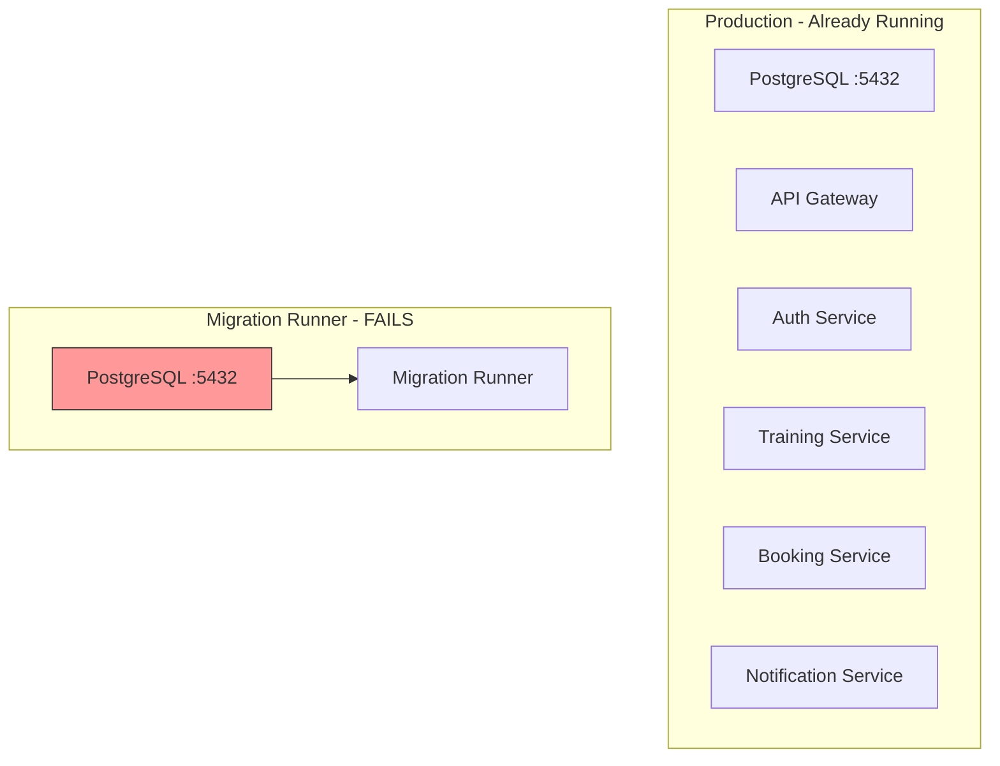
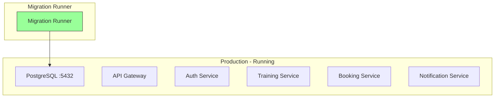

# Fix CI/CD Migration Port Conflict

## Problem

During CI/CD deployment, migration runner fails with:

```
Error: Bind for 0.0.0.0:5432 failed: port is already allocated
```

**Root Cause**: [`docker-compose.migrations.yml`](../docker-compose.migrations.yml) creates NEW PostgreSQL container, but production PostgreSQL already running on port 5432.

## Two Deployment Scenarios

### Scenario 1: First Deployment (Fresh Server)

- PostgreSQL NOT running
- Need to create PostgreSQL first
- Then run migrations

### Scenario 2: CI/CD Update (Production Running)

- PostgreSQL already running on port 5432
- Just need to run migrations against existing database

## Current Architecture



## Solution: Idempotent Migration Runner

Migration runner connects to EXISTING PostgreSQL if available, otherwise PostgreSQL must be started first.

### Architecture After Fix



## Implementation Plan

### Step 1: Update docker-compose.migrations.yml

Remove PostgreSQL service, use external network:

```yaml
# docker-compose.migrations.yml
services:
  migration-runner:
    build:
      context: ./backend
      dockerfile: Dockerfile.migrations
    environment:
      - NODE_ENV=${NODE_ENV:-production}
      - RUN_MIGRATIONS=${RUN_MIGRATIONS:-false}
      - RUN_SEED=${RUN_SEED:-false}
    env_file:
      - ./backend/.env
      - ./backend/.env.${NODE_ENV:-production}
      - ./backend/.env.docker
    networks:
      - dreamfitness-network

networks:
  dreamfitness-network:
    external: true
```

### Step 2: Update CI/CD Workflow

Start PostgreSQL first if not running, then run migrations:

```yaml
- name: Ensure PostgreSQL is running
  run: |
    docker compose -f docker-compose.prod.yml up -d postgres rabbitmq

- name: Wait for PostgreSQL
  run: npx wait-on -t 60000 tcp:5432

- name: Run database migrations
  run: |
    docker compose -f docker-compose.migrations.yml run --rm \
      -e RUN_MIGRATIONS=true \
      -e RUN_SEED=true \
      migration-runner
```

### Step 3: Update README for First Deployment

For first deployment, use same flow:

```bash
# Start PostgreSQL first
docker compose -f docker-compose.prod.yml up -d postgres rabbitmq

# Run migrations
npm run docker:prod:migrate:auto

# Start all services
npm run docker:prod
```

## Answers to Your Questions

### Q: Should migrations run if app already installed?

**YES**. Migrations should always run because:

- New migrations may exist from recent code changes
- TypeORM tracks applied migrations in database
- Already-applied migrations are skipped automatically

### Q: Should seed run if app already installed?

**YES**. Current seed script is idempotent:

- Checks if admin user exists before creating
- Checks if test user exists before creating
- Safe to run multiple times

See [`backend/src/database/run-seed.ts`](../backend/src/database/run-seed.ts:48-68):

```typescript
// Check if admin user exists, if not create
const existingAdmin = await userRepository.findOne({
  where: { email: "admin@dreamfitness.com" },
});
if (!existingAdmin) {
  await userRepository.save(adminUser);
  console.log("✅ Admin user created");
} else {
  console.log("ℹ️ Admin user already exists, skipping");
}
```

## Files to Modify

1. [`docker-compose.migrations.yml`](../docker-compose.migrations.yml) - Remove postgres service, add external network
2. [`.github/workflows/ci-cd.yml`](../.github/workflows/ci-cd.yml) - Start PostgreSQL first, then run migrations
3. [`backend/README.md`](../backend/README.md) - Update first deployment instructions
4. [`doc/deployment.md`](../doc/deployment.md) - Fix migration sections:
   - Lines 346-360: "Run Database Migrations" - remove "starts temporary postgres"
   - Lines 469-515: "Database Migrations" - already correct, minor updates

## Benefits

- **Idempotent**: Works for both first deployment and updates
- **No port conflicts**: Uses existing PostgreSQL when available
- **Same flow**: CI/CD and manual deployment use identical steps
- **Safe migrations**: TypeORM tracks applied migrations, skips if already run
- **Safe seeding**: Seed script checks for existing users before creating
